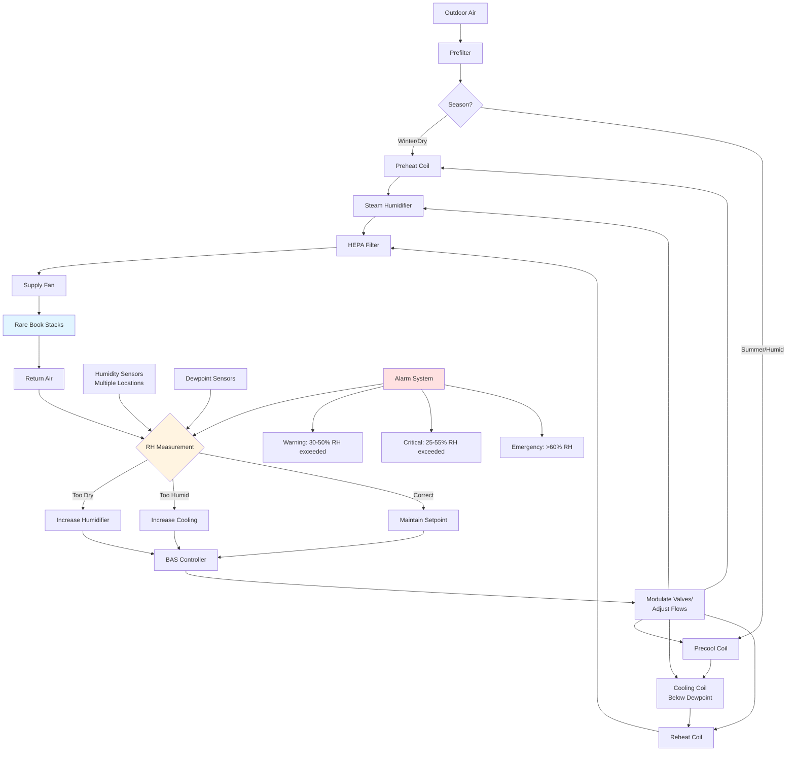

Humidity control represents the most critical environmental parameter for rare book preservation. Fluctuations in relative humidity cause dimensional changes in hygroscopic materials, accelerate chemical degradation, and create conditions favorable for biological growth. Precision humidity management requires year-round monitoring, rapid response capability, and redundant control systems.

## Target Humidity Ranges

The consensus standard for rare book storage maintains relative humidity between 30-50% RH, with 35-45% RH representing the optimal range for most collections. This narrow band balances competing risks: low humidity embrittles paper and desiccates leather bindings, while high humidity promotes mold growth and accelerates acid hydrolysis.

### Material-Specific Requirements

| Material Type | Optimal RH Range | Maximum Fluctuation | Critical Concerns |
|--------------|------------------|---------------------|-------------------|
| Paper (rag content) | 35-45% | ±3% daily | Dimensional stability |
| Paper (wood pulp) | 30-40% | ±3% daily | Acid hydrolysis acceleration |
| Leather bindings | 45-55% | ±5% daily | Desiccation and red rot |
| Parchment/vellum | 45-55% | ±2% daily | Extreme hygroscopic response |
| Photographic materials | 30-40% | ±3% daily | Emulsion degradation |
| Mixed collections | 35-45% | ±3% daily | Compromise between extremes |

Stability matters more than absolute value. A constant 48% RH causes less damage than cycling between 35-45% RH, as dimensional stress from expansion and contraction weakens binding structures and fractures brittle paper.

## Paper Degradation Mechanisms

Humidity directly influences chemical and physical degradation rates. Acid hydrolysis of cellulose—the primary aging mechanism in acidic paper—follows the relationship:

$$k = A e^{-E_a/RT} \cdot f(RH)$$

Where $k$ represents the reaction rate constant, $E_a$ is activation energy (typically 80-100 kJ/mol for cellulose hydrolysis), $R$ is the gas constant, $T$ is absolute temperature, and $f(RH)$ is the humidity-dependent factor that increases exponentially above 50% RH.

At 70% RH, acid hydrolysis proceeds approximately 3-4 times faster than at 40% RH at constant temperature. The moisture content $M$ of cellulosic materials follows sorption isotherms:

$$M = \frac{aRH}{1-bRH} + \frac{cRH}{1+dRH}$$

Where $a$, $b$, $c$, and $d$ are material-specific coefficients. This relationship explains why dimensional changes accelerate above 60% RH as moisture penetrates deeper into fiber structures.

## Seasonal Humidity Management

Geographic climate drives seasonal strategies:

**Cold Climate Facilities (Winter Heating Season)**
- Outdoor air at -10°C and 80% RH contains only 0.0015 kg moisture per kg dry air
- When heated to 20°C, this drops to 10% RH
- Steam humidification required to maintain 40% RH setpoint
- Humidifier capacity: 0.0045 kg H₂O per kg dry air for typical heating conditions

**Humid Climate Facilities (Summer Cooling Season)**
- Outdoor air at 30°C and 80% RH contains 0.0214 kg moisture per kg dry air
- Cooling to 20°C and 50% RH requires removing 0.0141 kg H₂O per kg dry air
- Dedicated dehumidification or cooling below dewpoint necessary
- Reheat energy penalty for proper humidity control

**Transitional Periods**
- Most challenging control periods due to rapid outdoor condition changes
- Building thermal mass creates lag in interior moisture response
- Require both humidification and dehumidification capability on standby

## Dehumidification Systems

Multiple technologies address excess humidity:

**Chilled Water Cooling Coils**
Reduce air temperature below dewpoint to condense moisture. Coil surface temperature must reach:

$$T_{coil} = T_{dp,supply} - \Delta T_{approach}$$

Where $T_{dp,supply}$ is the supply dewpoint temperature and $\Delta T_{approach}$ is the temperature approach (typically 2-3°C). Requires reheat to maintain proper supply temperature, creating energy penalty.

**Desiccant Dehumidification**
Uses solid or liquid desiccants to absorb moisture without cooling below dewpoint. Regeneration requires heat, typically 120-150°C. Coefficient of performance:

$$COP_{desiccant} = \frac{m_{H_2O} \cdot h_{fg}}{Q_{regen}}$$

Where $m_{H_2O}$ is mass of water removed, $h_{fg}$ is latent heat of vaporization (2450 kJ/kg), and $Q_{regen}$ is regeneration heat input. Typical COP values range from 0.5-1.0.

**Dedicated Outdoor Air Systems (DOAS)**
Separate latent and sensible loads. Dehumidifies ventilation air to low dewpoint (10-13°C dewpoint), then provides neutral-temperature supply. Eliminates humidity load from space conditioning equipment.

## Humidification Systems

Winter humidification maintains minimum RH:

**Steam Humidifiers**
Inject clean steam from electric or gas-fired generators. Provide precise control, no mineral contamination, self-sterilizing. Energy consumption:

$$Q_{steam} = \dot{m}_{steam} \cdot h_{fg} = \dot{m}_{air} \cdot (W_{supply} - W_{return}) \cdot h_{fg}$$

Where $\dot{m}_{steam}$ is steam mass flow rate and $W$ represents humidity ratio in kg H₂O per kg dry air.

**Evaporative Humidifiers**
Adiabatic process, no external heat input. Lower energy cost but risk of mineral deposits and biological growth. Require deionized or reverse osmosis water for rare book applications.

**Ultrasonic Humidifiers**
Fine mist generation through piezoelectric transducers. Compact, quiet, but require high water quality to prevent white dust deposition on collections.

## Mold Prevention Strategies

Mold growth threshold occurs at 65-70% RH for most species when sustained for 72+ hours. Prevention requires:

**Primary Controls**
- Maintain RH below 60% under all operating conditions
- Eliminate cold surfaces where condensation may occur
- Ensure adequate air circulation in storage areas (minimum 4 air changes per hour)

**Surface Dewpoint Management**
All interior surfaces must remain above dewpoint. For 20°C and 40% RH (dewpoint 6°C), insulation R-value must prevent surface temperature below 10°C:

$$R_{required} = \frac{T_{inside} - T_{outside}}{U \cdot (T_{inside} - T_{surface,min})}$$

**Monitoring**
- Continuous RH measurement at multiple locations
- Data logging with 5-15 minute intervals
- Alarming for excursions beyond ±5% of setpoint
- Annual calibration of sensors against NIST-traceable standards

## Monitoring and Alarming

Comprehensive humidity monitoring requires:

**Sensor Placement**
- One sensor per 1000-2000 sq ft of storage area
- Additional sensors at high-risk locations (exterior walls, near mechanical systems)
- Redundant measurement in critical vault spaces
- Height variation sampling (floor, mid-height, ceiling)

**Alarm Thresholds**
- Warning alarm: RH outside 35-45% range for >2 hours
- Critical alarm: RH <30% or >55% for >30 minutes
- Emergency alarm: RH >60% (immediate response required)
- Rate-of-change alarm: >5% RH change per hour

**Response Protocols**
- Automated notification to facilities management
- Escalation to preservation staff for extended events
- Temporary collection relocation procedures for equipment failures
- Portable dehumidification equipment on standby

Successful humidity control for rare book collections requires understanding the physics of moisture transport, the chemistry of material degradation, and the engineering of precision control systems. The investment in proper equipment and monitoring infrastructure provides measurable extension of collection lifespan, often justifying costs through avoided conservation treatment and irreplaceable material loss.

