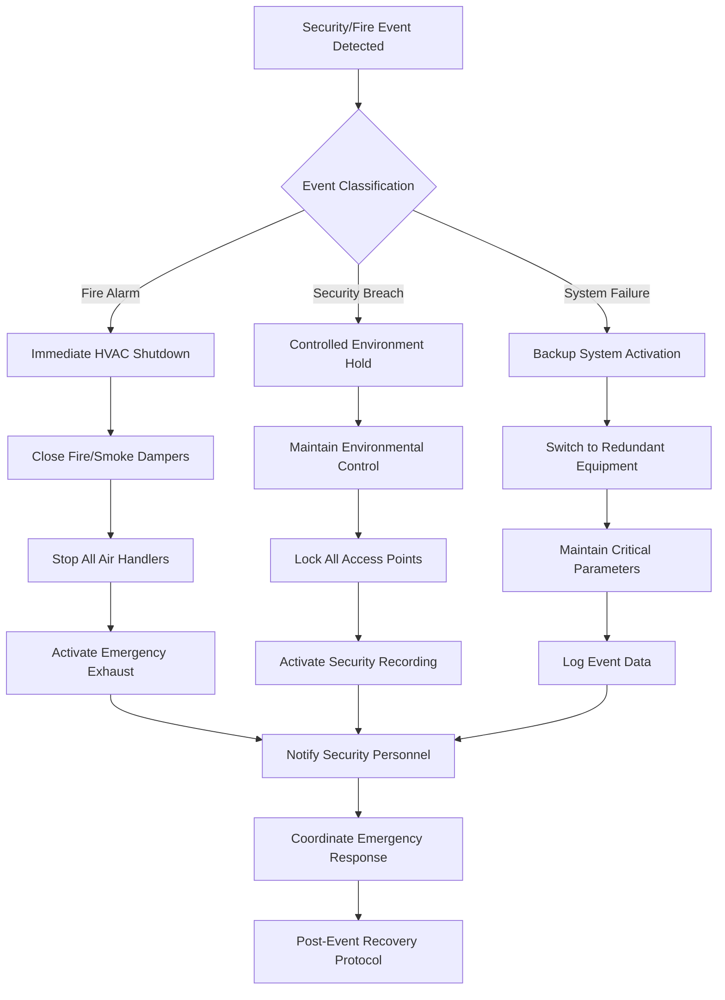

## Overview

HVAC systems in rare book libraries present unique security challenges requiring careful integration of environmental control with physical security measures. Ductwork and mechanical penetrations create potential access points for unauthorized entry, fire hazards, and security breaches that demand comprehensive protection strategies balancing preservation requirements with facility security.

## Duct Security for Valuable Materials

Ductwork represents a critical security vulnerability in facilities housing irreplaceable collections. Air distribution systems must incorporate security features preventing unauthorized access while maintaining optimal environmental conditions.

### Duct Penetration Protection

**Bar Grille Installation:**
- Install welded steel bar grilles at all exterior duct terminations
- Minimum bar spacing: 4 inches (100 mm) maximum
- Bar diameter: minimum 0.5 inches (12.7 mm) for high-security areas
- Secure mounting with tamper-resistant fasteners
- Position grilles to prevent removal from exterior

**Duct Material Selection:**
Security-rated ductwork specifications:
- High-security zones: 16-gauge galvanized steel minimum
- Standard areas: 20-gauge galvanized steel
- Avoid flexible duct in accessible ceiling spaces
- Reinforce duct at critical penetrations with 14-gauge steel

### Access Prevention Calculations

The penetration security factor $PSF$ evaluates duct vulnerability:

$$PSF = \frac{A_d \times F_a}{L_p \times t_w}$$

Where:
- $A_d$ = duct cross-sectional area (ft²)
- $F_a$ = accessibility factor (1.0 = publicly accessible, 0.5 = secured)
- $L_p$ = path length through secured barrier (ft)
- $t_w$ = wall gauge thickness equivalent (inches)

Target $PSF < 2.0$ for high-security installations.

## HVAC Penetration Security

Building envelope penetrations for mechanical systems require meticulous sealing and security measures protecting against intrusion while maintaining fire and smoke barriers.

### Penetration Sealing Standards

**Fire-Rated Barrier Penetrations:**

| Barrier Rating | Seal System | Security Enhancement |
|----------------|-------------|----------------------|
| 2-hour fire wall | UL-listed firestop | Steel sleeve with monitoring |
| 1-hour fire wall | Intumescent seal | Tamper-resistant inspection |
| Smoke barrier | Smoke seal gasket | Visual inspection access |
| Security wall | Ballistic-rated seal | Motion detection integration |

**Installation Requirements:**
- All penetrations through security barriers require documented approval
- Minimum 2-inch annular space for proper firestop installation
- Install penetrations only in monitored or inaccessible locations
- Maintain complete firestop system documentation

### Penetration Monitoring

The penetration monitoring effectiveness $PME$ quantifies detection capability:

$$PME = \frac{N_m \times R_r}{N_t} \times 100\%$$

Where:
- $N_m$ = number of monitored penetrations
- $R_r$ = response reliability factor (0.85-0.99)
- $N_t$ = total critical penetrations

Target $PME > 95\%$ for rare book vault mechanical systems.

## Fire Detection in Ductwork

In-duct fire and smoke detection systems provide early warning capabilities essential for protecting irreplaceable collections from fire and smoke damage.

### Detection System Design

**Duct Smoke Detector Placement:**
- Install detectors in supply and return ducts serving vault spaces
- Position detectors minimum 6 inches from duct walls
- Locate upstream of air handling unit discharge
- Install in return air prior to smoke dampers
- Sample velocity range: 300-4000 fpm

**Sensitivity Settings:**
Rare book environments require heightened sensitivity:
- Alarm threshold: 2-4% obscuration per foot
- Pre-alarm notification: 1-2% obscuration per foot
- Response time: maximum 30 seconds to alarm
- Integration with HVAC shutdown sequence

### Detector Coverage Calculation

Required detector spacing $S_d$ based on duct geometry:

$$S_d = \frac{V_d}{A_d \times SR}$$

Where:
- $V_d$ = detection volume per device (ft³)
- $A_d$ = duct cross-sectional area (ft²)
- $SR$ = sample rate effectiveness (typically 0.85)

## Emergency Shutdown Integration

Coordinated emergency shutdown procedures protect collections during fire, security breaches, or environmental system failures through integrated control sequences.

### Shutdown Sequence Design

### Response Time Requirements

Critical shutdown timing parameters:
- Fire alarm to fan shutdown: maximum 10 seconds
- Damper closure time: maximum 30 seconds
- Emergency notification: simultaneous with shutdown
- System status verification: within 60 seconds

## Access Control for Mechanical Rooms

Mechanical spaces serving rare book libraries require stringent access control protecting against tampering, sabotage, and unauthorized environmental adjustments.

### Access Control Hierarchy

**Security Levels:**

| Zone | Access Requirements | Monitoring Level |
|------|---------------------|------------------|
| Primary vault AHU room | Biometric + card + escort | Continuous video + motion |
| Secondary system rooms | Card access + PIN | Video on entry |
| General mechanical spaces | Card access only | Periodic inspection |
| Exterior equipment | Locked enclosure | Perimeter monitoring |

**Authentication Methods:**
- Multi-factor authentication for critical equipment
- Time-restricted access authorizations
- Access logging with event correlation
- Automatic lockdown during after-hours periods

### Access Audit Requirements

The access compliance factor $ACF$ evaluates control effectiveness:

$$ACF = \frac{N_a - N_u}{N_a} \times 100\%$$

Where:
- $N_a$ = total authorized access events
- $N_u$ = unauthorized or anomalous events

Maintain $ACF > 99.5\%$ for rare book facility mechanical systems.

## Vibration and Noise Impacts

Mechanical system vibration and noise can compromise both security systems and preservation conditions, requiring careful isolation and acoustic treatment.

### Vibration Control

**Security System Interference:**
- HVAC vibration frequency range: 5-500 Hz
- Security sensor operating range: 10-10,000 Hz
- Potential for false alarm triggering at resonant frequencies
- Isolation requirements prevent security system degradation

**Vibration Isolation Design:**
Minimum isolation efficiency $\eta_v$ calculation:

$$\eta_v = \left(1 - \frac{1}{\left(\frac{f}{f_n}\right)^2 - 1}\right) \times 100\%$$

Where:
- $f$ = disturbing frequency (Hz)
- $f_n$ = natural frequency of isolation system (Hz)

Target $\eta_v > 90\%$ for equipment near high-security zones.

### Acoustic Security Considerations

**Sound Transmission Through Ductwork:**
- Ductwork can transmit conversations from secured areas
- Install acoustic lining in ducts serving vault spaces
- Consider cross-talk attenuation between secure zones
- Minimum 15 dB attenuation between critical spaces

**Noise Masking:**
Controlled background noise can enhance security:
- NC-30 to NC-35 recommended for rare book reading rooms
- Prevents sound transmission through duct systems
- Masks security system operation sounds
- Avoids acoustic cues revealing security measures

## Security Integration Best Practices

**Coordinated System Design:**
- Integrate HVAC controls with building management and security systems
- Establish clear communication protocols between systems
- Regular testing of integrated emergency responses
- Maintain redundant notification pathways

**Documentation Requirements:**
- Complete as-built drawings showing all penetrations
- Security system interaction points clearly identified
- Emergency shutdown sequence documentation
- Access control system integration diagrams

**Maintenance Security:**
- Verify contractor security clearances before mechanical access
- Escort requirements during maintenance activities
- System status verification after maintenance completion
- Tamper-evident seals on critical components

**Testing Protocols:**
- Quarterly integrated system testing
- Annual security penetration assessments
- Verification of detector functionality
- Emergency response drill coordination

## Conclusion

Security integration in rare book library HVAC systems demands comprehensive coordination between environmental control, physical security, and life safety systems. Properly designed duct security, penetration protection, fire detection, emergency shutdown procedures, and access control create a layered defense protecting irreplaceable collections while maintaining optimal preservation conditions. Regular testing and maintenance of integrated systems ensures continued protection of these invaluable cultural resources.
