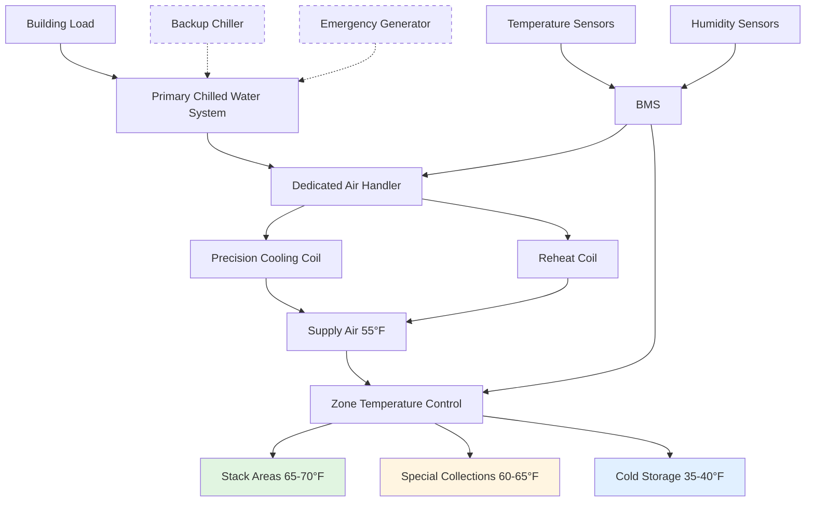

Temperature control represents the primary environmental parameter affecting the longevity of rare book collections. Chemical degradation processes that destroy paper, bindings, and inks follow temperature-dependent reaction kinetics, making precise temperature management essential for preservation.

## Target Temperature Range

The standard temperature range for rare book storage is **65-70°F (18-21°C)**. This range balances preservation requirements with human comfort for staff and researchers accessing materials. The selection derives from chemical kinetics principles: lower temperatures significantly slow degradation reactions while remaining practical for occupied spaces.

| Storage Type | Temperature Range | Stability Requirement | Application |
|-------------|-------------------|----------------------|-------------|
| General rare books | 65-70°F (18-21°C) | ±2°F (±1°C) | Standard archival storage |
| Special collections | 60-65°F (16-18°C) | ±1°F (±0.5°C) | High-value materials |
| Cold storage vault | 35-40°F (2-4°C) | ±2°F (±1°C) | Long-term preservation |
| Photographic materials | 35-45°F (2-7°C) | ±2°F (±1°C) | Color photographs, negatives |
| Reading rooms | 68-72°F (20-22°C) | ±3°F (±1.5°C) | Occupied research spaces |
| Processing areas | 68-72°F (20-22°C) | ±3°F (±1.5°C) | Conservation workrooms |

### Chemical Reaction Rates and Temperature

The relationship between temperature and degradation rate follows the **Arrhenius equation**:

$$k = A \cdot e^{-\frac{E_a}{RT}}$$

Where:
- $k$ = reaction rate constant
- $A$ = pre-exponential factor
- $E_a$ = activation energy (typically 80-100 kJ/mol for paper degradation)
- $R$ = universal gas constant (8.314 J/mol·K)
- $T$ = absolute temperature (K)

For practical application, the **lifetime extension factor** when reducing temperature from $T_1$ to $T_2$ is:

$$\frac{t_2}{t_1} = e^{\frac{E_a}{R}\left(\frac{1}{T_2} - \frac{1}{T_1}\right)}$$

**Example calculation**: Reducing storage temperature from 75°F (24°C = 297 K) to 65°F (18°C = 291 K) with $E_a = 90$ kJ/mol:

$$\frac{t_2}{t_1} = e^{\frac{90000}{8.314}\left(\frac{1}{291} - \frac{1}{297}\right)} = e^{0.747} = 2.11$$

This 10°F reduction **doubles the expected lifespan** of materials.

## Temperature Stability Requirements

Temperature stability matters as much as the absolute temperature. Acceptable stability criteria:

- **Short-term (hourly)**: ±1°F (±0.5°C) maximum deviation
- **Daily fluctuation**: ±2°F (±1°C) maximum range
- **Seasonal drift**: Gradual changes of 3-5°F over months are acceptable
- **Rate of change**: Less than 1°F per hour to prevent mechanical stress

Rapid temperature fluctuations cause dimensional changes in hygroscopic materials. Paper expands and contracts with temperature variations, leading to:
- Cockling and warping of pages
- Stress on binding structures
- Accelerated mechanical fatigue
- Increased susceptibility to handling damage

## Cool Storage for Special Collections

High-value collections benefit from dedicated **cool storage vaults** maintained at 35-40°F (2-4°C). At this temperature range:

- **Degradation rates** decrease by factor of 4-8 compared to 65°F
- **Expected lifespan** extends from centuries to millennia for acid-free materials
- **Oxidation reactions** proceed at minimal rates
- **Biological activity** (mold, insects) is effectively eliminated

Cool storage implementation requires:
- **Acclimatization protocols**: Materials must equilibrate to room temperature before handling (2-4 hours per inch of thickness)
- **Separate HVAC systems**: Dedicated equipment prevents cross-contamination of temperature zones
- **Vapor barriers**: Prevent condensation when moving materials between zones
- **Staff training**: Proper procedures for retrieving and returning materials

## Climate Control Strategies

### System Design Principles

**1. Dedicated HVAC Systems**
- Separate air handlers for archival spaces isolate from building loads
- Eliminates temperature disruptions from adjacent occupancies
- Allows independent setpoint control and scheduling

**2. Reheat Configuration**
- Supply air cooled to 55°F for dehumidification
- Electric or hot water reheat raises temperature to setpoint
- Decouples temperature and humidity control
- Provides precise sensible cooling without overcooling

**3. Thermal Mass Utilization**
- High-density book collections provide thermal inertia
- Massive construction (concrete, masonry) stabilizes temperature
- Limits rate of temperature change during equipment failures

**4. Zoning Strategy**
- Separate zones for different temperature requirements
- Interior zones for most sensitive materials (minimal envelope loads)
- Perimeter zones with higher setpoints buffer thermal transmission

## Energy Efficiency at Lower Temperatures

Lower temperature setpoints create HVAC energy implications:

**Heating season benefits**:
- Reduced heating load proportional to indoor-outdoor temperature difference: $Q = UA(T_{indoor} - T_{outdoor})$
- For 65°F vs 72°F setpoint with $U = 0.35$ BTU/h·ft²·°F and 10,000 ft² envelope area at 20°F outdoor temperature:
  - 72°F setpoint: $Q = 0.35 \times 10000 \times (72-20) = 182,000$ BTU/h
  - 65°F setpoint: $Q = 0.35 \times 10000 \times (65-20) = 157,500$ BTU/h
  - **Savings**: 13.5% heating energy reduction

**Cooling season considerations**:
- Lower setpoint increases cooling load and compressor energy
- Reduced latent load at lower temperatures (air holds less moisture)
- Economizer hours extend due to lower supply air requirements

**Optimization strategies**:
- Variable speed drives on supply fans reduce distribution energy
- Energy recovery systems capture cooling/heating from exhaust air
- Night setback inappropriate due to stability requirements
- Seasonal adjustment within acceptable drift range (3-5°F) optimizes annual energy

**Lifecycle cost analysis** consistently shows that energy penalties are offset by:
- Extended collection lifespan (deferred replacement costs)
- Reduced conservation treatment requirements
- Lower insurance premiums for better environmental control
- Enhanced institutional reputation and donor confidence

## Implementation Best Practices

**Control system specifications**:
- DDC controllers with ±0.5°F temperature control accuracy
- Multiple redundant sensors per zone (minimum 2, averaged)
- 15-minute data logging for environmental monitoring
- Alarm thresholds: ±3°F from setpoint triggers immediate notification

**Commissioning requirements**:
- 30-day continuous monitoring demonstrating stability compliance
- Load testing under peak summer/winter conditions
- Failure mode testing of backup systems
- Documentation of recovery time from upset conditions

**Operational protocols**:
- Quarterly calibration of temperature sensors
- Annual control loop tuning
- Preventive maintenance prevents equipment failures
- Staff training on emergency procedures

Proper temperature control extends the lifespan of irreplaceable cultural materials while maintaining accessibility for scholarship. The investment in precision HVAC systems pays dividends through enhanced preservation outcomes and reduced long-term conservation costs.
