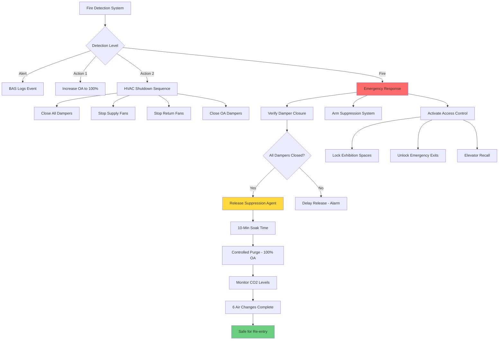

## Fire Suppression System Coordination

Integration between HVAC and fire protection systems in museums requires careful coordination to protect irreplaceable artifacts while maintaining environmental control. NFPA 909 (Code for the Protection of Cultural Resource Properties) and NFPA 2001 (Standard on Clean Agent Fire Extinguishing Systems) govern these critical interfaces.

### Clean Agent System Integration

Museums typically employ clean agent suppression systems (FM-200, Novec 1230, Inergen) rather than water-based systems to prevent water damage to collections. HVAC coordination requirements include:

**Pre-Discharge Sequence:**
1. HVAC system receives fire alarm signal from detection system
2. Supply and exhaust fans shut down within 30 seconds
3. Fire dampers close in all penetrations to the protected space
4. Return air dampers close to prevent agent loss
5. Outside air dampers close completely
6. Building automation system confirms damper closure before agent release

**Post-Discharge Requirements:**
- HVAC remains off for minimum 10-minute soak time (verify with suppression system manufacturer)
- Controlled purge cycle begins after soak time using 100% outside air
- Minimum 6 air changes before space re-occupancy
- CO₂ monitoring during purge to verify agent removal

### Fire Damper and Smoke Damper Coordination

| Damper Type | Location | Closure Rating | Integration Requirement |
|-------------|----------|----------------|------------------------|
| Fire dampers | All rated wall penetrations | 1.5-hour or 3-hour | Gravity or spring-close, fail-safe |
| Smoke dampers | AHU discharge, return air | UL 555S | Electrically operated, monitored closure |
| Combination dampers | Mixed-use spaces | Both fire and smoke rated | Dual actuation, position monitoring |
| Corridor dampers | Public circulation spaces | Smoke control | Integrate with fire alarm control panel |

**Critical Integration Points:**
- Damper end switches must report to both BAS and fire alarm control panel
- Fail-safe design requires dampers to close on power loss
- Manual reset required after fire event
- Annual testing per NFPA 80 with HVAC system operational

## Very Early Smoke Detection Apparatus (VESDA)

VESDA systems provide the earliest possible warning in museum environments through air sampling technology. HVAC integration is essential for proper operation.

**Sampling Point Design:**
- Sample probes located in supply ducts, return ducts, and ceiling plenums
- Probe spacing: 200-400 ft² per sampling point depending on sensitivity setting
- Integration with VAV systems requires flow compensation in BAS
- Minimum transport velocity: 200 fpm in sampling pipes

**HVAC System Response:**
- Alert level: Log event, no HVAC action
- Action level 1: Increase outside air to maximum, notify staff
- Action level 2: Shut down HVAC, activate smoke evacuation sequence
- Fire level: Full shutdown, damper closure, suppression system armed

## Access Control System Integration

Physical security systems must coordinate with HVAC to maintain environmental integrity while controlling access to sensitive collections.

### Integration Requirements

| System Interface | Function | HVAC Response | Priority Level |
|-----------------|----------|---------------|----------------|
| Card readers at vault doors | Access logging | Pressurization verification before door unlock | Critical |
| Motion detectors in galleries | After-hours intrusion | Maintain setback temps, log airflow changes | High |
| Door position switches | Unauthorized door opening | Alarm on pressure loss, increase OA | High |
| Turnstiles/vestibules | Visitor traffic monitoring | Adjust OA based on occupancy count | Medium |
| Emergency exits | Fire egress | Override mag locks, maintain smoke control | Critical |

**Pressurization and Access Control:**

Vault and storage areas maintain positive pressure (0.02-0.05 in. w.g. relative to adjacent spaces) to prevent infiltration. Door access sequence:

1. Card reader authentication
2. BAS confirms positive pressure maintained
3. Pressure relief damper pre-opens 5 seconds before door unlock
4. Door unlocks for 10-second access window
5. Door position switch confirms closure
6. Relief damper closes
7. System re-establishes design pressure within 60 seconds

**Emergency Override:**

Fire alarm activation triggers immediate access control override per NFPA 101 (Life Safety Code):
- Electromagnetic locks release on all egress paths
- Card readers switch to free egress mode
- HVAC switches to smoke control mode (if equipped)
- Vault doors remain locked unless on egress path

## Smoke Control System Design

For multi-story museums, smoke control systems per NFPA 92 require dedicated HVAC modes:

**Smoke Exhaust Mode:**
- Exhaust fans in fire zone operate at 100% capacity
- Supply fans in fire zone shut down
- Adjacent zones maintain positive pressure (0.05-0.10 in. w.g.)
- Stairwell pressurization activates (0.10 in. w.g. minimum)

**Acceptance Testing:**
- Measure pressure differentials with doors closed and open
- Verify smoke layer interface height (minimum 6 ft above floor)
- Confirm BAS response time under 60 seconds from alarm signal
- Document damper closure times and positions

## System Testing and Commissioning

Integrated testing must verify coordination between all systems:

1. **Functional Performance Testing:** Simulate fire conditions, verify HVAC shutdown, damper closure, and suppression system arming sequence
2. **Communication Testing:** Confirm hardwired signals between fire alarm panel and BAS, verify network failure modes
3. **Sequence of Operations Verification:** Document actual timing vs. design specifications
4. **Annual Testing:** Per NFPA 25, test all interfaces annually with full system operational

**Documentation Requirements:**
- As-built drawings showing all integration points
- Sequence of operations matrices for each fire scenario
- Damper schedule with closure ratings and monitoring points
- Contact information for fire alarm, HVAC, and security contractors

Integration of security and HVAC systems in museums demands rigorous engineering and ongoing commissioning. The consequences of failed coordination range from ineffective fire suppression to irreversible artifact damage, making this one of the most critical aspects of museum environmental control system design.

