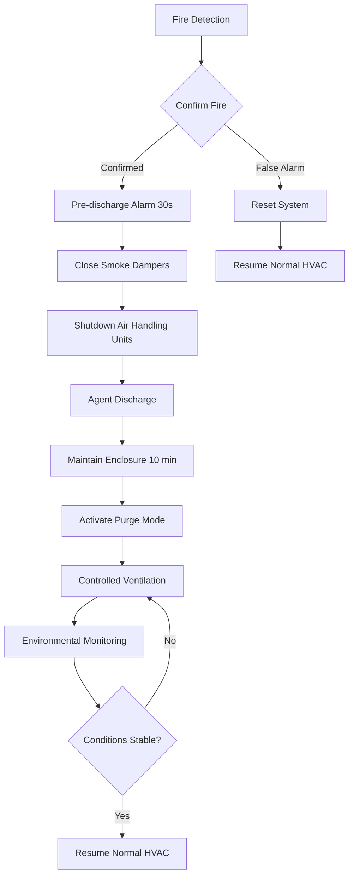
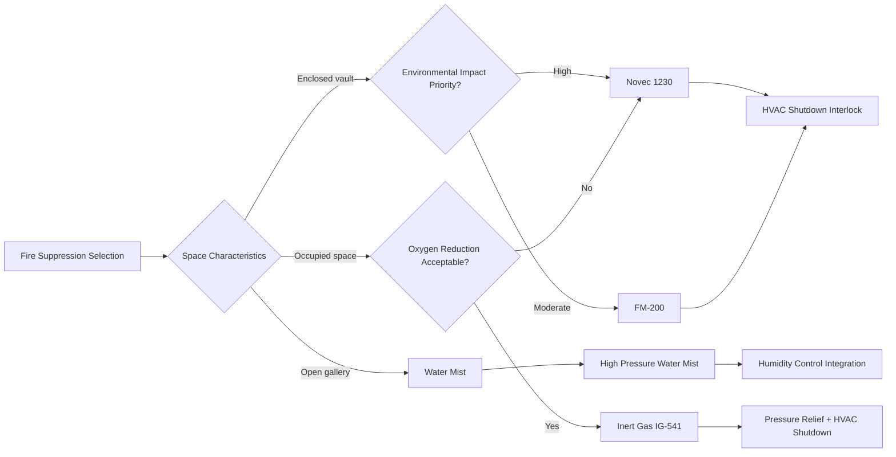

Fire suppression systems for museums, galleries, archives, and libraries require specialized integration with HVAC systems to protect irreplaceable collections while minimizing collateral damage. Unlike conventional commercial spaces, these facilities demand suppression agents that leave no residue, cause no water damage, and maintain environmental stability during and after discharge.

## Clean Agent Suppression Systems

Clean agents extinguish fires through heat absorption and oxygen displacement without leaving residue or causing secondary damage to artifacts. These systems require precise coordination with HVAC operations to ensure proper agent distribution and post-discharge ventilation.

### FM-200 (HFC-227ea)

FM-200 suppresses fire by absorbing heat from the combustion process. The agent reduces flame temperature below the point where combustion can sustain itself.

**System characteristics:**

- Design concentration: 7-9% by volume for Class A hazards
- Discharge time: 10 seconds maximum
- NOAEL (No Observed Adverse Effect Level): 9.0%
- LOAEL (Lowest Observed Adverse Effect Level): 10.5%
- Atmospheric lifetime: 33 years
- Storage pressure: 360 psi at 70°F (25 bar at 21°C)

HVAC integration requires immediate shutdown of air handling units upon detection to prevent agent dilution and ensure design concentration is maintained throughout the protected volume. After discharge, controlled ventilation removes agent residue at rates that prevent thermal shock to collections.

### Novec 1230 (FK-5-1-12)

Novec 1230 offers similar fire suppression performance to FM-200 with significantly reduced environmental impact.

**System characteristics:**

- Design concentration: 4-6% by volume for Class A hazards
- Discharge time: 10 seconds maximum
- NOAEL: 10%
- LOAEL: >10%
- Atmospheric lifetime: 5 days
- Global Warming Potential: 1
- Storage pressure: 360 psi at 70°F (25 bar at 21°C)

The lower required concentration reduces cylinder count and system footprint compared to FM-200. HVAC systems must maintain enclosure integrity during discharge, requiring tight damper closure and fan shutdown within 30 seconds of detection.

### Inert Gas Systems

Inert gas agents (IG-541, IG-55, IG-01) suppress fire by reducing oxygen concentration to levels below combustion sustainability while remaining safe for temporary human occupancy.

| Agent Type | Composition | Design Concentration | Storage Pressure |
|------------|-------------|---------------------|------------------|
| IG-541 (Inergen) | 52% N₂, 40% Ar, 8% CO₂ | 35-43% | 2900-4350 psi |
| IG-55 (Argonite) | 50% N₂, 50% Ar | 38-50% | 2900-4350 psi |
| IG-01 (Argon) | 100% Ar | 38-50% | 2900-4350 psi |

Inert gas systems require larger storage volumes and produce significant pressure increases during discharge. HVAC pressure relief provisions must accommodate the 30-50% volume expansion that occurs within seconds of agent release. Venting calculations per NFPA 2001 determine required relief area based on protected volume and discharge rate.

## Water Mist Suppression

Water mist systems provide fire suppression through cooling and oxygen displacement using fine water droplets (typically <400 microns). These systems offer advantages in spaces where clean agent systems are impractical due to volume or ventilation constraints.

**Operating pressures and droplet characteristics:**

| System Type | Operating Pressure | Mean Droplet Size | Application |
|-------------|-------------------|-------------------|-------------|
| Low pressure | 175 psi | 200-400 μm | General collections |
| Intermediate pressure | 175-500 psi | 100-200 μm | High-value storage |
| High pressure | >500 psi | <100 μm | Electronics/servers |

HVAC integration considerations for water mist systems include humidity control post-discharge and air circulation to accelerate evaporation. Unlike traditional sprinklers, water mist systems use 50-90% less water, reducing moisture exposure and facilitating faster environmental recovery.

## NFPA 909 Requirements

NFPA 909 (Code for the Protection of Cultural Resource Properties) establishes fire protection requirements specific to museums, libraries, and archives. Key provisions affecting HVAC integration include:

- Automatic shutdown of HVAC systems serving protected spaces within 30 seconds of suppression system activation
- Smoke dampers in supply and return ductwork rated for the protected enclosure
- Fire dampers at all duct penetrations through fire-rated assemblies
- Manual override capability for post-suppression purge ventilation
- Interlocks preventing HVAC restart until suppression system reset

## HVAC Coordination Sequence

## Post-Discharge Ventilation

After agent discharge, HVAC systems must provide controlled purge ventilation to remove combustion byproducts and suppression agent while maintaining environmental stability.

**Purge ventilation parameters:**

- Delay period: 10 minutes minimum to ensure fire extinguishment
- Purge rate: 4-6 air changes per hour
- Temperature control: ±3°F of setpoint during purge
- Humidity control: Maintain within ±5% RH of setpoint
- Particulate filtration: MERV 13 minimum to capture smoke residue

Emergency purge mode operates independently from normal HVAC control sequences, utilizing dedicated damper positions and fan speeds optimized for agent removal without thermal shock to collections.

## Suppression Agent Selection Matrix

## System Integration Requirements

Critical HVAC integration points for fire suppression systems:

1. **Detection zone coordination** - Align HVAC control zones with suppression zones to enable targeted shutdown
2. **Damper fail-safe positions** - Smoke dampers fail closed; outside air dampers fail closed; relief dampers fail open
3. **Fan shutdown sequence** - Supply fans stop before return fans to prevent pressurization
4. **Battery backup** - Damper actuators and control panels maintain function for 90 minutes minimum
5. **Manual override** - Key-operated override for emergency ventilation regardless of system state
6. **Status monitoring** - Real-time indication of damper positions, fan status, and suppression system state

These integrated systems ensure fire suppression effectiveness while preserving the environmental conditions essential for long-term collection preservation.
