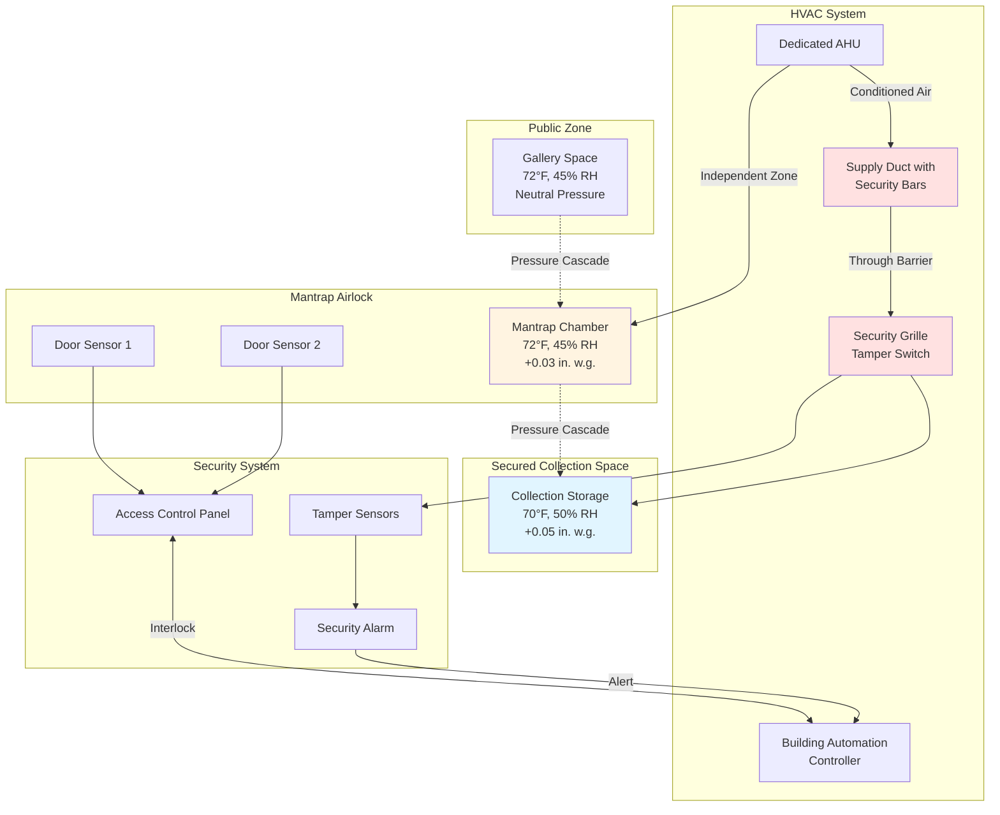

Physical security barriers present unique HVAC challenges that require coordinated design between mechanical and security systems. Ductwork, grilles, and equipment access points create potential security vulnerabilities that must be addressed without compromising climate control performance. This integration is critical in museums, archives, and galleries where both artifact protection and security are paramount.

## Mantrap Airlock Systems

Mantraps create controlled entry zones where individuals pass through two sequential doors, never both open simultaneously. These spaces require specialized HVAC design to maintain pressure relationships and prevent environmental crossover.

**Airlock Pressurization Strategy:**

The mantrap chamber should operate at positive pressure relative to both the exterior and secured interior zones. This creates an air barrier that prevents unconditioned air from entering the protected space during door transitions. Pressure differentials of 0.03-0.05 in. w.g. are typically sufficient while allowing door operation without excessive force.

Supply air to the mantrap must be independently controlled with dedicated diffusers providing 6-10 air changes per hour. Return or exhaust grilles should be positioned to create downward airflow, preventing personnel from introducing contaminants at head height. The HVAC control system must interlock with door position sensors to boost airflow during transition events, then return to baseline conditions when both doors are secured.

**Temperature and Humidity Buffering:**

Mantraps function as environmental buffer zones. When the exterior door opens, conditioned air from the mantrap absorbs the thermal and moisture load rather than allowing it to reach collection spaces. Size the mantrap HVAC capacity for worst-case outdoor conditions with door open for 30 seconds minimum. Calculate peak sensible load using:

Q = 1.08 × CFM × ΔT × (t_open / 3600)

Where t_open represents door open time in seconds.

## Secured Duct Penetrations

Ductwork penetrating security barriers creates potential forced-entry paths. Protection measures must maintain both security integrity and HVAC performance.

### Barrier Types and Airflow Impacts

| Barrier Type | Security Rating | Airflow Restriction | Pressure Drop Impact |
|--------------|----------------|---------------------|---------------------|
| Bar Grille with Tamper Switch | Medium | 15-25% free area reduction | 0.05-0.12 in. w.g. |
| Steel Mesh Insert (10 gauge) | High | 30-40% free area reduction | 0.15-0.25 in. w.g. |
| Welded Bar Matrix (1" spacing) | Very High | 40-50% free area reduction | 0.30-0.45 in. w.g. |
| Ballistic-Rated Grille Assembly | Maximum | 45-55% free area reduction | 0.40-0.60 in. w.g. |

### Duct Bar Reinforcement

Install steel bars perpendicular to ductwork at penetrations through security walls rated above standard construction. Bars should be 0.5-inch diameter minimum, spaced 6 inches on center maximum, welded to structural angles anchored to wall framing. This creates a 6-inch maximum opening dimension that prevents human passage while allowing airflow.

The bar matrix increases turbulence and reduces effective duct area. Compensate by:

- Increasing duct size 20-30% upstream of the barrier
- Installing turning vanes if direction change occurs near the barrier
- Specifying low-velocity design (below 1,200 fpm) through the barrier zone
- Adding acoustic lining downstream to attenuate turbulence noise

### Grille Security Fasteners

Standard grilles use accessible screws or spring clips that allow removal with common tools. Security-rated grilles employ:

- One-way screws requiring specialized removal tools
- Tamper-evident seals that indicate access attempts
- Recessed fasteners accessible only with equipment removal
- Welded frames for maximum-security applications

Specify security fasteners for all grilles in:
- Collection storage areas
- Conservation laboratories
- Vault spaces
- Server rooms containing security system controls

## Mechanical Room Access Control Integration

Mechanical rooms house HVAC controls that directly affect collection environments. Unauthorized access could compromise climate control or disable systems. Integrate access control with HVAC monitoring:

**Access Logging and HVAC Events:**

Connect door access logs to the building automation system. When mechanical room access occurs outside scheduled maintenance windows, flag the event and snapshot all HVAC parameters. This creates forensic records if climate deviations correlate with security breaches.

**Emergency Override Protocols:**

Fire alarm or emergency evacuation must override access control to ensure life safety. However, HVAC systems should respond appropriately:

- Shut down air handling units serving collection spaces
- Close motorized dampers isolating critical zones
- Maintain smoke control sequences per NFPA 92
- Log all override events with timestamp correlation

## Security-HVAC System Architecture

## Design Standards and Specifications

**Reference Standards:**

- ASIS GDL PSC-1: Facility Physical Security Guidelines
- UFC 4-020-01: Security Engineering (DoD installations)
- ASHRAE Applications Handbook, Chapter 24 (Museums, galleries)
- GSA Security Criteria for barrier requirements
- ASTM F1233: Security glazing materials and test methods

**Specification Requirements:**

When coordinating HVAC with physical security barriers, specifications must address:

1. **Structural coordination** - Identify all ductwork penetrations on security drawings with bar reinforcement details
2. **Pressure testing** - Verify mantrap pressure differentials under all door position combinations
3. **Tamper monitoring** - Connect all security grille sensors to both security and BAS systems
4. **Access coordination** - Mechanical contractor receives temporary access credentials for installation, revoked at substantial completion
5. **Performance validation** - Commission HVAC-security interlocks with witnessed testing of all sequences

### Penetration Security Matrix

| Penetration Type | Security Zone | Required Protection | HVAC Coordination |
|------------------|---------------|---------------------|-------------------|
| Supply Duct (>12" dia.) | Vault | Welded bar matrix + tamper switch | Upsize 25%, add silencer |
| Return Duct (>12" dia.) | Collection Storage | 10-gauge mesh insert | Increase SA 15% |
| Exhaust Duct | Conservation Lab | Bar grille + one-way fasteners | Verify negative pressure maintained |
| Condensate Drain | Secure Space | 0.5" pipe max, secured routing | Install air gap outside barrier |
| Refrigerant Lines | Any | Route through secured chase | Avoid penetrating highest security zones |
| Control Wiring | Any | Sealed conduit, no junction boxes in duct | Verify fire-rated penetration seals |

## Equipment Cage Enclosures

Roof-mounted equipment serving high-security spaces requires physical protection against tampering or disablement. Welded wire mesh cages (9-gauge minimum, 2-inch maximum opening) with access control prevent unauthorized shutdown or contamination introduction through outdoor air intakes.

Cage design must not restrict airflow to condensers or outdoor air intakes. Maintain 5-foot minimum clearance on all equipment sides requiring airflow. Install cages 8 feet minimum height with top closure to prevent climbing access. Connect cage door position switches to security monitoring and BAS systems.

The integration of physical security barriers with HVAC systems demands detailed coordination during design and rigorous commissioning verification. Properly executed, these systems provide both robust security and precise environmental control without compromise to either function.
