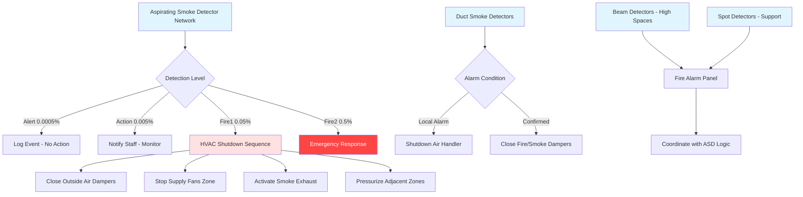

## Overview

Smoke detection in museum environments requires heightened sensitivity and integration with HVAC systems to provide early warning while minimizing false alarms. The combination of irreplaceable collections, controlled environmental conditions, and continuous air circulation demands detection strategies that exceed standard commercial requirements. NFPA 72 provides the foundational code requirements, while museum-specific standards emphasize very early warning capabilities to allow intervention before smoke or suppression agents damage artifacts.

## Detection Technology Selection

The choice of smoke detection technology directly impacts response time and the ability to protect collections before fire or smoke damage occurs.

### Aspirating Smoke Detection (ASD)

Aspirating systems, exemplified by VESDA (Very Early Smoke Detection Apparatus), actively sample air through a network of small-bore pipes. Air is continuously drawn to a central detection unit containing highly sensitive laser-based sensors. This approach provides detection at incipient stages—often 1000 times more sensitive than conventional detectors.

**Key advantages for museums:**
- Detection at obscuration levels as low as 0.00035% per foot
- Sampling points integrated into return air grilles and display cases
- Programmable alarm thresholds (alert, action, fire1, fire2)
- Minimal aesthetic impact with concealed sampling points
- Continuous air monitoring independent of ceiling height

**Installation considerations:**
- Pipe network design must account for transport lag time (typically 15-60 seconds)
- Sample hole spacing: 15-20 feet in gallery spaces, 6-10 feet near high-value items
- Integration with air handler shutdown sequences
- Ambient airflow velocity affects sampling efficiency

### Beam Smoke Detectors

Projected beam detectors use infrared light transmission across distances up to 330 feet. Smoke particles interrupt the beam, triggering an alarm when obscuration exceeds the threshold (typically 20-50% reduction).

**Applications in museums:**
- High-ceiling atriums and exhibition halls (20+ feet)
- Large open galleries where spot detectors would require excessive quantity
- Spaces with aesthetic constraints against visible ceiling devices

**Limitations:**
- Lower sensitivity than aspirating systems
- Potential for false alarms from dust during construction or maintenance
- Beam alignment stability critical in buildings with thermal movement

### Conventional Spot Detectors

Photoelectric and ionization spot detectors remain necessary for certain applications despite their lower sensitivity compared to ASD systems.

| Detector Type | Sensitivity Range | Response Time | Museum Application |
|--------------|-------------------|---------------|-------------------|
| Aspirating (VESDA) | 0.00035-2.0% obs/ft | 30-90 seconds | Primary protection for collection areas |
| Projected Beam | 0.5-4.0% obs/ft | 10-30 seconds | High ceiling spaces, atriums |
| Photoelectric Spot | 2.0-4.0% obs/ft | 15-60 seconds | Support spaces, mechanical rooms |
| Ionization Spot | 1.5-3.5% obs/ft | 10-45 seconds | Clean agent protected rooms (fast flaming) |

## HVAC Integration Architecture

Proper integration between smoke detection and HVAC systems prevents smoke migration while maintaining environmental control for collections.

## Detection Zones and Placement Strategy

NFPA 72 establishes maximum spacing requirements, but museum applications demand enhanced coverage:

**Collection storage areas:**
- Aspirating sampling points: 15-foot spacing on uniform grid
- Additional sampling within archival boxes or high-density mobile shelving
- Duct smoke detection on all air handlers serving storage

**Gallery spaces:**
- Primary: Aspirating system with 20-foot sample point spacing
- Secondary: Beam or spot detectors per NFPA 72 spacing requirements
- Display case sampling: Dedicated sample tubes for high-value enclosed exhibits

**Environmental control rooms:**
- Duct smoke detectors in supply and return ducts (per IMC Section 606.2)
- Spot detectors in mechanical spaces with alarm initiation to local panel
- Pre-action sprinkler room: Spot detectors for cross-zoned release

## HVAC System Response Sequences

The fire alarm system must execute coordinated HVAC control upon detection:

1. **Alert level (incipient)**: Notification only, no HVAC action
2. **Action level (developing)**: Increase outside air to 100%, prepare for shutdown
3. **Alarm level (confirmed fire)**:
   - Shut down air handling units serving affected zone
   - Close outside air dampers to prevent oxygen supply
   - Activate dedicated smoke exhaust if provided
   - Close fire/smoke dampers at rated barriers
   - Maintain pressurization in adjacent zones to prevent migration

## Sensitivity Settings and False Alarm Prevention

Balancing early detection with operational reliability requires careful threshold configuration:

| Environment | Alert Threshold | Action Threshold | Fire1 Threshold | Considerations |
|-------------|----------------|------------------|-----------------|----------------|
| Sealed Storage Vaults | 0.0003% obs/ft | 0.003% obs/ft | 0.03% obs/ft | Minimal dust, stable conditions |
| Active Galleries | 0.0005% obs/ft | 0.005% obs/ft | 0.05% obs/ft | Public traffic, variable loads |
| Conservation Labs | 0.001% obs/ft | 0.01% obs/ft | 0.1% obs/ft | Chemical fumes, solvent use |
| Loading Docks | 0.005% obs/ft | 0.05% obs/ft | 0.5% obs/ft | Vehicle exhaust, exterior doors |

**Factors affecting detector performance in conditioned spaces:**
- Relative humidity shifts (rapid RH decrease can create false optical scatter)
- Particle filtration efficiency (MERV 13+ reduces background particulate)
- Air velocity at sampling points (maintain 50-500 fpm for optimal transport)
- Temperature stratification in high spaces (affects smoke buoyancy)

## Regulatory and Standards Framework

**NFPA 72 (2022 Edition) requirements:**
- Chapter 17: Smoke detector initiation devices and sensitivity testing
- Chapter 21: Emergency control function interfaces including HVAC shutdown
- Annex B: Air sampling detector engineering guide

**Museum-specific guidance:**
- ASHRAE Applications Handbook Chapter 24: Museums, galleries, archives, and libraries
- Heritage Preservation guidelines for environmental monitoring integration
- AIC (American Institute for Conservation) environmental standards coordination

## Commissioning and Maintenance

Verification procedures confirm system integration:

**Initial acceptance testing:**
- Aspirating system transport time verification with smoke aerosol injection
- HVAC shutdown sequence timing (damper closure, fan de-energization)
- Multi-level alarm threshold testing at each programmed sensitivity
- Communication verification between fire alarm panel and building automation system

**Ongoing maintenance intervals:**
- Monthly: Visual inspection of sampling pipe integrity and inlet cleanliness
- Quarterly: Sensitivity drift testing using calibrated test aerosol
- Annual: Full functional test of HVAC integration sequences
- Biennial: Laser chamber cleaning and recalibration per manufacturer specifications

Properly designed and maintained smoke detection systems provide the critical early warning necessary to protect irreplaceable cultural heritage while integrating seamlessly with the environmental control systems essential for long-term preservation.
