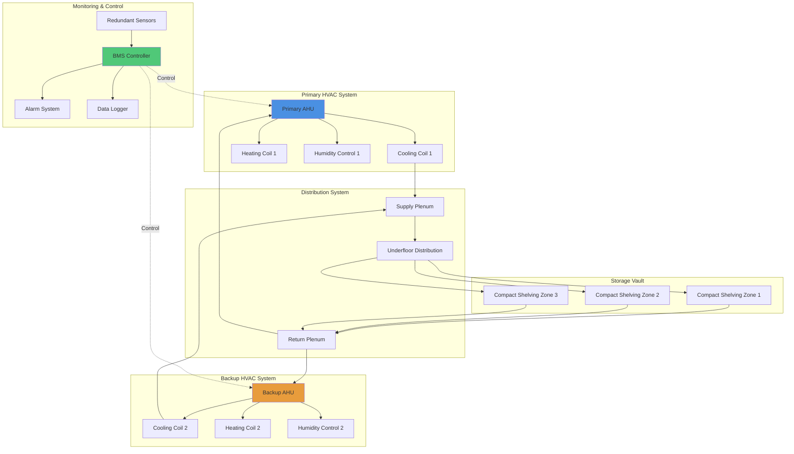

Storage vaults and archival repositories require highly specialized HVAC systems that maintain stable environmental conditions while accommodating compact shelving systems, managing diverse material requirements, and providing fail-safe redundancy. These enclosed spaces typically operate at lower temperatures and tighter humidity tolerances than public areas, with minimal air movement to prevent particulate disturbance.

## Environmental Requirements for Archive Storage

Storage vault conditions vary based on material composition and preservation priorities. The following specifications align with ISO 11799, NARA guidelines, and ASHRAE recommendations for archival facilities.

### Temperature and Humidity Specifications by Material Type

| Material Category | Temperature | Relative Humidity | Fluctuation Tolerance | Air Changes |
|-------------------|-------------|-------------------|----------------------|-------------|
| Paper documents | 65-70°F | 30-40% RH | ±2°F, ±3% RH daily | 4-6 ACH |
| Photographs (B&W) | 65-70°F | 30-40% RH | ±2°F, ±3% RH daily | 4-6 ACH |
| Color photographs | 35-50°F | 30-40% RH | ±2°F, ±3% RH daily | 4-6 ACH |
| Magnetic media | 65-70°F | 20-30% RH | ±2°F, ±3% RH daily | 4-6 ACH |
| Film (acetate) | 35-45°F | 30-40% RH | ±2°F, ±3% RH daily | 4-6 ACH |
| Digital media | 65-70°F | 20-30% RH | ±2°F, ±3% RH daily | 4-6 ACH |
| Mixed collections | 65-70°F | 35-45% RH | ±2°F, ±3% RH daily | 4-6 ACH |

The critical factor is stability rather than absolute values. Seasonal ratcheting (gradual drift within acceptable ranges) is preferable to aggressive setpoint changes that stress materials.

## Cold Storage Vault Design

Cold storage vaults for photographic materials, film, and chemically unstable documents extend preservation timelines by slowing degradation reactions. The Arrhenius equation demonstrates that reducing temperature by 18°F doubles the chemical stability of most organic materials.

### Cold Vault HVAC Considerations

**Dedicated refrigeration systems** sized for 24/7 operation with 100% backup capacity prevent temperature excursions. Walk-in cooler technology adapted for archival use provides reliable performance.

**Humidity control in cold environments** requires careful moisture management. As air temperature decreases, relative humidity increases even when absolute moisture content remains constant. Desiccant dehumidification systems maintain target RH without introducing condensation risk.

**Vestibule design** prevents thermal shock and moisture migration. A two-door airlock with intermediate conditions (typically 55°F, 35% RH) allows materials and personnel to acclimate before entering or exiting the cold vault.

**Defrost strategies** must prevent temperature spikes. Time-initiated electric defrost cycles scheduled during low-access periods minimize thermal disruption.

## Compact Shelving Integration

High-density mobile shelving systems reduce footprint but create HVAC challenges by restricting airflow and increasing thermal mass.

**Air distribution strategy** requires underfloor or low sidewall supply to ensure circulation reaches shelving interiors. Aisle-end returns pull air through the collection rather than short-circuiting above it.

**Cooling load calculations** account for shelving thermal mass, which stabilizes temperature but extends recovery time after disturbances. Metal shelving adds approximately 15-20% to sensible load calculations.

**Access heat management** addresses body heat and lighting during retrieval operations. Momentary temperature increases are acceptable if recovery occurs within 2 hours.

## System Redundancy and Reliability

Archive vaults demand fail-safe operation because environmental excursions threaten irreplaceable materials.

### Redundancy Architecture

**N+1 configuration** provides full capacity with one unit offline. Both systems operate at partial load during normal conditions, extending equipment life and ensuring immediate backup availability.

**Independent utilities** include separate electrical feeds, chilled water loops, and control panels. Generator backup powers both HVAC systems and monitoring equipment.

**Automatic failover** transfers operation to the backup system within 5 minutes of primary failure detection. Manual override allows testing and maintenance without compromising vault conditions.

## Air Quality Management

Particulate and gaseous contamination accelerate material degradation.

**Filtration requirements** specify MERV 13 minimum (85% efficiency at 1.0-3.0 microns) with MERV 16 recommended for high-value collections. Activated carbon or potassium permanganate filters remove acidic gases and volatile organic compounds.

**Positive pressurization** at 0.02-0.03 inches water column prevents infiltration of unconditioned air and contaminants during door openings.

**Air purge cycles** operate after extended closures to remove off-gassing products from materials and storage furniture.

## Monitoring and Documentation

Continuous environmental monitoring verifies HVAC performance and provides early warning of deviations.

**Sensor placement** positions temperature and humidity loggers at multiple heights and locations within the vault. A minimum of one sensor per 2,500 cubic feet ensures representative sampling.

**Data logging intervals** of 15 minutes capture diurnal variations while managing data volume. Critical vaults may employ 5-minute logging.

**Alarm thresholds** trigger notifications at ±3°F or ±5% RH from setpoint, providing time for corrective action before material damage occurs.

## Control Sequence Optimization

Vault HVAC systems prioritize stability over energy efficiency.

**PID control tuning** employs conservative parameters with slow response to prevent hunting and overshoot. Proportional bands of 4-6°F for temperature and 8-10% for humidity balance accuracy with stability.

**Setback strategies** are generally avoided in archival vaults. Unoccupied setback saves energy but introduces the very fluctuations that damage collections.

**Seasonal adjustment protocols** allow gradual setpoint changes (0.5°F per week maximum) when transitioning between winter and summer humidity targets.

## Design Recommendations

1. **Size dehumidification equipment** for peak latent load plus 25% safety factor to handle moisture from personnel, doors, and material off-gassing
2. **Install redundant condensate removal** with backup pumps and high-level alarms to prevent flooding
3. **Specify hospital-grade insulation** (R-30 walls, R-40 ceiling minimum) to minimize envelope loads and improve stability
4. **Design for future expansion** by oversizing distribution infrastructure 20-30% beyond initial requirements
5. **Implement vapor barriers** on the warm side of insulation to prevent moisture migration and condensation within the envelope

Storage vault HVAC systems represent the highest standard of environmental control in the preservation field, balancing stringent requirements with practical operational constraints to safeguard cultural heritage for future generations.
