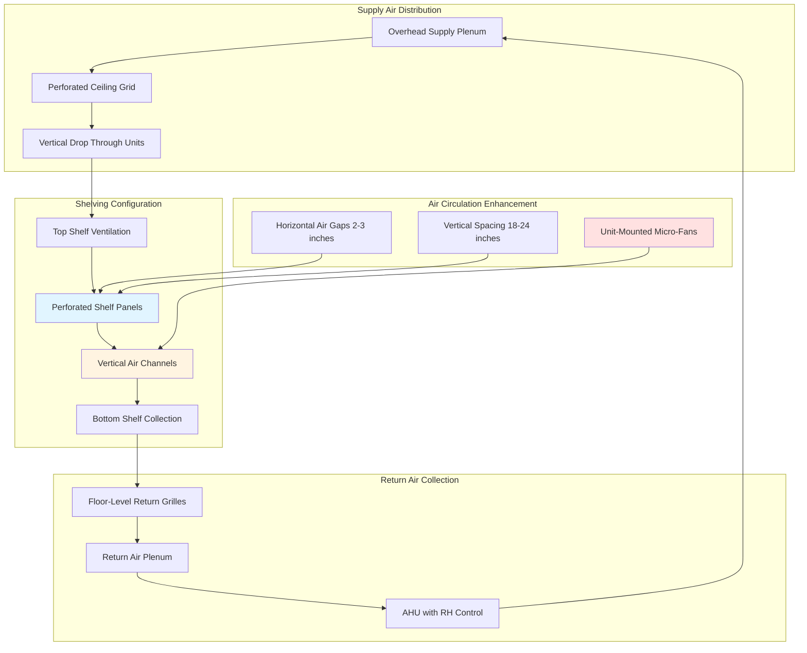

Compact mobile shelving systems maximize storage density by eliminating fixed aisles, creating significant HVAC challenges. The tightly packed configuration restricts air circulation, generates localized microclimates, and requires specialized ventilation strategies to maintain preservation conditions throughout the storage volume.

## Airflow Challenges in Compact Storage

Mobile shelving systems create three distinct airflow zones requiring different HVAC approaches:

**Closed Stack Conditions**
When shelving units are compacted, the space between units reduces to 1-2 inches, creating near-stagnant air zones. Air changes in these closed sections may drop to 0.1-0.3 ACH compared to 4-6 ACH in open aisles. Temperature stratification of 3-5°F can develop between top and bottom shelves, with humidity variations of 5-10% RH.

**Open Aisle Dynamics**
Temporary aisles experience elevated air velocity as supply air flows preferentially through the path of least resistance. Velocities of 75-150 fpm in open aisles contrast with <10 fpm in closed sections, creating preservation condition disparities across the collection.

**Perimeter Edge Effects**
The outermost shelving units adjacent to walls or supply diffusers receive disproportionate conditioning, while interior units remain isolated from direct airflow. This edge-to-core gradient can produce temperature differences exceeding 4°F and RH variations of 8-12%.

## Ventilation Design Requirements

Archive storage standards mandate specific environmental parameters regardless of shelving configuration:

| Parameter | ISO 11799 | ASHRAE Chapter 24 | PAS 198 |
|-----------|-----------|-------------------|---------|
| Temperature Stability | ±2°F | ±4°F | ±3.6°F |
| RH Stability | ±5% RH | ±5% RH | ±5% RH |
| Air Changes (Open) | 4-6 ACH | 4-8 ACH | 6-10 ACH |
| Air Changes (Closed) | 2-4 ACH | Not specified | 3-6 ACH |
| Particle Filtration | MERV 13 minimum | MERV 11-13 | MERV 13-14 |
| Air Velocity (at collections) | <50 fpm | <75 fpm | <50 fpm |

Achieving these parameters in compact shelving requires air changes 50-100% higher than equivalent static shelving due to restricted circulation paths.

## HVAC Integration Strategies

## Perforated Shelving Design

Standard solid shelves block vertical airflow, necessitating perforated or mesh alternatives:

**Perforation Specifications**
- Open area ratio: 40-60% for adequate air passage
- Hole diameter: 0.25-0.5 inches to prevent small object loss
- Spacing pattern: Staggered grid for structural integrity
- Material: Powder-coated steel with corrosion resistance

**Shelf Loading Considerations**
Densely packed materials on perforated shelves reduce effective open area by 60-80%. Design ventilation calculations based on worst-case loading scenarios where perforation effectiveness drops to 10-20% of theoretical maximum.

## Aisle Ventilation Enhancement

Temporary aisle conditioning presents unique challenges requiring rapid environmental response:

**Dedicated Aisle Supply**
Install compact linear diffusers along the mobile unit tops, activated when aisles open. Supply temperature offset 2-3°F warmer than ambient prevents cold air dumping onto collections. Air volume requirements: 3-5 CFM per linear foot of aisle length.

**Passive Circulation Boosting**
Mount low-velocity micro-fans (20-40 CFM each) at 6-8 foot intervals along vertical channels within shelving units. Operate continuously at 10-15% speed for background circulation, increasing to 40-60% when aisles are accessed. Fan power: 3-8 watts each.

**Automated Control Integration**
Link aisle position sensors to BMS for demand-based ventilation. When units separate, increase local supply air by 30-50% for 15-30 minutes to purge stagnant air, then reduce to maintenance levels. This strategy reduces annual HVAC energy consumption by 15-25% compared to constant maximum ventilation.

## Material-Specific Ventilation Requirements

Different collection materials demand adjusted airflow parameters:

| Material Type | Min Air Changes | Max Air Velocity | Special Considerations |
|---------------|----------------|------------------|------------------------|
| Paper Archives | 3-4 ACH | 50 fpm | Acid migration concerns, vertical stratification |
| Photographic Materials | 4-6 ACH | 40 fpm | Off-gassing sensitivity, RH precision ±3% |
| Magnetic Media | 6-8 ACH | 75 fpm | Heat dissipation from magnetic fields |
| Textile Storage | 2-3 ACH | 30 fpm | Dust settlement prevention, pest monitoring |
| Book Collections | 3-5 ACH | 60 fpm | Spine orientation affects air penetration |
| Microfilm Vaults | 6-10 ACH | 50 fpm | Temperature uniformity critical for dimensional stability |

## Design Verification Protocol

Commission compact shelving HVAC systems using this methodology:

1. **Baseline Mapping**: Measure temperature and RH at 9 points per shelving unit (top/middle/bottom × front/center/back) with units closed for 72 hours
2. **Aisle Opening Response**: Track environmental recovery time when creating aisles, target <30 minutes to reach steady state
3. **Load Testing**: Repeat measurements at 25%, 50%, 75%, and 100% collection density
4. **Seasonal Verification**: Conduct full mapping during peak cooling and heating months
5. **Long-term Monitoring**: Install permanent sensors at worst-case locations with ±0.5°F and ±2% RH accuracy

Properly designed HVAC systems for compact mobile shelving maintain ISO 11799 preservation standards while achieving 40-60% space savings compared to static shelving configurations. The investment in enhanced air distribution infrastructure provides long-term collection preservation benefits that far exceed the 15-30% premium in initial HVAC system costs.
