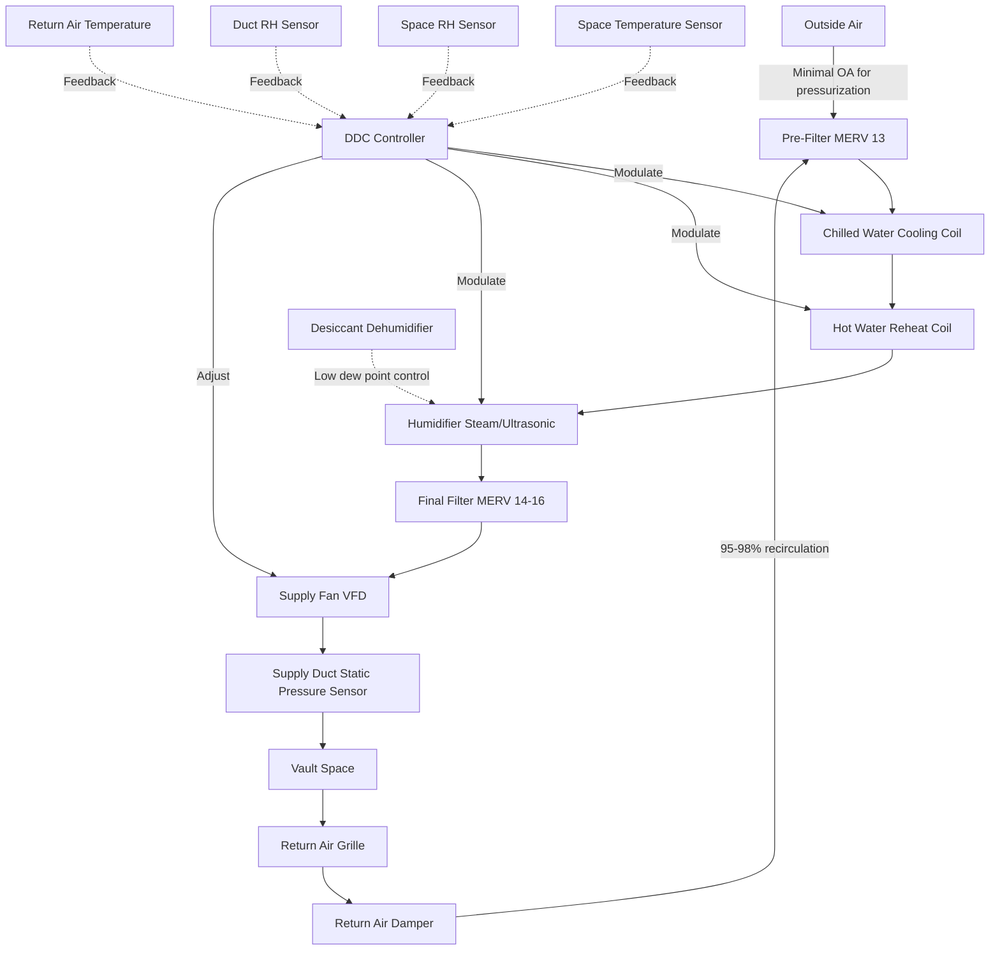

Storage vaults for archival materials, rare collections, and sensitive artifacts require precision environmental control systems that operate continuously with minimal variation. Unlike exhibition spaces, these dedicated storage environments prioritize material preservation over human comfort, demanding specialized HVAC approaches that maintain tight tolerance bands for temperature and relative humidity.

## Design Fundamentals for Vault Climate Control

Storage vault HVAC systems differ fundamentally from standard building applications. The primary design objective centers on eliminating environmental fluctuations that accelerate material degradation through hygroscopic expansion, chemical reaction rates, and biological activity. Dedicated air handling units serving only vault spaces provide superior control compared to shared systems, preventing cross-contamination and allowing independent setpoint management.

Vault systems operate with minimal internal loads due to restricted occupancy and limited lighting use. This characteristic enables downsized equipment capacity but requires careful attention to minimum turndown ratios to prevent short cycling during low-load conditions. Direct digital controls with proportional-integral-derivative algorithms maintain setpoints within narrow deadbands, typically ±2°F and ±3% RH.

## Temperature and Humidity Requirements by Material Type

Environmental parameters vary based on collection composition, with different materials exhibiting optimal preservation conditions. The following table presents NARA-derived and conservation community standards for common archival materials.

| Material Type | Temperature Range | Relative Humidity | Control Tolerance | Notes |
|--------------|-------------------|-------------------|-------------------|-------|
| Paper documents | 65-70°F | 35-45% | ±2°F, ±3% RH | Standard archival storage |
| Photographic film (B&W) | 35-45°F | 30-40% | ±2°F, ±2% RH | Cold storage required |
| Photographic film (color) | ≤35°F | 25-35% | ±2°F, ±2% RH | Frozen storage optimal |
| Magnetic media | 60-68°F | 30-40% | ±2°F, ±3% RH | Avoid humidity cycling |
| Parchment/vellum | 60-65°F | 45-55% | ±2°F, ±2% RH | Higher RH prevents brittleness |
| Nitrate film | 35-40°F | 30-40% | ±2°F, ±2% RH | Separate vault, fire risk |
| Mixed collections | 65-68°F | 35-45% | ±2°F, ±3% RH | Compromise conditions |

## System Architecture and Component Selection

Precision vault conditioning requires specific equipment configurations that deliver stable performance across minimal load variations. The system architecture diagram below illustrates key components and control sequences for a dedicated vault air handling system.

## Cold Storage and Cryogenic Vault Systems

Photographic film, particularly color emulsions, achieves extended life spans at sub-freezing temperatures. Cold storage vaults operating at 35-40°F use standard refrigeration equipment, while frozen storage below 32°F requires specialized low-temperature systems or reach-in freezer configurations.

Cold vault design considerations include:

- Vapor retarders with minimum 10 perm rating on warm side of insulation
- R-30 to R-40 wall and ceiling insulation assemblies
- Vestibule entries to minimize infiltration during access
- Controlled material acclimation before removal to exhibition temperature
- Condensate management for cooling coils operating below dew point
- Defrost cycles for sub-freezing applications

Transition protocols prevent condensation on cold materials. Items removed from cold storage must equilibrate in sealed containers or intermediate temperature zones before exposure to warmer, humid conditions. This acclimation period typically spans 24-48 hours depending on mass and temperature differential.

## Humidity Control Methodologies

Maintaining narrow relative humidity bands presents the primary control challenge in vault conditioning. Standard cooling coil/reheat sequences provide dehumidification but struggle below 40% RH at moderate temperatures. Multiple approaches address this limitation:

**Desiccant Dehumidification:** Rotating desiccant wheels achieve RH levels below 30% independent of cooling. Regeneration energy (typically 250-350°F) comes from electric resistance, gas heat, or heat recovery. Operating costs exceed mechanical dehumidification but provide superior low-humidity performance.

**Overcool and Reheat:** Deep cooling below dew point removes moisture, followed by sensible reheat to target temperature. Energy-intensive but effective, this method suits moderate humidity targets (35-50% RH). Proportional reheat control prevents temperature hunting.

**Chemical Dehumidification:** Lithium chloride or similar hygroscopic solutions absorb moisture in dedicated equipment. Less common than desiccant systems but applicable for specific installations.

## Filtration and Air Quality Management

Archival materials suffer degradation from particulate matter, gaseous pollutants, and biological contaminants. Multi-stage filtration protects collections while maintaining acceptable pressure drop across the air handling system.

| Filtration Stage | Filter Type | Efficiency | Target Contaminants | Typical Δp |
|-----------------|-------------|------------|---------------------|-----------|
| Pre-filtration | MERV 13 pleated | 85% @ 1μm | Large particulates, fibers | 0.3-0.5 in. w.c. |
| Final filtration | MERV 14-16 bag | 95% @ 0.3μm | Fine particulates, spores | 0.6-1.0 in. w.c. |
| Carbon filtration | Activated carbon | Gas removal | Ozone, VOCs, sulfur compounds | 0.2-0.4 in. w.c. |
| HEPA (optional) | 99.97% @ 0.3μm | Maximum protection | Ultra-fine particulates | 1.0-1.5 in. w.c. |

Gaseous filtration using activated carbon or potassium permanganate media removes sulfur dioxide, nitrogen oxides, and ozone—pollutants that accelerate paper degradation and dye fading. Chemical filtration typically follows particulate removal to prevent media saturation with dust.

## Ventilation Rates and Pressurization

Storage vaults operate with minimal outside air introduction, typically 2-4 air changes per hour total supply with 95-98% recirculation. This low ventilation rate:

- Reduces cooling and dehumidification loads
- Minimizes introduction of outdoor contaminants
- Lowers energy consumption
- Maintains stable conditions

Positive pressurization relative to adjacent spaces (0.02-0.05 in. w.c.) prevents infiltration of unconditioned air and particulates. Pressurization comes from slight outdoor air excess over exhaust/exfiltration, maintaining inward-to-vault airflow at door openings.

## Monitoring and Alarming Infrastructure

Continuous monitoring with data logging enables verification of environmental stability and rapid response to deviations. Critical parameters include space temperature, relative humidity, dew point, and differential pressure. Monitoring systems should:

- Record measurements at 5-15 minute intervals
- Generate alarms for out-of-tolerance conditions
- Provide historical trending for verification
- Alert facility staff via multiple communication paths
- Include redundant sensors for critical spaces

Vault environmental logs become part of permanent collection records, documenting preservation conditions and supporting insurance requirements.
