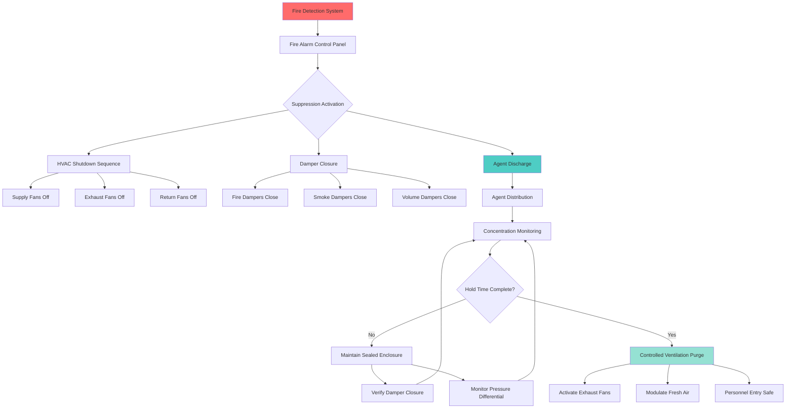

## Fire Suppression Systems for Museum Storage Vaults

Museum and archive storage vaults require fire suppression systems that protect irreplaceable collections while preventing water damage. Clean agent gaseous suppression systems provide rapid fire extinguishment without residue or secondary damage to artifacts, making them the preferred solution for high-value storage environments.

## Clean Agent Suppression Fundamentals

Clean agent systems extinguish fires through heat absorption and oxygen displacement without electrically conductive residues. The critical design parameter is achieving the minimum design concentration throughout the protected volume within the specified discharge time.

### Agent Concentration Calculation

The required agent mass depends on the protected volume, agent type, and design concentration:

$$W = \frac{V \cdot C}{S} \cdot \left(\frac{T_a}{T_0}\right)$$

Where:
- $W$ = agent mass required (kg)
- $V$ = net protected volume (m³)
- $C$ = design concentration (%)
- $S$ = specific vapor volume (m³/kg)
- $T_a$ = ambient temperature (K)
- $T_0$ = reference temperature (typically 294 K)

### Hold Time Requirements

After discharge, the agent concentration must remain above the minimum extinguishing concentration for the required hold time:

$$t_h = t_{min} + t_{extinguish} + t_{safety}$$

Where:
- $t_h$ = total hold time (min)
- $t_{min}$ = 10 minutes minimum per NFPA 2001
- $t_{extinguish}$ = additional time for deep-seated fires
- $t_{safety}$ = safety margin (typically 5 minutes)

For museum vaults storing combustible materials, 20-30 minute hold times are standard to ensure complete extinguishment of smoldering fires within artifact storage containers.

## HVAC System Integration

Proper HVAC integration is critical for maintaining agent concentration and preventing system conflicts during fire events.

### HVAC Shutdown Sequence

Upon fire detection, the HVAC system must execute a coordinated shutdown to prevent agent loss:

1. **Pre-discharge alarm** (30-60 seconds before agent release)
   - Shut down all supply fans
   - Shut down all return and exhaust fans
   - Close all fire and smoke dampers
   - Close all volume control dampers

2. **Agent discharge** (occurs after pre-discharge delay)
   - Agent released into protected space
   - Target concentration achieved within 10 seconds

3. **Hold time maintenance** (20-30 minutes)
   - All HVAC equipment remains off
   - Dampers remain closed
   - Enclosure integrity maintained
   - Monitor for agent concentration decay

4. **Post-discharge ventilation** (after hold time verification)
   - Gradually introduce fresh air
   - Activate exhaust fans at low speed
   - Prevent stratification of agent vapors
   - Monitor for safe oxygen levels

## Suppression Agent Comparison

Selection of the appropriate clean agent depends on extinguishing performance, environmental impact, and collection compatibility.

| Agent Type | Design Concentration | Discharge Time | NOAEL | Environmental Impact | Typical Hold Time |
|------------|---------------------|----------------|-------|----------------------|-------------------|
| FM-200 (HFC-227ea) | 7.0-8.5% | 10 seconds | 9.0% | GWP 3220 | 10 minutes |
| Novec 1230 (FK-5-1-12) | 4.5-5.8% | 10 seconds | >10% | GWP 1, ODP 0 | 10 minutes |
| IG-541 (Inert Gas) | 40-42% | 60 seconds | >43% | Zero GWP/ODP | 10 minutes |
| IG-55 (Argonite) | 40-42% | 60 seconds | >43% | Zero GWP/ODP | 10 minutes |
| Water Mist | N/A | 10-30 seconds | N/A | Zero | N/A |

**Key Parameters:**
- **NOAEL** (No Observable Adverse Effect Level): maximum safe concentration for human exposure
- **GWP** (Global Warming Potential): environmental impact relative to CO₂
- **ODP** (Ozone Depletion Potential): stratospheric ozone impact

### Agent Selection Criteria

**FM-200 (Heptafluoropropane)**
- Rapid extinguishment with low concentration
- Requires less storage space than inert gas
- Higher environmental impact (GWP 3220)
- Suitable for Class A and Class B fires
- Narrow safety margin between design and NOAEL

**Novec 1230 (Fluorinated Ketone)**
- Lowest environmental impact among halocarbon agents
- Excellent safety margin (NOAEL >10%)
- Minimal temperature drop during discharge
- Premium cost compared to FM-200
- Preferred for sustainable museum operations

**Inert Gas (IG-541, IG-55)**
- Zero environmental impact
- Extinguishment by oxygen displacement to 12-13%
- Requires large storage cylinder banks
- 60-second discharge time
- Suitable for electrically energized equipment

**Water Mist**
- No agent storage requirements
- Effective cooling for Class A fires
- Risk of water damage to collections
- Requires dedicated water supply
- Generally avoided in high-value storage vaults

## NFPA Standards Compliance

Fire suppression systems for museum vaults must comply with multiple NFPA standards:

### NFPA 2001 - Clean Agent Fire Extinguishing Systems

- Minimum design concentration for Class A fuels: 5.8-8.5% (agent-dependent)
- Maximum discharge time: 10 seconds for halocarbon agents
- Minimum hold time: 10 minutes (extended for deep-seated fires)
- Pre-discharge alarm: minimum 30 seconds (up to 60 seconds where life safety permits)
- Enclosure integrity testing required (door fan test per NFPA 2001 Annex C)

### NFPA 75 - Information Technology Equipment

For vaults housing digital archives and electronic media:

- Electrical shutdown coordination with suppression activation
- UPS systems must continue operation during discharge
- Environmental monitoring during hold time
- Post-discharge inspection of electronic equipment

### Museum-Specific Requirements

Following ICOM (International Council of Museums) fire protection guidelines:

- Redundant detection systems (cross-zoned verification)
- Manual abort capability for false alarms
- Post-discharge artifact condition assessment protocols
- Collection-specific hold times for archival materials
- Integration with security and environmental monitoring

## Damper Control and Enclosure Integrity

Agent retention during hold time depends on achieving and maintaining enclosure integrity.

### Critical Leakage Points

1. **Fire and smoke dampers**
   - Must achieve Class I leakage rating per UL 555/555S
   - Actuator fail-safe position: normally open, close on fire
   - Redundant closure verification via end switches

2. **Door assemblies**
   - Automatic door closers required
   - Electromagnetic hold-open devices release on alarm
   - Drop seals or gasketing for 3-hour fire rating
   - Vision panels with fire-rated glazing

3. **Penetrations and services**
   - All cable, pipe, and conduit penetrations fire-stopped
   - HVAC ductwork penetrations with fire dampers
   - Pressure relief venting sized per NFPA 2001 Section 5.4.1.3

### Enclosure Integrity Testing

Prior to system commissioning, perform door fan test per NFPA 2001 Annex C:

$$Q = C \cdot A \cdot \sqrt{\Delta P}$$

Where:
- $Q$ = leakage rate (m³/min)
- $C$ = flow coefficient
- $A$ = effective leakage area (m²)
- $\Delta P$ = pressure differential (Pa)

Maximum allowable leakage ensures agent concentration remains above minimum extinguishing concentration for the required hold time. Typical vault leakage targets: equivalent leakage area <0.1% of floor area.

## Post-Discharge HVAC Restoration

After fire suppression system discharge and hold time verification:

1. **Assess fire status** - confirm complete extinguishment
2. **Monitor agent concentration** - verify safe levels for entry
3. **Activate purge ventilation** - 100% outside air at reduced airflow
4. **Monitor oxygen levels** - ensure >19.5% before personnel entry
5. **Gradual return to normal** - restore setpoints after complete purge
6. **System reset** - recharge suppression system, inspect dampers
7. **Collection assessment** - evaluate artifact conditions post-event

This controlled restoration prevents thermal shock to collections and ensures safe conditions for emergency responders and conservation staff.

## Conclusion

Clean agent fire suppression systems provide essential protection for museum and archive storage vaults when properly integrated with HVAC systems. Successful implementation requires careful agent selection, precise concentration calculations, coordinated HVAC shutdown sequences, and rigorous enclosure integrity testing to maintain hold time requirements per NFPA 2001. The superior fire protection and minimal collection damage offered by gaseous suppression systems make them the standard of care for protecting irreplaceable cultural heritage materials.
