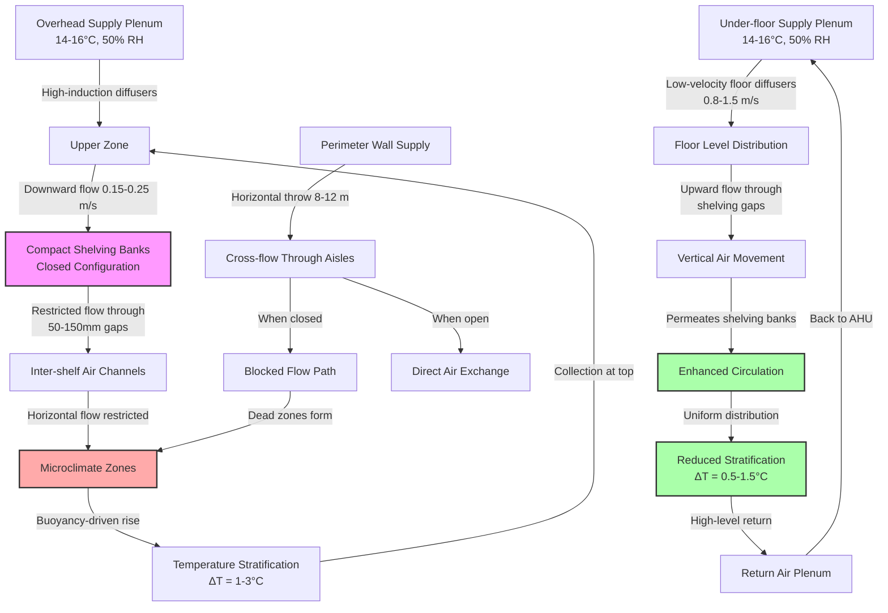

## Physical Challenge of High-Density Storage

High-density compact shelving systems—characterized by mobile shelving units on tracks that eliminate fixed aisles—create severe HVAC challenges. Storage density increases 40-80% compared to static shelving, but air circulation capacity decreases proportionally. The result is restricted airflow pathways, extended air residence time, and substantial risk of microclimate formation within closed shelving banks.

The fundamental problem is geometric: when shelving units compress to eliminate aisles, air must travel through narrow vertical channels and horizontal gaps (typically 50-150 mm) rather than through open aisles. Pressure drop increases exponentially, and velocity decreases to levels where buoyancy-driven stratification dominates over forced convection.

## Air Distribution Physics

### Pressure Drop Through Compact Shelving

Airflow resistance through closed compact shelving banks follows the Darcy-Weisbach relationship modified for porous media:

$$\Delta P = f \cdot \frac{L}{D_h} \cdot \frac{\rho v^2}{2} + K \cdot \frac{\rho v^2}{2}$$

Where:
- $\Delta P$ = pressure drop through shelving bank (Pa)
- $f$ = friction factor (0.02-0.05 for shelving with stored materials)
- $L$ = depth of shelving bank (m)
- $D_h$ = hydraulic diameter of flow channels (m), typically 0.05-0.15 m
- $\rho$ = air density (kg/m³), approximately 1.2 kg/m³
- $v$ = air velocity through restriction (m/s)
- $K$ = minor loss coefficient for entrance/exit effects, typically 1.5-3.0

For a typical 10 m deep compact shelving bank with 75 mm gaps, pressure drop ranges from 15-40 Pa at design airflow rates, requiring dedicated distribution strategies.

### Required Air Change Rate

High-density storage requires elevated air change rates to overcome restricted circulation:

$$ACH_{required} = ACH_{base} \cdot \left(1 + \frac{\Delta T_{max}}{2}\right) \cdot \frac{V_{total}}{V_{accessible}}$$

Where:
- $ACH_{base}$ = baseline air changes per hour for open storage (typically 4-6 ACH)
- $\Delta T_{max}$ = maximum allowable temperature variation (°C), typically 2°C
- $V_{total}$ = total storage volume including shelving (m³)
- $V_{accessible}$ = volume of accessible air pathways when closed (m³)

This calculation yields 8-15 ACH for typical high-density installations versus 4-6 ACH for conventional static shelving.

## HVAC System Approaches

### Comparison of Distribution Strategies

| **Approach** | **Air Change Rate** | **Temperature Uniformity** | **Capital Cost** | **Dead Zone Risk** | **Best Application** |
|--------------|---------------------|----------------------------|------------------|--------------------|---------------------|
| **Overhead supply, low return** | 8-12 ACH | ±1.5-2.5°C | Baseline | Moderate (floor level) | Standard archives, moderate density |
| **Perimeter wall diffusers** | 10-15 ACH | ±1.0-2.0°C | +15-25% | Low (if spaced correctly) | Medium height (≤4 m), perimeter access |
| **Under-floor plenum with floor diffusers** | 12-18 ACH | ±0.5-1.5°C | +40-60% | Very low | Critical collections, tight tolerances |
| **Dedicated in-aisle supply** | 15-20 ACH | ±0.5-1.0°C | +60-80% | Minimal | High-value, maximum density |
| **Hybrid (perimeter + overhead)** | 10-14 ACH | ±1.0-1.5°C | +25-35% | Low | Large facilities, variable density |

### Under-Floor Distribution

Under-floor supply with low-velocity floor diffusers positioned in potential aisle locations provides the most effective solution for critical high-density storage. Air rises through the shelving banks via buoyancy after initial horizontal distribution, creating vertical flow that counteracts stratification.

Design velocity at floor diffusers should be 0.8-1.5 m/s to provide penetration without excessive turbulence. Plenum depth of 300-450 mm enables adequate pressure equalization across large floor areas.

### Overhead Distribution

Overhead supply requires high induction diffusers positioned to drive air downward between shelving rows. Ceiling height must exceed shelving height by minimum 1.5 m to enable effective air entrainment before impingement on shelving tops.

Return air should be located at floor level on opposite walls to create vertical circulation through the entire storage volume. This approach is more economical but provides inferior uniformity compared to under-floor systems.

## Air Distribution Configuration

## Stratification Control

Temperature stratification in high-density storage results from:

1. **Restricted convection**: Minimal forced airflow through closed shelving banks allows buoyancy to dominate
2. **Thermal mass asymmetry**: Stored materials absorb heat slowly, creating temperature lag
3. **Heat gain concentration**: Lighting and equipment heat concentrates at upper levels

Stratification magnitude follows:

$$\Delta T_{stratification} = \frac{q \cdot H}{k_{eff} \cdot A_{flow} \cdot v}$$

Where:
- $q$ = internal heat gain rate (W)
- $H$ = ceiling height (m)
- $k_{eff}$ = effective thermal conductivity of air/shelving system (W/m·K)
- $A_{flow}$ = effective flow cross-section (m²)
- $v$ = average air velocity (m/s)

To maintain stratification below 2°C requires velocity of 0.15-0.25 m/s through the storage volume, achievable only with enhanced air change rates and proper distribution.

## Dead Zone Elimination

Dead zones form in:
- Corners of closed shelving banks (particularly lower corners opposite returns)
- Centers of large closed banks exceeding 10 m × 10 m without internal air pathways
- Floor level areas beneath bottom shelves with inadequate clearance (<150 mm)

Mitigation strategies:
- Position supply diffusers to create overlapping coverage with maximum 4-5 m spacing
- Maintain minimum 200 mm clearance beneath bottom shelves
- Install vertical air channels within shelving systems at 6-8 m intervals for banks exceeding 12 m depth
- Use ceiling-mounted destratification fans operating continuously at low speed (0.5-1.0 m/s) in critical zones

## Standards and Tolerances

ASHRAE Chapter 24 (Archives and Libraries) specifies:
- Temperature: 15-21°C with maximum ±2°C variation
- Relative humidity: 30-50% with maximum ±5% variation
- Air changes: minimum 4 ACH for static storage; increase for compact shelving

ISO 11799 (Archival Storage) provides tighter specifications:
- Temperature: 18±2°C (documents), 2-10°C (photographs)
- Relative humidity: 35±5% (documents), 30-40% (photographs)
- Maximum rate of change: 4°C/day, 10% RH/day

High-density storage design should target the upper end of ACH requirements and tighter uniformity tolerances (±1.5°C, ±3% RH) due to restricted natural circulation.

## Design Recommendations

For optimal environmental control in high-density compact shelving storage:

1. **Specify under-floor or perimeter distribution** for installations requiring ±2°C or tighter uniformity
2. **Calculate pressure drop through shelving banks** and verify supply system can overcome 15-40 Pa additional resistance
3. **Design for 10-15 ACH minimum** based on total storage volume
4. **Position temperature/RH sensors** at multiple levels (floor, mid-height, ceiling) and within closed shelving banks
5. **Provide independent circulation fans** for installations exceeding 500 m² storage area
6. **Maintain supply air temperature** 1-2°C below space setpoint to overcome internal gains during circulation
7. **Verify adequate return air pathways** with maximum 15 Pa pressure differential between supply and return

The physics of restricted airflow in high-density storage demands elevated air change rates, strategic distribution, and continuous monitoring to maintain archival environment standards.
