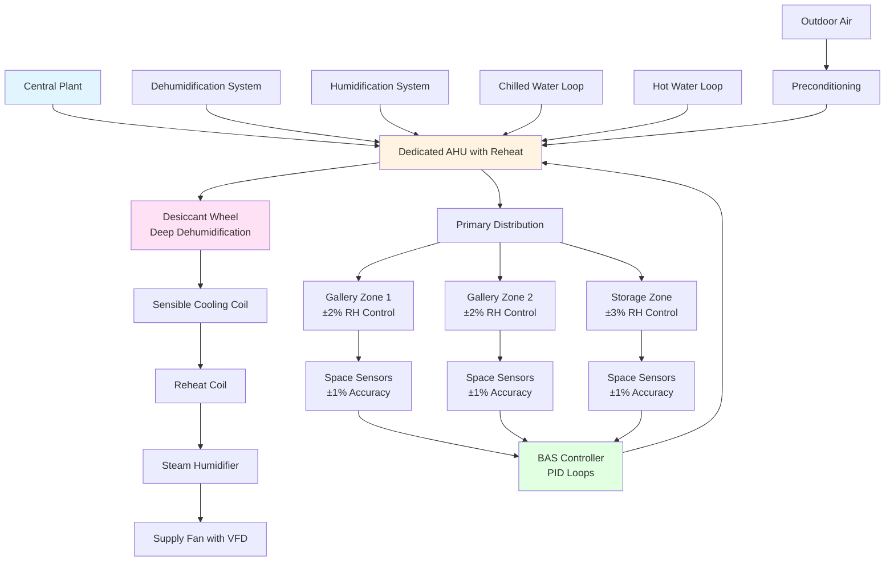

## Overview

Museum preservation environments demand HVAC systems that maintain precise temperature and relative humidity (RH) within narrow tolerances while limiting rate-of-change fluctuations. Unlike comfort conditioning, preservation systems prioritize stability over energy efficiency, as even minor environmental variations can accelerate material degradation through hygroscopic dimensional changes, chemical reactions, and biological growth.

The fundamental preservation challenge involves controlling moisture content equilibrium between hygroscopic materials and ambient air. When RH changes, organic materials absorb or desorb moisture until reaching equilibrium moisture content (EMC), causing dimensional stresses that lead to cracking, warping, and delamination.

## Thermodynamic Principles of Conservation Control

### Relative Humidity Calculations

Relative humidity represents the ratio of actual water vapor partial pressure to saturation vapor pressure at a given temperature:

$$\phi = \frac{P_v}{P_{vs}(T)} \times 100\%$$

Where:
- $\phi$ = relative humidity (%)
- $P_v$ = actual water vapor partial pressure (Pa)
- $P_{vs}(T)$ = saturation vapor pressure at temperature T (Pa)

The Antoine equation approximates saturation vapor pressure over water:

$$\log_{10}(P_{vs}) = A - \frac{B}{C + T}$$

For water: A = 8.07131, B = 1730.63, C = 233.426 (T in °C, $P_{vs}$ in mmHg)

### Equilibrium Moisture Content

The relationship between EMC and RH for cellulosic materials follows the Henderson-Thompson model:

$$EMC = \left[\frac{-\ln(1-\phi)}{A(T + B)}\right]^{1/C}$$

For wood and paper: A = 6.27×10⁻⁵, B = 273, C = 2.0

This demonstrates why RH control takes precedence over temperature control—moisture content in hygroscopic artifacts depends primarily on RH, with temperature playing a secondary role through its effect on vapor pressure.

## ASHRAE Standard Setpoints and Control Bands

ASHRAE Handbook—HVAC Applications, Chapter 24 (Museums, Galleries, Archives, and Libraries) establishes preservation environment classes:

| Collection Type | Temperature | RH Setpoint | Control Band | Rate-of-Change Limit |
|----------------|-------------|-------------|--------------|----------------------|
| General collections | 20-22°C (68-72°F) | 50% | ±5% | 5% RH/month maximum |
| Metal artifacts | 18-20°C (64-68°F) | 30-40% | ±3% | 10°C/24hr, 5% RH/day |
| Photographs (B&W) | 18-20°C (64-68°F) | 30-40% | ±3% | Strict: ±2% daily |
| Oil paintings | 20-22°C (68-72°F) | 50% | ±5% | 3% RH/day maximum |
| Paper/books | 18-21°C (64-70°F) | 40-50% | ±5% | 5% RH/month |
| Natural history (organic) | 16-19°C (60-66°F) | 50-55% | ±5% | Seasonal gradual shifts |
| Film (nitrate/acetate) | 2-10°C (36-50°F) | 30-40% | ±3% | Requires cold storage |
| Textiles | 18-20°C (64-68°F) | 50-55% | ±3% | 2-3% RH/day |

The Getty Conservation Institute recommends the "±5/±5" standard (±5°F, ±5% RH) for mixed collections as a practical compromise between ideal preservation and operational reality.

## System Architecture for Precision Control

## Engineering Strategies for Stability

### Dedicated Systems with Reheat

Museum HVAC systems employ cooling-based dehumidification followed by reheat to achieve independent temperature and humidity control. The process:

1. **Over-cool supply air** to condense moisture below setpoint
2. **Reheat to desired temperature** using hot water or electric coils
3. **Add moisture if needed** using steam or ultrasonic humidifiers
4. **Modulate continuously** through proportional-integral-derivative (PID) control

This approach wastes energy but provides the precision stability required for preservation.

### Desiccant-Enhanced Dehumidification

For deep dehumidification (below 40% RH), vapor compression systems become inefficient. Desiccant wheels using silica gel or lithium chloride achieve dewpoints of 0-5°C, enabling consistent control during humid seasons without excessive subcooling.

### Seasonal Adjustment Philosophy

The International Institute for Conservation (IIC) and American Institute for Conservation (AIC) now recognize that gradual seasonal RH changes (40% winter to 55% summer) cause less damage than mechanical system failures attempting year-round setpoints. The key requirement: rate-of-change must not exceed 5% RH per month.

This "seasonal set-point drift" reduces energy consumption by 30-40% while accommodating building envelope moisture dynamics without compromising long-term preservation.

### Zoning and Air Distribution

Precision systems require:

- **Separate air handling per zone** to accommodate different collection requirements
- **Low-velocity laminar supply** (200-300 FPM) to prevent localized RH gradients
- **Return air sensing 15 minutes delayed** to account for mixing time constant
- **Redundant sensors** (minimum three per zone) with signal averaging
- **Gradual setback during unoccupied periods** (maximum 2°F/hour, 2% RH/hour)

### Sensor Calibration and Accuracy

Conservation-grade RH sensors must maintain ±1% accuracy across the 30-60% RH range. Capacitive thin-film sensors provide superior long-term stability compared to resistive types. Calibration protocol:

- **Monthly verification** against NIST-traceable salt standards
- **Annual recalibration** by manufacturer or certified laboratory
- **Replacement every 5 years** due to sensor drift

## Load Calculations and System Sizing

Museum latent loads dominate sensible loads due to:

- **Infiltration through building envelope**: 0.2-0.5 ACH typical
- **Visitor moisture generation**: 200-250 g/hr per person
- **Display case off-gassing**: requires makeup air treatment

Size dehumidification capacity for worst-case summer conditions at outdoor design dewpoint plus 20% safety factor. Humidification sizing requires winter indoor/outdoor vapor pressure differential analysis.

## Monitoring and Alarming

Conservation environments require continuous monitoring with alarm thresholds set at control band limits:

- **Data logging at 15-minute intervals** minimum
- **Immediate alarms** for ±3% RH deviation or ±3°F temperature deviation
- **Trending analysis** to identify slow seasonal drifts before they exceed monthly rate-of-change limits
- **Redundant systems** with automatic failover for mission-critical collections

## Practical Implementation Considerations

The most reliable museum HVAC systems feature:

1. **24/7 operation** with no night setback (maintain stability)
2. **N+1 redundancy** for all critical components
3. **Bypass ductwork** allowing temporary zone isolation during maintenance
4. **Manual override capability** for conservators during environmental emergencies

The HVAC system must serve conservation goals first, occupant comfort second. When these requirements conflict, preservation takes precedence.

---

**References**: ASHRAE Handbook—HVAC Applications Chapter 24, Getty Conservation Institute environmental guidelines, IIC Declaration on Environmental Guidelines (2014), AIC Commentaries to the Declaration (2016), ISO 11799 Archive Storage standard.
