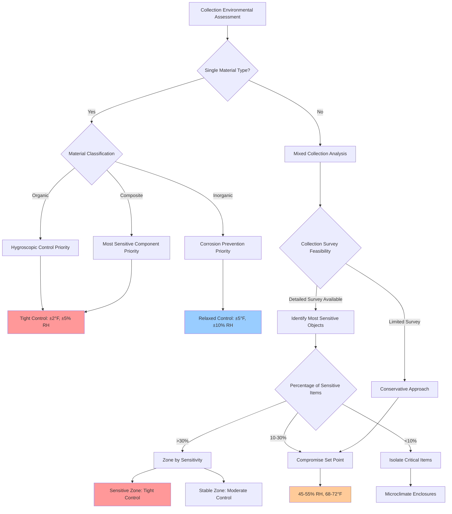

## Collection Type Environmental Requirements

Museum collections exhibit vastly different sensitivities to temperature and relative humidity based on material composition, hygroscopic properties, and degradation mechanisms. ASHRAE Chapter 24 (Museums, Galleries, Archives, and Libraries) provides the foundation for collection-specific environmental control strategies that balance preservation needs with energy consumption and operational feasibility.

### Material Categories and Sensitivity Classification

**Organic Materials** (high hygroscopic sensitivity):
- Paper, parchment, photographic materials
- Textiles, leather, fur
- Wood, bamboo, natural fibers
- Biological specimens

**Inorganic Materials** (low hygroscopic sensitivity):
- Metals (ferrous and non-ferrous)
- Ceramics, glass, stone
- Stable plastics and synthetic polymers
- Minerals and geological specimens

**Composite Materials** (intermediate sensitivity):
- Paintings on canvas or wood panels
- Furniture with multiple material components
- Ethnographic objects with mixed construction
- Mounted specimens and dioramas

### ASHRAE Environmental Specifications by Collection Type

| Collection Type | Temperature Range | Relative Humidity | Allowable Fluctuation | Risk Factor |
|-----------------|-------------------|-------------------|----------------------|-------------|
| Paper archives | 68-72°F (20-22°C) | 30-50% RH | ±2°F, ±5% RH/day | High |
| Photographs (silver gelatin) | 65-70°F (18-21°C) | 30-40% RH | ±2°F, ±3% RH/day | Critical |
| Oil paintings on canvas | 68-75°F (20-24°C) | 45-55% RH | ±4°F, ±5% RH/day | High |
| Wooden furniture/panels | 68-72°F (20-22°C) | 45-55% RH | ±3°F, ±5% RH/day | High |
| Textiles and leather | 65-70°F (18-21°C) | 45-55% RH | ±3°F, ±5% RH/day | High |
| Metals (ferrous) | 68-72°F (20-22°C) | <35% RH | ±5°F, ±10% RH/day | Medium |
| Ceramics and glass | 68-75°F (20-24°C) | 40-60% RH | ±5°F, ±10% RH/day | Low |
| Stone and minerals | 65-75°F (18-24°C) | 35-65% RH | ±8°F, ±15% RH/day | Low |

### Risk Assessment Methodology

The degradation risk for hygroscopic materials follows an Arrhenius relationship for chemical reaction rates combined with moisture-induced mechanical stress. The cumulative degradation index can be expressed as:

$$
D_{total} = \int_{0}^{t} k(T, RH) \, dt
$$

where $k(T, RH)$ represents the degradation rate coefficient influenced by temperature and relative humidity.

For temperature-dependent degradation:

$$
k_T = A \cdot e^{-\frac{E_a}{RT}}
$$

where:
- $A$ = pre-exponential factor (material-specific)
- $E_a$ = activation energy (kJ/mol)
- $R$ = universal gas constant (8.314 J/mol·K)
- $T$ = absolute temperature (K)

For fluctuation-induced mechanical stress in hygroscopic materials:

$$
\sigma_{RH} = E_{eff} \cdot \alpha_{RH} \cdot \Delta RH
$$

where:
- $\sigma_{RH}$ = induced stress (Pa)
- $E_{eff}$ = effective elastic modulus (Pa)
- $\alpha_{RH}$ = hygroscopic expansion coefficient (%/% RH)
- $\Delta RH$ = relative humidity change (%)

The allowable daily fluctuation limit for wood-based objects can be calculated:

$$
\Delta RH_{max} = \frac{\sigma_{yield}}{E_{eff} \cdot \alpha_{RH}}
$$

Typical values for wood yield $\Delta RH_{max} \approx 5-7\%$ daily change, consistent with ASHRAE recommendations.

### Collection Type Decision Tree

### Mixed Collection Compromise Strategies

Real-world museums rarely contain homogeneous collections, necessitating compromise strategies:

**1. Most Sensitive Object Priority**
Set environmental parameters based on the most vulnerable materials. For a mixed collection containing paper, metal, and ceramics, the paper requirements (45-50% RH) govern the entire space.

**2. Zoning by Material Sensitivity**
Separate HVAC control zones for:
- High-sensitivity organic materials: 45-55% RH, ±5% daily fluctuation
- Medium-sensitivity composites: 40-60% RH, ±10% daily fluctuation
- Low-sensitivity inorganic materials: 35-65% RH, ±15% daily fluctuation

**3. Microclimate Enclosures**
For exceptionally sensitive items within a broader collection, sealed display cases with independent humidity control buffering provide localized protection without conditioning the entire gallery space.

**4. Seasonal Adaptation**
ASHRAE allows seasonal set point adjustments (winter: 45% RH, summer: 55% RH) to reduce energy consumption while maintaining cumulative degradation within acceptable limits. The annual average remains within the target range.

### Collection Survey Requirements

Effective environmental specification requires comprehensive collection inventory:

- Material composition and condition assessment
- Hygroscopic sensitivity classification
- Existing degradation patterns
- Value hierarchy (cultural, historical, monetary)
- Display vs. storage requirements

Conservators employ the risk assessment framework to prioritize HVAC investment where preservation benefit is greatest. A collection with 80% ceramics and 20% watercolors should invest in tight control for the watercolor gallery rather than uniform conditioning throughout.

### Implementation Considerations

**Control Tolerance Selection:**
Tighter tolerances demand:
- Higher precision sensors (±2% RH accuracy vs. ±5%)
- Increased HVAC equipment capacity for rapid response
- Enhanced dehumidification/humidification staging
- Greater energy consumption (30-50% increase for ±3% RH vs. ±8% RH)

**Monitoring and Documentation:**
Continuous datalogger deployment at artifact level validates HVAC performance and identifies microclimatic deviations. Logging intervals of 15-60 minutes capture diurnal cycles and mechanical system responses.

### Conservator Consultation Protocol

HVAC designers must collaborate with conservation professionals during:
- Initial collection assessment and material identification
- Environmental specification development
- Set point compromise negotiations for mixed collections
- Control tolerance definition based on budget constraints
- Monitoring strategy and alarm threshold establishment

The conservator's material science expertise translates abstract degradation mechanisms into quantifiable HVAC performance requirements, ensuring the mechanical system protects rather than damages irreplaceable cultural heritage.
