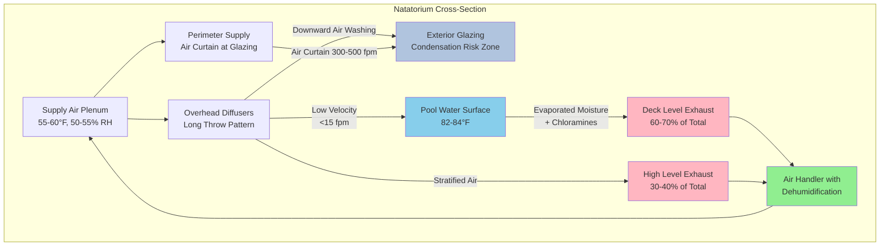

# Air Distribution Systems for Indoor Swimming Pools

Proper air distribution in natatorium environments is critical for controlling moisture migration, preventing condensation on building surfaces, and maintaining swimmer comfort. Unlike conventional HVAC applications, pool air distribution must address high moisture loads, chloramine exposure, and occupant activities occurring at the breathing zone near the water surface.

## Fundamental Design Principles

Air distribution in natatoriums serves three primary objectives:

1. **Surface evaporation control** - Direct low-velocity airflow across the water surface minimizes evaporation rates
2. **Condensation prevention** - Maintain building envelope surfaces above dew point temperature through proper air washing
3. **Contaminant dilution** - Remove chloramines and disinfection byproducts at the breathing zone

The ASHRAE Handbook Applications (Chapter 6) specifies that air distribution systems must provide sufficient air motion to prevent stratification while avoiding excessive velocities that increase evaporation. The relationship between air velocity and evaporation rate follows:

$$E = A \cdot (P_w - P_a) \cdot (0.089 + 0.0782 \cdot V)$$

Where:
- $E$ = evaporation rate (lb/h)
- $A$ = water surface area (ft²)
- $P_w$ = saturation pressure at water temperature (in. Hg)
- $P_a$ = partial pressure of water vapor in air (in. Hg)
- $V$ = air velocity over water surface (fpm)

This equation demonstrates that air velocity has a direct linear relationship with evaporation beyond the base rate. Maintaining velocities below 10-15 fpm at the water surface reduces unnecessary moisture loads.

## Air Distribution Strategies

### Overhead Supply with Low Sidewall Return

The most common approach supplies conditioned air from overhead diffusers with returns positioned at deck level. This configuration:

- Provides downward airflow to wash exterior walls and windows
- Reduces temperature stratification
- Positions return grilles to capture chloramines concentrated near the water surface

Supply diffusers require long throw patterns to reach perimeter glazing. The throw distance is calculated using:

$$L = K \cdot \sqrt{\frac{Q}{V_t}}$$

Where:
- $L$ = throw distance to terminal velocity (ft)
- $K$ = diffuser-specific constant (typically 2.0-4.0)
- $Q$ = airflow rate (cfm)
- $V_t$ = terminal velocity (fpm)

For natatoriums with high ceilings (15-30 ft), select diffusers with K-factors of 3.5 or higher to achieve adequate throw without excessive supply velocities.

### Perimeter Air Distribution

Perimeter systems supply conditioned air along exterior walls through linear diffusers or slot outlets. This approach:

- Creates an air curtain effect over glazing surfaces
- Directly addresses condensation risk zones
- Reduces throw requirements compared to overhead systems

Supply outlets positioned 12-18 inches from glazing surfaces should deliver air at 300-500 fpm discharge velocity with a 15-30 degree downward angle. The air curtain must extend from ceiling to floor, creating a thermal barrier that maintains glass surface temperatures above the space dew point.

### Displacement Ventilation

Low-velocity displacement systems supply air at or near deck level at temperatures only 2-4°F below space temperature. The supply air spreads across the floor, picks up heat and contaminants, and rises naturally to overhead exhaust points. Benefits include:

- Superior contaminant removal efficiency at the breathing zone
- Reduced air velocities over the water surface
- Lower fan energy due to reduced pressure drops

Displacement ventilation requires supply velocities below 50 fpm and dedicated attention to supply air temperature control. Temperature differentials exceeding 5°F create uncomfortable drafts at ankle level.

## Air Distribution Comparison

| Strategy | Advantages | Disadvantages | Best Application |
|----------|-----------|---------------|------------------|
| Overhead Supply | Proven reliability, effective wall washing, simple control | Higher evaporation rates, significant throw required | Standard rectangular pools, retrofit applications |
| Perimeter Distribution | Direct condensation control, uniform glazing protection | Complex ductwork, limited flexibility | High glazing areas, competition venues |
| Displacement Ventilation | Superior air quality, energy efficiency, low evaporation | Temperature control critical, higher first cost | Therapy pools, low-activity spaces |

## Supply and Exhaust Locations

Exhaust grille placement significantly impacts system performance. Position exhausts to:

- Capture chloramines at the breathing zone (6-8 ft above deck level)
- Create airflow patterns that sweep contaminated air away from occupied areas
- Avoid short-circuiting with supply air

The ratio of low-level to high-level exhaust should be 60:40 to 70:30, with the majority of exhaust near the pool deck. High-level exhaust prevents stratification and addresses buoyant moisture accumulation at the ceiling.

Supply air distribution should maintain space air velocities of 25-35 fpm in occupied zones to provide gentle air motion without causing drafts. Areas over the pool deck and spectator seating require careful balancing to prevent cold drafts during low-activity periods.

## Air Curtain Systems

Entrance doors require air curtain systems to prevent outdoor air infiltration and moisture migration. Effective air curtain design requires:

- Discharge velocity of 500-1000 fpm
- Airflow rate of 200-400 cfm per linear foot of door width
- Minimum velocity ratio of 3:1 (discharge to crossflow)

The effectiveness of an air curtain is expressed as:

$$\eta = 1 - \frac{Q_i}{Q_{i,max}}$$

Where $\eta$ is the sealing efficiency, $Q_i$ is the actual infiltration rate, and $Q_{i,max}$ is the infiltration without the air curtain. Properly designed systems achieve 70-85% sealing efficiency.

## Air Distribution Schematic

## Design Recommendations

1. **Velocity Control** - Maintain water surface velocities below 15 fpm to minimize evaporation while providing sufficient air motion for condensation control (20-30 fpm at building surfaces)

2. **Breathing Zone Focus** - Position 60-70% of exhaust capacity within 8 feet of the deck to capture chloramines before they reach occupied breathing zones

3. **Glazing Protection** - Ensure all exterior glazing receives continuous airflow at temperatures maintaining surface conditions at least 3°F above space dew point

4. **Flexibility** - Design systems with variable flow capabilities to adjust air distribution for varying occupancy loads and activity levels

5. **Integration** - Coordinate air distribution with dehumidification capacity, ensuring supply air dew point remains 2-3°F below space dew point to provide continuous latent cooling

Proper air distribution is the foundation of successful natatorium environmental control, directly impacting energy consumption, building durability, and occupant comfort.
---
