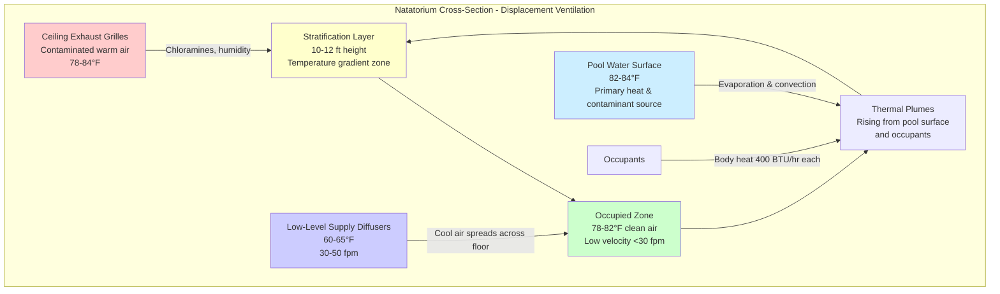

## Displacement Ventilation in Natatoriums

Displacement ventilation represents a fundamentally different approach to natatorium air distribution compared to traditional mixing systems. This strategy supplies conditioned air at low velocity near floor level, allowing thermal buoyancy forces to drive vertical airflow through the occupied zone and remove contaminants at ceiling level.

## Physical Principles

Displacement ventilation exploits natural convection currents generated by heat sources in the pool environment. The primary thermal plumes originate from the water surface, occupants, and any heated surfaces. Air supplied at temperatures 4-8°F below occupied zone temperature remains stratified near the floor until encountering heat sources.

The thermal plume velocity above a heat source follows the relationship:

$$w(z) = 1.14 \left(\frac{Q}{z}\right)^{1/3}$$

Where:
- $w(z)$ = vertical velocity at height $z$ (ft/min)
- $Q$ = convective heat flux (BTU/hr)
- $z$ = height above heat source (ft)

The stratification interface height can be estimated using:

$$h_s = \frac{Q_t^{1/3} A^{1/2}}{(C_p \rho \Delta T)^{1/3}}$$

Where:
- $h_s$ = stratification height (ft)
- $Q_t$ = total convective heat gain (BTU/hr)
- $A$ = floor area (ft²)
- $C_p$ = specific heat of air (0.24 BTU/lb·°F)
- $\rho$ = air density (lb/ft³)
- $\Delta T$ = supply-to-room temperature difference (°F)

## Supply Air Configuration

Low-level displacement diffusers must deliver air at velocities below 50 fpm at 3 ft above floor level to prevent disruption of the stratified layer. Supply temperatures typically range from 60-65°F in natatoriums with occupied zone setpoints of 78-82°F.

Diffuser placement along pool deck perimeters provides uniform coverage while minimizing draft risk. The supply air rate per diffuser must account for the thermal load in its coverage area:

$$\dot{V}_{diffuser} = \frac{Q_{zone}}{60 \rho C_p (T_{room} - T_{supply})}$$

Where $\dot{V}_{diffuser}$ is the airflow per diffuser (CFM).

## Chloramine and Contaminant Management

Displacement ventilation offers superior contaminant removal efficiency for natatoriums because it exploits the buoyancy of warm, chloramine-laden air rising from the pool surface. Combined chloramines (trichloramine in particular) evaporate with water and become entrained in thermal plumes.

The ventilation effectiveness for contaminant removal is expressed as:

$$\epsilon_c = \frac{C_e - C_s}{C_{occ} - C_s}$$

Where:
- $\epsilon_c$ = contaminant removal effectiveness (dimensionless)
- $C_e$ = exhaust concentration (ppm)
- $C_s$ = supply concentration (ppm)
- $C_{occ}$ = concentration in occupied zone (ppm)

Displacement systems achieve $\epsilon_c$ values of 1.5-2.0, compared to 1.0 for perfect mixing systems, meaning they remove contaminants more efficiently with the same airflow rate.

## System Performance Comparison

| Parameter | Displacement Ventilation | Mixing Ventilation |
|-----------|-------------------------|-------------------|
| Supply velocity at diffuser | 30-50 fpm | 400-800 fpm |
| Supply temperature | 60-65°F | 68-72°F |
| Temperature stratification | 4-6°F floor to ceiling | 1-2°F floor to ceiling |
| Contaminant removal effectiveness | 1.5-2.0 | 0.9-1.1 |
| Occupied zone air velocity | <30 fpm | 50-100 fpm |
| Supply air volume (same load) | 85-90% of mixing | 100% baseline |
| Fan energy consumption | 40-50% of mixing | 100% baseline |
| Thermal comfort complaints | Lower | Higher |

## Energy Performance

Displacement ventilation reduces energy consumption through three mechanisms:

1. **Lower fan power**: Reduced air velocities and simplified ductwork decrease static pressure requirements by 50-60%

2. **Higher supply temperatures**: The 8-12°F higher supply temperature (compared to mixing systems) reduces cooling coil load and allows economizer operation during more hours

3. **Reduced airflow rates**: Superior contaminant removal effectiveness permits 10-15% airflow reduction while maintaining the same occupied zone air quality

The fan power reduction follows the affinity law relationship:

$$\frac{HP_2}{HP_1} = \left(\frac{CFM_2}{CFM_1}\right)^3 \times \frac{\Delta P_2}{\Delta P_1}$$

## Design Considerations per ASHRAE Guidelines

ASHRAE research (RP-1271 and subsequent studies) establishes several requirements for displacement ventilation in high-humidity natatorium applications:

- Maintain supply air dewpoint at least 2°F below pool deck surface temperature to prevent condensation on floors
- Limit supply air velocity to prevent disruption of stratified layer (maximum 50 fpm at 3 ft height)
- Provide minimum 6 air changes per hour based on pool water surface area and occupancy
- Design stratification height to position interface above occupied zone but below exhaust grilles (typically 10-12 ft)
- Account for thermal bridging and envelope heat loss that can disrupt stratification patterns near exterior walls

## Implementation Challenges

Successful displacement ventilation in natatoriums requires careful attention to:

- **Envelope thermal performance**: Poor insulation or thermal bridges create downward cold air currents that disrupt stratification
- **Load distribution**: Concentrated heat sources (hot tubs, spectator areas) may require supplemental mixing ventilation
- **Start-up conditions**: Cold pool facilities require temporary mixing mode operation until thermal stratification establishes
- **Humidity control**: Dewpoint control becomes critical to prevent floor condensation with cold supply air

## Operational Benefits

Beyond energy savings, displacement ventilation improves natatorium operation through:

- Reduced chloramine exposure for deck-level occupants and staff
- Elimination of high-velocity drafts that cause thermal discomfort
- Quieter operation due to low air velocities
- Reduced ductwork fouling from chloramine deposits (contaminants extracted before condensing in ducts)
- Extended equipment service life from lower fan speeds and reduced corrosive exposure
