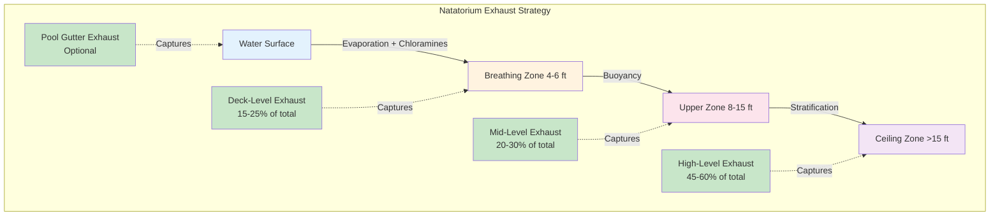

## Exhaust Air Strategies for Natatoriums

Effective exhaust air strategies are critical for maintaining indoor air quality, controlling humidity, and removing chloramines in natatorium environments. The strategic placement and volumetric balance of exhaust points directly impacts occupant comfort, air quality, and the longevity of building materials.

## Fundamental Exhaust Requirements

The primary objectives of natatorium exhaust systems include:

- **Chloramine extraction** from the breathing zone and water surface
- **Moisture control** to prevent condensation on building surfaces
- **Contaminant dilution** to maintain acceptable indoor air quality
- **Thermal stratification management** to prevent hot, humid air accumulation at the ceiling

ASHRAE Applications Handbook Chapter 6 (Natatoriums) specifies minimum outdoor air ventilation rates and emphasizes the importance of exhaust location relative to contaminant sources.

## Exhaust Air Volume Calculations

Total exhaust airflow must balance supply air while maintaining appropriate building pressure. For natatoriums, the exhaust rate is typically calculated based on ventilation requirements:

$$
Q_{\text{exhaust}} = Q_{\text{supply}} - Q_{\text{infiltration}} + Q_{\text{exfiltration}}
$$

Where natatoriums typically maintain **negative pressure** of 0.05 to 0.10 inches water column relative to adjacent spaces to prevent moisture migration:

$$
Q_{\text{exhaust}} = Q_{\text{supply}} \times (1 + P_{\text{factor}})
$$

Where $P_{\text{factor}}$ ranges from 0.05 to 0.15 depending on building tightness and desired pressure differential.

Minimum outdoor air requirements per ASHRAE 62.1 for pool deck areas:

$$
Q_{\text{OA}} = 0.48 \, \text{cfm/ft}^2 \times A_{\text{deck}} + 0.06 \, \text{cfm/ft}^2 \times A_{\text{water}}
$$

## Exhaust Location Strategies

The effectiveness of contaminant removal depends significantly on exhaust grille placement relative to contaminant generation zones.

### Deck-Level Exhaust

Low-level exhaust grilles positioned 4 to 6 feet above the pool deck capture chloramines and moisture in the breathing zone before buoyancy transports contaminants upward. This strategy is particularly effective for:

- Swimmer and spectator breathing zones
- High-occupancy periods with elevated chloramine generation
- Facilities with competitive swimming where athletes breathe heavily near the water surface

Deck-level exhaust should constitute **15 to 25 percent** of total exhaust volume. Grille placement should be:

- **3 to 8 feet** from pool edge
- **4 to 6 feet** above finished floor
- Positioned to avoid short-circuiting with low-level supply air

### High-Level Ceiling Exhaust

Upper exhaust points capture buoyant warm, humid air that naturally stratifies at the ceiling. This exhaust location:

- Prevents condensation on ceiling surfaces and roof structure
- Removes the bulk of moisture load through natural convection
- Captures chloramines that have risen through thermal plumes

High-level exhaust typically represents **45 to 60 percent** of total exhaust and should be distributed across the ceiling to prevent dead zones.

### Gutter and Water Surface Exhaust

Some designs incorporate exhaust integrated into pool gutter systems or positioned immediately above the water surface. This approach:

- Captures evaporation and chloramines at the source
- Reduces contaminant concentration before breathing zone exposure
- Requires specialized grille design to prevent water entrainment

This strategy is optional and typically adds **5 to 15 percent** to total exhaust capacity.

## Exhaust Approach Comparison

| Exhaust Strategy | Location | % of Total Exhaust | Contaminant Removal Effectiveness | Applications | Design Considerations |
|------------------|----------|-------------------|----------------------------------|--------------|----------------------|
| **High-Level Only** | Ceiling (>12 ft) | 100% | Moderate for chloramines, High for moisture | Budget-conscious designs, low-occupancy pools | Simple installation, relies on stratification, poor breathing zone control |
| **Deck-Level Only** | 4-6 ft AFG | 100% | High for chloramines, Moderate for moisture | Not recommended as sole strategy | Short-circuits natural buoyancy, increases fan energy |
| **Combined High/Deck** | Multi-level | 15-25% deck, 45-60% high, 20-30% mid | Very High for both | Competition pools, high-occupancy natatoriums | Best IAQ performance, increased ductwork complexity |
| **Gutter-Integrated** | Water surface | 5-15% (supplemental) | Excellent at source | Facilities with specialized gutter systems | Prevents moisture migration, requires custom design |

## Contaminant Removal Effectiveness

The air change effectiveness for exhaust systems depends on placement relative to contaminant sources. The ventilation effectiveness can be quantified:

$$
\epsilon_v = \frac{C_{\text{exhaust}} - C_{\text{supply}}}{C_{\text{breathing zone}} - C_{\text{supply}}}
$$

For well-designed multi-level exhaust systems in natatoriums, $\epsilon_v$ ranges from **1.2 to 1.8**, indicating superior performance compared to mixing ventilation ($\epsilon_v = 1.0$).

The chloramine removal rate depends on exhaust proximity to generation sources:

$$
\eta_{\text{removal}} = 1 - e^{-\frac{Q_{\text{local}} \times t}{V_{\text{zone}}}}
$$

Where:
- $Q_{\text{local}}$ = local exhaust flow rate (cfm)
- $t$ = residence time (minutes)
- $V_{\text{zone}}$ = zone volume (ft³)

## Stratification Control

Thermal stratification naturally occurs in natatoriums due to:

- Warm water surface temperatures (78-82°F)
- Evaporative heat release
- High ceilings (typically 15-25 feet)

Temperature differentials between deck and ceiling can reach **8 to 15°F** without proper air distribution. Exhaust strategies must work in coordination with supply air patterns to:

1. Extract the warmest, most humid air at the ceiling
2. Prevent excessive temperature gradients that reduce comfort
3. Maintain adequate air movement through the breathing zone

The stratification factor can be estimated:

$$
S_f = \frac{T_{\text{ceiling}} - T_{\text{deck}}}{T_{\text{supply}} - T_{\text{deck}}}
$$

Well-designed systems maintain $S_f < 0.5$.

## Design Implementation Guidelines

**Exhaust Grille Sizing and Selection:**
- Maximum face velocity: **500-700 fpm** to minimize noise
- Grille free area: **50-60%** of nominal size
- Corrosion-resistant construction (Type 316 stainless steel, powder-coated aluminum)

**Duct Placement:**
- Insulate exhaust ducts in conditioned spaces to prevent condensation
- Maintain duct velocity: **1200-1800 fpm** to prevent moisture accumulation
- Slope horizontal runs toward drain points

**Pressure Balancing:**
- Install exhaust dampers for zone balancing
- Provide volume control at main exhaust branches
- Monitor building pressure relative to adjacent spaces

**Chloramine Concentration Targets:**
- Trichloramine (NCl₃): **< 0.3 mg/m³** per WHO guidelines
- Breathing zone sampling at 3-5 feet above deck
- Continuous monitoring recommended for high-use facilities

## Operational Considerations

Exhaust strategies must adapt to varying occupancy and pool use:

- **High occupancy periods:** Increase deck-level exhaust proportion
- **Unoccupied periods:** Reduce total exhaust while maintaining building pressure
- **Water treatment events:** Temporarily increase exhaust during shock chlorination

The exhaust system should integrate with dehumidification equipment controls to optimize energy recovery while maintaining air quality and humidity setpoints.

## References

- ASHRAE Handbook—HVAC Applications, Chapter 6: Natatoriums
- ASHRAE Standard 62.1: Ventilation for Acceptable Indoor Air Quality
- WHO Guidelines for Indoor Swimming Pools and Similar Environments
