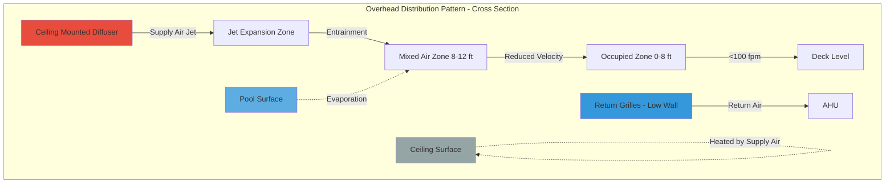
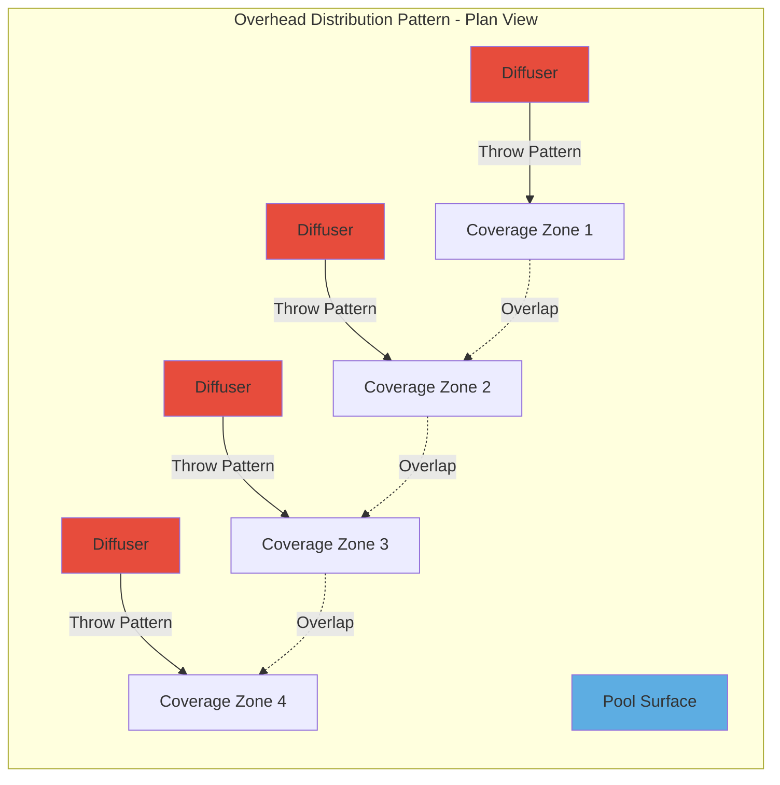

## Overhead Distribution Systems

Overhead air distribution represents the most common approach for natatorium ventilation, positioning supply outlets in the ceiling plane or high on sidewalls. This configuration leverages natural stratification while providing complete coverage of the pool deck and water surface. The primary engineering challenge involves delivering sufficient air motion to control humidity and temperature without creating uncomfortable drafts in the occupied zone.

### Physical Principles

Air jets discharged from overhead diffusers follow predictable decay patterns governed by momentum transfer and entrainment. The centerline velocity of a free jet decreases according to:

$$V_x = K \cdot V_0 \cdot \sqrt{\frac{A_0}{A_x}}$$

Where:
- $V_x$ = velocity at distance x from diffuser (ft/min)
- $V_0$ = discharge velocity at diffuser face (ft/min)
- $A_0$ = effective diffuser area (ft²)
- $A_x$ = jet cross-sectional area at distance x (ft²)
- $K$ = diffuser discharge coefficient (0.8-1.2)

For isothermal conditions, the throw distance to a terminal velocity is calculated:

$$T_{50} = \frac{V_0 \cdot \sqrt{A_0}}{K_d \cdot V_t}$$

Where $T_{50}$ represents throw to 50 ft/min, $V_t$ is terminal velocity (typically 50 ft/min), and $K_d$ is the diffuser throw coefficient from manufacturer data.

### Jet Entrainment and Temperature Decay

As the supply air jet travels, it entrains room air at a rate proportional to jet perimeter and velocity. The temperature differential decays according to:

$$\frac{\Delta T_x}{\Delta T_0} = \frac{A_0}{A_x}$$

This relationship is critical for preventing cold drafts. For a supply air temperature 15°F below room temperature, a 4:1 entrainment ratio reduces the differential to 3.75°F at the occupied zone.

### Design Criteria for Natatoriums

ASHRAE Applications Handbook Chapter 6 establishes specific requirements:

- **Maximum occupied zone velocity**: 100 ft/min at deck level
- **Maximum water surface velocity**: 30-50 ft/min (prevents evaporation increase)
- **Minimum air changes**: 4-6 ACH for ventilation
- **Supply air temperature**: 2-4°F above space temperature (minimizes condensation risk)

The critical design parameter is the throw-to-ceiling height ratio. For typical installations:

$$\frac{T_{50}}{H} = 0.8 \text{ to } 1.2$$

Where $H$ is ceiling height above deck. This ensures adequate air mixing before the jet reaches occupied zones.

### Condensation Prevention Strategy

Overhead systems must prevent condensation on ceiling and structural elements. The surface temperature must remain above the dew point:

$$T_s > T_{dp} = T_{db} - \frac{100 - RH}{5}$$

Where $T_s$ is surface temperature, $T_{dp}$ is dew point, $T_{db}$ is dry-bulb temperature, and $RH$ is relative humidity. For a 82°F/60% RH space, the dew point is 65°F. All surfaces must maintain temperatures above 65°F, requiring insulation values of:

$$R_{min} = \frac{T_{room} - T_{outdoor}}{U \cdot (T_{room} - T_{dp})}$$

High-velocity air distribution across ceiling surfaces maintains elevated surface temperatures through convective heat transfer.

### Diffuser Type Comparison

| Diffuser Type | Throw Characteristics | Applications | Advantages | Limitations |
|---------------|----------------------|--------------|------------|-------------|
| **Linear Slot** | Uniform distribution, 15-25 ft throw | Medium ceilings (12-18 ft), perimeter zones | Excellent pattern control, architectural integration | Limited throw for high ceilings |
| **Drum Louver** | Multi-directional, 20-35 ft throw | General distribution, 16-24 ft ceilings | High induction ratio, flexible patterns | Requires more ceiling penetrations |
| **Nozzle/Jet** | Long throw, 35-60 ft | High ceilings (>20 ft), large spaces | Maximum throw, high aspiration | Noise potential, careful aiming required |
| **Perforated Face** | Horizontal spread, 12-20 ft throw | Low ceilings (<12 ft), small pools | Low noise, even distribution | Insufficient for large spaces |

### System Layout Patterns

### High Ceiling Considerations

Ceiling heights exceeding 20 feet require specialized approaches:

1. **Nozzle diffusers** with throw distances of 40-60 feet
2. **Higher discharge velocities** (1200-2000 ft/min) to achieve throw
3. **Careful aiming** to prevent jet impingement on far walls
4. **Increased supply air temperature differential** limited to 5-6°F maximum

The throw calculation for high-velocity nozzles incorporates the Coanda effect when positioned near ceiling surfaces:

$$T_{100} = C_n \cdot \sqrt{Q}$$

Where $T_{100}$ is throw to 100 ft/min, $Q$ is airflow (CFM), and $C_n$ is the nozzle coefficient (8-12 for typical installations).

### Draft Risk Mitigation

Draft complaints occur when local velocities exceed comfort thresholds or when cold air impinges on occupants. Prevention strategies include:

- **Supply air temperature control**: Maintain within 2-4°F of space temperature
- **Diffuser spacing**: Position to achieve 50% throw overlap at 6 feet above deck
- **Return placement**: Low sidewall or deck-level returns prevent downward air currents
- **Variable volume systems**: Reduce airflow during low occupancy periods

### Performance Verification

Commission overhead systems by measuring:

1. **Velocity traverse** at deck level (should be <100 ft/min)
2. **Temperature stratification** (vertical temperature gradient <3°F from deck to 8 feet)
3. **Relative humidity uniformity** (<5% variation across space)
4. **Surface temperatures** of ceiling elements (must exceed dew point by 5°F minimum)

Thermal anemometer measurements at a grid spacing of 10-15 feet across the deck provide verification of uniform distribution without excessive velocities.

## Design Recommendations

For optimal overhead distribution in natatoriums:

- Select diffuser throw to match 80-120% of spacing distance
- Position diffusers to direct air across pool surface at grazing angles
- Avoid aiming directly downward toward pool surface (increases evaporation)
- Use ceiling-mounted returns only in non-condensing applications
- Specify insulated diffuser boots and plenums in all cases
- Design for maximum 0.15 in. w.g. pressure drop through diffusers
- Verify acoustical performance (NC 35-40 maximum for pools)

Overhead systems, when properly engineered, provide reliable humidity control, condensation prevention, and occupant comfort for indoor pool facilities of all sizes.