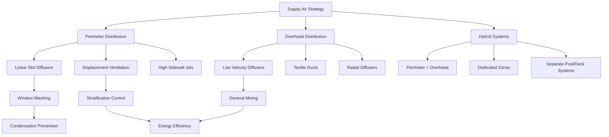

## Supply Air Configuration Fundamentals

Supply air strategies for natatoriums must simultaneously address three critical objectives: condensation prevention on building envelope surfaces, evaporation control at the pool water surface, and thermal comfort for swimmers and spectators. The selection and design of supply air systems directly impacts energy consumption, indoor air quality, and operational success.

## Perimeter Air Distribution

Perimeter supply air systems deliver conditioned air along exterior walls and glazing to prevent condensation formation. The supply air temperature and velocity must maintain surface temperatures above the dew point while avoiding uncomfortable drafts in occupied zones.

**Critical design parameters:**

The required supply air temperature to prevent condensation:

$$T_{supply} = T_{dewpoint} + \Delta T_{safety}$$

Where $\Delta T_{safety}$ typically ranges from 5-10°F to provide adequate margin against varying outdoor conditions and internal loads.

Discharge velocity at perimeter surfaces should maintain adequate momentum to wash glazing surfaces:

$$v_{discharge} = 400-800 \text{ fpm at diffuser}$$

$$v_{surface} = 50-100 \text{ fpm at glass surface}$$

The throw distance and velocity decay follow the relationship:

$$\frac{v_x}{v_0} = K \cdot \frac{\sqrt{A_0}}{x}$$

Where $v_x$ is velocity at distance $x$, $v_0$ is initial discharge velocity, $A_0$ is diffuser outlet area, and $K$ is a diffuser-specific constant (typically 4-6 for linear diffusers).

## Supply Air Strategy Options

## Supply Strategies by Pool Type

| Pool Type | Primary Strategy | Supply Air Temperature | ACH Range | Key Considerations |
|-----------|------------------|------------------------|-----------|---------------------|
| Competition | Overhead + Perimeter | 82-86°F | 4-6 | Uniform conditions, spectator comfort |
| Therapy/Spa | Perimeter Displacement | 86-90°F | 6-8 | High humidity tolerance, minimal drafts |
| Recreational | Hybrid Zones | 84-88°F | 4-6 | Variable occupancy, activity zones |
| Wave/Activity | High-Level Overhead | 82-85°F | 6-8 | High ceiling clearance, splash protection |
| Hotel/Residential | Perimeter Linear | 84-88°F | 4-6 | Aesthetic integration, quiet operation |

## Window Washing Air Design

Perimeter supply air systems must deliver sufficient velocity to maintain a continuous air curtain across glazed surfaces. The design approach depends on window height and configuration.

**For windows up to 15 feet high:**

Linear slot diffusers at floor level or sill height provide effective upward air washing. The supply air volume required:

$$Q_{window} = A_{glass} \cdot v_{avg} \cdot 60$$

Where $Q_{window}$ is in CFM, $A_{glass}$ is glazing area in ft², and $v_{avg}$ is average surface velocity (75-100 fpm).

**For windows exceeding 15 feet:**

Dual supply points (floor and mid-height) or high sidewall jets become necessary. The upper supply offsets buoyancy-driven flow separation that occurs with floor-only supply at tall glazing.

## Swimmer Comfort Considerations

Supply air delivery directly above swimmers creates discomfort through evaporative cooling of wet skin. The effective temperature experienced by a wet swimmer:

$$T_{effective} = T_{air} - \frac{h_{evap}}{h_{total}} \cdot (T_{air} - T_{wetbulb})$$

At typical natatorium conditions (84°F air, 60% RH), a wet swimmer experiences an effective temperature 8-12°F below dry bulb temperature when exposed to 50 fpm air velocity.

**Design recommendations for swimmer zones:**

- Limit air velocity at water surface to 30 fpm maximum
- Maintain supply air temperature within 2°F of water temperature
- Position supply outlets to avoid direct impingement on pool surface
- Use low-velocity displacement systems or textile ducts for deck zones

## Deck Area Supply Distribution

Deck areas require separate consideration from pool water surface zones. Elevated supply air temperatures and controlled velocities prevent thermal discomfort while maintaining adequate air change rates.

**Deck zone supply parameters:**

- Supply air temperature: $T_{water} + 2\text{°F to } T_{water} + 4\text{°F}$
- Deck level velocity: 25-50 fpm (occupied zones)
- Diffuser placement: Minimum 6 feet horizontal from pool edge
- Throw pattern: Parallel to pool edge when possible

## Spectator Area Integration

Spectator zones tolerate standard comfort conditions (72-76°F) unlike the warm, humid environment required at pool level. Separate air handling systems or dedicated zones within the natatorium unit serve these areas.

The supply air strategy for spectator areas prioritizes:

- Temperature differential from pool deck (typically 6-10°F cooler)
- Independent humidity control (40-50% RH vs 50-60% at pool)
- Conventional diffuser selection and spacing
- Mixing ventilation patterns rather than displacement

## ASHRAE Design Guidelines

ASHRAE Applications Handbook, Chapter 6 (Natatoriums) establishes minimum ventilation rates and distribution criteria. Key requirements include:

- Minimum outdoor air: 0.48 CFM/ft² of pool surface plus deck area
- Supply air temperature: Not less than 2°F above water temperature
- Air velocity at water surface: 10-30 fpm to control evaporation without excessive drafts
- Dehumidification capacity: Based on evaporation rate calculations accounting for activity factor

The standard evaporation equation incorporating air movement:

$$W = \frac{A \cdot Y \cdot (P_w - P_a)}{(1 + 0.089 \cdot v)}$$

Where $W$ is evaporation rate (lb/hr), $A$ is pool area (ft²), $Y$ is activity factor (0.5-1.0), $P_w$ and $P_a$ are water and air vapor pressures (in. Hg), and $v$ is air velocity over water (fpm).

## Supply Air Temperature Control Strategy

The supply air temperature setpoint must balance multiple competing requirements. The recommended control sequence:

1. Calculate minimum temperature to prevent condensation: $T_{glass,inside} > T_{dewpoint} + 5\text{°F}$
2. Verify swimmer comfort: $T_{supply} \geq T_{water} - 2\text{°F}$
3. Confirm evaporation control: $T_{supply} = T_{water} + 2\text{°F to } T_{water} + 4\text{°F}$
4. Reset supply temperature based on outdoor conditions and occupancy

During unoccupied periods, supply air temperature may be lowered to increase dehumidification capacity while maintaining envelope protection.

## System Selection Criteria

The optimal supply air strategy depends on facility-specific factors:

**Linear slot diffusers at perimeter:** Best for facilities with extensive glazing, provides excellent window washing, higher first cost

**Overhead textile ducts:** Uniform low-velocity distribution, reduced duct installation costs, challenging condensate drainage in high-humidity environment

**High sidewall jets:** Effective mixing, good throw characteristics, requires careful aiming to avoid direct impingement on swimmers

**Displacement ventilation:** Energy-efficient stratification, excellent comfort in therapy pools, requires adequate ceiling height (minimum 12 feet)

The supply air distribution strategy forms the foundation of successful natatorium environmental control. Proper design prevents condensation damage, controls evaporation rates, and maintains occupant comfort across diverse activity zones within the facility.
