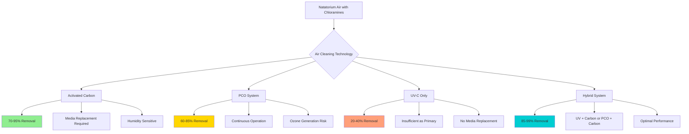

## Physical Principles of Gaseous Contaminant Removal

Chloramines (primarily trichloramine NCl₃) present a unique challenge in natatorium air treatment due to their molecular nature. Unlike particulate contaminants removed by mechanical filtration, gaseous chloramines require physical or chemical interaction at the molecular level. Standard HVAC particulate filters (MERV 8-16) provide negligible chloramine removal because the molecular diameter of NCl₃ (approximately 0.0003 μm) is orders of magnitude smaller than the pore spaces in fibrous media.

The mass transfer rate for gaseous contaminant removal follows the general relationship:

$$\frac{dm}{dt} = k_g A (C_g - C_i)$$

where $k_g$ is the mass transfer coefficient (m/s), $A$ is the surface area (m²), $C_g$ is the bulk gas concentration (mg/m³), and $C_i$ is the interface concentration. Effective air cleaning technologies maximize surface area and maintain favorable concentration gradients.

## Activated Carbon Adsorption

### Physical Mechanism

Activated carbon removes chloramines through physisorption and chemisorption on microporous carbon structures. The micropore volume (typically 0.3-0.5 cm³/g) provides surface areas of 800-1500 m²/g. Chloramine molecules diffuse into the pore structure and adhere through van der Waals forces and chemical bonding with surface functional groups.

The adsorption capacity follows the Freundlich isotherm:

$$q_e = K_F C_e^{1/n}$$

where $q_e$ is the equilibrium adsorption capacity (mg/g), $C_e$ is the equilibrium concentration (mg/m³), and $K_F$ and $n$ are empirical constants dependent on carbon type and temperature.

### Performance Characteristics

| Parameter | Typical Range | Notes |
|-----------|---------------|-------|
| Residence time | 0.05-0.15 seconds | At face velocity 250-500 fpm |
| Removal efficiency | 70-95% | Single pass, fresh media |
| Pressure drop | 0.3-0.8 in. w.g. | Increases with loading |
| Capacity | 5-15% by weight | Before breakthrough occurs |
| Media depth | 2-4 inches | Deeper beds improve efficiency |

**Critical Limitation**: Activated carbon exhibits breakthrough when adsorption sites saturate. In high-humidity natatorium environments (relative humidity 50-60%), water vapor competes for adsorption sites, reducing chloramine capacity by 30-50%. Media replacement is required every 6-18 months depending on contaminant loading and humidity.

## Photocatalytic Oxidation (PCO)

### Photocatalytic Reaction Mechanism

PCO systems use ultraviolet light (typically 254 nm) to activate titanium dioxide (TiO₂) catalyst surfaces. When photon energy exceeds the bandgap energy (3.2 eV for anatase TiO₂), electron-hole pairs generate:

$$\text{TiO}_2 + h\nu \rightarrow e^- + h^+$$

These charge carriers produce hydroxyl radicals (OH·) and superoxide ions (O₂⁻) that oxidize chloramines to nitrogen gas, water, and chloride ions:

$$\text{NCl}_3 + \text{OH}· \rightarrow \text{N}_2 + \text{H}_2\text{O} + \text{Cl}^-$$

### Performance Characteristics

PCO effectiveness depends on several interrelated factors:

1. **UV intensity**: Must exceed 2-5 mW/cm² at catalyst surface
2. **Catalyst surface area**: 50-200 m²/g for nano-TiO₂
3. **Residence time**: 0.5-2.0 seconds required for oxidation completion
4. **Humidity**: Moderate humidity (40-60% RH) enhances OH· formation

**Limitation**: PCO systems generate ozone as a byproduct when oxygen molecules absorb UV energy below 240 nm. ASHRAE Standard 62.1 limits indoor ozone to 0.05 ppm (8-hour average). UV lamps must emit primarily at 254 nm, and ozone destruct filters may be required.

## UV-C Germicidal Treatment

### Direct Photolysis

UV-C radiation (200-280 nm) directly breaks chemical bonds in chloramine molecules. The photolysis rate follows first-order kinetics:

$$\frac{dC}{dt} = -k_{UV} I C$$

where $k_{UV}$ is the photolysis rate constant (m²/mJ), $I$ is UV intensity (mW/cm²), and $C$ is concentration.

**Critical Limitation**: UV-C alone provides limited chloramine destruction (20-40% single pass) at practical airstream velocities. Chloramines absorb UV energy less efficiently than microorganisms, requiring UV doses of 500-2000 mJ/cm² versus 40-100 mJ/cm² for microbial inactivation. This necessitates significantly higher UV intensity or longer residence times than germicidal applications.

## Effectiveness Comparison

## Hybrid Approach for Optimal Performance

The most effective natatorium air cleaning systems combine technologies to leverage synergistic benefits:

### Recommended Configuration

1. **Pre-oxidation stage**: UV-C or PCO partially oxidizes chloramines and reduces molecular complexity
2. **Adsorption stage**: Activated carbon removes oxidation products and remaining chloramines
3. **Final polishing**: Additional PCO or carbon stage for maximum removal

This staged approach reduces carbon media loading by 40-60%, extending replacement intervals while maintaining >90% removal efficiency.

| Technology | Single-Pass Efficiency | Annual Operating Cost* | Maintenance Frequency |
|------------|----------------------|----------------------|---------------------|
| Activated Carbon | 70-95% | $8,000-15,000 | 6-18 months |
| PCO | 60-85% | $2,000-5,000 | Lamp replacement 12-18 months |
| UV-C Alone | 20-40% | $1,500-3,000 | Lamp replacement 12 months |
| Hybrid (UV+Carbon) | 85-95% | $6,000-12,000 | 12-24 months |
| Hybrid (PCO+Carbon) | 85-99% | $7,000-14,000 | 18-24 months |

*Based on 20,000 CFM natatorium with 0.5 ppm chloramine concentration

## Design Considerations per ASHRAE Standards

ASHRAE Standard 62.1 requires natatorium ventilation to maintain acceptable indoor air quality. When integrating air cleaning technologies:

- **Outdoor air ventilation cannot be eliminated**: Air cleaning supplements but does not replace ventilation requirements (typically 0.48 cfm/ft² minimum)
- **Energy recovery**: Combining air cleaning with energy recovery ventilators (ERVs) per ASHRAE 90.1 reduces dehumidification loads while maintaining air quality
- **Monitoring**: Continuous chloramine monitoring recommended to verify air cleaning system effectiveness
- **Bypass provisions**: Design systems with bypass capability for maintenance without complete HVAC shutdown

The integration of air cleaning technologies can reduce required ventilation rates by 25-50% while maintaining superior air quality, resulting in substantial energy savings in the dehumidification and conditioning loads that dominate natatorium HVAC operating costs.
