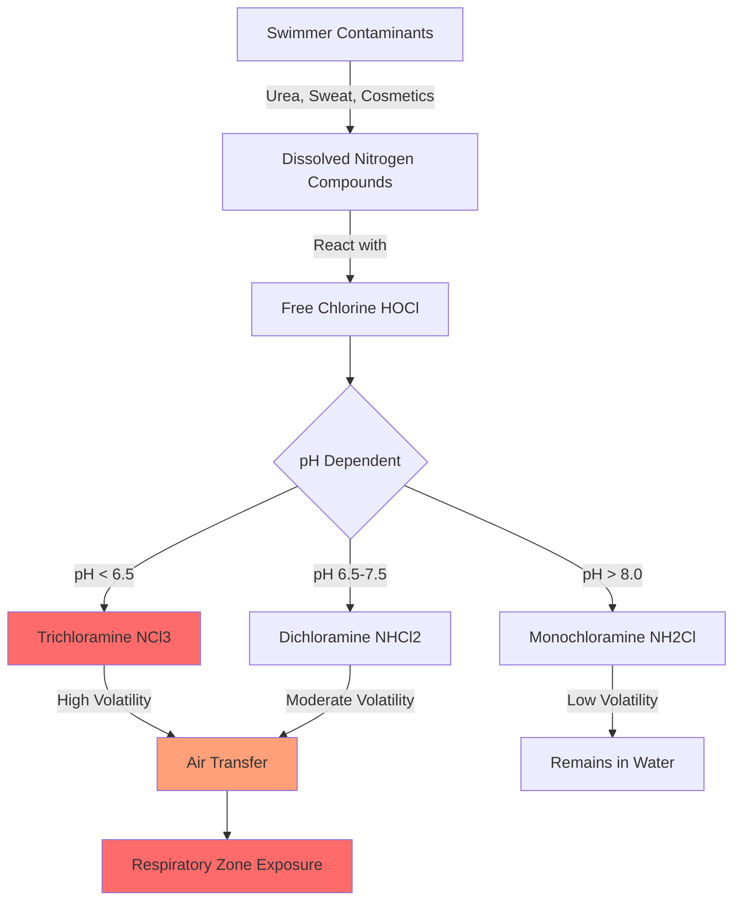
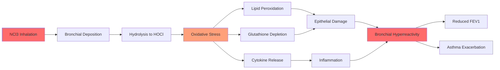
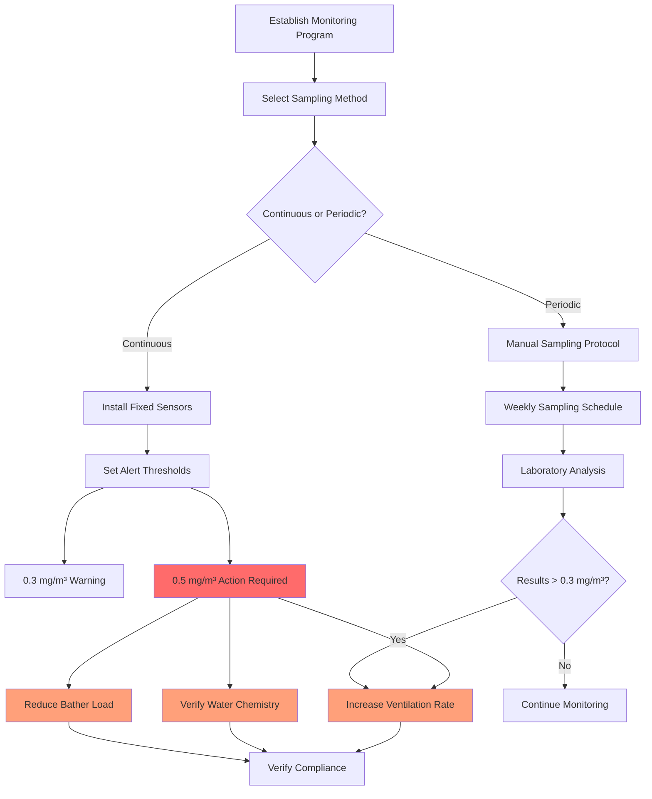

## Overview

Chloramines represent the primary air quality hazard in natatorium environments, generated through reactions between chlorine-based disinfectants and nitrogen-containing organic compounds introduced by swimmers. Of the three chloramine species, nitrogen trichloride (NCl3) presents the most significant health concern due to its volatility, irritant properties, and tendency to accumulate in indoor pool air.

The concentration of airborne chloramines depends on source water chemistry, disinfection practices, bather load, and critically, the performance of the ventilation system. Inadequate ventilation creates conditions where chloramine concentrations exceed occupational exposure limits, resulting in respiratory distress, ocular irritation, and accelerated corrosion of building materials.

## Chloramine Formation Chemistry

Chloramines form through sequential chlorination of ammonia and organic nitrogen compounds:

$$\text{NH}_3 + \text{HOCl} \rightarrow \text{NH}_2\text{Cl} + \text{H}_2\text{O}$$

$$\text{NH}_2\text{Cl} + \text{HOCl} \rightarrow \text{NHCl}_2 + \text{H}_2\text{O}$$

$$\text{NHCl}_2 + \text{HOCl} \rightarrow \text{NCl}_3 + \text{H}_2\text{O}$$

The distribution among monochloramine (NH2Cl), dichloramine (NHCl2), and trichloramine (NCl3) depends heavily on pH. Trichloramine formation accelerates below pH 7.0, while monochloramine predominates above pH 8.5.

**Henry's Law Constant for Trichloramine:**

The volatility of NCl3 drives its transfer from water to air:

$$C_{air} = H \cdot C_{water}$$

Where H ≈ 0.014 (dimensionless) at 25°C, indicating that NCl3 readily volatilizes from pool water surfaces. This transfer rate increases with water temperature and surface turbulence.

## Health Effects Profile

### Trichloramine (NCl3) Toxicity

Trichloramine exhibits acute toxicity through multiple mechanisms:

**Respiratory Effects:**
- Direct epithelial damage to bronchial mucosa
- Increased bronchial hyperreactivity
- Exacerbation of asthma symptoms
- Reduced forced expiratory volume (FEV1)
- Chronic exposure linked to occupational asthma

**Ocular Irritation:**
- Corneal epithelial disruption
- Lacrimation and conjunctival inflammation
- Reduced tear film stability

**Dermal Effects:**
- Stratum corneum lipid disruption
- Contact dermatitis
- Accelerated chlorine absorption through compromised skin barrier

### Dichloramine (NHCl2) Effects

While less volatile than NCl3, dichloramine contributes significantly to total chloramine exposure:

- Water-phase irritation during swimming
- Respiratory irritation when aerosolized
- Synergistic effects with trichloramine

### Exposure-Response Relationship

The concentration-time profile governs symptom severity:

$$\text{Dose} = C \cdot t \cdot \text{RR}$$

Where:
- $C$ = airborne concentration (mg/m³)
- $t$ = exposure duration (hours)
- $\text{RR}$ = respiratory rate (m³/hr)

Acute symptoms typically manifest above 0.5 mg/m³ NCl3 with exposure durations exceeding 1 hour.

## Occupational Exposure Limits

| Organization | Limit Type | Value | Notes |
|--------------|-----------|-------|-------|
| **NIOSH** | REL (Recommended Exposure Limit) | 0.4 mg/m³ | 8-hour TWA |
| **ANSES (France)** | OEL | 0.5 mg/m³ | 8-hour TWA |
| **WHO** | Guideline | 0.5 mg/m³ | Pool hall air |
| **Germany (DFG)** | MAK | 0.2 mg/m³ | Conservative limit |
| **Belgium** | OEL | 0.34 mg/m³ | 8-hour TWA |

**ASHRAE Standard 62.1-2022 Implications:**

While ASHRAE 62.1 does not specify chloramine limits directly, the standard's ventilation rate procedure (VRP) and indoor air quality procedure (IAQP) apply to natatorium design. Achieving acceptable air quality requires ventilation rates significantly higher than those for typical occupancies:

- Minimum outdoor air: 0.48 cfm/ft² deck area
- Target chloramine concentration: < 0.3 mg/m³
- Enhanced ventilation during high occupancy periods

## Respiratory Effects Mechanisms

Trichloramine induces respiratory distress through oxidative stress pathways:

**Bronchial Epithelial Damage:**

$$\text{NCl}_3 + \text{H}_2\text{O} \rightarrow \text{HOCl} + \text{Reactive Nitrogen Species}$$

This reaction generates hypochlorous acid and reactive nitrogen intermediates that:
1. Oxidize membrane lipids (lipid peroxidation)
2. Deplete glutathione antioxidant reserves
3. Activate inflammatory cytokine cascades (IL-8, TNF-α)
4. Increase epithelial permeability

**Dose-Response for Lung Function:**

Studies demonstrate measurable FEV1 reduction:

$$\Delta \text{FEV}_1 = -0.08 \cdot C_{NCl_3} - 0.05 \cdot t$$

Where FEV1 decline (in %) correlates with NCl3 concentration (mg/m³) and exposure time (hours).

## Building Material Corrosion

Chloramines accelerate corrosion of metals and degrade building materials through electrochemical and chemical mechanisms:

**Metal Corrosion Rate:**

For steel structural elements:

$$\text{CR} = K \cdot C_{NCl_3}^{0.6} \cdot \text{RH}^{1.2}$$

Where:
- $\text{CR}$ = corrosion rate (μm/year)
- $K$ = material constant
- $\text{RH}$ = relative humidity (fraction)

**Affected Materials:**
- Carbon steel: 5-10× normal corrosion rate
- Aluminum: pitting and crevice corrosion
- Stainless steel (304): chloride-induced stress corrosion
- Copper: dezincification in brass alloys
- Concrete rebar: accelerated oxidation

**Economic Impact:**

Premature structural failure and maintenance costs represent significant operational expenses, with average natatorium maintenance 3-4× higher than comparable buildings due to chloramine-induced corrosion.

## Monitoring Strategies

### Sampling Methods

| Method | Detection Limit | Advantages | Limitations |
|--------|----------------|------------|-------------|
| **Spectrophotometry** | 0.05 mg/m³ | Laboratory accuracy | Requires sample collection |
| **Electrochemical Sensors** | 0.1 mg/m³ | Real-time data | Cross-sensitivity to Cl2 |
| **HPLC Analysis** | 0.02 mg/m³ | Species differentiation | Complex procedure |
| **Portable Monitors** | 0.1 mg/m³ | Immediate feedback | Calibration drift |

### Sampling Protocol

**NIOSH Method 6011 (Chloramines):**
1. Sample at breathing zone height (4-6 ft above deck)
2. Minimum sample volume: 50 L
3. Flow rate: 0.5-1.0 L/min
4. Sample duration: 2-4 hours for TWA determination

**Strategic Sampling Locations:**
- Lifeguard stations (highest occupational exposure)
- Pool deck perimeter (general air quality)
- Spa/hot tub areas (elevated volatilization)
- Mechanical room intakes (system performance verification)

## Exposure Guidelines and Control Strategies

### Hierarchy of Controls

**1. Source Reduction (Most Effective):**
- Enforce pre-swim showering (reduces nitrogen load by 70%)
- Maintain optimal pH (7.4-7.6) to minimize NCl3 formation
- Implement UV or ozone supplemental disinfection
- Limit combined chlorine to < 0.2 mg/L through regular shocking

**2. Engineering Controls:**
- Design ventilation systems for 0.06 cfm/ft² per occupant
- Provide source capture at water surface (displacement ventilation)
- Maintain negative pressure in pool hall relative to adjacent spaces
- Achieve 6-8 air changes per hour minimum

**3. Administrative Controls:**
- Limit continuous occupancy duration for staff
- Rotate lifeguard positions to reduce individual exposure
- Schedule high-intensity activities during off-peak ventilation load

**4. Personal Protective Equipment (Least Effective):**
- Not practical for swimmers or most staff
- Reserved for maintenance activities in confined spaces

### Ventilation Effectiveness Metric

The chloramine removal efficiency depends on outdoor air delivery:

$$\eta = \frac{Q_{OA}}{Q_{OA} + V \cdot k}$$

Where:
- $\eta$ = removal efficiency
- $Q_{OA}$ = outdoor air flow rate (cfm)
- $V$ = space volume (ft³)
- $k$ = chloramine generation rate (cfm equivalent)

Target efficiency: > 90% to maintain concentrations below 0.3 mg/m³.

## Regulatory Compliance

**OSHA Requirements:**

While OSHA does not specify chloramine PELs, employers must comply with General Duty Clause (Section 5(a)(1)) to provide a workplace "free from recognized hazards." This necessitates:

- Air quality monitoring programs
- Ventilation system maintenance records
- Employee exposure documentation
- Medical surveillance for symptomatic workers

**State and Local Codes:**

Many jurisdictions incorporate ASHRAE 62.1 by reference, making compliance mandatory for new construction and major renovations. Designers must demonstrate that ventilation systems achieve acceptable indoor air quality under design conditions.

## Conclusion

Chloramine air quality control in natatoriums requires integrated management of water chemistry, ventilation performance, and operational practices. Trichloramine concentrations must remain below 0.3 mg/m³ to protect occupant health and building infrastructure. Regular monitoring, combined with proactive ventilation system maintenance and source control measures, ensures compliance with occupational exposure guidelines and provides a safe, comfortable environment for swimmers and staff.

Effective chloramine management aligns with ASHRAE Standard 62.1 ventilation principles while addressing the unique contaminant generation characteristics of aquatic facilities. The physics of chloramine formation, volatilization, and transport govern the engineering solutions required to maintain acceptable air quality in these challenging environments.
