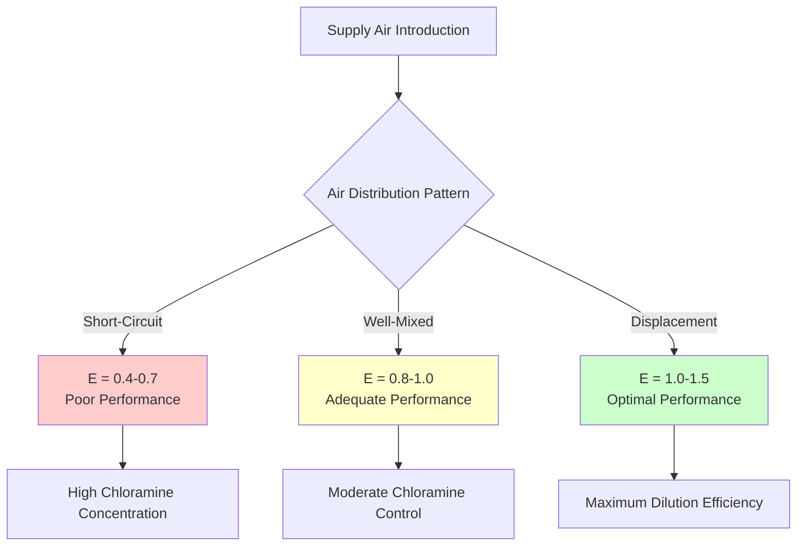
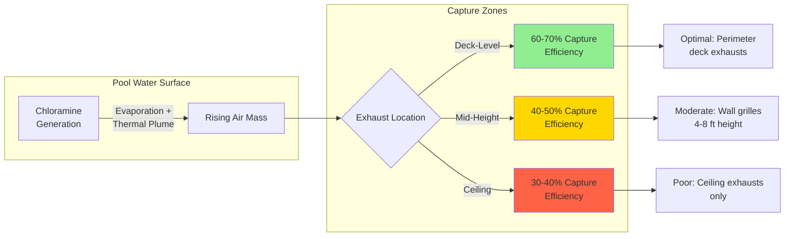

## Overview

Dilution ventilation represents the primary engineering control for managing airborne chloramine concentrations in indoor swimming pool facilities. This approach relies on introducing outdoor air to dilute contaminant concentrations below threshold limit values while simultaneously exhausting chloramine-laden air. The effectiveness of dilution ventilation depends on ventilation rate, air distribution patterns, and the interaction between supply and exhaust locations.

## Fundamental Dilution Principle

The steady-state contaminant concentration in a well-mixed space follows the mass balance equation:

$$C_{ss} = \frac{G}{Q \cdot E}$$

Where:
- $C_{ss}$ = steady-state chloramine concentration (mg/m³)
- $G$ = chloramine generation rate (mg/h)
- $Q$ = outdoor air ventilation rate (m³/h)
- $E$ = ventilation effectiveness factor (dimensionless, 0.5-1.5)

This relationship demonstrates that doubling the ventilation rate halves the steady-state concentration, assuming constant generation rates and effectiveness.

## Ventilation Rate Requirements

### Minimum Air Changes

ASHRAE Standard 62.1 specifies minimum ventilation requirements for natatoriums, though specific chloramine control often demands higher rates.

| Space Type | Minimum ACH | Recommended ACH | Design ACH |
|------------|-------------|-----------------|------------|
| Pool deck only | 4 | 6-8 | 8-10 |
| Pool with spectator area | 4 | 6-8 | 8-12 |
| Therapy/spa pools | 6 | 8-10 | 10-15 |
| Competition venues | 4 | 8-10 | 10-15 |

The air change rate alone does not determine effectiveness. A 6 ACH system with poor distribution may perform worse than a 4 ACH system with optimized airflow patterns.

### Calculation of Required Outdoor Air

The required outdoor air volume depends on target chloramine concentration and measured generation rates:

$$Q_{OA} = \frac{G \cdot SF}{(C_{target} \cdot E) - C_{OA}}$$

Where:
- $Q_{OA}$ = required outdoor air flow rate (cfm)
- $G$ = measured chloramine generation rate (mg/h)
- $SF$ = safety factor (typically 1.2-1.5)
- $C_{target}$ = target indoor concentration (typically 0.3-0.5 mg/m³)
- $C_{OA}$ = outdoor air chloramine concentration (typically ≈0)

## Air Change Effectiveness

The ventilation effectiveness factor $E$ quantifies how efficiently supplied air reaches and dilutes the contaminated zone. Perfect mixing yields $E = 1.0$, while short-circuiting reduces effectiveness below 1.0, and displacement ventilation can achieve $E > 1.0$.

### Factors Affecting Effectiveness

**Thermal stratification:** Warm, humid air above the pool surface resists mixing with cooler supply air. Temperature differential between supply and pool air should not exceed 5°F to prevent stratification.

**Air velocity gradients:** Excessive supply velocities create high-speed jets that bypass the breathing zone, reducing effective dilution. Target velocities in occupied zones: 30-50 fpm.

**Exhaust location:** Low-level exhausts near the water surface capture rising chloramine plumes before dispersion throughout the space.

## Supply Air Distribution Strategies

### Overhead Supply with Low-Level Exhaust

This conventional approach introduces conditioned air from ceiling diffusers while exhausting at deck level or from the pool gutter system.

**Advantages:**
- Simple ductwork routing
- Uniform temperature distribution
- Dehumidification capability at ceiling level

**Disadvantages:**
- Requires high ventilation rates due to mixing losses
- Supply air must travel through occupied zone
- Thermal stratification risk in high-ceiling spaces

### Underfloor Supply with Overhead Exhaust

Displacement ventilation introduces low-velocity air below pool deck level, creating an upward airflow that carries chloramines to high-level exhausts.

**Advantages:**
- Higher ventilation effectiveness ($E = 1.2-1.5$)
- Reduced energy consumption per unit of contaminant removal
- Better breathing zone air quality

**Disadvantages:**
- Complex underfloor plenum requirements
- Limited temperature control range
- Not suitable for retrofit applications

## Exhaust Placement Optimization

Chloramines exhibit slight positive buoyancy due to thermal plumes from the warm water surface. Optimal exhaust strategies capture this upward movement.

### Gutter Exhaust Systems

Pool gutter systems can function as low-level exhausts, removing air directly at the water surface:

$$Q_{gutter} = V_{avg} \cdot P \cdot h_{effective}$$

Where:
- $Q_{gutter}$ = volumetric flow through gutter (cfm)
- $V_{avg}$ = average air velocity at gutter opening (fpm)
- $P$ = perimeter of pool (ft)
- $h_{effective}$ = effective height of air capture zone (typically 0.5-1.0 ft)

Target velocity at gutter opening: 50-100 fpm to avoid disturbing water surface while maintaining capture effectiveness.

## Water Surface Air Velocity Considerations

Air velocity over the water surface directly affects evaporation rate and chloramine generation. The evaporation rate follows:

$$E_{rate} = A \cdot K \cdot V^{0.6} \cdot (P_{sat} - P_{air})$$

Where:
- $E_{rate}$ = evaporation rate (lb/h)
- $A$ = water surface area (ft²)
- $K$ = empirical constant
- $V$ = air velocity over water surface (fpm)
- $P_{sat}$ = saturation vapor pressure at water temperature
- $P_{air}$ = actual vapor pressure in space air

Excessive surface velocity increases evaporation and chloramine release. Target range: 10-30 fpm over competitive pools, 5-15 fpm over therapy pools.

## Design Recommendations

1. **Minimum outdoor air:** 0.48 cfm/ft² of water surface area plus deck area, or 6 ACH, whichever is greater
2. **Supply air temperature:** Within 2-5°F of space temperature to prevent thermal stratification
3. **Exhaust distribution:** Minimum 50% of total exhaust at deck level or below
4. **Supply diffuser selection:** Low-velocity, high-induction diffusers to promote mixing without drafts
5. **Monitoring:** Continuous chloramine sensors with alarm at 0.5 mg/m³ to verify ventilation adequacy

## Ventilation Distribution Efficiency Testing

Ventilation effectiveness can be measured using tracer gas techniques:

$$\varepsilon = \frac{C_{exhaust} - C_{supply}}{C_{breathing zone} - C_{supply}}$$

Values of $\varepsilon > 1.0$ indicate better-than-mixed ventilation, while $\varepsilon < 1.0$ reveals short-circuiting or dead zones requiring airflow pattern adjustment.

## Energy Implications

Dilution ventilation carries substantial energy costs due to conditioning outdoor air. The annual heating energy for outdoor air ventilation:

$$Q_{annual} = Q_{OA} \cdot \rho \cdot c_p \cdot HDD \cdot 24 \cdot \eta^{-1}$$

Where:
- $Q_{annual}$ = annual heating energy (Btu)
- $\rho$ = air density (lb/ft³)
- $c_p$ = specific heat of air (Btu/lb·°F)
- $HDD$ = heating degree days
- $\eta$ = heat recovery effectiveness

Heat recovery through pool water heating or dedicated heat recovery ventilators can reduce energy consumption by 40-60%.

## Limitations of Dilution Ventilation

Dilution ventilation alone cannot address:
- Peak chloramine events during heavy bather loads
- Facilities with inadequate outdoor air capacity
- Spaces with inherently poor air distribution geometry
- High chloramine generation from poor water chemistry

These scenarios require supplementary control methods including source capture ventilation, air cleaning systems, or improved pool water treatment protocols.
