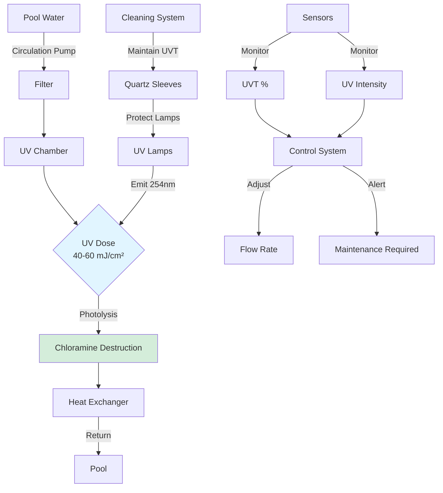
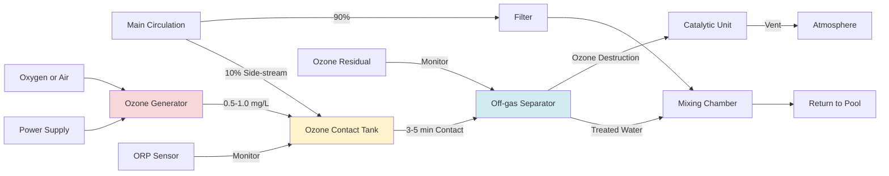

Controlling chloramine formation at the source represents the most effective and energy-efficient strategy for managing indoor pool air quality. While ventilation dilution can address airborne chloramines, preventing their formation through water chemistry management and bather hygiene provides superior results at lower operating cost. Source control reduces the chloramine generation rate ($G$) rather than attempting to dilute the contaminant after formation.

## Chloramine Formation Fundamentals

Chloramines form when free chlorine (hypochlorous acid, HOCl) reacts with nitrogen-containing compounds introduced by swimmers. The primary nitrogen sources are:

**Body fluid contributions**:
- Urea: 20-80 mg released per swimmer per hour
- Ammonia: 5-15 mg per swimmer per hour
- Creatinine: 3-8 mg per swimmer per hour
- Amino acids: 10-30 mg per swimmer per hour

**Cosmetic and personal care products**:
- Sunscreen residues
- Body lotions and oils
- Hair products
- Deodorants and fragrances

### Reaction Sequence

The chloramine formation reactions proceed sequentially based on the chlorine-to-nitrogen molar ratio:

**Step 1: Monochloramine formation** (Cl:N ratio < 5:1)
$$\text{NH}_3 + \text{HOCl} \rightarrow \text{NH}_2\text{Cl} + \text{H}_2\text{O}$$

**Step 2: Dichloramine formation** (Cl:N ratio 5:1 to 7.6:1)
$$\text{NH}_2\text{Cl} + \text{HOCl} \rightarrow \text{NHCl}_2 + \text{H}_2\text{O}$$

**Step 3: Trichloramine formation** (Cl:N ratio > 7.6:1)
$$\text{NHCl}_2 + \text{HOCl} \rightarrow \text{NCl}_3 + \text{H}_2\text{O}$$

At typical pool pH (7.2-7.8), all three species form simultaneously, with relative concentrations governed by pH, temperature, and reaction kinetics. Trichloramine ($\text{NCl}_3$) is the problematic species due to:

- Low water solubility (1.5 g/L at 20°C)
- High volatility (Henry's law constant $H = 0.67$ at 25°C)
- Strong odor and irritant properties at concentrations above 0.3 mg/m³

### Volatilization Rate

The mass transfer of trichloramine from pool water to air follows the two-film theory:

$$J = K_L \cdot A \cdot (C_w - C_w^*)$$

Where:
- $J$ = Mass transfer rate (mg/h)
- $K_L$ = Overall mass transfer coefficient (m/h)
- $A$ = Water surface area (m²)
- $C_w$ = Trichloramine concentration in bulk water (mg/L)
- $C_w^*$ = Equilibrium concentration corresponding to air concentration

The mass transfer coefficient depends on water turbulence (activity level) and air velocity across the surface:

$$K_L = 0.001 \cdot (1 + 0.3 \cdot v_{air}) \cdot (1 + \alpha \cdot v_{water})$$

Where:
- $v_{air}$ = Air velocity across surface (m/s)
- $v_{water}$ = Water surface turbulence factor (dimensionless, 1.0 = calm, 3.0 = heavy activity)
- $\alpha$ = Activity coefficient (typically 0.5-1.0)

This relationship demonstrates why calm pools with low air movement produce less volatilization than highly active pools with water features or high air circulation.

## Pre-Swim Showering Programs

Mandatory pre-swim showering represents the single most cost-effective chloramine reduction strategy, removing 75-95% of urea, cosmetics, and other nitrogen sources before pool entry.

### Effectiveness Data

Research from European pool facilities demonstrates showering effectiveness:

| Parameter | Before Shower | After 30-Second Shower | After 60-Second Shower | Reduction |
|-----------|---------------|------------------------|------------------------|-----------|
| Urea on body | 100 mg | 15 mg | 5 mg | 95% |
| Cosmetic residue | 100% | 35% | 10% | 90% |
| Ammonia | 100 mg | 20 mg | 8 mg | 92% |
| Total nitrogen loading | 100% | 22% | 8% | 92% |

**Shower duration requirement**: Minimum 30 seconds with soap, preferably 60 seconds for swimmers with heavy cosmetic use.

### Implementation Strategies

**Physical design**:
1. **Mandatory pathway**: Configure facility so swimmers must pass through shower area to reach pool
2. **Sufficient capacity**: Provide 1 shower head per 15-20 swimmers (peak capacity)
3. **Comfortable temperature**: 95-105°F (35-41°C) encourages compliance
4. **Adequate drainage**: Prevent standing water that discourages use

**Enforcement methods**:
- Visual monitoring by lifeguards/staff
- Automated shower timers with indicator lights
- Educational signage explaining chloramine formation
- Incentive programs for children (stickers, etc.)
- Wristband systems showing shower completion

**Measured impact**: Facilities with enforced pre-swim showering report 60-80% reduction in combined chlorine formation rates and corresponding decreases in airborne trichloramine concentrations from 0.6 mg/m³ to 0.15 mg/m³.

### Shower Water Quality Considerations

The shower water quality affects nitrogen removal efficiency:

- **Warm water** (>95°F): Opens pores, improves cosmetic removal
- **Soft water**: Better surfactant action, improved cleaning
- **Adequate pressure**: 20-30 psi for effective rinsing

## Bather Load Management

The chloramine generation rate is directly proportional to the number of swimmers and their activity level. Managing occupancy prevents overwhelming water treatment capacity.

### Load Calculation

The total nitrogen loading rate is:

$$N_{total} = \sum (n_i \cdot f_i \cdot A_i)$$

Where:
- $n_i$ = Number of swimmers in activity category $i$
- $f_i$ = Nitrogen release factor for activity (mg/person·h)
- $A_i$ = Activity multiplier (1.0 = calm, 2.5 = vigorous)

**Activity-based nitrogen release rates**:

| Activity Type | Nitrogen Release (mg/person·h) | Activity Multiplier |
|---------------|-------------------------------|---------------------|
| Lap swimming | 40-60 | 1.2 |
| Recreational swimming | 60-90 | 1.5 |
| Children's play | 90-120 | 2.0 |
| Water aerobics | 80-110 | 1.8 |
| Competition training | 100-150 | 2.5 |

### Capacity Limits

Design capacity should match water treatment system capability:

$$n_{max} = \frac{Q_{treatment} \cdot C_{removal}}{N_{release}}$$

Where:
- $n_{max}$ = Maximum sustainable bather count
- $Q_{treatment}$ = Water circulation rate (L/h)
- $C_{removal}$ = System chloramine removal capacity (mg/L per pass)
- $N_{release}$ = Average nitrogen release rate per swimmer (mg/h)

**Example calculation**:

Pool with 500 gpm (1,893 L/min = 113,580 L/h) circulation
UV system removing 0.3 mg/L combined chlorine per pass
Average swimmer releasing 80 mg nitrogen/h

$$n_{max} = \frac{113,580 \cdot 0.3}{80} = \frac{34,074}{80} = 426 \text{ swimmers}$$

This theoretical maximum should be reduced by safety factor of 0.5-0.7 for design capacity: 210-300 swimmers maximum.

### Occupancy Control Methods

**Design-based controls**:
- Pool area sizing (surface area per swimmer)
- Lane rope configurations limiting density
- Separate areas for different activity levels

**Administrative controls**:
- Timed admission/session limits
- Reservation systems for high-demand periods
- Lifeguard-monitored capacity limits
- Pricing strategies to distribute demand

## Water Chemistry Optimization

Proper water chemistry minimizes chloramine formation and enhances removal processes.

### pH Control

pH profoundly affects chloramine speciation and volatilization. The optimal range balances disinfection effectiveness against trichloramine formation:

**pH effects on chemistry**:

| pH Range | HOCl % | OCl⁻ % | Trichloramine Formation Rate | Recommendation |
|----------|---------|---------|------------------------------|----------------|
| 7.0-7.2 | 75-70% | 25-30% | Moderate | Acceptable |
| 7.2-7.4 | 70-60% | 30-40% | Low | **Optimal** |
| 7.4-7.6 | 60-50% | 40-50% | Low-Moderate | Acceptable |
| 7.6-7.8 | 50-40% | 50-60% | Moderate-High | Avoid |
| 7.8-8.0 | 40-30% | 60-70% | High | Poor |

**Target pH**: 7.3-7.5 provides optimal balance between disinfection efficacy (requires HOCl) and minimal trichloramine formation.

The pH affects the equilibrium:

$$\text{HOCl} \rightleftharpoons \text{H}^+ + \text{OCl}^-$$

With $pK_a = 7.5$ at 25°C. At pH 7.3, approximately 61% exists as HOCl (active disinfectant), while higher pH shifts equilibrium toward less effective hypochlorite ion.

### Free Chlorine Maintenance

Maintaining adequate free chlorine prevents accumulation of organic nitrogen compounds:

**Free chlorine targets**:
- Minimum: 1.0 mg/L (ppm)
- Optimal: 2.0-3.0 mg/L
- Maximum: 5.0 mg/L (comfort limit)

**Combined chlorine limits**:
- Maximum acceptable: 0.2 mg/L
- Action level: 0.4 mg/L (initiate superchlorination)
- Critical: >0.5 mg/L (immediate breakpoint chlorination)

The ratio of free chlorine to combined chlorine indicates water quality:

$$R_{chlorine} = \frac{[\text{Free Cl}_2]}{[\text{Combined Cl}_2]}$$

Target ratio: $R_{chlorine} > 10$ (indicating <10% of chlorine tied up as chloramines)

### Breakpoint Chlorination

Breakpoint chlorination oxidizes chloramines back to nitrogen gas, resetting water chemistry:

**Breakpoint reaction**:
$$2\text{NH}_2\text{Cl} + \text{HOCl} \rightarrow \text{N}_2 + 3\text{HCl} + \text{H}_2\text{O}$$

The theoretical chlorine demand is 7.6× the combined chlorine concentration, but practical dosing requires 10× due to competing reactions:

$$Cl_{dose} = 10 \times [\text{Combined Cl}_2]$$

**Procedure**:
1. Measure combined chlorine concentration
2. Calculate required chlorine dose: $Dose = 10 \times C_{combined}$ (mg/L)
3. Add chlorine gradually over 30-60 minutes
4. Maintain circulation for 4-8 hours
5. Verify free chlorine returns to normal range
6. Retest combined chlorine after 24 hours

**Example**: Pool with 0.6 mg/L combined chlorine requires 6.0 mg/L additional chlorine dose. For 100,000-gallon pool:

$$Mass = 6.0 \frac{\text{mg}}{\text{L}} \times 100,000 \text{ gal} \times 3.785 \frac{\text{L}}{\text{gal}} \times \frac{1 \text{ g}}{1000 \text{ mg}} = 2,271 \text{ g} = 5.0 \text{ lb}$$

**Frequency**: Weekly for recreational pools, 2-3 times weekly for heavily-used competitive facilities.

## UV Treatment Systems

Ultraviolet irradiation destroys chloramines through photolytic decomposition, providing continuous removal without chemical addition.

### Operating Principles

UV light at 200-280 nm wavelength photolyzes the nitrogen-chlorine bonds:

$$\text{NCl}_3 + h\nu \rightarrow \text{NCl}_2 + \text{Cl}^{\bullet}$$

Subsequent reactions break down nitrogen-chlorine intermediates to nitrogen gas and chloride ions. The process also oxidizes urea and other organic nitrogen precursors, preventing chloramine formation.

### System Design Parameters

**UV dose requirement**: 40-60 mJ/cm² for effective chloramine reduction (medium-pressure lamps provide broader spectrum than low-pressure)

**Flow rate**: Typically treat 100% of circulation flow for maximum effectiveness

**Transmittance**: Pool water must maintain >75% UV transmittance (UVT) at 254 nm; reduced by organics, turbidity

**Lamp configuration**:
- Chamber design: Multiple lamps in parallel flow chamber
- Lamp power: 5-15 kW per lamp
- Lamp life: 9,000-12,000 hours (approximately 1 year continuous operation)

### Effectiveness Correlation

The chloramine destruction efficiency follows first-order kinetics:

$$\eta = 1 - e^{-k \cdot D}$$

Where:
- $\eta$ = Destruction efficiency (fraction)
- $k$ = Rate constant (cm²/mJ), typically 0.020-0.035 for trichloramine
- $D$ = UV dose (mJ/cm²)

For $D = 50$ mJ/cm² and $k = 0.025$:

$$\eta = 1 - e^{-0.025 \times 50} = 1 - e^{-1.25} = 1 - 0.287 = 0.713 = 71\%$$

**Measured results**: Properly designed UV systems reduce combined chlorine by 50-80% and decrease airborne trichloramine concentrations by 40-70%.

### Maintenance Requirements

**Critical parameters**:
- UV lamp intensity monitoring (sensors verify output)
- Quartz sleeve cleaning (automatic wipers or chemical cleaning)
- Water quality maintenance (UVT >75%)
- Annual lamp replacement

**Operating costs**:
- Electrical: 0.5-1.5 kW per 10,000 gallons circulation
- Lamp replacement: $200-500 per lamp annually
- Maintenance: 4-8 hours annually

## Ozone Treatment Systems

Ozone ($\text{O}_3$) provides powerful oxidation of chloramines and organic precursors, though at higher capital and operating cost than UV.

### Chemical Reactions

Ozone oxidizes chloramines through multiple pathways:

**Direct oxidation**:
$$\text{NHCl}_2 + \text{O}_3 \rightarrow \text{NO}_2^- + \text{HCl} + \text{O}_2$$

**Hydroxyl radical formation** (advanced oxidation):
$$\text{O}_3 + \text{H}_2\text{O} \rightarrow \text{OH}^{\bullet} + \text{O}_2 + \text{H}^+$$

The hydroxyl radical ($\text{OH}^{\bullet}$) is extremely reactive (oxidation potential +2.8 V vs. +2.1 V for ozone) and destroys chloramines, urea, and other organics.

### System Configuration

**Ozone generation**: Corona discharge ozonators producing 1-3% ozone by weight from oxygen feed gas or air

**Dosing**: 0.5-1.0 mg/L applied to side-stream (10-30% of total circulation flow)

**Contact time**: 3-5 minutes in dedicated contact chamber

**Off-gassing**: Residual ozone must be removed before return to pool (catalytic destruction or activated carbon)

**System layout**:

### Ozone Dosing Calculations

The required ozone mass flow is:

$$\dot{m}_{O_3} = Q_{side} \cdot C_{dose} \cdot \rho$$

Where:
- $\dot{m}_{O_3}$ = Ozone mass flow rate (g/h)
- $Q_{side}$ = Side-stream flow rate (L/min)
- $C_{dose}$ = Ozone dose concentration (mg/L or ppm)
- $\rho$ = Water density (~1 kg/L)

**Example**: 50 gpm (189 L/min) side-stream, 0.8 mg/L ozone dose

$$\dot{m}_{O_3} = 189 \frac{\text{L}}{\text{min}} \times 60 \frac{\text{min}}{\text{h}} \times 0.8 \frac{\text{mg}}{\text{L}} \times \frac{1 \text{ g}}{1000 \text{ mg}} = 9.07 \text{ g/h}$$

Ozonator must produce 9-10 g/h at 1-2% concentration (requires 450-1,000 g/h air/oxygen throughput).

### Performance and Economics

**Effectiveness**:
- Combined chlorine reduction: 70-90%
- Organic precursor oxidation: 50-80%
- Airborne chloramine reduction: 60-85%

**Costs** (relative to UV):
- Capital: 2-3× UV system cost
- Operating power: 1.5-2× UV power consumption
- Maintenance: More complex, requires oxygen supply monitoring, catalyst replacement

**Advantages over UV**:
- Destroys wider range of organic contaminants
- Reduces total chlorine demand by 30-50%
- Provides additional oxidation capacity

**Disadvantages**:
- Higher cost
- More complex operation
- Requires off-gassing system
- Potential for over-oxidation if not controlled

## Combined Treatment Strategies

The most effective chloramine control combines multiple approaches in integrated strategy:

### Tier 1: Behavioral and Operational

**Primary prevention**:
1. Enforced pre-swim showering (75-90% nitrogen reduction)
2. Bather load management (prevents overwhelming treatment capacity)
3. Swim diaper requirements for children
4. Pool hygiene education programs

**Expected impact**: 60-75% reduction in chloramine formation rate

### Tier 2: Water Chemistry

**Chemical control**:
1. pH optimization (7.3-7.5)
2. Free chlorine maintenance (2.0-3.0 mg/L)
3. Weekly breakpoint chlorination
4. Regular backwashing and filter maintenance

**Expected impact**: Additional 20-30% reduction (cumulative 70-85% total)

### Tier 3: Supplemental Treatment

**Advanced oxidation**:
1. UV treatment (40-60 mJ/cm² on 100% flow) **OR**
2. Ozone treatment (0.5-1.0 mg/L on 10-30% side-stream)
3. Combined UV + ozone for maximum effectiveness

**Expected impact**: Additional 10-20% reduction (cumulative 80-95% total)

### Performance Monitoring

Track effectiveness through:

**Water quality metrics**:
- Free chlorine: 2-3× daily
- Combined chlorine: Daily
- pH: Continuous or 2-3× daily
- Cyanuric acid: Weekly

**Air quality metrics**:
- Trichloramine concentration: Monthly (laboratory analysis)
- Occupant complaints: Continuous logging
- Equipment corrosion: Quarterly inspection

**Treatment system verification**:
- UV intensity/dose: Continuous monitoring
- Ozone production: Continuous monitoring
- Flow rates: Continuous monitoring

## Implementation Case Study

**Facility**: 25-meter competitive pool, 500,000 gallons, 200-300 daily swimmers

**Baseline conditions** (before source control):
- Combined chlorine: 0.6-0.8 mg/L
- Airborne trichloramine: 0.5-0.7 mg/m³
- Ventilation: 6 ACH
- Frequent odor complaints

**Implemented measures**:

| Measure | Implementation Cost | Annual Operating Cost |
|---------|--------------------|-----------------------|
| Enforced showering program | $15,000 (signage, timers) | $2,000 (monitoring) |
| pH controller upgrade | $8,000 | $1,500 (chemicals) |
| Automated chlorine feeders | $12,000 | $3,000 (chemicals) |
| UV system (60 mJ/cm²) | $45,000 | $8,000 (power, lamps) |
| Weekly superchlorination | - | $4,000 (chemicals) |
| **Total** | **$80,000** | **$18,500** |

**Results after 6 months**:
- Combined chlorine: 0.1-0.2 mg/L (75% reduction)
- Airborne trichloramine: 0.15-0.25 mg/m³ (65% reduction)
- Ventilation reduced to 4 ACH (energy savings)
- Zero odor complaints
- Equipment corrosion reduced

**Energy savings**: Reduced ventilation from 6 ACH to 4 ACH saves approximately 30,000 kWh/year heating/cooling ($3,600 annual savings), providing 4.5-year simple payback on source control investment while dramatically improving air quality.

## Troubleshooting Source Control Failures

When combined chlorine remains elevated despite source control measures:

**Diagnostic sequence**:

1. **Verify shower compliance**: Observe actual bather behavior; are showers being used properly?

2. **Check UV/ozone operation**:
   - UV: Verify lamp output, check UVT >75%, inspect for fouled quartz sleeves
   - Ozone: Confirm generation rate, verify contact time, check off-gassing

3. **Analyze bather load**: Calculate actual nitrogen loading vs. design capacity

4. **Review water chemistry**:
   - pH in optimal range (7.3-7.5)?
   - Free chlorine adequate (2-3 mg/L)?
   - Proper circulation and filtration?

5. **Perform breakpoint chlorination**: Reset water chemistry baseline

6. **Consider supplemental measures**:
   - Increase UV dose or ozone concentration
   - Add secondary oxidation system
   - Reduce bather capacity temporarily

Source control success requires sustained operational attention across all system components. The physics of chloramine formation is unforgiving—nitrogen inputs will inevitably combine with chlorine. Only through comprehensive, multi-layered approach can facilities achieve target air quality below 0.3 mg/m³ trichloramine.
