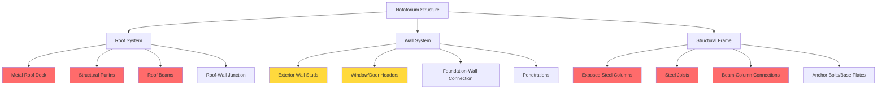

## Condensation Risk in Natatorium Structures

Condensation on structural elements represents one of the most critical failure modes in natatorium design. The combination of elevated indoor humidity (typically 50-60% RH), warm air temperatures (82-86°F), and cold exterior surfaces creates ideal conditions for moisture accumulation on inadequately insulated structural components. This condensation leads to corrosion of steel elements, degradation of concrete, deterioration of roof decking, and potential structural failure.

The fundamental physics governing condensation is straightforward: when a surface temperature falls below the dew point temperature of adjacent air, moisture condenses. In natatoriums, where indoor dew point temperatures commonly reach 60-70°F, any structural element with insufficient thermal resistance will experience condensation during cold weather.

## Surface Temperature Calculation

The critical calculation for condensation prevention determines the minimum interior surface temperature of structural elements. This temperature must remain above the indoor air dew point under design conditions.

The interior surface temperature $T_{si}$ of a structural element is calculated as:

$$T_{si} = T_i - \frac{T_i - T_o}{R_{total} \cdot h_i}$$

where:
- $T_i$ = indoor air temperature (°F)
- $T_o$ = outdoor design temperature (°F)
- $R_{total}$ = total thermal resistance of assembly (h·ft²·°F/BTU)
- $h_i$ = interior surface film coefficient (typically 1.5 BTU/h·ft²·°F for still air, 2.5 for moving air)

For condensation prevention, the requirement is:

$$T_{si} > T_{dp}$$

where $T_{dp}$ is the indoor air dew point temperature.

**Example Calculation:**

For a natatorium with indoor conditions of 84°F and 60% RH (dew point ≈ 69°F), outdoor design temperature of 0°F, and a roof assembly with R-30 total insulation:

$$T_{si} = 84 - \frac{84 - 0}{30 \cdot 1.5} = 84 - \frac{84}{45} = 84 - 1.87 = 82.13°F$$

This surface temperature (82.13°F) exceeds the dew point (69°F), preventing condensation. However, thermal bridges through structural members can create local cold spots below this calculated value.

## Condensation Risk Locations

**Legend:** Red indicates highest condensation risk requiring continuous insulation; Yellow indicates moderate risk requiring careful detail design.

## Condensation Prevention Strategies by Structural Element

| Structural Element | Primary Risk | Prevention Strategy | Minimum R-Value* | Critical Details |
|-------------------|--------------|---------------------|------------------|------------------|
| **Metal Roof Deck** | Direct condensation on cold metal surface | Continuous insulation above deck; vapor retarder below deck | R-35 to R-50 | Eliminate all deck penetrations; seal seams |
| **Steel Purlins/Joists** | Thermal bridging through continuous members | Thermally broken clips; exterior insulation layer | Effective R-30+ | Use thermal blocks at connections |
| **Steel Columns** | Condensation on exposed column faces | Encapsulate columns within insulated envelope | Full encapsulation | Interior furring with insulation |
| **Concrete Walls** | Interior surface condensation; freeze-thaw damage | Continuous exterior insulation | R-20 to R-30 | No gaps at transitions |
| **Roof Beams** | Condensation at beam-deck interface | Thermal breaks; insulation wrapping | Local R-15 minimum | Seal all penetrations through insulation |
| **Wall Studs (Metal)** | Thermal bridging through wall cavity | Exterior continuous insulation | R-5 continuous minimum | Eliminates 30-50% heat loss |
| **Foundation-Wall Junction** | Cold bridge at base of wall | Insulation extending below grade | R-10 extending 2 ft below | Critical moisture barrier integration |
| **Penetrations** | Localized cold spots around ducts, pipes | Sealed thermal blocks; insulated sleeves | Match adjacent assembly | Use manufactured thermal curbs |

*R-values assume ASHRAE 90.1 Climate Zone 5-7; adjust for local conditions.

## Thermal Bridging and Continuous Insulation

The most common condensation failure in natatoriums occurs at thermal bridges—continuous conductive paths through the building envelope. A steel column penetrating an insulated wall creates a thermal short circuit, dramatically reducing the effective R-value at that location.

The effective R-value of an assembly with thermal bridging is:

$$R_{effective} = \frac{1}{\frac{f_{bridge}}{R_{bridge}} + \frac{1-f_{bridge}}{R_{cavity}}}$$

where:
- $f_{bridge}$ = fraction of area occupied by thermal bridge (typically 0.15-0.25 for metal framing)
- $R_{bridge}$ = R-value through thermal bridge path
- $R_{cavity}$ = R-value through insulated cavity

For a wall with R-19 cavity insulation but 20% steel studs (R-1), the effective R-value drops to approximately R-6.8—a 64% reduction. This explains why continuous insulation exterior to structural framing is essential in natatorium design.

## ASHRAE and Building Science Guidelines

ASHRAE Standard 62.1 and the ASHRAE Natatorium Design Guide establish minimum ventilation requirements but do not specify envelope performance. However, building science principles and field experience establish clear requirements:

1. **Continuous thermal insulation** must be installed on the exterior side of all structural elements to prevent thermal bridging
2. **Minimum surface temperature** must exceed dew point by at least 5°F margin for condensation safety
3. **Vapor retarders** (not vapor barriers) should be installed on the warm (interior) side of roof assemblies, with permeance matched to climate and assembly type
4. **Air sealing** is critical—air leakage through envelope assemblies carries moisture directly to cold surfaces
5. **Structural steel** exposed to natatorium air must be fully encapsulated within the thermal envelope or heated to prevent condensation

## Roof Deck Condensation Prevention

Roof deck condensation represents the most destructive failure mode due to the large surface area and structural criticality. Metal roof decks are particularly vulnerable due to high thermal conductivity. Effective prevention requires:

- **Insulation placement:** All insulation must be located above the metal deck, with no insulation between the deck and interior space
- **Vapor control:** A self-adhered vapor retarder must be installed on top of the deck before insulation
- **Continuous coverage:** Insulation must extend continuously over all structural members with no gaps
- **Minimum thickness:** Typically R-35 to R-50 depending on climate zone, calculated to maintain deck temperature above dew point during coldest design conditions

The deck surface temperature can be approximated as:

$$T_{deck} = T_i - \frac{(T_i - T_o)}{1 + R_{above} \cdot h_i}$$

where $R_{above}$ is the R-value of insulation above the deck.

## Monitoring and Verification

Even with proper design, verification of actual surface temperatures is essential. Infrared thermography surveys during cold weather identify thermal bridges and condensation-prone areas. Permanently installed surface temperature sensors at critical locations (exposed columns, roof-wall junctions, beam-column connections) provide continuous monitoring and alert facility operators to condensation risk before damage occurs.

Surface temperature monitoring should trigger alerts when:

$$T_{surface} < T_{dp} + 5°F$$

This 5°F margin accounts for sensor accuracy and local air movement variations.

## Conclusion

Preventing condensation on natatorium structural elements requires rigorous application of building science principles: continuous thermal insulation exterior to all structural members, elimination of thermal bridges, vapor control strategies appropriate to climate, and verification through calculation and monitoring. The high humidity environment and potential for catastrophic structural corrosion demand design approaches that exceed typical building standards. Proper envelope design, with surface temperatures maintained above dew point under all operating conditions, ensures long-term structural integrity and operational reliability.
