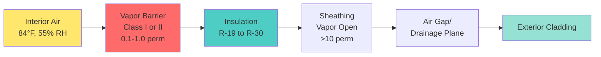

## Vapor Barrier Systems

Vapor barriers in natatorium building envelopes serve as critical moisture control elements that prevent water vapor migration from high-humidity interior spaces into wall and roof assemblies. Given that indoor pool facilities maintain relative humidity levels between 50-60% at temperatures of 82-86°F, the vapor pressure differential between interior and exterior environments drives substantial moisture flux through building assemblies. Without proper vapor control, this moisture migrates to cold surfaces within the wall cavity, condenses at the dew point plane, and causes structural deterioration, mold growth, and insulation degradation.

## Vapor Drive and Condensation Physics

The fundamental mechanism governing vapor barrier necessity is vapor pressure differential. Water vapor moves from regions of high vapor pressure (warm, humid natatorium interior) toward regions of lower vapor pressure (cooler exterior). The driving force for this migration is expressed by:

$$q_v = \frac{\Delta p}{\sum R_v}$$

where $q_v$ is vapor flux (grains/hr·ft²), $\Delta p$ is vapor pressure difference (in. Hg), and $\sum R_v$ is total vapor resistance (perm-in).

The critical concern is the **condensation plane**—the location within the wall assembly where temperature equals the dew point temperature of the migrating air. At this plane:

$$T_{assembly} = T_{dp}$$

where $T_{dp}$ is calculated from interior conditions:

$$T_{dp} = T_{db} - \frac{100 - RH}{5}$$

This simplified approximation (valid for typical natatorium conditions) shows that at 84°F and 55% RH, the dew point is approximately 65°F. Any surface within the wall assembly at or below this temperature will experience condensation if water vapor reaches it.

## Vapor Barrier Placement Strategy

ASHRAE Applications Handbook specifies that vapor retarders in natatoriums must be positioned on the **warm side** of the insulation—the side facing the conditioned space. This placement prevents moisture from reaching cold surfaces where condensation occurs.

The vapor barrier creates high vapor resistance close to the warm interior, limiting the quantity of moisture that can enter the assembly. Exterior layers must remain **vapor open** (high permeance) to allow any moisture that does enter to escape outward during warm weather or inward drying periods.

## Vapor Permeance Classifications

Vapor barrier materials are classified by permeance rating in perms (grains/hr·ft²·in. Hg):

| Class | Permeance | Material Examples | Natatorium Application |
|-------|-----------|-------------------|------------------------|
| **Class I** | ≤0.1 perm | 6-mil polyethylene, foil-faced insulation, self-adhered membrane | Primary vapor barrier for severe moisture loads |
| **Class II** | 0.1-1.0 perm | Kraft-faced insulation, some vapor retarder paints | Supplementary control in mild climates |
| **Class III** | 1.0-10 perm | Latex paint, some building wraps | Not suitable for natatorium interiors |
| **Vapor Open** | >10 perm | Unpainted gypsum, felt paper, housewrap | Required for exterior sheathing layers |

For natatorium applications, **Class I vapor retarders are mandatory** due to the extreme moisture load. Typical perm ratings for specific materials:

| Material | Thickness | Permeance (perm) | Installation Notes |
|----------|-----------|------------------|--------------------|
| Polyethylene sheet | 6 mil | 0.06 | Most economical; requires careful seam sealing |
| Polyethylene sheet | 10 mil | 0.04 | Greater durability and puncture resistance |
| Foil-faced polyisocyanurate | 1.5 in | 0.05 | Continuous insulation with integral vapor barrier |
| Self-adhered membrane | 40 mil | 0.02 | Highest reliability; self-sealing around fasteners |
| Closed-cell spray foam | 2 in | 0.8-1.2 | Class II when used alone; requires additional layer |
| Aluminum foil laminate | 1 mil | 0.01 | Extremely low permeance; difficult to install |

## Critical Installation Requirements

### Vapor Barrier Continuity

The effectiveness of a vapor barrier depends entirely on **continuity**—any gap, tear, or unsealed penetration creates a pathway for massive moisture migration. A 1-square-inch opening in a vapor barrier allows moisture flux equivalent to 30 square feet of 6-mil polyethylene. Installation requirements include:

1. **Lapped seams**: Minimum 6-inch overlap at all joints
2. **Sealed seams**: Acoustical sealant or manufacturer-approved tape at all laps
3. **Perimeter sealing**: Continuous seal to foundation, roof deck, and adjacent walls
4. **Penetration treatment**: Seal around all electrical boxes, mechanical penetrations, and structural elements

### Penetration Sealing Protocol

Every penetration through the vapor barrier creates a potential condensation pathway:

- **Electrical outlets**: Use vapor-tight electrical boxes with gasketed covers
- **Pipe penetrations**: Apply vapor barrier boot fittings or multiple layers of sealant
- **Structural members**: Seal gaps between framing and vapor barrier with compatible sealant
- **Windows and doors**: Integrate vapor barrier continuously with window/door perimeter seals

### Air Barrier Integration

The vapor barrier and air barrier functions often coincide at the same plane in natatorium construction. Air leakage transports far more moisture than vapor diffusion alone—one cubic foot of saturated air at 84°F contains 18 grains of water, while diffusion through one square foot of vapor barrier might transfer only 2-3 grains per day.

The integrated air/vapor barrier system requires:

$$Q_{total} = Q_{diffusion} + Q_{airflow}$$

where $Q_{airflow} >> Q_{diffusion}$ in most failures. Therefore, achieving airtightness is equally critical to selecting low-perm materials.

## Material Selection Criteria

### Polyethylene Sheet Vapor Barriers

**Advantages:**
- Lowest cost per square foot
- Permeance of 0.04-0.06 perm exceeds requirements
- Readily available in large rolls for continuous coverage

**Limitations:**
- Susceptible to puncture during construction
- Requires meticulous seam sealing
- Difficult to integrate with irregular geometry

**Specification**: 6-mil minimum thickness, 10-mil preferred for high-traffic construction areas.

### Foil-Faced Insulation Systems

Rigid insulation boards with foil facings provide combined thermal and vapor control:

$$R_{total} = R_{insulation} + R_{airfilm}$$

The foil facing (0.05 perm) serves as the vapor barrier, while the insulation provides thermal resistance that keeps the assembly temperature above dew point.

**Installation advantage**: Single-component system reduces coordination between trades.

### Self-Adhered Membrane Systems

Premium vapor barriers consisting of rubberized asphalt or butyl polymers with polyethylene facing offer superior reliability:

- Self-sealing around fastener penetrations
- Conformability to irregular substrates
- Factory-controlled thickness and permeance
- Reduced installation time and labor skill requirements

**Cost consideration**: 3-5 times the cost of polyethylene sheet, but eliminates vapor barrier failures.

## Moisture Control Strategy Integration

The vapor barrier is one component of a comprehensive moisture control strategy:

1. **Source control**: Maintain pool water temperature and air dewpoint within ASHRAE-recommended differentials
2. **Vapor barrier**: Limit moisture entry into building assemblies
3. **Thermal insulation**: Maintain assembly temperatures above dew point
4. **Drainage plane**: Remove any bulk water from exterior
5. **Vapor-open exterior**: Allow outward drying of any accumulated moisture

The mass balance for moisture in the wall assembly must satisfy:

$$m_{in} = m_{storage} + m_{out}$$

Proper vapor barrier design ensures $m_{in} \approx 0$, while vapor-open exteriors maximize $m_{out}$ to prevent long-term accumulation.

## Design Verification

Verify vapor barrier adequacy through hygrothermal analysis:

1. Calculate interior vapor pressure: $p_i = p_{sat}(T_i) \times RH_i$
2. Determine exterior vapor pressure: $p_o = p_{sat}(T_o) \times RH_o$
3. Calculate temperature profile through assembly using thermal resistances
4. Plot dew point plane location
5. Verify vapor barrier prevents moisture from reaching temperatures below $T_{dp}$

For natatorium assemblies, this analysis must account for **winter conditions** (maximum vapor drive outward) and **summer conditions** (potential inward vapor drive in humid climates).

## Conclusion

Vapor barrier systems in natatorium envelopes demand Class I materials (≤0.1 perm), warm-side placement, continuous installation, and integration with air barrier systems. The extreme moisture load in indoor pool facilities—resulting from sustained high humidity and elevated temperatures—creates vapor pressure differentials that drive condensation in improperly protected assemblies. Successful moisture control requires understanding vapor drive physics, proper material selection, meticulous installation, and verification that assembly temperatures remain above dew point throughout operational conditions.
