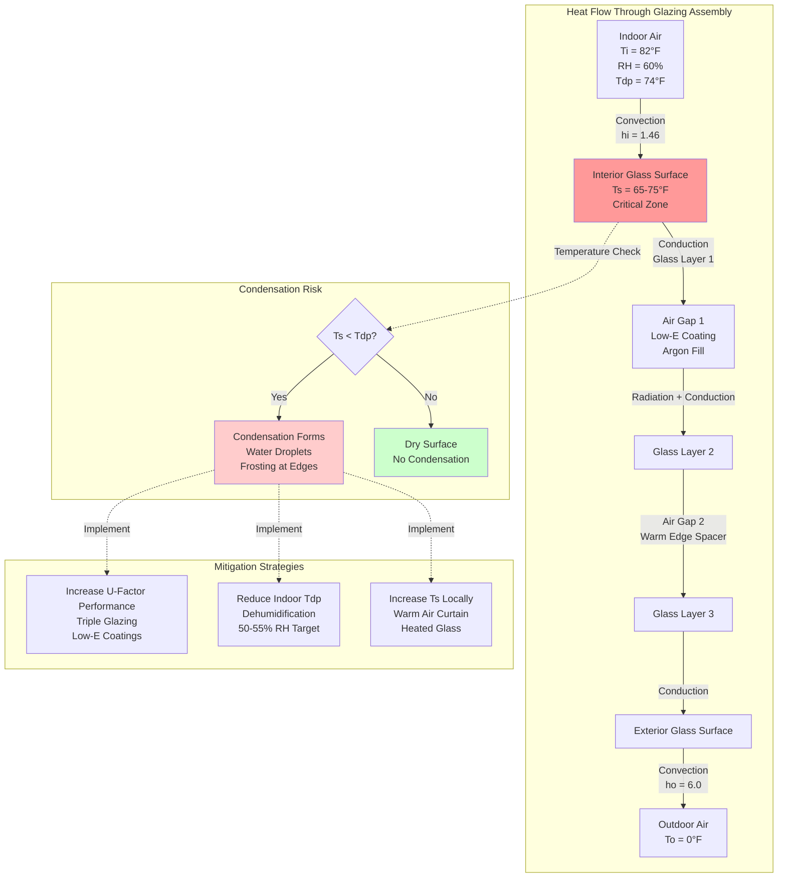

## Overview

Window condensation in natatoriums represents one of the most challenging envelope design problems due to the combination of elevated indoor humidity, high dew point temperatures, and significant temperature differentials across the glazing assembly. Condensation occurs when the interior glazing surface temperature falls below the indoor air dew point temperature, creating moisture accumulation that leads to water damage, mold growth, and degraded visual aesthetics.

## Condensation Formation Physics

Condensation on glazing surfaces follows fundamental heat transfer and psychrometric principles. The critical relationship is:

$$T_s > T_{dp}$$

Where:
- $T_s$ = interior glazing surface temperature (°F)
- $T_{dp}$ = indoor air dew point temperature (°F)

The dew point temperature for natatorium air is calculated from:

$$T_{dp} = T_{db} - \frac{100 - RH}{5}$$

For typical natatorium conditions at 82°F and 60% RH:

$$T_{dp} = 82 - \frac{100 - 60}{5} = 82 - 8 = 74°F$$

ASHRAE Applications Handbook recommends maintaining natatorium relative humidity between 50-60% to balance occupant comfort with condensation control.

## Surface Temperature Analysis

The interior glazing surface temperature depends on the overall heat transfer coefficient (U-factor), outdoor temperature, and indoor temperature:

$$T_s = T_i - \frac{U \cdot (T_i - T_o)}{h_i}$$

Where:
- $T_i$ = indoor air temperature (°F)
- $T_o$ = outdoor air temperature (°F)
- $U$ = overall U-factor (Btu/hr·ft²·°F)
- $h_i$ = interior film coefficient (1.46 Btu/hr·ft²·°F for vertical surfaces)

For a window with U-factor of 0.30 Btu/hr·ft²·°F, indoor temperature of 82°F, and outdoor temperature of 0°F:

$$T_s = 82 - \frac{0.30 \times (82 - 0)}{1.46} = 82 - 16.8 = 65.2°F$$

This surface temperature of 65.2°F is below the dew point of 74°F, resulting in condensation.

## Glazing Performance Requirements

### U-Factor Specifications

For condensation prevention in northern climates (design outdoor temperature below 20°F), ASHRAE recommends:

$$U_{max} = \frac{h_i \cdot (T_i - T_{dp})}{T_i - T_o}$$

For the example conditions:

$$U_{max} = \frac{1.46 \times (82 - 74)}{82 - 0} = \frac{11.68}{82} = 0.14 \text{ Btu/hr·ft²·°F}$$

This demanding requirement necessitates high-performance glazing assemblies.

### Glazing System Comparison

| Glazing Type | U-Factor (Btu/hr·ft²·°F) | CRF at 70°F | Interior Surface Temp (0°F outdoor) | Condensation Risk |
|--------------|--------------------------|-------------|-------------------------------------|-------------------|
| Single Glazing | 1.04 | 14 | 3°F | Severe frosting |
| Double Glazing, Clear | 0.49 | 37 | 26°F | Severe condensation |
| Double Glazing, Low-E, Argon | 0.29 | 57 | 66°F | Moderate condensation |
| Triple Glazing, Low-E, Argon | 0.20 | 69 | 71°F | Minimal condensation |
| Triple Glazing, 2× Low-E, Krypton | 0.15 | 76 | 74°F | No condensation |
| Heated Glass System | 0.25 (effective) | 85+ | 78°F | No condensation |

**CRF** = Condensation Resistance Factor (0-100 scale, higher is better)

## Condensation Resistance Factor

The Condensation Resistance Factor quantifies a fenestration product's ability to resist condensation:

$$CRF = \frac{T_s - T_o}{T_i - T_o} \times 100$$

For triple glazing with $T_s = 71°F$, $T_i = 82°F$, $T_o = 0°F$:

$$CRF = \frac{71 - 0}{82 - 0} \times 100 = 86.6$$

CRF values above 70 are recommended for natatoriums in cold climates.

## Technical Mitigation Strategies

### Triple Glazing with Low-E Coatings

Triple-pane insulating glass units with two low-emissivity coatings on surfaces 2 and 5 (counting from outdoor to indoor) provide:
- U-factors as low as 0.15 Btu/hr·ft²·°F
- Surface temperatures 20-25°F higher than double glazing
- Reduced thermal bridging at edges

### Warm Edge Spacers

Insulated spacer systems reduce edge condensation by minimizing conductive heat loss at the glazing perimeter. Warm edge spacers improve edge temperatures by 5-10°F compared to aluminum spacers.

### Insulated and Heated Frames

Thermally broken aluminum or fiberglass frames with internal insulation prevent frame condensation. Heated frame systems incorporate low-voltage resistance heating elements to maintain frame temperatures above the dew point.

### Heated Glass Systems

Electric resistance heating embedded in the glazing assembly maintains interior surface temperatures 5-15°F above ambient. Power density ranges from 15-40 W/ft² depending on design conditions. These systems provide absolute condensation control but increase operating costs.

### Strategic Air Distribution

Delivering warm, dehumidified air along window surfaces elevates the local surface temperature and reduces condensation risk:

- Linear slot diffusers mounted at window perimeter
- Air velocity at glazing surface: 150-250 fpm
- Supply air temperature: 85-90°F (3-8°F above room temperature)
- Air volume: 15-25 CFM per linear foot of window

The warm air curtain increases the effective interior film coefficient from 1.46 to approximately 2.0-2.5 Btu/hr·ft²·°F, raising the surface temperature.

## Design Integration

Effective window condensation control requires coordinated design across multiple disciplines:

1. **Envelope design**: Specify glazing U-factor ≤ 0.20 Btu/hr·ft²·°F for cold climates
2. **Dehumidification capacity**: Size mechanical dehumidification to maintain 50-55% RH maximum
3. **Air distribution**: Design perimeter air delivery with adequate throw and temperature rise
4. **Controls integration**: Monitor glazing surface temperature and modulate heating/airflow
5. **Drainage provisions**: Provide condensate collection at sills for occasional condensation events

## Reference Standards

- ASHRAE Handbook—HVAC Applications, Chapter 6: Natatoriums
- NFRC 500: Procedure for Determining Fenestration Product Condensation Resistance
- ASHRAE Standard 160: Criteria for Moisture-Control Design Analysis in Buildings

## Conclusion

Window condensation control in natatoriums demands high-performance glazing systems with U-factors below 0.20 Btu/hr·ft²·°F, warm edge spacers, insulated frames, and coordinated air distribution. Triple-pane assemblies with multiple low-E coatings represent the minimum standard for cold climates, while heated glass systems provide absolute protection in extreme conditions. Success requires integrated design that addresses thermal performance, dehumidification capacity, and air delivery simultaneously.
