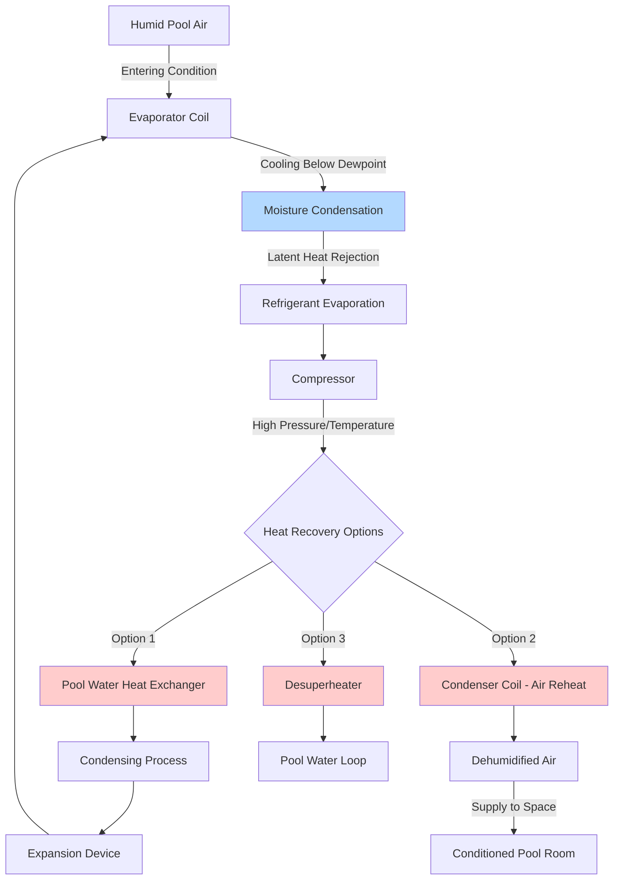

## Overview

Dedicated pool dehumidifiers are engineered refrigerant-based systems designed specifically for natatorium moisture control. These units operate on the vapor-compression refrigeration cycle, condensing water vapor from pool room air while simultaneously providing heat recovery for space heating, air reheating, and pool water heating. Unlike standard HVAC dehumidifiers, pool dehumidifiers are constructed with corrosion-resistant materials to withstand the aggressive chloramine and high-humidity environment.

## Operating Principles

### Refrigeration Cycle with Heat Recovery

Dedicated pool dehumidifiers employ a modified refrigeration cycle that captures energy at multiple points for productive use:

### Latent Heat Removal

The latent cooling capacity relates directly to moisture removal rate:

$$Q_L = 1076 \cdot GPH$$

where:
- $Q_L$ = latent cooling capacity (Btu/hr)
- $GPH$ = gallons per hour of condensate removed
- $1076$ = latent heat of vaporization (Btu/lb) at typical conditions

In metric units:

$$Q_L = 2500 \cdot L/h$$

where:
- $Q_L$ = latent cooling capacity (kW)
- $L/h$ = liters per hour of condensate removed

Moisture removal capacity is typically specified in pounds per hour (lb/hr) or kilograms per hour (kg/hr):

$$\dot{m}_w = \rho_{air} \cdot \dot{V} \cdot (W_{in} - W_{out})$$

where:
- $\dot{m}_w$ = moisture removal rate (lb/hr)
- $\rho_{air}$ = air density (~0.075 lb/ft³)
- $\dot{V}$ = airflow rate (cfm)
- $W_{in}$ = inlet humidity ratio (lb_water/lb_dry air)
- $W_{out}$ = outlet humidity ratio (lb_water/lb_dry air)

## Key Components and Features

### Heat Recovery Options

**1. Pool Water Heating Heat Recovery**
- Refrigerant-to-water heat exchanger (desuperheater or condenser)
- Delivers 60-80% of total heat rejection to pool water
- Typical pool water heating capacity: 40,000-300,000 Btu/hr
- Reduces boiler/heater operating costs by 40-70%

**2. Condenser Air Reheat**
- Hot refrigerant gas heats dehumidified air after evaporator
- Prevents overcooling of space during dehumidification
- Adjustable reheat capacity via refrigerant circuit control
- Maintains space temperature setpoint while removing moisture

**3. Desuperheating**
- Captures superheat energy before full condensing
- Supplies high-temperature water (140-160°F) to pool or domestic hot water
- Improves overall system efficiency by 15-25%

### Outdoor Air Integration

ASHRAE Standard 62.1 requires ventilation air for natatoriums. Dedicated pool dehumidifiers accommodate outdoor air through:

- **Ducted outdoor air connection** to unit mixing plenum
- **Minimum outdoor air dampers** with actuator control
- **Energy recovery** between exhaust and outdoor air streams
- **Outdoor air preheating** during winter operation to prevent coil freezing

Typical outdoor air rates: 0.06 cfm/ft² of pool water surface area plus occupancy-based ventilation.

## Capacity Sizing Guidelines

Per ASHRAE Applications Handbook (Chapter 6 - Natatoriums):

**Evaporation Rate Calculation:**

$$E = \frac{A \cdot (P_{pool} - P_{air}) \cdot F}{Y}$$

where:
- $E$ = evaporation rate (lb/hr)
- $A$ = pool surface area (ft²)
- $P_{pool}$ = saturation vapor pressure at pool water temperature (in. Hg)
- $P_{air}$ = vapor pressure of pool room air (in. Hg)
- $F$ = activity factor (0.5 unoccupied, 1.0 occupied)
- $Y$ = latent heat factor (~1,050 Btu/lb)

**Dehumidifier Sizing:**
Select unit with moisture removal capacity ≥ 1.3 × calculated evaporation rate to provide safety margin and account for:
- Peak occupancy periods
- Wet deck areas
- Splash-out and carryover moisture
- Air leakage infiltration

## Manufacturer Comparison

| Manufacturer | Capacity Range (lb/hr) | Pool Water Heating (Btu/hr) | Airflow Range (cfm) | Special Features |
|--------------|------------------------|------------------------------|---------------------|------------------|
| Desert Aire | 75-600 | 150,000-1,200,000 | 2,000-20,000 | Triple corrosion protection, modular design |
| Seresco | 50-500 | 100,000-1,000,000 | 1,500-18,000 | Stainless steel construction, smart controls |
| Dectron | 60-550 | 120,000-1,100,000 | 1,800-19,000 | Kinetic™ coil design, touchscreen interface |
| Calorex | 45-480 | 90,000-950,000 | 1,200-16,000 | Heat pump reversing, glycol pool heating |
| DRI | 70-620 | 140,000-1,250,000 | 2,200-21,000 | Advanced diagnostics, remote monitoring |

## Performance Considerations

**Sensible Cooling Capacity:**
Most dedicated pool dehumidifiers provide 0-50 MBH sensible cooling. Space sensible load is typically small in natatoriums due to:
- High glazing U-values from condensation control requirements
- Envelope insulation requirements
- Limited internal gains

**Reheat Capacity:**
Reheat prevents overcooling during dehumidification. Required reheat capacity:

$$Q_{reheat} = 1.08 \cdot \dot{V} \cdot (T_{supply} - T_{evap,out})$$

where:
- $Q_{reheat}$ = reheat capacity (Btu/hr)
- $\dot{V}$ = airflow (cfm)
- $T_{supply}$ = desired supply air temperature (°F)
- $T_{evap,out}$ = air temperature leaving evaporator coil (°F)

**Energy Efficiency:**
- Coefficient of Performance (COP) for dehumidification: 2.5-4.0
- Pool water heating COP: 3.5-5.5
- Total system COP (dehumidification + heat recovery): 4.5-7.0

## Control Strategies

Dedicated pool dehumidifiers employ multiple control loops:

1. **Space humidity control** - primary setpoint (50-60% RH)
2. **Space temperature control** - modulating reheat
3. **Pool water temperature control** - heat recovery to pool loop
4. **Outdoor air economizer** - free cooling when conditions permit
5. **Dehumidifier staging** - multiple units or compressor capacity modulation

Advanced units incorporate:
- Variable frequency drives (VFD) on supply/return fans
- Electronic expansion valves (EEV) for precise superheat control
- Hot gas bypass for capacity modulation
- Microprocessor-based controls with BACnet/LonWorks integration

## Installation Requirements

**Corrosion Protection:**
- Epoxy-coated or stainless steel heat exchangers
- UV-resistant polymer drain pans
- Sealed electrical components (NEMA 4X minimum)

**Condensate Management:**
- Trapped drain connections per UPC requirements
- Minimum 1" drain pipe sizing
- Air gap or backflow preventer if connected to sanitary system

**Refrigerant Piping:**
- Brazed copper connections, pressure tested to 450 psig
- Suction line insulation to prevent condensation
- Proper oil return provisions for heat recovery piping

## Maintenance Considerations

Critical maintenance tasks:

- **Coil inspection** - quarterly cleaning to remove chloramine deposits
- **Filter replacement** - MERV 8 minimum, monthly inspection
- **Refrigerant charge verification** - annually via subcooling/superheat
- **Condensate drain testing** - verify trap seal and flow
- **Heat exchanger descaling** - pool water side annually

Expected service life: 15-20 years with proper maintenance in natatorium environment.
