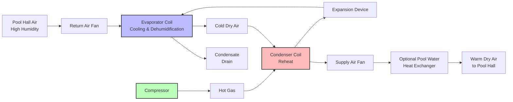

Pool dehumidification systems integrate multiple refrigeration and air handling components into a unified moisture control system. Understanding each component's function, sizing methodology, and interaction with other system elements is essential for proper design, installation, and troubleshooting.

## System Architecture and Airflow Path

## Evaporator Coil: Dehumidification Core

The evaporator coil removes both sensible and latent heat from the pool hall air. Air passing over the cold coil surface drops below its dew point, causing moisture to condense and drain away.

### Sizing Methodology

Evaporator capacity must handle the total load:

$$Q_{evap} = Q_{sensible} + Q_{latent}$$

$$Q_{evap} = \dot{m}_{air} \cdot c_p \cdot (T_{db,in} - T_{db,out}) + \dot{m}_{air} \cdot (h_{in} - h_{out})$$

Where:
- $Q_{evap}$ = total evaporator capacity (Btu/hr)
- $\dot{m}_{air}$ = mass flow rate (lb/hr)
- $c_p$ = specific heat of air (0.24 Btu/lb·°F)
- $T_{db}$ = dry bulb temperature (°F)
- $h$ = enthalpy (Btu/lb)

**Critical Design Parameters:**
- Coil face velocity: 400-550 fpm (optimal moisture removal)
- Coil entering air: typically 82-84°F DB, 75-77°F WB
- Coil leaving air: 50-55°F DB (below dew point)
- Fin spacing: 8-10 FPI for condensate drainage
- Rows: 6-8 rows typical for pool applications

## Condenser Coil: Heat Rejection and Reheat

The condenser serves dual purposes in pool dehumidifiers—rejecting heat from the refrigeration cycle while simultaneously reheating the cold, dehumidified air before it returns to the space.

### Heat Recovery Efficiency

The condenser releases the heat absorbed at the evaporator plus the compressor work:

$$Q_{cond} = Q_{evap} + W_{comp}$$

$$Q_{cond} = \dot{m}_{ref} \cdot (h_{cond,in} - h_{cond,out})$$

Where:
- $Q_{cond}$ = condenser heat rejection (Btu/hr)
- $W_{comp}$ = compressor power (Btu/hr)
- $\dot{m}_{ref}$ = refrigerant mass flow rate (lb/hr)

**Design Considerations:**
- Airflow arrangement: counter-flow for maximum heat transfer
- Temperature rise: 20-30°F across condenser
- Supply air target: 80-90°F to pool space
- Face velocity: 500-700 fpm

## Compressor: System Heart

The compressor circulates refrigerant and creates the pressure differential necessary for heat transfer. Pool dehumidifiers require precise capacity modulation to match varying moisture loads.

### Compressor Capacity Calculation

Required compressor displacement:

$$V_{disp} = \frac{\dot{m}_{ref} \cdot v_{suction}}{\eta_{vol}}$$

Where:
- $V_{disp}$ = displacement volume (CFM)
- $v_{suction}$ = specific volume at suction (ft³/lb)
- $\eta_{vol}$ = volumetric efficiency (0.70-0.85)

### Compressor Power Requirement

$$W_{comp} = \frac{\dot{m}_{ref} \cdot (h_{discharge} - h_{suction})}{\eta_{comp}}$$

Where:
- $\eta_{comp}$ = compressor efficiency (0.60-0.75 for scroll)

## Component Comparison

| Component Type | Technology Options | Capacity Range | Efficiency | Control Capability | Typical Application |
|---|---|---|---|---|---|
| **Compressor** | Scroll | 3-20 tons | High (EER 10-12) | On/Off, 2-stage | Small to medium pools |
| | Scroll with unloader | 3-20 tons | High | 50-100% steps | Variable load pools |
| | Variable speed scroll | 3-25 tons | Very high (EER 12-15) | 25-100% continuous | Premium applications |
| | Screw | 20-200 tons | Moderate | Slide valve modulation | Large natatoriums |
| **Evaporator** | Copper tube/aluminum fin | All sizes | Standard | Fixed geometry | Standard duty |
| | Copper tube/coated fin | All sizes | Standard | Fixed geometry | Chlorine resistance |
| | Microchannel | Small-medium | High | Fixed geometry | Compact designs |
| **Condenser** | Air-cooled reheat | All sizes | COP 3.5-4.5 | Fixed/staged fans | Standard pool dehumidifiers |
| | Water-cooled with separate reheat | Large systems | COP 4.5-6.0 | Modulating | High efficiency designs |
| | Pool water heating coil | All sizes | COP 5.0-7.0 | Modulating valve | Maximum heat recovery |
| **Expansion Device** | Thermostatic expansion valve (TXV) | All sizes | Good | Superheat control | Standard systems |
| | Electronic expansion valve (EEV) | All sizes | Excellent | Precise superheat | Variable speed systems |
| **Air Handling** | Direct drive plenum fans | <10 tons | Standard | On/Off, 2-speed | Small units |
| | Belt drive centrifugal | 10-50 tons | High static capability | VFD compatible | Ducted systems |
| | EC motor plug fans | All sizes | Very high efficiency | Integrated VFD | Premium efficiency |

## Heat Recovery Options

Pool dehumidifiers can recover rejected heat for three purposes:

1. **Space Reheat (Standard):** Condenser warms dehumidified air before return
2. **Pool Water Heating:** Refrigerant-to-water heat exchanger heats pool directly
3. **Domestic Hot Water:** Additional heat exchanger for facility DHW needs

### Pool Water Heat Recovery

$$Q_{pool} = \dot{m}_{water} \cdot c_{p,water} \cdot (T_{out} - T_{in})$$

Where:
- $Q_{pool}$ = heat delivered to pool water (Btu/hr)
- $\dot{m}_{water}$ = pool water flow rate (lb/hr)
- $c_{p,water}$ = 1.0 Btu/lb·°F
- Temperature rise: typically 2-5°F

**Heat Exchanger Types:**
- Cupronickel tube-in-shell (chlorine resistant)
- Titanium plate-and-frame (compact, efficient)
- Double-wall safety designs (codes may require)

## Capacity Control Methods

Precise capacity modulation prevents cycling and maintains stable space conditions.

### Hot Gas Bypass

Diverts hot refrigerant gas around the condenser directly to the evaporator inlet, reducing effective capacity without cycling the compressor.

- **Capacity range:** 30-100% of full load
- **Energy penalty:** Moderate (still running full compressor load)
- **Response:** Fast (seconds)
- **Application:** Older systems, simple control needs

### Digital Scroll Unloading

Scroll compressor mechanically unloads pockets to reduce displacement.

- **Capacity steps:** 33%, 67%, 100% (typical)
- **Efficiency:** High (power matches capacity reduction)
- **Response:** Moderate (10-30 seconds per step)
- **Application:** Modern mid-range systems

### Variable Speed Drive (VFD)

Controls compressor motor speed continuously from minimum to maximum RPM.

- **Capacity range:** 25-100% (continuous)
- **Efficiency:** Highest (power proportional to load)
- **Response:** Slow (1-2 minutes for stability)
- **Application:** Premium systems, stable control

## Control Systems and Sensors

Modern pool dehumidifiers employ sophisticated controls to balance dehumidification, heating, and energy efficiency.

**Essential Sensors:**
- Space relative humidity (primary control)
- Space temperature (heating/cooling mode)
- Supply air temperature (freeze protection)
- Refrigerant pressures (safety, optimization)
- Pool water temperature (heat recovery control)

**Control Strategies (per ASHRAE Applications Handbook):**
- Humidity setpoint: 50-60% RH typical
- Dead band: 5% RH to prevent hunting
- Night setback: may increase to 65% RH when unoccupied
- Morning recovery: ramp up capacity 2 hours before occupancy
- Outdoor air economizer: when conditions permit (rare for pools)

**Advanced Features:**
- Demand-based ventilation (CO₂ sensing in spectator areas)
- Predictive defrost (evaporator ice detection)
- Remote monitoring and diagnostics
- Integration with pool covers (reduce load when covered)

## Refrigerant Circuit Components

**Receiver:** Stores excess liquid refrigerant during varying loads, essential for systems with pool water heat recovery where condenser load varies.

**Liquid Line Filter-Drier:** Removes moisture and contaminants from refrigerant. Critical in pool applications due to potential for chlorine-accelerated breakdown of refrigerant and oil.

**Suction Accumulator:** Prevents liquid refrigerant from returning to compressor during pull-down or abnormal conditions.

**Sight Glass:** Indicates refrigerant charge and moisture level. Should show clear liquid (no bubbles) during steady operation.

## References and Standards

Design and selection of pool dehumidification components must follow:
- **ASHRAE Handbook—HVAC Applications, Chapter 6:** Natatoriums
- **ASHRAE Standard 62.1:** Ventilation requirements
- **ASHRAE Standard 15:** Refrigeration system safety
- Manufacturer's certified performance data (AHRI standards)

---

**Key Takeaway:** Pool dehumidification systems integrate refrigeration components (compressor, evaporator, condenser, expansion device) with air handling equipment (fans, coils) and sophisticated controls to simultaneously remove moisture and recover heat. Proper component sizing and selection based on accurate load calculations ensures efficient, reliable operation across varying pool hall conditions.
