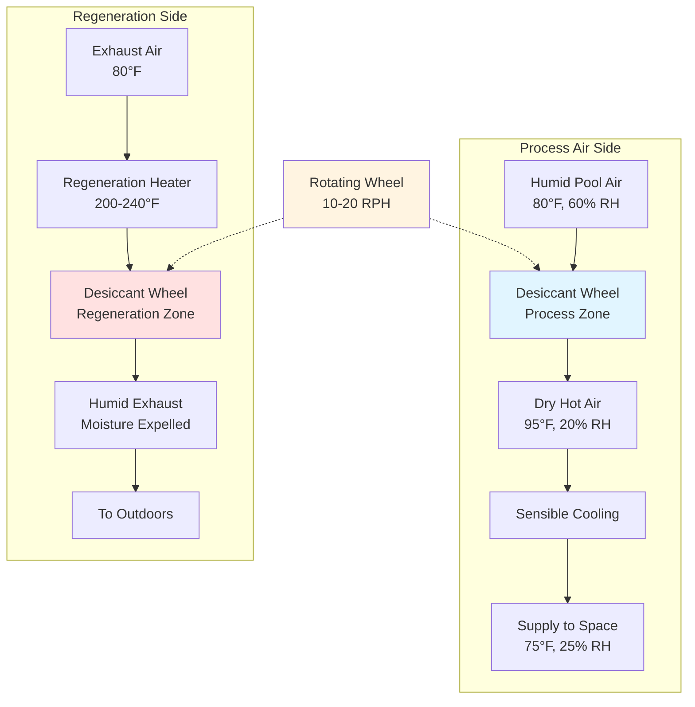

Desiccant dehumidification systems provide specialized moisture control for natatorium environments by adsorbing water vapor directly from air streams through chemical affinity rather than condensation. These systems achieve extremely low dew points and operate effectively across wide temperature ranges, making them valuable for specific pool facility applications where conventional refrigerant-based systems reach performance limitations.

## Physical Principles of Desiccant Operation

Desiccant materials remove moisture through adsorption (solid desiccants) or absorption (liquid desiccants), creating a chemical or physical bond with water molecules. This process releases the heat of adsorption, increasing supply air temperature by 10-15°F per grain of moisture removed at typical operating conditions.

The moisture removal capacity follows the Langmuir isotherm relationship for solid desiccants:

$$W = W_m \frac{bP}{1 + bP}$$

Where:
- $W$ = moisture content of desiccant (lb water/lb desiccant)
- $W_m$ = maximum monolayer capacity
- $b$ = adsorption equilibrium constant
- $P$ = water vapor partial pressure

Regeneration heat requirement depends on the desorption energy and temperature differential:

$$Q_{regen} = \dot{m}_{air} \left[ c_p(T_{regen} - T_{ambient}) + \Delta m_{water} \cdot h_{fg} \right]$$

Where:
- $Q_{regen}$ = regeneration heat input (Btu/hr)
- $\dot{m}_{air}$ = regeneration airflow rate (lb/hr)
- $c_p$ = specific heat of air (Btu/lb·°F)
- $T_{regen}$ = regeneration temperature (180-250°F typical)
- $\Delta m_{water}$ = moisture removal rate (lb water/hr)
- $h_{fg}$ = latent heat of vaporization (1050 Btu/lb at atmospheric pressure)

## Desiccant Wheel Operation Cycle

## Solid vs Liquid Desiccant Systems Comparison

| Parameter | Solid Desiccant (Wheel) | Liquid Desiccant (LiCl) |
|-----------|-------------------------|--------------------------|
| **Desiccant Material** | Silica gel, molecular sieve, activated alumina | Lithium chloride, lithium bromide solution |
| **Moisture Removal** | 30-150 grains/lb air | 40-200 grains/lb air |
| **Regeneration Temperature** | 180-250°F | 140-180°F |
| **Minimum Dew Point** | -40°F to +20°F | +30°F to +50°F |
| **Process Air Heating** | 10-15°F rise | 5-8°F rise |
| **Pressure Drop** | 0.8-1.5 in. w.g. | 1.2-2.0 in. w.g. |
| **Maintenance** | Low (annual inspection) | Moderate (solution monitoring, filtration) |
| **Carryover Risk** | None | Potential droplet carryover |
| **System Complexity** | Simple rotating wheel | Pumps, spray chambers, heat exchangers |
| **Capital Cost** | Moderate | Higher |
| **Energy Efficiency (COP)** | 0.8-1.2 | 1.0-1.4 |

## Deep Drying Capability for Natatorium Applications

Desiccant systems achieve dew points below 40°F, enabling precise humidity control during cold weather operation when pool water temperatures create high evaporation rates but outdoor air temperatures limit condensing dehumidifier performance.

ASHRAE Applications Handbook (Chapter 6: Natatoriums) recognizes desiccant systems for the following scenarios:

1. **Cold climate facilities** where outdoor air temperatures fall below 35°F for extended periods
2. **Low humidity requirements** such as competitive facilities maintaining 50-55% RH
3. **High sensible heat ratio loads** where latent cooling exceeds sensible requirements
4. **Existing buildings** with limited cooling capacity for condensing unit heat rejection

The moisture removal effectiveness at low temperature conditions:

$$\eta_{latent} = \frac{W_{inlet} - W_{outlet}}{W_{inlet} - W_{regen}} \times 100\%$$

High-performance desiccant wheels achieve 60-75% latent effectiveness, removing 70-100 grains per pound of process air at typical natatorium inlet conditions (80°F, 60% RH).

## Regeneration Energy Sources and Requirements

Regeneration energy represents 50-70% of total desiccant system operating cost. Energy source selection significantly impacts system economics:

**Gas-fired regeneration**: Direct-fired burners provide 200-240°F regeneration air at 80-85% thermal efficiency. Natural gas cost at $0.80/therm yields regeneration cost of approximately $0.012-0.015 per pound of water removed.

**Electric resistance heating**: Provides precise temperature control but increases operating cost by 2.5-3.0× compared to gas-fired systems in most utility rate structures.

**Heat recovery from pool heaters or CHP systems**: Captures waste heat at 140-180°F, sufficient for liquid desiccant regeneration or low-temperature solid desiccant cycles.

**Solar thermal collectors**: Flat-plate or evacuated tube collectors generate 160-200°F regeneration heat during daytime operation, reducing energy costs by 40-60% in high-insolation climates.

## Hybrid Desiccant-Refrigerant Systems

Hybrid configurations combine desiccant deep drying with conventional refrigerant systems to optimize energy performance across operating conditions:

**Series hybrid**: Desiccant wheel pre-dries air before entering refrigerant coil, reducing coil surface temperature and preventing condensate freeze-up during low-temperature operation. Reduces total system energy by 15-25% compared to refrigerant-only systems in cold climates.

**Parallel hybrid**: Desiccant system handles peak latent loads while refrigerant system maintains base cooling. Control logic switches between modes based on outdoor temperature and humidity ratio.

**Ventilation air pre-treatment**: Desiccant wheel processes 100% outdoor air ventilation stream only, reducing moisture load on main pool dehumidifier by 30-50% and eliminating negative pressurization issues.

The hybrid system coefficient of performance:

$$COP_{system} = \frac{Q_{latent,total}}{Q_{electric,ref} + Q_{thermal,desiccant}/\eta_{source}}$$

Properly designed hybrid systems achieve seasonal COPs of 2.5-3.5 in northern climates, outperforming refrigerant-only systems (COP 1.8-2.2) while maintaining superior humidity control.

## Design Considerations and Limitations

**Advantages for natatorium applications:**
- Achieves dew points 15-30°F lower than refrigerant systems
- Operates effectively at outdoor temperatures below 32°F
- Reduces overcooling and reheating energy in shoulder seasons
- Eliminates condensate freezing issues in air handlers
- Provides independent latent and sensible cooling control

**System limitations:**
- High regeneration energy requirement (1200-1500 Btu/lb water removed)
- Increases supply air temperature requiring additional sensible cooling capacity
- Higher initial cost compared to conventional pool dehumidifiers
- Requires reliable regeneration heat source
- Larger equipment footprint for equivalent moisture removal

Desiccant dehumidification serves specialized natatorium applications where conventional systems reach performance limitations, particularly cold climate facilities and those requiring precise low humidity control. Proper integration with heat recovery and hybrid operation strategies maximizes energy efficiency while maintaining superior moisture control throughout annual operating cycles.
