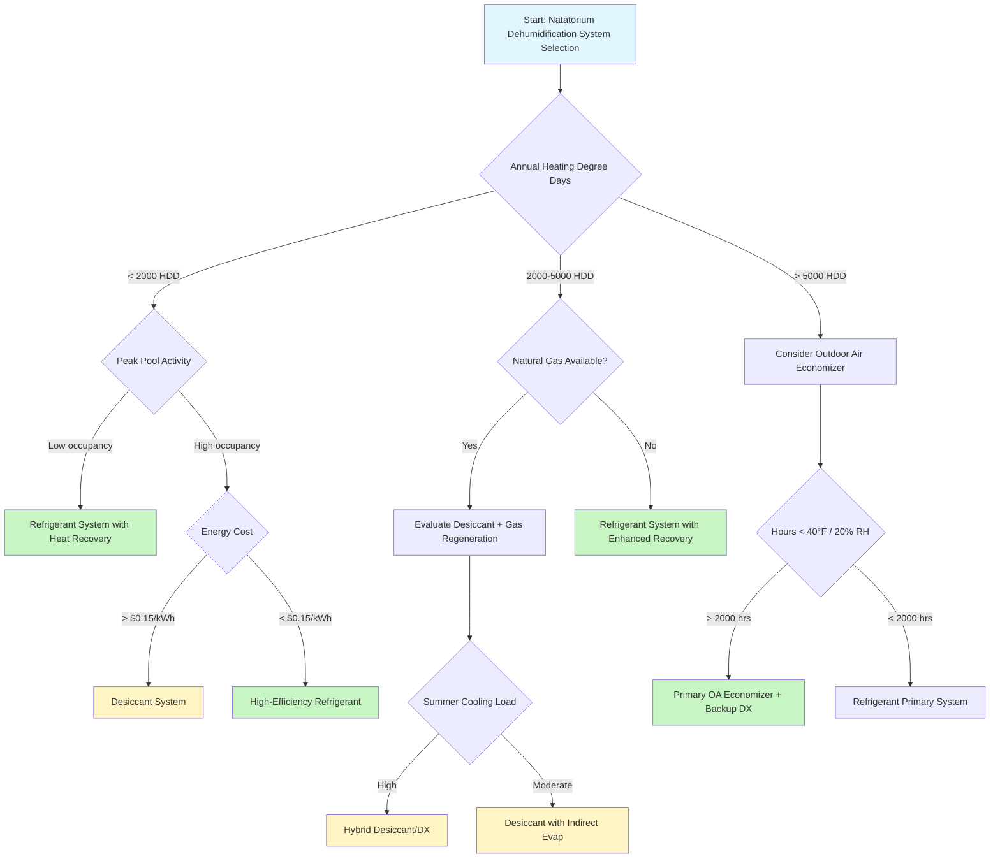

Selecting the appropriate dehumidification system for a natatorium requires comprehensive analysis of facility characteristics, climate conditions, energy economics, and operational requirements. The selection process balances first cost, operating cost, space constraints, and performance objectives to identify the optimal technology for each application.

## System Technology Comparison

Three primary dehumidification technologies serve natatorium applications, each with distinct performance characteristics and appropriate application ranges:

| System Type | Typical Capacity Range | Energy Efficiency | First Cost | Best Applications |
|-------------|------------------------|-------------------|------------|-------------------|
| Refrigerant-Based (DX) | 50-2000 lb/hr | 3.5-5.0 lb/kWh | Baseline | Moderate climates, year-round operation |
| Desiccant Systems | 100-5000 lb/hr | 2.0-3.5 lb/kWh | 1.5-2.5× DX | Hot-humid climates, high latent loads |
| Outdoor Air Economizer | Variable | 8-15 lb/kWh | 0.3-0.6× DX | Cold-dry climates, seasonal use |
| Hybrid DX/Desiccant | 200-3000 lb/hr | 4.0-6.5 lb/kWh | 1.8-2.8× DX | Variable climates, optimization required |

## Capacity Sizing Requirements

Dehumidification capacity must address evaporation from pool and deck surfaces, occupant moisture generation, and ventilation latent load. Total moisture load:

$$W_{total} = W_{pool} + W_{deck} + W_{occupants} + W_{ventilation}$$

Pool evaporation rate per ASHRAE:

$$W_{pool} = A_{pool} \times (0.1 + 0.0085 \cdot V_{air}) \times (P_{sat,pool} - P_{air}) \times \frac{1}{1093}$$

Where:
- $A_{pool}$ = pool water surface area (ft²)
- $V_{air}$ = air velocity over pool surface (fpm), typically 10-30 fpm
- $P_{sat,pool}$ = saturation pressure at pool water temperature (in. Hg)
- $P_{air}$ = partial pressure of water vapor in room air (in. Hg)
- Result in lb/hr

Safety factor application:

$$W_{design} = W_{total} \times SF$$

Where $SF$ = 1.2-1.5 depending on pool activity level (1.2 for residential, 1.3 for commercial fitness, 1.5 for competitive/therapy pools).

## Selection Decision Tree

## Climate Zone Considerations

Climate fundamentally influences system selection through heating/cooling balance and economizer potential:

**Cold Climates (Zones 6-7):** Refrigerant systems with comprehensive heat recovery provide optimal performance. Recovered condensing heat offsets facility heating loads during extended heating seasons. Outdoor air economizer operation viable during 30-50% of annual hours when outdoor conditions fall below 45°F and 30% RH.

**Moderate Climates (Zones 3-5):** Refrigerant systems remain the baseline choice. Heat recovery effectiveness reduces as heating season shortens. Economic analysis must account for cooling season performance when recovered heat becomes a liability requiring rejection.

**Hot-Humid Climates (Zones 1-2):** Desiccant systems gain advantage through independent temperature and humidity control. High regeneration efficiency with waste heat or natural gas justifies increased first cost. Refrigerant systems require oversizing for latent capacity, reducing sensible efficiency.

## Energy Performance Metrics

Compare systems using latent coefficient of performance under design conditions:

$$COP_{latent} = \frac{W_{removed} \times h_{fg}}{E_{input} \times 3.412}$$

Where:
- $W_{removed}$ = moisture removal rate (lb/hr)
- $h_{fg}$ = latent heat of vaporization = 1061 BTU/lb at 70°F
- $E_{input}$ = electrical input (kW)
- 3.412 = BTU/hr per watt conversion

Annual energy cost comparison:

$$C_{annual} = \sum_{i=1}^{8760} \left(\frac{W_{required,i}}{COP_{latent,i}}\right) \times 3.412 \times C_{energy,i}$$

Life cycle cost analysis must include:
- Equipment first cost with installation
- Annual energy cost at projected utility rates
- Maintenance cost (refrigerant: 2-4% of first cost annually; desiccant: 3-6%)
- Expected equipment life (refrigerant: 15-20 years; desiccant: 20-25 years)
- Discount rate for present value calculation

## System Selection Considerations

**Space Requirements:** Refrigerant systems offer compact footprints (0.3-0.5 ft²/100 CFM). Desiccant systems require 1.5-2× the space for desiccant wheel, reactivation heating, and cooling coils. Evaluate mechanical room constraints early in design.

**Noise Criteria:** Natatoriums require NC 40-45 maximum. Refrigerant compressors generate 75-85 dBA requiring attenuation. Desiccant systems operate at 70-78 dBA with lower frequency content. Remote location or acoustic treatment affects installation cost.

**Maintenance Access:** Refrigerant systems demand routine refrigeration service capabilities. Desiccant systems require desiccant wheel inspection every 2-3 years and potential replacement at 10-15 years. Filter maintenance identical across technologies at 2000-4000 hour intervals.

**Controls Integration:** Modern systems integrate with building automation through BACnet or Modbus protocols. Critical control points include space dewpoint, pool water temperature, occupancy sensing, and outdoor air economizer logic. Desiccant systems require additional regeneration temperature control.

## ASHRAE Design Guidelines

ASHRAE Applications Handbook, Chapter 6 (Natatoriums) establishes selection criteria:

- Design for continuous operation; intermittent operation causes condensation damage
- Size for unoccupied evaporation rate plus 30% minimum for occupancy surges
- Provide 100% outdoor air capability for exceptional occupancy events
- Heat recovery efficiency minimum 60% for energy code compliance
- Maintain 2-4°F dewpoint depression below pool water temperature
- Deliver 4-6 air changes per hour minimum, 6-8 ACH for competitive pools

The selection process requires rigorous load calculation, climate analysis, and economic evaluation to identify the system that minimizes life cycle cost while meeting performance requirements.

## Conclusion

No single dehumidification technology suits all natatorium applications. Refrigerant systems provide reliable, cost-effective performance for most moderate climate installations. Desiccant systems excel in hot-humid environments and high-latent-load facilities despite higher first cost. Outdoor air economizers reduce operating cost in cold-dry climates when properly integrated with mechanical dehumidification. Thorough analysis of climate, pool characteristics, energy costs, and facility constraints guides optimal system selection.
