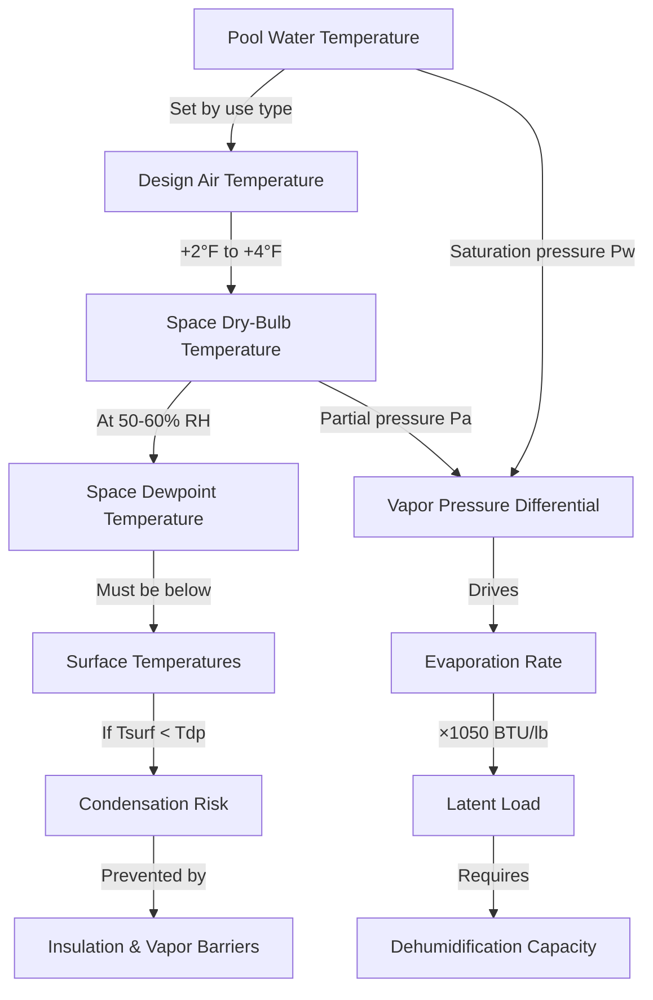

## Overview

Natatorium design conditions represent a critical balance between occupant comfort, energy efficiency, and structural protection. Unlike conventional HVAC applications, indoor pool environments demand precise control of air temperature, water temperature, and relative humidity to prevent condensation damage while maintaining swimmer comfort and minimizing evaporation rates.

The fundamental design challenge stems from the continuous evaporation of water from the pool surface, which introduces massive latent loads into the space. This evaporative process is governed by the vapor pressure differential between the water surface and the surrounding air, making the air-to-water temperature relationship the primary design parameter.

## Air Temperature Requirements

Space air temperature in natatoriums must be maintained above the pool water temperature to prevent uncomfortable cooling of swimmers as they exit the pool. The standard design relationship is:

$$T_{air} = T_{water} + 2°F \text{ to } 4°F$$

This temperature differential serves multiple functions. It reduces the evaporation rate from the pool surface by decreasing the vapor pressure gradient, provides thermal comfort for wet swimmers, and prevents condensation on interior surfaces when combined with proper humidity control.

For typical recreational pools with water temperatures of 78-82°F, this yields design air temperatures of 80-86°F. Competitive swimming facilities often maintain cooler water (76-78°F) for athletic performance, resulting in corresponding air temperatures of 78-82°F.

Maintaining air temperature below water temperature creates severe comfort problems. Swimmers emerging from the pool experience rapid evaporative cooling from their wet skin, producing the sensation of being cold despite relatively warm air temperatures. This condition also accelerates evaporation rates, increasing both latent loads and chemical treatment costs.

## Pool Water Temperature Design Values

Pool water temperature is determined primarily by the intended use and user demographics:

| Pool Type | Water Temperature | Air Temperature | Relative Humidity |
|-----------|-------------------|-----------------|-------------------|
| Competitive Swimming | 76-78°F | 78-82°F | 50-60% |
| Recreational Pool | 78-82°F | 80-86°F | 50-60% |
| Therapy/Rehabilitation | 86-92°F | 88-94°F | 50-60% |
| Diving Well | 80-82°F | 82-86°F | 50-60% |
| Children's Pool | 82-86°F | 84-88°F | 50-60% |
| Hotel/Resort Pool | 82-84°F | 84-88°F | 50-60% |

These values align with ASHRAE Handbook Applications Chapter 5 recommendations for natatorium design. The air-water differential remains consistent across pool types, adjusting the absolute temperature values based on the water setpoint.

## Relative Humidity Control

Relative humidity represents the most critical parameter for preventing condensation damage to the building envelope and mechanical systems. ASHRAE recommends maintaining natatorium relative humidity between 50-60% for optimal conditions.

The dewpoint temperature of the space air must remain below the temperature of all interior surfaces to prevent condensation. This relationship is expressed as:

$$T_{surface} > T_{dewpoint}$$

where $T_{dewpoint}$ is calculated from the space dry-bulb temperature and relative humidity using psychrometric relationships.

At 50% RH, a space maintained at 82°F has a dewpoint of approximately 61°F. All windows, structural elements, and ductwork surfaces must be maintained above this temperature through insulation, vapor barriers, or active heating.

Lower humidity levels (below 50%) reduce condensation risk but increase evaporation rates and can cause discomfort from excessive skin drying. Higher humidity levels (above 60%) create condensation risk, promote mold growth, and produce a "heavy" uncomfortable atmosphere.

## Psychrometric Relationships

The evaporation rate from a pool surface is governed by:

$$E = A \times F \times (P_w - P_a)$$

where:
- $E$ = evaporation rate (lb/hr)
- $A$ = pool surface area (ft²)
- $F$ = evaporation factor (function of air velocity and activity)
- $P_w$ = saturation vapor pressure at water temperature (in Hg)
- $P_a$ = partial vapor pressure of room air (in Hg)

This equation demonstrates why the air-water temperature differential and relative humidity are interdependent design parameters. Increasing air temperature reduces $(P_w - P_a)$ by raising $P_a$, thereby decreasing evaporation. Similarly, increasing relative humidity directly increases $P_a$, reducing the vapor pressure differential.

The latent heat associated with this evaporation is:

$$Q_{latent} = E \times h_{fg}$$

where $h_{fg}$ = 1,050 BTU/lb (latent heat of vaporization for water).

For a typical 2,000 ft² recreational pool with moderate activity, evaporation rates of 0.5-1.0 lb/hr/ft² are common, producing latent loads of 1-2 million BTU/hr that the dehumidification system must remove.

## Design Condition Selection Process

Selecting appropriate design conditions requires analysis of the specific facility requirements:

1. **Determine pool water temperature** based on primary use (competitive, recreational, therapeutic)
2. **Calculate air temperature** by adding 2-4°F to water temperature
3. **Set relative humidity** at 50-60% based on envelope construction and local climate
4. **Calculate dewpoint temperature** from air temperature and RH using psychrometric charts
5. **Verify all surfaces** exceed dewpoint temperature with appropriate safety margin (minimum 5°F)
6. **Calculate evaporation rate** using pool area, activity factor, and vapor pressure differential
7. **Size dehumidification equipment** to handle latent load plus outdoor air ventilation requirements

This systematic approach ensures that all interdependent parameters are properly coordinated and that the facility will operate without condensation issues while maintaining occupant comfort.

## Seasonal Variations

Many natatoriums implement seasonal setpoint adjustments to reduce energy consumption during unoccupied periods or shoulder seasons. However, humidity control must be maintained year-round to prevent condensation damage, even when the pool is not in active use. Reducing air temperature during unoccupied periods is acceptable only if the corresponding dewpoint remains safely below all surface temperatures.

