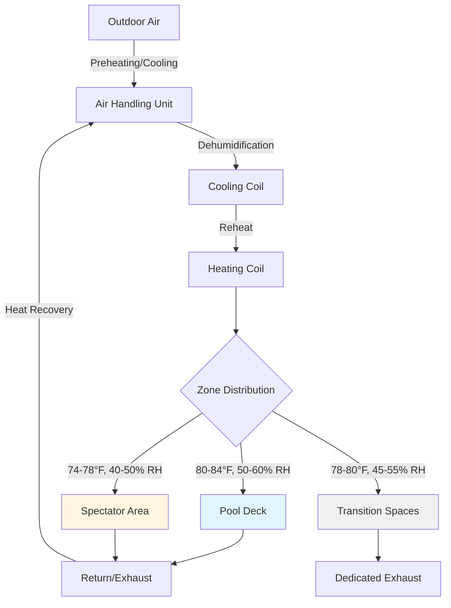
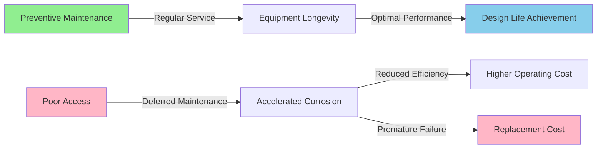

## Integrated Systems Approach

Natatorium HVAC design requires simultaneous optimization of multiple interacting variables. The high moisture generation rate from pool evaporation—ranging from 0.1 to 0.5 lbm/ft²·hr depending on activity level—creates conditions where thermal comfort, moisture control, and structural protection must be balanced. A systems-level approach prevents conflicts between zone requirements and ensures energy-efficient operation.

The fundamental challenge stems from the physics of evaporative cooling. Each pound of water evaporated from the pool surface absorbs approximately 1,050 BTU as latent heat, creating substantial cooling loads even in winter. This heat extraction must be replaced while simultaneously removing moisture to prevent condensation on building surfaces.

## Zone-Specific Design Requirements

### Pool Deck Conditions

The pool deck zone experiences the highest moisture loads and requires precise control to ensure occupant comfort while minimizing evaporation. ASHRAE Standard 62.1 recommends deck air temperatures 2-4°F above water temperature to reduce evaporative rates while maintaining thermal comfort for wet occupants.

**Temperature stratification** becomes critical in high-ceiling natatoriums. The buoyancy-driven flow of warm, humid air creates vertical temperature gradients described by:

$$\frac{dT}{dz} = \frac{g}{c_p} \left(1 - \frac{1}{\gamma}\right)$$

Where $g$ is gravitational acceleration, $c_p$ is specific heat at constant pressure, and $\gamma$ is the ratio of specific heats. For typical natatorium conditions, temperature differences of 10-15°F between deck level and ceiling are common without proper air circulation.

| Zone Parameter | Pool Deck | Spectator Area | Transition Space |
|----------------|-----------|----------------|------------------|
| Temperature | 80-84°F | 74-78°F | 78-80°F |
| Relative Humidity | 50-60% | 40-50% | 45-55% |
| Air Velocity | < 30 fpm | < 50 fpm | < 40 fpm |
| Dew Point | 60-65°F | 52-58°F | 56-62°F |

### Spectator Area Conditions

Spectator zones require conventional comfort conditions (74-78°F, 40-50% RH) distinct from pool deck requirements. The physical separation between these zones creates three design challenges:

1. **Pressure relationships** - Pool deck must maintain slight positive pressure (+0.02" to +0.05" w.c.) relative to spectator areas to prevent humid air migration
2. **Thermal boundary** - Temperature differential drives conductive heat transfer through dividing walls at rate $q = UA\Delta T$
3. **Moisture boundary** - Vapor pressure differential drives moisture migration through building assemblies

The vapor pressure difference between zones can be calculated:

$$\Delta p_v = p_{sat,deck} \cdot RH_{deck} - p_{sat,spec} \cdot RH_{spec}$$

For typical conditions (deck: 82°F/55% RH, spectator: 76°F/45% RH), this yields approximately 0.15" Hg vapor pressure difference, requiring effective vapor retarders in separating walls.

### Transition and Support Spaces

Locker rooms, corridors, and entry vestibules function as buffer zones. These spaces should maintain intermediate temperature and humidity conditions to minimize thermal shock when occupants transition between environments. Exhaust from locker rooms must be dedicated (not recirculated) due to contamination concerns per ASHRAE 62.1.

## Envelope Design for Moisture Control

Building envelope failures in natatoriums result from condensation on surfaces below the air dew point. The critical surface temperature threshold is:

$$T_{surface,min} = T_{dewpoint} + \Delta T_{safety}$$

Where $\Delta T_{safety}$ is typically 5-10°F to account for thermal bridging and local air circulation variations. For pool deck air at 82°F/55% RH (dew point 63°F), all envelope surfaces must maintain temperatures above 68-73°F.

### Thermal Bridge Mitigation

Common thermal bridges in natatorium envelopes include:

- **Steel structural members** - Thermal conductivity 26 BTU/hr·ft·°F creates direct conductive paths through insulation
- **Window frames** - Metal frames without thermal breaks reach outdoor temperatures
- **Foundation perimeters** - Concrete slab edges conduct heat to cold soil
- **Roof penetrations** - HVAC curbs, skylights, and structural connections

The heat transfer through a thermal bridge can be quantified using the linear thermal transmittance:

$$\Psi = \frac{Q_{2D} - \sum U_i \cdot A_i}{L}$$

Where $Q_{2D}$ is the actual heat flow through the junction, $U_i \cdot A_i$ represents one-dimensional heat flows through adjacent assemblies, and $L$ is the junction length.

### Vapor Retarder Strategy

Vapor control in natatorium envelopes requires careful attention to both diffusion and air leakage. The diffusive vapor flow rate through building assemblies follows:

$$\dot{m}_{vapor} = \frac{\Delta p_v}{\sum R_{vapor}}$$

Where $R_{vapor}$ is the vapor resistance of each material layer in perms. However, air leakage typically contributes 100-1000 times more moisture transport than diffusion, making air barrier continuity the primary design concern.

## Corrosion-Resistant Materials Selection

Chlorinated pool water creates an aggressive environment. Chlorine off-gassing produces hypochlorous acid (HOCl) and hydrochloric acid (HCl) vapors that accelerate corrosion of ferrous metals, aluminum, and copper. Corrosion rates increase exponentially with temperature and humidity according to:

$$r_{corr} = A \cdot e^{-E_a/RT} \cdot (RH)^n$$

Where $E_a$ is activation energy, $R$ is the gas constant, $T$ is absolute temperature, and $n$ is an empirical exponent (typically 2-3 for atmospheric corrosion).

### Material Selection by Component

| Component | Inappropriate Materials | Recommended Materials |
|-----------|------------------------|----------------------|
| Ductwork | Galvanized steel, aluminum | Stainless steel 316L, coated steel, fiberglass |
| Diffusers/Grilles | Aluminum, carbon steel | Stainless steel, ABS plastic, powder-coated aluminum |
| Piping | Copper (chlorine areas), black steel | PVC, CPVC, stainless steel, polymer-lined steel |
| Fasteners | Zinc-plated steel | Stainless steel 316, hot-dip galvanized |
| Structural Hangers | Galvanized steel | Stainless steel, epoxy-coated steel |
| AHU Components | Standard coils and pans | Coated coils, stainless drain pans |

Stainless steel 316L contains 2-3% molybdenum, providing superior resistance to chloride-induced pitting corrosion compared to 304 alloys.

## Equipment Accessibility and Maintenance

Dehumidification equipment in natatoriums requires frequent maintenance due to the corrosive environment. Design must provide:

**Access clearances** per manufacturer requirements (typically 36" minimum on service sides)
- Removable panels for coil cleaning without system disassembly
- Floor drains beneath all dehumidification equipment
- Lifting provisions for motor and compressor replacement
- Electrical disconnects within line-of-sight of equipment

The total cost of ownership for natatorium HVAC systems is heavily weighted toward maintenance and replacement. Accessibility during design prevents costly operational disruptions. Equipment positioned in hard-to-reach spaces experiences deferred maintenance, leading to efficiency degradation and premature failure.

## Design Integration Checklist

Successful natatorium HVAC design requires coordination across disciplines:

1. **Architectural** - Envelope insulation levels, vapor retarder placement, glazing specifications
2. **Structural** - Thermal break details at structural penetrations, support locations for heavy dehumidifiers
3. **Mechanical** - Zone separation, pressure control, corrosion-resistant materials
4. **Electrical** - Corrosion-resistant conduit and boxes, GFCI protection in wet areas
5. **Plumbing** - Pool water treatment impact on air quality, drain provision for condensate

The interconnected nature of moisture generation, thermal loads, and material durability demands early coordination to avoid conflicts during construction and operational problems post-occupancy.
