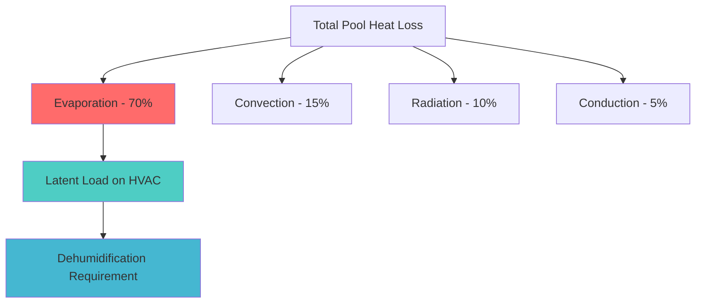
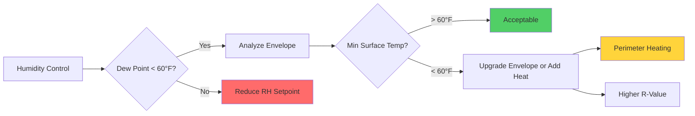

## Overview

Humidity control represents the most critical design parameter for natatorium HVAC systems. Unlike conventional occupied spaces, indoor swimming pools generate massive moisture loads through continuous water evaporation, requiring precise humidity management to prevent condensation damage, ensure occupant comfort, and protect building structures from corrosion.

## Design Humidity Range

### Target Conditions

ASHRAE Applications Handbook specifies the following humidity parameters for natatoriums:

| Parameter | Value | Rationale |
|-----------|-------|-----------|
| Relative Humidity (Design) | 50-60% | Balances evaporation control and comfort |
| Minimum RH | 40% | Prevents excessive evaporation and occupant discomfort |
| Maximum RH | 60% | Limits condensation risk on building surfaces |
| Design Dew Point | 55-60°F | Prevents condensation on typical glazing |
| Air Temperature | 2-4°F above water temperature | Minimizes evaporation while maintaining comfort |

The 50-60% RH range emerges from the intersection of multiple physical constraints. Below 50% RH, evaporation rates increase exponentially, leading to excessive water loss, chemical consumption, and energy waste. Above 60% RH, condensation risk on building envelope components becomes unacceptable, particularly on windows, metal structures, and exterior walls during cold weather.

## Evaporation Rate Calculations

### Carrier Equation

The fundamental relationship governing water evaporation from pool surfaces is the Carrier equation:

$$W = \frac{A \cdot Y \cdot (P_w - P_a)}{Y_p}$$

Where:
- $W$ = evaporation rate (lb/hr)
- $A$ = water surface area (ft²)
- $Y$ = activity factor (dimensionless)
- $P_w$ = saturation vapor pressure at water temperature (in. Hg)
- $P_a$ = partial vapor pressure of ambient air (in. Hg)
- $Y_p$ = latent heat factor (typically 1,050 BTU/lb at standard conditions)

### Activity Factors

| Pool Type | Unoccupied | Occupied | Whirlpool/Spa |
|-----------|------------|----------|---------------|
| Activity Factor (Y) | 0.5 | 1.0 | 1.5 |

These empirical factors account for surface agitation effects. Occupied pools experience doubled evaporation rates due to splashing, wave action, and increased surface area from disturbed water.

### Vapor Pressure Differential

The driving force for evaporation is the vapor pressure difference $(P_w - P_a)$. For a pool at 82°F with air at 84°F and 55% RH:

$$P_w = 1.10 \text{ in. Hg (saturated at 82°F)}$$

$$P_a = P_{sat,air} \times RH = 1.15 \times 0.55 = 0.63 \text{ in. Hg}$$

$$\Delta P = 1.10 - 0.63 = 0.47 \text{ in. Hg}$$

This vapor pressure gradient quantifies the thermodynamic potential for moisture transfer and directly determines dehumidification loads.

## Dehumidification Load Calculation

### Latent Heat Removal

The sensible and latent heat balance for a natatorium differs dramatically from conventional spaces:

The latent load dominates, accounting for approximately 70% of total heat loss from the pool water. This load converts directly to the dehumidification capacity requirement:

$$Q_{latent} = W \times h_{fg}$$

Where:
- $Q_{latent}$ = latent cooling load (BTU/hr)
- $W$ = evaporation rate from Carrier equation (lb/hr)
- $h_{fg}$ = latent heat of vaporization ≈ 1,050 BTU/lb at typical pool conditions

### Example Calculation

For a 1,500 ft² competitive pool operating at 82°F water temperature with 84°F air at 55% RH during occupied periods:

$$W = \frac{1500 \times 1.0 \times 0.47}{1} = 705 \text{ lb/hr}$$

$$Q_{latent} = 705 \times 1050 = 740,250 \text{ BTU/hr} \approx 62 \text{ tons}$$

This massive latent load necessitates dedicated dehumidification equipment, typically combining mechanical refrigeration with heat recovery to minimize energy consumption.

## Dew Point Control and Condensation Prevention

### Critical Surface Temperature Analysis

Condensation occurs when any surface temperature falls below the air dew point temperature. The critical relationship:

$$T_{surface} < T_{dew point} \rightarrow \text{Condensation}$$

For natatorium air at 84°F and 55% RH, the dew point is approximately 65°F. Any building surface below this temperature becomes a condensation site.

### Glazing Analysis

Windows represent the most vulnerable condensation locations. The interior surface temperature of glazing depends on:

$$T_{inside} = T_{room} - \frac{T_{room} - T_{outside}}{1 + \frac{U \cdot h_i}{h_o}}$$

Simplified for practical application with known U-factor:

$$T_{inside} \approx T_{room} - U(T_{room} - T_{outside}) \times R_{inside}$$

| Glazing Type | U-Factor (BTU/hr·ft²·°F) | Min. Outdoor Temp (°F) for No Condensation* |
|--------------|--------------------------|---------------------------------------------|
| Single pane | 1.10 | 54 |
| Double pane, air | 0.50 | 32 |
| Double pane, low-E | 0.30 | 12 |
| Triple pane, low-E, argon | 0.20 | -2 |

*Assumes 84°F indoor, 65°F dew point

This analysis reveals why single-pane glazing is never acceptable in natatoriums except in tropical climates. Even double-pane units require low-E coatings for condensation-free operation in temperate zones.

### Condensation Control Strategy

## Corrosion Prevention Through Humidity Control

### Chlorine Off-Gassing and Corrosivity

Pool water treatment chemicals, particularly chlorine compounds, volatilize into the air. The corrosion rate of metals in chlorinated natatorium environments increases exponentially with relative humidity:

$$\text{Corrosion Rate} \propto RH^{2.5} \times [\text{Cl}_2]$$

This nonlinear relationship explains why maintaining RH below 60% provides dramatic protection for structural steel, HVAC equipment, and electrical components.

| Material | Max RH for 20-Year Service Life | Protection Method |
|----------|--------------------------------|-------------------|
| Carbon steel (uncoated) | 45% | Not recommended |
| Galvanized steel | 55% | Standard for ductwork |
| Stainless steel (304) | 60% | Preferred for diffusers |
| Stainless steel (316) | 70% | Pool equipment, louvers |
| Aluminum (anodized) | 65% | Structural applications |

High humidity environments accelerate chloride-induced pitting corrosion. Maintaining design humidity at 50-55% rather than allowing drift to 60% can double equipment service life.

## Occupant Comfort Considerations

### Psychrometric Comfort Zone

Human thermal comfort in aquatic facilities differs from dry environments due to wet skin conditions:

$$PMV = f(T_{air}, RH, v_{air}, T_{radiant}, M_{metabolic}, I_{clothing})$$

For minimally clothed natatorium occupants (swimmers, spectators in swimwear):
- Optimal comfort: 82-86°F air, 50-60% RH
- High humidity (>65%) at these temperatures creates oppressive conditions
- Low humidity (<45%) causes excessive evaporative cooling from wet skin, perceived as cold drafts

The narrow acceptable range necessitates robust humidity control with minimal deviation.

## Design Recommendations

1. **Primary Dehumidification**: Size equipment for occupied activity factor with 20% safety margin
2. **Dew Point Setpoint**: Control to 58°F maximum to provide 7°F safety margin for typical double-pane glazing
3. **Envelope Design**: Specify glazing U-factors based on winter design temperature and 60°F dew point criterion
4. **Ventilation Integration**: Balance ASHRAE 62.1 outdoor air requirements with dehumidification capacity—excess ventilation during humid weather increases latent loads
5. **Material Selection**: Specify corrosion-resistant materials rated for continuous 60% RH chlorinated environment exposure

Proper humidity control in natatoriums requires integrated analysis of thermodynamics, psychrometrics, building science, and materials engineering. The 50-60% RH design range represents the optimized solution balancing evaporation control, condensation prevention, equipment longevity, and occupant comfort.
