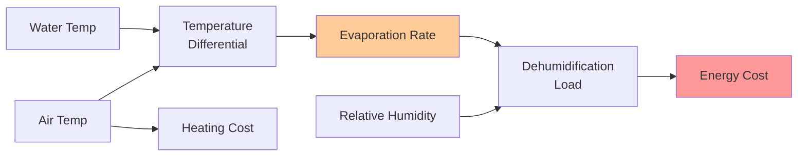

## Overview

Natatorium temperature control requires precise coordination between air and water temperatures to minimize evaporation, ensure occupant comfort, and maintain structural integrity. The fundamental principle involves maintaining space air temperature 2-4°F above pool water temperature, creating a slight vapor pressure gradient that reduces evaporation while providing thermal comfort for wet occupants.

## Thermodynamic Basis for Temperature Differential

The evaporation rate from a pool surface follows the mass transfer relationship:

$$\dot{m}_e = h_m \cdot A \cdot (W_s - W_a)$$

Where:
- $\dot{m}_e$ = evaporation rate (lb/hr)
- $h_m$ = mass transfer coefficient (lb/hr·ft²)
- $A$ = pool surface area (ft²)
- $W_s$ = humidity ratio at water surface (lb/lb)
- $W_a$ = humidity ratio of air (lb/lb)

The humidity ratio at the water surface is determined by saturated conditions at water temperature. When air temperature drops below water temperature, the vapor pressure differential $(W_s - W_a)$ increases dramatically, accelerating evaporation. This creates three critical problems:

1. **Energy Loss**: Each pound of evaporated water carries approximately 1,050 BTU of latent heat
2. **Humidity Load**: The HVAC system must remove the evaporated moisture
3. **Occupant Discomfort**: Evaporative cooling creates cold drafts at the pool surface

Maintaining air temperature 2-4°F above water temperature reduces the vapor pressure differential by 15-25%, significantly decreasing evaporation rates.

## Pool Water Temperature Standards by Application

Different pool applications require specific water temperatures based on activity intensity and duration:

| Pool Type | Water Temperature | Air Temperature | Rationale |
|-----------|------------------|-----------------|-----------|
| Competition | 78-80°F | 80-84°F | Lower temp reduces cardiovascular strain during intense exercise |
| Recreational | 82-84°F | 84-88°F | Comfortable for moderate activity and extended immersion |
| Therapy | 90-95°F | 92-99°F | Elevated temp promotes muscle relaxation and circulation |
| Diving | 80-82°F | 82-86°F | Cooler water preferred for explosive athletic movements |
| Leisure | 84-86°F | 86-90°F | Warmer temp for passive enjoyment and families |
| Lap Swimming | 78-82°F | 80-86°F | Moderate temp balances comfort with performance |

### Temperature Selection Methodology

Water temperature selection follows metabolic heat generation principles. The human body at rest produces approximately 400 BTU/hr. During vigorous swimming, metabolic rate increases to 1,500-2,000 BTU/hr. Heat transfer from the body to water follows:

$$q = h_c \cdot A_b \cdot (T_{skin} - T_{water})$$

Where:
- $q$ = heat transfer rate (BTU/hr)
- $h_c$ = convective heat transfer coefficient (BTU/hr·ft²·°F)
- $A_b$ = body surface area (typically 20 ft²)
- $T_{skin}$ = skin temperature (approximately 92°F)

For competitive swimmers generating high metabolic heat, water temperatures of 78-80°F provide sufficient heat rejection. Therapy pools at 90-95°F minimize heat loss, keeping muscles warm and promoting blood flow.

## Air Temperature Control Strategy

The air temperature setpoint must account for three factors:

1. **Evaporation Control**: Maintain 2-4°F above water temperature
2. **Occupant Comfort**: Address the cooling effect of evaporation on wet skin
3. **Structural Protection**: Prevent condensation on building surfaces

```mermaid
graph TD
    A[Pool Water Temperature<br/>Setpoint] --> B{Activity Type}
    B -->|Competition| C[78-80°F Water]
    B -->|Recreation| D[82-84°F Water]
    B -->|Therapy| E[90-95°F Water]
    C --> F[Air: +2 to +4°F]
    D --> F
    E --> F
    F --> G[Final Air Temperature<br/>Setpoint]
    G --> H{Verify Conditions}
    H --> I[Check Dewpoint vs<br/>Surface Temps]
    I -->|Condensation Risk| J[Increase Air Temp or<br/>Decrease RH]
    I -->|Safe| K[Implement Setpoint]
```

### Wet Occupant Thermal Comfort

A person exiting a pool experiences significant evaporative cooling. The heat loss from evaporation is:

$$q_{evap} = \dot{m}_{water} \cdot h_{fg}$$

Where:
- $\dot{m}_{water}$ = water evaporation rate from skin (lb/hr)
- $h_{fg}$ = latent heat of vaporization (1,050 BTU/lb at 80°F)

A thin water film on skin (approximately 0.01 lb) evaporating over 2-3 minutes represents 300-500 BTU of cooling. To compensate, air temperature must be elevated above typical comfort zones. The effective temperature for a wet occupant is approximately 5-7°F lower than the actual air temperature due to evaporative cooling.

This explains why natatorium air temperatures of 82-88°F feel comfortable to wet occupants, whereas the same temperature would be uncomfortably warm in a dry environment.

## Temperature Differential and Evaporation Control

The relationship between temperature differential and evaporation rate is quantified through the Carrier equation for pool evaporation:

$$E = 0.1 \cdot A \cdot (p_w - p_a) \cdot (1 + 0.2 \cdot V)$$

Where:
- $E$ = evaporation rate (lb/hr)
- $A$ = pool surface area (ft²)
- $p_w$ = vapor pressure at water surface (in Hg)
- $p_a$ = vapor pressure of air (in Hg)
- $V$ = air velocity over water surface (ft/min ÷ 100)

Vapor pressure increases exponentially with temperature according to the Antoine equation. A 4°F decrease in air temperature below water temperature can increase $(p_w - p_a)$ by 20-30%, directly increasing evaporation rate.

## Design Implementation per ASHRAE

ASHRAE Handbook—HVAC Applications recommends:

- **Space Temperature**: 2-4°F above water temperature
- **Relative Humidity**: 50-60% for comfort and condensation control
- **Air Velocity**: Maximum 30 ft/min over pool surface when unoccupied
- **Ventilation**: Per ASHRAE 62.1, minimum 0.48 cfm/ft² of pool area

Temperature control systems should incorporate:

1. **Dewpoint Monitoring**: Maintain dewpoint at least 2-3°F below coldest surface temperature
2. **Staging**: Gradual temperature adjustment to prevent condensation transients
3. **Setback Limitations**: Maximum 5°F setback during unoccupied periods to control humidity

## Temperature Control Optimization

Energy-efficient operation requires balancing multiple variables:

Optimal performance typically occurs at:
- Minimum acceptable air-water differential (2°F) to reduce heating energy
- Maximum acceptable relative humidity (60%) to reduce dehumidification energy
- Precise control (±1°F) to prevent oscillation-induced comfort issues

The energy impact is substantial. Each 1°F increase in air temperature adds approximately 3-5% to space heating load, while each 1°F decrease in air-water differential can reduce evaporation load by 5-8%.

## Conclusion

Natatorium temperature requirements stem from the physics of evaporative mass transfer and thermal comfort for wet occupants. The 2-4°F air-water temperature differential represents an engineering compromise that minimizes evaporation while maintaining comfort and preventing structural condensation. Proper implementation requires careful coordination of water temperature selection based on pool use, precise air temperature control, and continuous monitoring of dewpoint conditions.
