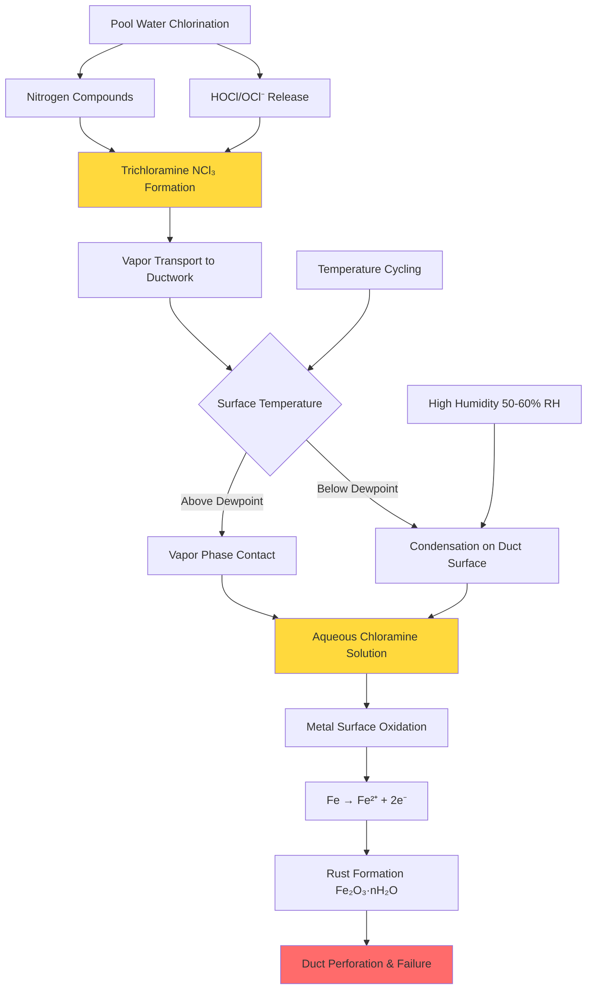

Natatorium ductwork operates in the most corrosive HVAC environment due to the combined effects of high humidity (typically 50-60% RH), elevated chlorine and chloramine concentrations, and continuous temperature cycling. Conventional galvanized steel ductwork fails rapidly in these conditions, with complete degradation possible within 2-5 years. Proper material selection and corrosion protection are critical for system longevity and air quality.

## Corrosion Mechanisms in Pool Environments

Chlorinated pool water releases hypochlorous acid (HOCl) and hypochlorite ions (OCl⁻) into the air. When combined with nitrogen compounds from swimmer waste, these form trichloramine (NCl₃), a highly corrosive gas that condenses on cool duct surfaces. The corrosion process accelerates when dewpoint conditions occur within ductwork.

## Corrosion Rate Factors

The corrosion rate for ferrous metals in natatorium environments depends on chloramine concentration, relative humidity, and surface temperature:

$$
CR = k \cdot [NCl_3]^{0.8} \cdot (RH)^{1.5} \cdot e^{-\frac{E_a}{RT_s}}
$$

Where:
- $CR$ = corrosion rate (mils/year)
- $k$ = material-specific constant
- $[NCl_3]$ = trichloramine concentration (mg/m³)
- $RH$ = relative humidity (fraction)
- $E_a$ = activation energy for corrosion reaction (J/mol)
- $R$ = universal gas constant (8.314 J/mol·K)
- $T_s$ = surface temperature (K)

For galvanized steel in typical natatorium conditions ([NCl₃] = 0.3-0.5 mg/m³, RH = 0.55, T_s = 20°C), corrosion rates range from 15-40 mils/year, resulting in failure of 22-gauge ductwork within 2-4 years.

## Ductwork Material Selection

Material selection must balance corrosion resistance, structural strength, and cost. ASHRAE Applications Handbook Chapter 6 and SMACNA guidelines recommend avoiding ferrous metals for natatorium applications.

| Material | Corrosion Resistance | Cost Factor | Structural Strength | Service Life | Notes |
|----------|---------------------|-------------|---------------------|--------------|-------|
| Galvanized Steel | Poor | 1.0× | Excellent | 2-5 years | Not recommended; rapid failure |
| Epoxy-Coated Steel | Fair | 1.8× | Excellent | 5-8 years | Coating damage at joints/seams |
| Aluminum (5052/6061) | Good | 2.2× | Good | 12-20 years | Pitting with chloride >0.5 mg/m³ |
| 304 Stainless Steel | Very Good | 3.5× | Excellent | 20-30 years | Crevice corrosion at fasteners |
| 316 Stainless Steel | Excellent | 4.8× | Excellent | 30+ years | Best metallic option |
| Fiberglass (FRP) | Excellent | 2.8× | Fair | 25-35 years | Requires external bracing |
| PVC/CPVC Schedule 40 | Excellent | 2.5× | Poor | 20-30 years | Limited to low-velocity applications |

**Cost factors are relative to galvanized steel installed cost per square foot of duct surface.**

## Material Selection Criteria

The resistance factor for material selection combines chemical resistance, mechanical properties, and thermal performance:

$$
R_f = \frac{(C_r \cdot M_s)}{(C_i \cdot T_e)} \cdot \eta_{fab}
$$

Where:
- $R_f$ = resistance factor (higher is better)
- $C_r$ = chemical resistance rating (1-10 scale)
- $M_s$ = mechanical strength ratio vs. galvanized steel
- $C_i$ = installed cost ratio
- $T_e$ = thermal expansion coefficient ratio
- $\eta_{fab}$ = fabrication difficulty factor (0.6-1.0)

For natatoriums, target $R_f > 2.0$ for supply ductwork and $R_f > 2.5$ for exhaust ductwork carrying the highest chloramine concentrations.

## Coating Systems for Steel Ductwork

When economic constraints require steel ductwork, multi-layer coating systems extend service life. SMACNA's "HVAC Systems - Duct Design" specifies coating requirements for corrosive environments.

**Effective coating systems:**

1. **Epoxy-Phenolic Fusion Bonded**
   - Dry film thickness: 12-16 mils
   - Application: Factory-applied powder coating
   - Service life: 8-12 years with proper joint sealing
   - Critical: All field cuts and joints require field coating repair

2. **Polyamide Epoxy**
   - Wet film thickness: 10-12 mils (two coats)
   - Application: Spray or brush-applied
   - Service life: 6-10 years
   - Requires surface preparation to SSPC-SP6 (commercial blast)

3. **Vinyl Ester Resin**
   - Wet film thickness: 15-20 mils
   - Application: Shop-applied with heat cure
   - Service life: 10-15 years
   - Excellent chloramine resistance

**All coating systems fail at unsealed joints, penetrations, and fastener locations.** Field-applied sealants compatible with the coating system are mandatory at all connections.

## Design Recommendations

**Supply Ductwork:**
- Minimum: Aluminum 5052 or fiberglass-reinforced plastic (FRP)
- Preferred: 304 stainless steel for long-term reliability
- Insulation: External with vapor barrier to prevent condensation
- Velocity: ≤2000 fpm to minimize coating erosion

**Exhaust Ductwork:**
- Minimum: FRP or PVC for low-pressure systems
- Preferred: 316 stainless steel with welded seams
- Critical: First 20-30 feet from pool area experiences highest chloramine exposure
- Slope: 1/4" per foot minimum to drain condensate, with drain provisions every 20 feet

**Fasteners and Supports:**
- Use 316 stainless steel for all fasteners, hangers, and supports
- Avoid dissimilar metal contact (use isolation bushings)
- Thread sealants must be chlorine-resistant (e.g., PTFE-based)

**Joint Sealing:**
- All longitudinal and transverse joints require sealant compatible with duct material
- Silicone or polyurethane sealants rated for continuous moisture exposure
- Minimum 1/4" sealant bead at all S-slips and drives

## Inspection and Maintenance

Visual inspection of natatorium ductwork should occur every 6 months, focusing on:
- Joint integrity and sealant condition
- Surface rust or white corrosion products (aluminum)
- Coating adhesion and damage
- Condensate staining indicating dewpoint conditions

Annual air quality testing for chloramines provides early warning of system degradation. Concentrations >0.5 mg/m³ indicate inadequate ventilation or ductwork leakage allowing return of contaminated air.

SMACNA's "Accepted Industry Practices for Sheet Metal Lagging" provides guidelines for protective coating inspection and repair procedures specific to corrosive environments.

## Conclusion

Natatorium ductwork corrosion protection requires a systems approach: appropriate material selection, proper insulation to prevent condensation, effective sealing to prevent leakage, and regular inspection. While initial costs for corrosion-resistant materials are 2.5-5× higher than galvanized steel, the 20-30 year service life and elimination of premature replacement costs provide strong economic justification. For critical applications, 316 stainless steel or fiberglass ductwork represents the most reliable long-term solution.
