Design considerations for natatorium ductwork extend beyond material selection to encompass drainage provisions, access points, joint sealing, and support systems that collectively prevent corrosion damage. Proper design mitigates the dual threats of external condensation and internal moisture accumulation in the chloramine-laden environment.

## Drainage Provisions and Slope Requirements

Ductwork in natatoriums must eliminate standing water and condensate, which accelerates corrosion when combined with chloramines. SMACNA guidelines recommend minimum duct slopes of 1:200 (0.5%) toward drainage points for horizontal runs.

**Drainage design calculations:**

$$Q_d = \frac{A \cdot V \cdot \Delta T \cdot h_{fg}}{c_p \cdot (T_s - T_{dp})}$$

Where:
- $Q_d$ = condensate drainage rate (lb/h)
- $A$ = exterior duct surface area (ft²)
- $V$ = air velocity (fpm)
- $\Delta T$ = temperature differential (°F)
- $h_{fg}$ = latent heat of vaporization (BTU/lb)
- $c_p$ = specific heat of air (BTU/lb·°F)
- $T_s$ = surface temperature (°F)
- $T_{dp}$ = dewpoint temperature (°F)

**Velocity limits for corrosive environments:**

$$v_{max} = \sqrt{\frac{2 \cdot \Delta P \cdot \rho}{f \cdot L/D}}$$

Where:
- $v_{max}$ = maximum velocity (ft/s)
- $\Delta P$ = allowable pressure drop (in. wg)
- $\rho$ = air density (lb/ft³)
- $f$ = friction factor (dimensionless)
- $L/D$ = duct aspect ratio

ASHRAE Applications Handbook (Chapter 6) limits duct velocities to 2000-2500 fpm in natatorium supply systems to minimize erosion-corrosion at fittings and to prevent moisture re-entrainment from drainage points.

## Corrosion-Resistant Duct Design Features

```mermaid
graph TD
    A[Natatorium Duct System] --> B[Drainage Design]
    A --> C[Access Provisions]
    A --> D[Joint Sealing]
    A --> E[Support Protection]

    B --> B1[1:200 Min Slope]
    B --> B2[Drain Pans at Low Points]
    B --> B3[Trap Primers]
    B --> B4[Positive Drainage]

    C --> C1[Access Doors Every 20 ft]
    C --> C2[Inspection Ports]
    C --> C3[Corrosion-Resistant Frames]
    C --> C4[Gasketed Seals]

    D --> D1[Welded Seams Preferred]
    D --> D2[Sealed Mechanical Joints]
    D --> D3[Non-Hygroscopic Sealants]
    D --> D4[Continuous Weld Inspection]

    E --> E1[Coated Support Brackets]
    E --> E2[Isolation Pads]
    E --> E3[Stainless Hardware]
    E --> E4[Galvanic Protection]

    style A fill:#e1f5ff
    style B fill:#fff4e1
    style C fill:#ffe1f5
    style D fill:#e1ffe7
    style E fill:#f5e1ff
```

## Access Panel and Inspection Port Design

Access doors serve dual purposes in natatorium ductwork: enabling corrosion inspection and facilitating cleaning of chloramine deposits. SMACNA standards for access panel placement:

- Minimum one access door per 20 ft of horizontal duct run
- Access doors at all low points with drainage provisions
- Access upstream and downstream of coils and filters
- Minimum 12" × 12" for inspection; 18" × 18" for entry

Access door frames and hardware must resist corrosion:
- Type 316 stainless steel frames and fasteners
- EPDM or silicone gaskets (not neoprene)
- External latches with corrosion-resistant coatings
- Removable from outside without disturbing seals

## Joint Sealing and Connection Design

Joint integrity prevents chloramine infiltration into duct insulation and wall cavities. Sealing hierarchy for natatorium applications:

1. **Welded joints** (preferred): Continuous TIG or MIG welds for PVC-coated, stainless steel, or aluminum ductwork
2. **Mechanical joints**: Sealed with non-hardening, non-hygroscopic mastics
3. **Flanged connections**: Gasketed with EPDM or silicone gaskets, not cork or fiber materials

**Static pressure considerations in sealed systems:**

$$\Delta P_{seal} = \frac{f \cdot L \cdot \rho \cdot v^2}{2 \cdot D \cdot g_c} + K \cdot \frac{\rho \cdot v^2}{2 \cdot g_c}$$

Where:
- $\Delta P_{seal}$ = pressure drop across sealed joint (in. wg)
- $K$ = joint loss coefficient (0.05-0.15 for sealed joints)
- $g_c$ = gravitational constant (32.2 ft/s²)

Excessive static pressure from over-sealing can stress joints and create leakage points. Design target: joint leakage < 1% at operating pressures per SMACNA Seal Class A.

## Design Approaches by Corrosion Severity

| Corrosion Level | Duct Material | Joint Type | Access Frequency | Drainage Slope | Coating System |
|-----------------|---------------|------------|------------------|----------------|----------------|
| **Mild** (< 1 ppm chloramines) | PVC-coated galvanized | Sealed mechanical | Every 30 ft | 1:200 (0.5%) | Single-coat epoxy exterior |
| **Moderate** (1-3 ppm) | Type 304 stainless | Welded or gasketed flanges | Every 20 ft | 1:150 (0.67%) | Dual-coat epoxy or phenolic |
| **Severe** (> 3 ppm) | Type 316 stainless or FRP | Continuously welded | Every 15 ft | 1:100 (1%) | Triple-coat phenolic interior/exterior |
| **Extreme** (competitive pools) | FRP or AL6XN alloy | Fusion-welded FRP | Every 10 ft | 1:80 (1.25%) | Integral FRP or fluoropolymer liner |

## Support System Corrosion Protection

Ductwork supports create galvanic coupling risks and condensation concentration points. Protection strategies:

- **Isolation**: EPDM or neoprene pads between duct and support
- **Material compatibility**: Match support material to duct (316 SS supports for 316 SS duct)
- **Coating**: Hot-dip galvanized or epoxy-coated carbon steel supports with minimum 4 mils DFT
- **Hardware**: Type 316 stainless steel bolts, threaded rods, and fasteners

Support spacing must account for moisture weight in addition to standard loads. SMACNA recommends reducing standard hanger spacing by 25% for natatorium applications where condensate accumulation is possible.

## Condensate Management

Low points require drain pans fabricated from corrosion-resistant materials (Type 316 SS or PVC) with trapped connections to sanitary drains. Trap primers prevent seal loss during dry periods. Size drain connections for 150% of calculated condensate rate to prevent overflow during peak dehumidification loads.

ASHRAE Applications Handbook Chapter 6 provides psychrometric methods for calculating condensate generation rates based on outdoor air intake, space conditions, and duct surface temperatures.

## Corrosion Monitoring Integration

Design must incorporate corrosion monitoring points:
- Removable coupons at representative locations
- Ultrasonic thickness measurement access points
- Visual inspection ports at high-risk areas (fittings, transitions)
- Documentation of baseline thickness measurements

Monitoring frequency: quarterly for first year, then annually if corrosion rates remain below design thresholds (< 2 mils/year for coated systems, < 0.5 mils/year for stainless steel).

## References

- SMACNA HVAC Systems Duct Design, 4th Edition: Natatorium ductwork specifications
- ASHRAE Handbook—Applications, Chapter 6: Natatorium HVAC design guidance
- SMACNA Architectural Sheet Metal Manual: Access door and drainage detail standards
