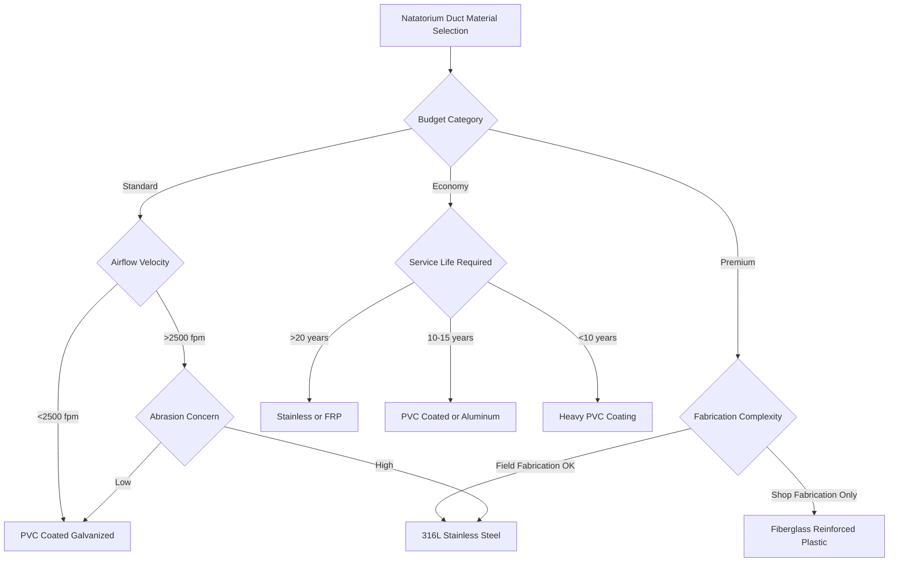

Ductwork material selection for natatoriums represents one of the most critical engineering decisions in indoor pool HVAC systems. Unlike standard commercial applications, natatorium ductwork must withstand continuous exposure to chlorinated air with relative humidity levels between 50-60%, creating an aggressively corrosive environment that rapidly degrades conventional galvanized steel systems.

## Corrosion Mechanisms in Natatorium Environments

The primary corrosion driver in indoor pool facilities is the formation of hypochlorous acid (HClO) and hydrochloric acid (HCl) when chlorine compounds react with moisture in the air. The corrosion rate for ferrous metals in this environment follows:

$$C_r = k \cdot [\text{Cl}_2]^{0.6} \cdot (\text{RH})^{1.8} \cdot e^{-E_a/RT}$$

Where:
- $C_r$ = corrosion rate (mils/year)
- $k$ = material-specific constant
- $[\text{Cl}_2]$ = chlorine concentration (ppm)
- $\text{RH}$ = relative humidity (decimal)
- $E_a$ = activation energy
- $R$ = gas constant
- $T$ = absolute temperature (K)

Standard galvanized steel ductwork typically fails within 3-7 years in natatorium applications, making material selection essential for long-term system viability.

## Material Selection Decision Framework

## Material Comparison Matrix

| Material | Chemical Resistance | Initial Cost | Fabrication | Maintenance | Service Life | SMACNA Rating |
|----------|---------------------|--------------|-------------|-------------|--------------|---------------|
| **316L Stainless Steel** | Excellent | $$$$ | Standard sheet metal | Minimal | 30+ years | Excellent |
| **Fiberglass Reinforced Plastic (FRP)** | Excellent | $$$ | Specialized shop | Minimal | 25-30 years | Excellent |
| **PVC Coated Galvanized (Heavy)** | Very Good | $$ | Modified standard | Periodic inspection | 15-20 years | Good |
| **5052 Aluminum** | Good | $$$ | Standard sheet metal | Regular inspection | 15-20 years | Fair |
| **PVC Ductboard** | Excellent | $ | Shop fabrication | Structural monitoring | 20-25 years | Good |
| **Fabric Duct (Antimicrobial)** | Good | $$ | Specialized | Periodic replacement | 10-15 years | Limited |

## Engineering Selection Criteria

### 316L Stainless Steel

Austenitic stainless steel with low carbon content provides superior resistance to chloride-induced stress corrosion cracking. The chromium oxide passive layer remains stable across the typical natatorium pH range (7.2-7.8):

$$\text{PREN} = \%\text{Cr} + 3.3(\%\text{Mo}) + 16(\%\text{N})$$

For 316L: PREN ≈ 24-26, providing excellent pitting resistance.

**Applications**: Supply and return ductwork, high-velocity systems (>3000 fpm), outdoor air intakes
**Fabrication**: Standard SMACNA construction methods apply; TIG welding preferred for seams
**Limitations**: Highest initial cost; requires stainless steel fasteners and support hardware

### Fiberglass Reinforced Plastic (FRP)

Thermoset polyester or vinyl ester resin systems reinforced with glass fiber mats offer complete immunity to chlorine corrosion. The material exhibits essentially zero moisture absorption:

$$\alpha_{\text{moisture}} < 0.1\%$$

**Applications**: Main supply/return trunks, dehumidification unit connections, exhaust systems
**Fabrication**: Shop-fabricated with hand lay-up or filament winding; field joints use mechanical couplings
**Limitations**: Limited to lower velocities (<2500 fpm); requires specialized labor; UV degradation if exposed to sunlight

### PVC Coated Galvanized Steel

Hot-dip galvanized steel with 10-20 mil plastisol PVC coating provides cost-effective corrosion protection when coating integrity is maintained:

$$t_{\text{coating}} \geq 15 \text{ mils for ASHRAE Applications Manual compliance}$$

**Applications**: Low-to-medium velocity systems, branch ductwork, above-ceiling installations
**Fabrication**: Modified SMACNA methods; coating repair required at all cut edges and penetrations
**Limitations**: Coating damage during installation compromises protection; requires inspection protocol

### Aluminum Alloys

5052-H32 aluminum offers moderate corrosion resistance through protective oxide formation. Performance depends on chloride concentration limits:

$$[\text{Cl}^-] < 50 \text{ ppm for acceptable corrosion rates}$$

**Applications**: Limited to low-chlorine environments or short duct runs
**Fabrication**: Standard sheet metal techniques; avoid galvanic contact with dissimilar metals
**Limitations**: Pitting corrosion risk increases with humidity; not recommended for primary systems

## ASHRAE and SMACNA Guidelines

ASHRAE Applications Handbook (Chapter 6: Natatoriums) specifies material selection criteria based on exposure severity:

**Zone 1 (Direct Pool Area)**: FRP or 316L stainless steel only
**Zone 2 (Within 30 ft of pool)**: PVC coated (heavy), FRP, or stainless steel
**Zone 3 (Remote mechanical rooms)**: Coated galvanized acceptable with monitoring

SMACNA *HVAC Systems Duct Design* recommends corrosion allowance factors for material thickness calculations in chlorinated environments:

$$t_{\text{design}} = t_{\text{standard}} \cdot (1 + C_f)$$

Where $C_f$ = 0.3-0.5 for natatorium applications.

## Life Cycle Cost Considerations

While stainless steel and FRP command 2.5-4× the initial cost of coated galvanized systems, life cycle analysis consistently favors corrosion-resistant materials:

$$\text{LCC} = C_{\text{initial}} + \sum_{t=1}^{n} \frac{C_{\text{maint},t} + C_{\text{replacement},t}}{(1+r)^t}$$

For a typical 10,000 CFM natatorium system over 20 years, stainless steel or FRP systems show 30-45% lower LCC compared to multiple coated galvanized replacements.

## Specification Best Practices

1. **Specify alloy grade explicitly**: "316L stainless steel" not "stainless steel"
2. **Require coating thickness verification**: Minimum 15 mils for PVC systems
3. **Detail field repair procedures**: All coating systems need documented repair protocols
4. **Specify hardware compatibility**: Use same material or compatible alloys for supports and fasteners
5. **Include inspection requirements**: Annual coating integrity checks for non-metallic protective systems

Material selection establishes the foundation for reliable long-term natatorium HVAC performance. The aggressive chlorinated environment eliminates conventional materials as viable options, necessitating engineering analysis to balance initial cost against service life and maintenance requirements.
