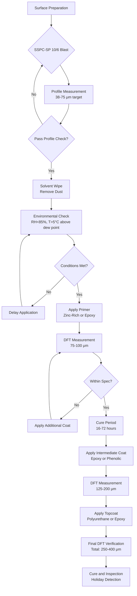

## Protective Coatings for Natatorium Ductwork

Protective coating systems represent the primary defense mechanism against chloride-induced corrosion in natatorium ductwork. The aggressive chemical environment—characterized by chlorine gas concentrations of 0.5-2.0 ppm, chloramine vapors, and relative humidity exceeding 60%—demands coating systems engineered for chemical resistance, adhesion stability, and long-term impermeability.

## Coating System Selection Criteria

Selection of protective coatings requires evaluation of multiple performance parameters:

**Chemical Resistance**: Coatings must withstand continuous exposure to chlorine, hypochlorous acid (HOCl), and chloramines without degradation, blistering, or loss of adhesion.

**Permeability**: Low water vapor transmission rates prevent substrate corrosion. Film thickness and cross-link density govern permeability characteristics.

**Thermal Stability**: Operating temperatures in dehumidification systems range from -5°C to 65°C. Coating systems must maintain integrity across this temperature spectrum without cracking or delamination.

**Mechanical Properties**: Coatings require sufficient flexibility to accommodate thermal expansion (coefficient α = 12-17 × 10⁻⁶ /°C for steel) and mechanical stress from airflow-induced vibration.

## Coating Type Comparison

| Coating Type | Dry Film Thickness (DFT) | Chemical Resistance | Service Temperature | Recoat Window | Relative Cost |
|--------------|-------------------------|---------------------|---------------------|---------------|---------------|
| Epoxy (2-part) | 125-250 μm (5-10 mils) | Excellent to chlorine/alkaline | -20°C to 120°C | 24-72 hours | Moderate |
| Polyurethane (aliphatic) | 75-150 μm (3-6 mils) | Good, UV stable | -30°C to 90°C | 16-48 hours | Moderate-High |
| Zinc-Rich Epoxy (primer) | 75-100 μm (3-4 mils) | Excellent (sacrificial) | -20°C to 65°C | 48 hours max | High |
| Phenolic Epoxy | 200-400 μm (8-16 mils) | Superior to acids/chlorine | -10°C to 200°C | 24-96 hours | High |

## Surface Preparation Requirements

Coating performance correlates directly with surface preparation quality. SSPC-SP standards define preparation protocols:

**SSPC-SP 10 (Near-White Blast)**: Remove all visible rust, mill scale, and coatings to achieve 95% clean surface. Required for immersion or severe chemical exposure conditions.

**SSPC-SP 6 (Commercial Blast)**: Minimum standard for natatorium ductwork, removes 67% of surface contamination. Surface profile depth: 38-75 μm (1.5-3.0 mils).

**Surface Profile Measurement**: Anchor pattern depth must correlate with coating thickness:

$$
t_{\text{profile}} = 0.25 \times t_{\text{coating}}
$$

where $t_{\text{profile}}$ is the surface profile depth and $t_{\text{coating}}$ is the specified dry film thickness.

**Cleanliness Verification**: Chloride contamination must not exceed 7 μg/cm² (Bresle method, ISO 8502-6). Oil and grease removal per SSPC-SP 1 solvent cleaning precedes abrasive blasting.

## Coating Application Process

## Coating Thickness Calculations

Total system thickness follows the multi-coat principle where each layer provides specific functionality:

$$
DFT_{\text{total}} = DFT_{\text{primer}} + DFT_{\text{intermediate}} + DFT_{\text{topcoat}}
$$

For severe natatorium environments, specify:
- Primer: 75-100 μm
- Intermediate: 125-150 μm
- Topcoat: 75-100 μm
- **Total: 275-350 μm (11-14 mils)**

**Coverage Rate Calculation**: Theoretical coverage depends on volume solids (VS) content:

$$
\text{Coverage (m}^2\text{/L)} = \frac{VS \times 10}{DFT_{\mu m}}
$$

Example: Epoxy coating at 70% VS, applied at 125 μm DFT yields:

$$
\text{Coverage} = \frac{70 \times 10}{125} = 5.6 \text{ m}^2\text{/L theoretical}
$$

Practical coverage accounts for 25-35% loss (overspray, surface irregularities):

$$
\text{Coverage}_{\text{practical}} = \text{Coverage}_{\text{theoretical}} \times 0.70 = 3.9 \text{ m}^2\text{/L}
$$

## Application Method Selection

**Airless Spray**: Primary method for large ductwork fabrication. Tip size 0.43-0.53 mm (0.017-0.021 in), pressure 140-210 bar (2000-3000 psi). Achieves uniform film build with minimal waste.

**Brush/Roller**: Field touch-up and small areas. Increases DFT by 20-30% compared to spray due to mechanical working of coating into surface profile.

**Plural Component Spray**: For fast-cure polyurethane and polyurea systems. Requires heated hoses (60-70°C) and precise ratio control (1:1 or custom ratios).

## Environmental Controls During Application

Coating application requires strict environmental monitoring:

- **Temperature**: Substrate temperature must exceed dew point by minimum 3°C (5°F), per SSPC-PA 1
- **Relative Humidity**: Maximum 85% RH during application and initial cure
- **Air Temperature**: Within manufacturer's specification, typically 10-35°C (50-95°F)

Dew point calculation:

$$
T_{\text{dp}} = T - \frac{100 - RH}{5}
$$

where $T$ is air temperature (°C) and $RH$ is relative humidity (%).

## Coating Inspection and Quality Assurance

**Dry Film Thickness**: Measure using magnetic induction gauges (Type 1 or 2, per SSPC-PA 2). Minimum 5 measurements per 10 m² area. Individual readings must not fall below 90% of specified DFT.

**Holiday Detection**: Apply spark testing at voltage determined by coating thickness:

$$
V_{\text{test}} = 1000 + 3000 \times \left(\frac{DFT_{\text{mils}} - 5}{5}\right)
$$

For 12-mil coating: $V = 1000 + 3000 \times \frac{7}{5} = 5200$ V DC.

**Adhesion Testing**: ASTM D4541 pull-off adhesion minimum 2.0 MPa (290 psi) for primer coats, 1.4 MPa (200 psi) for topcoats.

## Service Life and Recoating

Properly applied coating systems in natatorium environments achieve 15-25 year service life. Degradation modes include:

- **Chalking**: UV-induced polymer breakdown (exterior applications)
- **Blistering**: Osmotic pressure from substrate contamination or inadequate cure
- **Delamination**: Loss of adhesion from chemical attack at coating-substrate interface

**Recoating Assessment**: When coating degradation reaches 5-10% surface area, initiate recoating protocol:

1. Remove loose/degraded coating per SSPC-SP 2 or SP 11 (power tool cleaning)
2. Feather edges of existing coating to 50 mm taper
3. Spot prime bare areas to match existing DFT
4. Apply full topcoat system

## Applicable Standards and Specifications

- **NACE SP0108**: Control of Internal Corrosion in Steel Pipelines and Piping Systems
- **SSPC-SP 10/NACE No. 2**: Near-White Blast Cleaning
- **SSPC-SP 6/NACE No. 3**: Commercial Blast Cleaning
- **SSPC-PA 2**: Measurement of Dry Coating Thickness with Magnetic Gages
- **ASTM D4541**: Pull-Off Strength of Coatings Using Portable Adhesion Testers
- **ISO 12944**: Paints and Varnishes—Corrosion Protection of Steel Structures (C4/C5 environments)

## Components

- Epoxy Coating Ductwork
- Phenolic Coating
- Polyurethane Coating
- Galvanized Steel Coating
- Coating Thickness Requirements
- Coating Application Standards
- Coating Inspection
- Coating Life Expectancy
