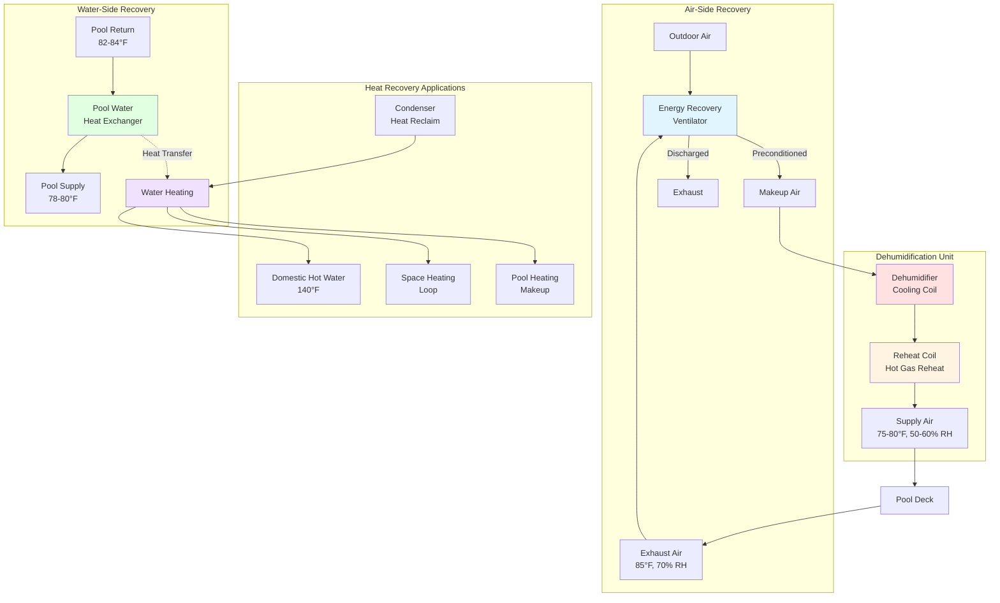

## Overview

Combined heat recovery systems for natatoriums integrate both exhaust air energy recovery and pool water heat reclaim to maximize energy efficiency. These dual-stream recovery systems capture thermal energy from warm, humid exhaust air while simultaneously extracting heat from pool filtration water, shower drains, and other aquatic facility water streams. The integrated approach achieves recovery efficiencies exceeding individual system capabilities, reducing facility operating costs by 40-60% compared to conventional systems without heat recovery.

## Dual Heat Recovery Integration

Combined recovery systems coordinate multiple heat sources and sinks within the natatorium. The primary exhaust air stream passes through energy recovery ventilators or heat pipe coils, transferring sensible and latent heat to incoming outdoor air. Simultaneously, pool circulation water diverts through water-to-water or water-to-refrigerant heat exchangers before returning to the pool. Additional recovery opportunities include shower waste heat, backwash water, and condensate from dehumidification equipment.

The integration challenge involves balancing recovery capacities across different streams. Exhaust air recovery availability correlates with ventilation rates (typically 0.5 cfm/ft² deck area minimum per ASHRAE 62.1), while pool water recovery depends on filtration turnover rates (6-8 hours per cycle). Optimal system design sequences recovery equipment to maximize temperature differentials and minimize parasitic losses from pumping and fan energy.

## System Efficiency Calculations

The overall combined recovery efficiency accounts for both air-side and water-side heat reclaim:

$$\eta_{combined} = 1 - \frac{Q_{aux}}{Q_{total}}$$

where $Q_{aux}$ represents auxiliary heating energy after all recovery systems operate, and $Q_{total}$ equals the total heating load including space heating, pool water heating, and domestic hot water.

The combined heat recovery rate sums individual recovery streams:

$$Q_{recovery} = Q_{air} + Q_{pool} + Q_{shower} + Q_{other}$$

For air-side recovery:

$$Q_{air} = \dot{m}_{air} \cdot (h_{exhaust} - h_{oa}) \cdot \eta_{ERV}$$

For pool water recovery:

$$Q_{pool} = \dot{m}_{pool} \cdot c_p \cdot (T_{return} - T_{supply}) \cdot \eta_{HX}$$

The net system coefficient of performance combines mechanical refrigeration for dehumidification with heat recovery:

$$COP_{net} = \frac{Q_{cooling} + Q_{reheat} + Q_{recovery}}{W_{comp} + W_{fan} + W_{pump}}$$

Typical combined systems achieve net COP values of 4.5-6.5, compared to 2.5-3.5 for dehumidification-only equipment without recovery.

## Integrated System Configuration

## Combined System Configurations

| Configuration Type | Air Recovery | Water Recovery | Applications | Typical Efficiency | Installed Cost Factor |
|-------------------|--------------|----------------|--------------|-------------------|----------------------|
| **Basic Combined** | Run-around coil | Pool filter HX | Small pools (<2,000 ft²) | 35-45% total recovery | 1.0× baseline |
| **Standard Integrated** | Plate ERV + run-around | Pool + shower drains | Medium facilities | 45-55% total recovery | 1.3× baseline |
| **Advanced Dual-Stream** | Enthalpy wheel + heat pipe | Multi-stage pool/shower/backwash | Large natatoriums | 55-65% total recovery | 1.6× baseline |
| **Full Integration** | Multiple ERVs + dedicated outdoor air | All water streams + condensate | Competition facilities | 60-70% total recovery | 2.0× baseline |

## Energy Recovery Opportunities

**Exhaust Air Recovery**

Natatorium exhaust air contains substantial sensible and latent energy. At typical conditions (85°F, 70% RH), exhaust enthalpy reaches 38-42 Btu/lb, compared to outdoor air at winter design conditions (0°F, minimal moisture) of 2-4 Btu/lb. This 35-38 Btu/lb differential represents significant recovery potential, particularly during heating season when outdoor air requires maximum conditioning.

**Pool Water Heat Reclaim**

Pool filtration systems circulate total pool volume every 6-8 hours, providing continuous heat recovery opportunities. A typical Olympic-size pool (660,000 gallons) with 6-hour turnover moves 1,833 gallons per minute through filters. Extracting 4-6°F from this flow before returning to the pool yields:

$$Q_{pool} = 1833 \text{ gpm} \times 8.33 \frac{\text{lb}}{\text{gal}} \times 1.0 \frac{\text{Btu}}{\text{lb·°F}} \times 5°F \times 60 \frac{\text{min}}{\text{hr}} = 4.6 \text{ MMBtu/hr}$$

This recovered energy preheats domestic hot water, provides space heating, or offsets pool heating loads.

**Shower and Drain Recovery**

Large natatoriums with extensive showering facilities generate significant drain water heat. Drain water heat exchangers recover 40-60% of shower heat, typically preheating cold makeup water from 50-55°F to 85-95°F. For facilities with 30-50 showers operating simultaneously during peak periods, this represents 200-400 MBh recovery capacity.

## System Integration Considerations

Combined recovery systems require careful integration to avoid conflicts between recovery modes. Pool water cooling for heat recovery must not overcool the pool below setpoint (78-82°F typical). Air-side recovery equipment must maintain proper indoor conditions (75-80°F, 50-60% RH per ASHRAE 62.1 and local health codes) regardless of recovery operation.

Control sequences prioritize recovery equipment operation based on instantaneous loads. During shoulder seasons with minimal heating loads, systems may bypass recovery equipment to prevent overheating. Winter operation maximizes recovery to offset heating energy. Summer operation shifts to pool water cooling emphasis, using extracted heat for domestic hot water rather than space heating.

The economic analysis must account for increased first costs against annual energy savings. Combined systems add $8-15/ft² deck area compared to dehumidification-only equipment, but reduce annual operating costs by $3-6/ft² through energy recovery. Simple payback periods range from 2-5 years depending on climate, utility rates, and facility operating schedules.

## Performance Optimization

Maximum combined recovery efficiency requires proper equipment sizing and sequencing. Undersized air-side recovery equipment creates excessive pressure drops and reduces ventilation effectiveness. Oversized pool water heat exchangers increase parasitic pumping energy without proportional recovery gains.

Temperature cascading improves overall efficiency by matching source and sink temperatures appropriately. Highest temperature recovery sources (condenser heat from dehumidification) serve domestic hot water loads requiring 140°F output. Intermediate temperature sources (exhaust air at 85°F) provide space heating and pool water heating. Lower temperature sources (shower drains at 95-105°F) preheat cold makeup water.

ASHRAE Standard 90.1 requires energy recovery for natatorium applications exceeding 5,000 cfm outdoor air and 70% or greater outdoor air fraction. Many natatoriums operate with 100% outdoor air to prevent recirculation of chloramine-laden air, making energy recovery mandatory for code compliance and essential for economic operation.

## References

- ASHRAE Standard 62.1: Ventilation for Acceptable Indoor Air Quality
- ASHRAE Standard 90.1: Energy Standard for Buildings Except Low-Rise Residential Buildings
- ASHRAE HVAC Applications Handbook, Chapter 6: Natatoriums
- ASHRAE Journal: Energy Recovery in Pool Facilities
- Model Aquatic Health Code (MAHC): Ventilation Requirements
