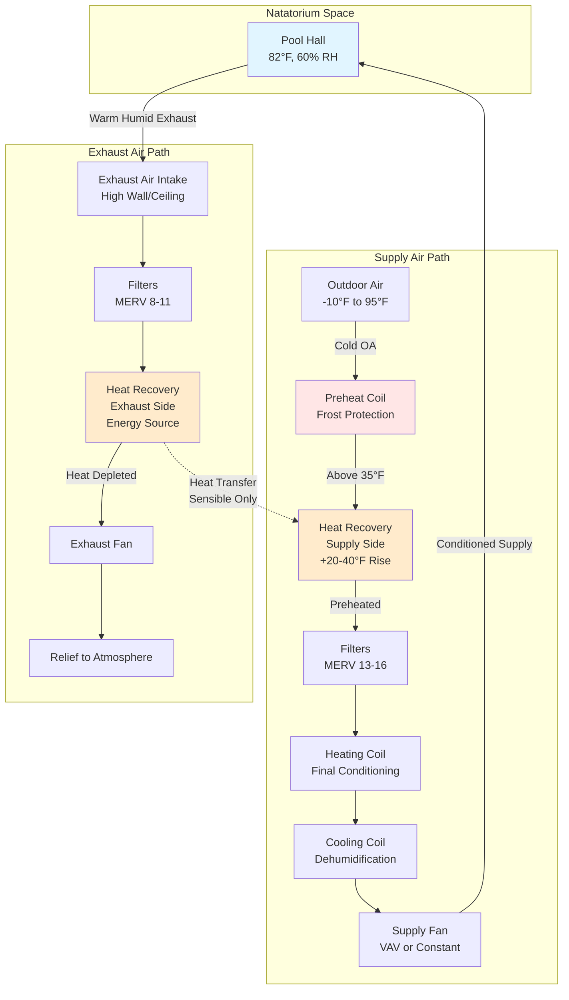

## Overview

Exhaust air heat recovery represents the single most effective energy conservation strategy in natatorium HVAC systems. Indoor pool facilities exhaust large volumes of warm, humid air continuously to control moisture and maintain acceptable indoor air quality. Without heat recovery, this represents a massive thermal energy loss. Modern heat recovery systems can capture 50-85% of this otherwise wasted energy, dramatically reducing heating costs while maintaining proper environmental control.

The unique operating conditions of natatoriums—high humidity, chloramine-laden air, and continuous operation—place extraordinary demands on heat recovery equipment. Successful implementation requires careful selection of heat exchanger type, robust corrosion protection, and comprehensive frost prevention strategies.

## Heat Recovery Effectiveness

Heat recovery effectiveness quantifies the thermal performance of energy recovery equipment. For sensible heat recovery, effectiveness is defined as:

$$\eta_{sensible} = \frac{T_{supply} - T_{outdoor}}{T_{exhaust} - T_{outdoor}}$$

Where:
- $T_{supply}$ = supply air temperature leaving heat exchanger (°F)
- $T_{outdoor}$ = outdoor air temperature entering heat exchanger (°F)
- $T_{exhaust}$ = exhaust air temperature entering heat exchanger (°F)

For total energy recovery systems (enthalpy recovery), effectiveness accounts for both sensible and latent heat transfer:

$$\eta_{total} = \frac{h_{supply} - h_{outdoor}}{h_{exhaust} - h_{outdoor}}$$

Where $h$ represents specific enthalpy (Btu/lb). Total energy recovery effectiveness typically ranges from 60-75% for rotary wheels and 50-65% for plate exchangers designed for natatorium service.

The annual energy savings from heat recovery can be estimated as:

$$Q_{saved} = \dot{m} \times c_p \times \eta \times (T_{exhaust} - T_{outdoor}) \times hours_{annual}$$

For a typical natatorium exhausting 10,000 cfm with 70% effectiveness and 5,500 heating hours annually, this yields approximately 1.8 million Btu/hr recovered capacity.

## Heat Exchanger Types for Natatoriums

The selection of heat exchanger technology critically impacts long-term reliability and maintenance costs in pool environments.

| Heat Exchanger Type | Effectiveness | Corrosion Resistance | Frost Risk | Cross-Contamination | Capital Cost | Maintenance |
|---------------------|--------------|---------------------|-----------|---------------------|--------------|-------------|
| **Plate (Fixed)** | 50-65% | Excellent (AL or SS) | Moderate | None | Moderate | Low |
| **Rotary Wheel** | 70-85% | Poor-Good | Low | 1-3% carryover | High | Moderate-High |
| **Heat Pipe** | 45-60% | Excellent | Moderate | None | Moderate | Very Low |
| **Runaround Loop** | 45-55% | Excellent | None | None | Low-Moderate | Moderate |

### Plate Heat Exchangers

Fixed-plate heat exchangers provide reliable sensible heat recovery without cross-contamination. For natatorium service, aluminum or stainless steel construction is mandatory. Plates must be widely spaced (0.25-0.375 inch) to minimize fouling and allow effective cleaning. Crossflow configuration is preferred to counterflow for better frost control.

**Key specifications:**
- Material: Type 316 stainless steel or epoxy-coated aluminum
- Plate spacing: minimum 0.25 inch
- Face velocity: 400-600 fpm maximum
- Pressure drop: 0.4-0.8 inches w.c. at design flow

### Rotary Heat Wheels

Enthalpy wheels offer the highest effectiveness but present significant challenges in pool applications. Standard desiccant-coated wheels are incompatible with chloramine exposure—only sensible wheels with aluminum or epoxy-coated substrates should be considered. Even with proper materials, the rotating seal mechanism requires rigorous maintenance.

ASHRAE Applications Handbook specifically cautions against enthalpy recovery in natatoriums due to transfer of moisture and contaminants from exhaust to supply airstream. If enthalpy wheels are employed, purge sections of minimum 10% wheel area are essential.

### Heat Pipe Heat Exchangers

Heat pipes provide passive heat transfer through refrigerant-charged sealed tubes. The complete separation of airstreams eliminates cross-contamination concerns. Heat pipes excel in corrosive environments when constructed with copper tubes and aluminum fins with protective coatings.

The gravity-dependent operation means heat pipes must maintain proper orientation (exhaust above supply) and cannot be applied in horizontal configurations. Effectiveness is inherently lower than active systems but reliability is exceptional.

### Runaround Loop Systems

Runaround (glycol loop) systems place finned coils in both exhaust and supply airstreams connected by a pumped glycol solution. This configuration offers complete flexibility in coil placement—no physical proximity required—and eliminates all cross-contamination and frost concerns.

The glycol concentration must be maintained at 40-50% to prevent freeze-up in outdoor air coils. Heat transfer effectiveness is limited by the intermediate fluid loop, but the operational flexibility often justifies this performance penalty in natatorium applications.

## Corrosion Protection in Pool Environments

Chloramines present in natatorium exhaust air aggressively attack standard HVAC materials. All heat recovery components in contact with pool exhaust require corrosion-resistant construction:

**Material specifications:**
- Heat exchanger surfaces: Type 316 stainless steel, epoxy-coated aluminum, or copper with protective coating
- Frames and casings: Galvanized steel minimum; stainless steel preferred
- Fasteners: All stainless steel
- Coils (runaround): Copper tubes with aluminum fins, epoxy coating mandatory

Regular inspection protocols must verify coating integrity. Any breach in protective coatings accelerates degradation exponentially. Budget for recoating or replacement every 10-15 years even with proper material selection.

## Frost Protection Strategies

When outdoor air temperatures drop below freezing, condensate within heat exchangers can freeze, blocking airflow and potentially damaging equipment. Natatoriums present elevated frost risk due to high exhaust moisture content.

**Frost prevention methods:**

1. **Preheat coil**: Heat outdoor air to 35-40°F before entering heat exchanger
2. **Bypass control**: Modulate outdoor air around heat exchanger to maintain minimum exhaust temperature
3. **Face and bypass dampers**: Vary effective heat exchanger area exposed to airflow
4. **Wheel speed control** (rotary wheels only): Reduce rotation speed to decrease effectiveness

The exhaust air dewpoint temperature at the coldest point in the heat exchanger must remain above 32°F. For a typical natatorium with 82°F, 60% RH exhaust air (dewpoint 65°F), this provides substantial safety margin. However, during low occupancy periods with reduced latent loads, active frost protection becomes critical.

Face and bypass control offers the most reliable frost protection with fixed-plate exchangers. Install temperature sensors at the coldest leaving air section and modulate bypass dampers to maintain 40°F minimum.

## Enthalpy vs Sensible Recovery

The choice between sensible-only and total energy (enthalpy) recovery fundamentally impacts system performance in natatoriums.

**Sensible recovery advantages:**
- No moisture transfer from exhaust to supply (contamination prevention)
- Simpler control sequences
- Better compatibility with corrosive environments
- Lower maintenance requirements

**Enthalpy recovery concerns:**
- Transfers 1-3% of exhaust air contaminants to supply
- Desiccant coatings degrade rapidly in chloramine exposure
- Increased complexity in psychrometric control
- ASHRAE recommends against in pool applications

The consensus among natatorium designers is clear: sensible-only heat recovery is strongly preferred. The modest increase in moisture recovery does not justify the contamination risk and material compatibility challenges.

## System Configuration

## Implementation Best Practices

**Design considerations:**

- **Bypass capability**: Install full bypass around heat recovery to permit 100% mechanical cooling when outdoor conditions allow
- **Economizer integration**: Coordinate heat recovery control with economizer operation for optimal efficiency
- **Maintenance access**: Provide removable sections for periodic cleaning and inspection
- **Monitoring**: Install temperature and pressure sensors at all heat exchanger boundaries
- **Control sequences**: Program automatic bypass on low exhaust temperature, high supply temperature, or differential pressure alarm

**Operational guidelines:**

- Clean heat exchanger surfaces annually minimum (quarterly in heavy-use facilities)
- Inspect coatings biannually for corrosion damage
- Verify frost protection control operation before each heating season
- Monitor heat recovery effectiveness quarterly and investigate any degradation
- Maintain glycol concentration (runaround systems) per manufacturer specifications

**Performance validation:**

Document baseline effectiveness during commissioning with the equation provided above. Annual verification ensures equipment maintains design performance. Effectiveness degradation of more than 10% indicates fouling or mechanical failure requiring corrective action.

## Energy and Economic Analysis

The economic justification for heat recovery in natatoriums is compelling. Consider a 15,000 square foot natatorium exhausting 12,000 cfm with 6,000 heating degree days:

- Annual heating load without recovery: 3.2 billion Btu
- Heat recovery savings (70% effective): 2.2 billion Btu
- Natural gas savings ($1.50/therm, 80% efficiency): $34,400/year
- Simple payback (typical installation): 3-5 years

These savings persist for the life of the facility. Energy recovery should be considered mandatory for any natatorium in climates with significant heating requirements.

## References and Standards

- ASHRAE Handbook—HVAC Applications, Chapter 6: Natatoriums
- ASHRAE Standard 62.1: Ventilation for Acceptable Indoor Air Quality
- ASHRAE Standard 90.1: Energy Standard for Buildings (Section 6.5.6 Energy Recovery)
- CDC Model Aquatic Health Code (MAHC): Ventilation Requirements

Heat recovery in natatoriums represents proven technology with decades of successful implementations. Proper equipment selection, robust corrosion protection, and effective frost control ensure reliable operation and substantial energy savings throughout the facility lifecycle.
