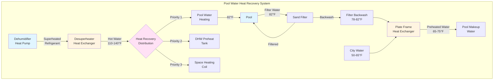

## Overview

Pool water heat recovery captures thermal energy from multiple sources in natatorium HVAC systems to reduce operating costs and improve energy efficiency. Primary recovery opportunities include refrigerant desuperheating from dehumidification equipment, filter backwash heat reclamation, and waste heat from mechanical systems. Properly designed heat recovery systems can reduce pool heating energy consumption by 50-70% while simultaneously heating domestic hot water or providing space heating.

The physics of pool water heat recovery centers on transferring sensible heat from a higher-temperature source to pool water at 78-82°F or other end uses. Heat exchangers serve as the critical interface, with sizing determined by heat transfer coefficients, flow rates, and temperature differentials.

## Heat Pump Desuperheater Systems

Dehumidification heat pumps in natatoriums reject heat through condensers operating at 90-120°F refrigerant temperatures. Desuperheaters recover a portion of this heat from superheated refrigerant vapor before condensing, providing hot water at 110-140°F.

### Desuperheater Heat Recovery Capacity

The recoverable heat from desuperheated refrigerant vapor:

$$Q_{dsh} = \dot{m}_r (h_2 - h_3)$$

Where:
- $Q_{dsh}$ = desuperheater heat recovery rate (Btu/h)
- $\dot{m}_r$ = refrigerant mass flow rate (lb/h)
- $h_2$ = enthalpy at compressor discharge (Btu/lb)
- $h_3$ = enthalpy at saturation temperature (Btu/lb)

For typical dehumidification equipment, desuperheater recovery represents 15-25% of total condenser capacity.

### Heat Exchanger Sizing

Refrigerant-to-water heat exchangers require proper sizing to maximize heat transfer while maintaining acceptable pressure drop:

$$Q = UA \cdot LMTD$$

Where:
- $Q$ = heat transfer rate (Btu/h)
- $U$ = overall heat transfer coefficient (Btu/h·ft²·°F)
- $A$ = heat exchanger surface area (ft²)
- $LMTD$ = log mean temperature difference (°F)

$$LMTD = \frac{(T_{r,in} - T_{w,out}) - (T_{r,out} - T_{w,in})}{\ln\left(\frac{T_{r,in} - T_{w,out}}{T_{r,out} - T_{w,in}}\right)}$$

Where:
- $T_{r,in}$ = refrigerant inlet temperature (°F)
- $T_{r,out}$ = refrigerant outlet temperature (°F)
- $T_{w,in}$ = water inlet temperature (°F)
- $T_{w,out}$ = water outlet temperature (°F)

Typical overall heat transfer coefficients for refrigerant-to-water heat exchangers range from 150-250 Btu/h·ft²·°F depending on flow velocities and heat exchanger configuration.

## Filter Backwash Heat Recovery

Swimming pool filters require periodic backwashing, discharging 800-1500 gallons of 78-82°F water per backwash cycle. Heat recovery from this waste stream preheats incoming makeup water, reducing heating loads.

### Backwash Heat Recovery Potential

The recoverable energy from filter backwash:

$$Q_{bw} = \dot{m}_w c_p (T_{bw} - T_{mu})$$

Where:
- $Q_{bw}$ = backwash heat recovery rate (Btu/h)
- $\dot{m}_w$ = backwash water flow rate (lb/h)
- $c_p$ = specific heat of water (1.0 Btu/lb·°F)
- $T_{bw}$ = backwash water temperature (°F)
- $T_{mu}$ = makeup water temperature (°F)

For a 50,000-gallon pool with backwashing three times per week, annual backwash heat recovery potential exceeds 2.5 million Btu at 60% heat exchanger effectiveness.

## Integrated Heat Recovery Systems

Modern natatorium HVAC systems integrate multiple heat recovery opportunities through series or parallel heat exchanger arrangements.

## Heat Recovery Applications Comparison

| Application | Temperature Range | Typical Capacity | Annual Runtime | Efficiency | Implementation Cost | Payback Period |
|-------------|------------------|------------------|----------------|-----------|---------------------|----------------|
| **Pool Water Heating** | 78-82°F | 50,000-200,000 Btu/h | 8,760 hours | COP 4.5-6.0 | $8,000-$15,000 | 2-4 years |
| **DHW Preheat** | 90-120°F | 30,000-100,000 Btu/h | 6,000-8,000 hours | Effectiveness 60-75% | $6,000-$12,000 | 3-5 years |
| **Space Heating** | 100-140°F | 75,000-250,000 Btu/h | 3,000-5,000 hours | Effectiveness 65-80% | $10,000-$20,000 | 4-7 years |
| **Filter Backwash Recovery** | 65-75°F preheat | 10,000-30,000 Btu/h | 150-300 hours | Effectiveness 50-70% | $4,000-$8,000 | 5-8 years |

## Design Considerations

### Heat Exchanger Selection

Heat exchanger type affects performance, maintenance requirements, and cost:

- **Plate-and-frame exchangers**: High effectiveness (75-85%), compact, serviceable, ideal for backwash recovery
- **Brazed plate exchangers**: Lower cost, non-serviceable, suitable for clean water applications
- **Double-wall exchangers**: Required for potable water protection, lower effectiveness (60-70%)
- **Coaxial tube exchangers**: Excellent for refrigerant-to-water, high pressure capability

### System Integration

Heat recovery systems require proper integration with existing pool heating equipment:

1. **Temperature controls**: Modulating valves maintain pool temperature within ±1°F while prioritizing heat recovery
2. **Flow management**: Variable speed pumps optimize heat transfer rates and minimize parasitic losses
3. **Freeze protection**: Glycol solutions or heat trace protect exposed piping in cold climates
4. **Backup heating**: Auxiliary boilers or heat pumps supplement heat recovery during peak demand

### Performance Optimization

Maximize heat recovery efficiency through design optimization:

- **Counterflow configuration**: Increases LMTD by 15-25% compared to parallel flow
- **Flow velocity**: Maintain 3-6 ft/s in heat exchangers to ensure turbulent flow and high heat transfer coefficients
- **Temperature approach**: Design for 5-10°F approach temperature difference at heat exchanger outlet
- **Fouling factors**: Include 0.001-0.002 h·ft²·°F/Btu fouling resistance for pool water applications

## ASHRAE Design Guidelines

ASHRAE Standard 90.1 Section 6.5.6 requires heat recovery for pools exceeding 70°F when conditioned space is cooled. ASHRAE Applications Handbook Chapter 6 (Natatoriums) provides comprehensive design guidance:

- Minimum heat recovery effectiveness of 60% for air-to-air systems
- Pool water heating priority over DHW or space heating to minimize evaporation
- Heat recovery system controls to prevent overheating during low-load periods
- Annual energy analysis to justify heat recovery implementation

## Maintenance Requirements

Heat recovery systems require periodic maintenance to sustain performance:

- **Monthly**: Inspect temperature and pressure gauges, verify control operation
- **Quarterly**: Clean or backflush heat exchangers, check for scaling or fouling
- **Annually**: Measure heat transfer effectiveness, calibrate temperature sensors, inspect refrigerant charge
- **Chemical treatment**: Maintain proper pool water chemistry (pH 7.2-7.8, alkalinity 80-120 ppm) to minimize scaling

Proper maintenance preserves heat transfer coefficients within 10% of design values and extends equipment life to 15-20 years.

## References

- ASHRAE Handbook—HVAC Applications, Chapter 6: Natatoriums (2023)
- ASHRAE Standard 90.1: Energy Standard for Buildings Except Low-Rise Residential Buildings, Section 6.5.6
- ASHRAE Handbook—HVAC Systems and Equipment, Chapter 26: Heat Exchangers (2020)
