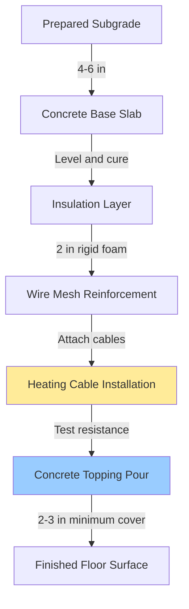
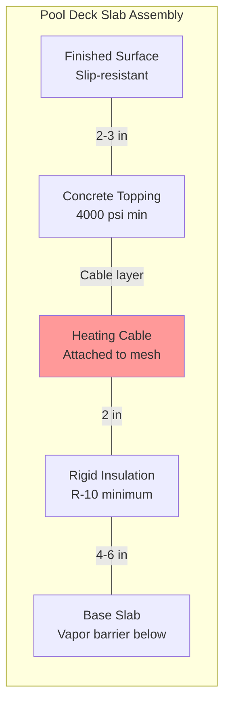

Electric radiant heating provides uniform warmth to natatorium pool decks through resistance heating elements embedded in the concrete slab. This heating method delivers direct thermal comfort to bare feet, prevents condensation, accelerates drying, and eliminates the need for boiler systems.

## System Types

### Constant Wattage Cable

Constant wattage cables produce a fixed heat output regardless of floor temperature. These cables consist of series or parallel resistance heating elements insulated by cross-linked polyethylene or fluoropolymer jackets.

**Heat output calculation:**

$$Q = \frac{P \times A}{3.412}$$

Where:
- $Q$ = Heat output (BTU/hr)
- $P$ = Power density (W/ft²)
- $A$ = Heated area (ft²)
- $3.412$ = Conversion factor (BTU/hr per watt)

Typical power densities range from 15 to 25 W/ft² for pool decks depending on slab losses, indoor conditions, and desired surface temperature.

**Cable spacing formula:**

$$S = \frac{W_{cable}}{P_{target}}$$

Where:
- $S$ = Spacing between cable runs (inches)
- $W_{cable}$ = Cable wattage per linear foot (W/ft)
- $P_{target}$ = Target power density (W/ft²)

For example, a 12 W/ft cable installed to achieve 20 W/ft² requires 7.2-inch spacing.

### Self-Regulating Cable

Self-regulating cables automatically adjust heat output based on local temperature using a conductive polymer matrix between parallel bus wires. As temperature increases, polymer resistance increases, reducing current flow and heat generation.

**Advantages:**
- Energy efficiency through automatic temperature response
- No cold spots or hot spots due to local temperature modulation
- Overlapping cable runs acceptable without burnout risk
- Lower maintenance requirements

**Limitations:**
- Higher initial cost than constant wattage cable
- Maximum continuous exposure temperature typically 150°F
- Power output decreases with age (approximately 10% over 10 years)

### Heating Mat Systems

Pre-fabricated heating mats consist of factory-assembled heating cables attached to polymer mesh at fixed spacing. Mats simplify installation by eliminating field spacing calculations and reducing labor time.

Standard mat widths: 12, 18, 24, 30 inches
Standard lengths: 10 to 100 feet
Power densities: 12, 15, 20, 25 W/ft²

## Cable Type Comparison

| Parameter | Constant Wattage | Self-Regulating |
|-----------|------------------|-----------------|
| Heat output | Fixed at all temperatures | Varies with local temperature |
| Power density stability | Constant over service life | Decreases 10% over 10 years |
| Energy efficiency | Requires thermostat control | Self-modulating reduces energy |
| Installation sensitivity | Precise spacing required | Overlapping acceptable |
| Maximum exposure temp | Up to 400°F (cable dependent) | Typically 150°F continuous |
| Initial cost | $8-15/ft² | $12-22/ft² |
| Warranty period | 10-25 years | 10-15 years |

## Installation Methods

**Detailed cross-section:**

### Installation Sequence

1. **Base preparation:** Pour and cure 4 to 6-inch concrete base slab over compacted subgrade with vapor barrier
2. **Insulation placement:** Install 2-inch rigid foam insulation (R-10 minimum) to direct heat upward and reduce downward losses
3. **Reinforcement installation:** Lay wire mesh (6×6 W1.4×W1.4 or heavier) secured at 24-inch intervals
4. **Cable attachment:** Secure heating cable to wire mesh using cable ties or clips at manufacturer-specified spacing
5. **Electrical testing:** Measure and record cable resistance before concrete pour (deviation >5% indicates damage)
6. **Concrete placement:** Pour 2 to 3-inch concrete topping (minimum 4000 psi) carefully to avoid cable damage
7. **Curing period:** Allow concrete to cure 28 days before energizing heating system

**Critical installation considerations:**
- Maintain 6-inch minimum clearance from pool wall to prevent thermal stress
- Keep cables 12 inches minimum from deck drains to avoid hot spots
- Route cold leads in conduit to prevent damage at slab penetrations
- Embed floor temperature sensors 6 inches from heating cable runs

## Electrical Requirements

### GFCI Protection

The National Electrical Code (NEC Article 680.27) mandates ground fault circuit interrupter protection for all pool deck heating equipment. GFCI devices must trip at 5 mA ground fault current within 25 milliseconds.

**GFCI types:**
- **Personnel protection:** Standard 5 mA GFCI for 120V circuits
- **Equipment protection:** 30 mA GFCI acceptable for permanently installed equipment
- **Nuisance trip prevention:** Use GFCI devices rated for capacitive loads (heating cables exhibit capacitance)

### Control Strategies

**Floor temperature control:**
- Primary control method for occupied pool decks
- Maintain surface temperature between 82°F and 88°F for comfort
- Sensor embedded in slab 6 inches from heating element
- Proportional-integral-derivative (PID) controllers minimize temperature overshoot

**Air temperature control:**
- Secondary or backup control method
- Prevents excessive floor temperatures during unoccupied periods
- Less responsive than floor sensing due to thermal mass lag

**Combination control:**
- Floor sensor as primary with air sensor as high-limit safety
- Air sensor prevents runaway heating if floor sensor fails
- Recommended approach for commercial natatoriums

**Power density sizing equation:**

$$P_{required} = \frac{q_{loss} + q_{evap}}{A_{heated} \times \eta}$$

Where:
- $P_{required}$ = Required power density (W/ft²)
- $q_{loss}$ = Slab heat loss to environment (BTU/hr)
- $q_{evap}$ = Evaporative cooling from wet feet (BTU/hr)
- $A_{heated}$ = Heated deck area (ft²)
- $\eta$ = System efficiency (typically 0.95)

ASHRAE recommends 15 to 20 W/ft² for indoor pool decks with adequate insulation and controlled humidity. Increase to 20 to 25 W/ft² for high-traffic areas, outdoor adjacent zones, or facilities with elevated evaporation rates.

## Advantages and Limitations

**Advantages:**
- No boiler or hydronic distribution system required
- Rapid temperature response (30 to 60 minutes to setpoint)
- Zone control allows selective heating of high-traffic areas
- Minimal maintenance requirements
- No risk of freeze damage or water leaks
- Precise temperature control through electronic thermostats

**Limitations:**
- Operating cost higher than hydronic systems in high-use facilities ($0.12 to $0.18 per kWh typical)
- Requires adequate electrical service capacity (80 to 120 A for 1000 ft² deck at 20 W/ft²)
- Repair requires concrete removal if cable fails
- Limited suitability for retrofit applications without deck reconstruction

## Design References

- ASHRAE Handbook—HVAC Applications, Chapter 6: Natatoriums
- NEC Article 680: Swimming Pools, Fountains, and Similar Installations
- NEC Article 424: Fixed Electric Space-Heating Equipment
- NEMA Standards Publication WC 51: Heating Cables
- IEEE Standard 515: Testing of Electrical Resistance Heating Cables

Properly designed and installed electric pool deck heating systems provide reliable, maintenance-free operation for 20 to 30 years. Success depends on correct power density selection, adequate insulation to minimize downward losses, proper GFCI protection, and careful installation practices to prevent cable damage during concrete placement.
