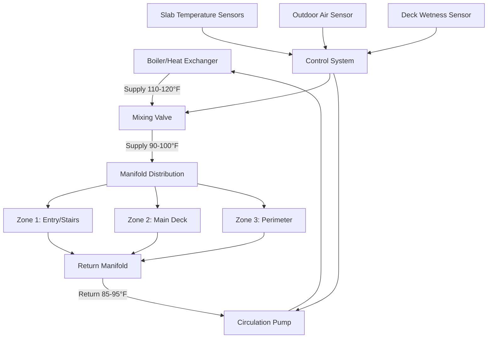

Radiant floor heating provides optimal thermal comfort for natatorium pool decks by delivering uniform heat distribution, eliminating the discomfort of cold wet surfaces, and preventing slip hazards from condensation. The system embeds hydronic tubing within the concrete slab, creating a continuous heated surface that maintains deck temperatures between 80-85°F regardless of ambient conditions.

## Hydronic System Fundamentals

Radiant floor systems operate on convective and radiative heat transfer principles. Heat flows from warm water through tubing walls into the concrete slab, then conducts to the surface where it radiates to occupants and evaporates surface moisture.

The heat output per unit area depends on the temperature difference between the slab surface and the space:

$$q = U \cdot A \cdot \Delta T$$

Where:
- $q$ = heat transfer rate (BTU/hr)
- $U$ = overall heat transfer coefficient (BTU/hr·ft²·°F)
- $A$ = surface area (ft²)
- $\Delta T$ = temperature difference between surface and air (°F)

For typical pool deck applications, heat flux ranges from 20-35 BTU/hr·ft² depending on the evaporative load from wet surfaces and foot traffic patterns.

## Tubing Design and Spacing

Tube spacing directly affects surface temperature uniformity and system capacity. Closer spacing increases heat output but raises installation costs and pumping energy.

The relationship between tube spacing and mean water temperature:

$$\Delta T_{mwt} = \frac{q \cdot s}{12 \cdot k_{concrete}}$$

Where:
- $\Delta T_{mwt}$ = temperature variation at surface (°F)
- $s$ = tube spacing (inches)
- $k_{concrete}$ = thermal conductivity of concrete (typically 0.9 BTU/hr·ft·°F)

**Recommended Spacing for Pool Decks:**

| Zone Type | Tube Spacing | Heat Output | Application |
|-----------|--------------|-------------|-------------|
| High traffic | 6 inches | 30-35 BTU/hr·ft² | Entry areas, stairs |
| Deck perimeter | 9 inches | 25-30 BTU/hr·ft² | Main walking surfaces |
| Low use areas | 12 inches | 20-25 BTU/hr·ft² | Equipment alcoves |

Install tubing 2-3 inches below the finished surface for optimal heat transfer and structural integrity. Avoid placing tubing deeper than 4 inches, as thermal lag increases and responsiveness decreases.

## System Components and Configuration

The system includes:

- **Heat source**: Dedicated boiler or heat exchanger tied to pool heating system
- **Mixing valve**: Modulates supply temperature based on load requirements
- **Manifolds**: Distribute and collect water from multiple zones
- **Circulation pump**: Variable-speed pump maintaining flow rate
- **Control system**: Monitors slab temperature and adjusts output
- **Insulation**: 2-inch rigid insulation below slab prevents downward heat loss

## Tubing Materials Comparison

| Property | PEX-A | PEX-B | PEX-AL-PEX |
|----------|-------|-------|------------|
| Temperature rating | 200°F (93°C) | 200°F (93°C) | 200°F (93°C) |
| Pressure rating | 160 psi @ 73°F | 160 psi @ 73°F | 200 psi @ 73°F |
| Bend radius | 6× OD | 8× OD | 5× OD |
| Oxygen barrier | Requires EVOH layer | Requires EVOH layer | Aluminum layer |
| Expansion coefficient | 1.0 in/10°F/100 ft | 1.0 in/10°F/100 ft | 0.13 in/10°F/100 ft |
| Cost (relative) | $$$ | $$ | $$$$ |
| Best application | Residential pools | Commercial natatoriums | High-performance systems |

All tubing must include oxygen barrier to prevent corrosion in ferrous system components. PEX-AL-PEX offers superior dimensional stability in large commercial installations but requires specialized fittings.

## Supply Water Temperature Design

Pool deck radiant systems operate at lower temperatures than conventional hydronic heating:

**Design Parameters:**
- Supply water temperature: 95-105°F
- Return water temperature: 85-95°F
- Design ΔT: 10-15°F
- Maximum slab surface temperature: 85°F (per ASHRAE Applications Handbook)

Lower water temperatures compared to standard radiant systems (120-140°F) result from:

1. **High ambient temperature**: Pool spaces maintained at 82-86°F reduce required ΔT
2. **Continuous moisture**: Evaporative cooling demands consistent, moderate heat input
3. **Comfort limits**: Surface temperatures exceeding 85°F cause discomfort on bare feet

Flow rate calculation for a given zone:

$$\dot{m} = \frac{q}{c_p \cdot \Delta T}$$

Where:
- $\dot{m}$ = mass flow rate (lb/hr)
- $c_p$ = specific heat of water (1.0 BTU/lb·°F)
- $q$ = zone heat load (BTU/hr)
- $\Delta T$ = supply-return temperature difference (°F)

## Slab Thermal Mass Benefits

Concrete slab thermal mass provides critical advantages in natatorium applications:

**Thermal storage capacity:**

$$Q_{stored} = m \cdot c_p \cdot \Delta T = \rho \cdot V \cdot c_p \cdot \Delta T$$

For a 4-inch slab:
- Density ($\rho$): 150 lb/ft³
- Specific heat ($c_p$): 0.2 BTU/lb·°F
- Storage capacity: 10 BTU/ft² per °F temperature change

This thermal flywheel effect:
- Dampens rapid temperature fluctuations from occupancy changes
- Reduces boiler cycling frequency
- Maintains comfort during brief equipment outages
- Enables night setback strategies in seasonally-used facilities

## Installation Methods

**Staple-up method**: Tubing attached to underside of subfloor with transfer plates. Not recommended for pool decks due to moisture exposure.

**Thin-slab method**: Tubing embedded in 1.5-inch gypcrete overlay. Suitable for retrofit applications over existing structural slabs.

**Thick-slab method** (preferred): Tubing embedded in structural concrete pour, 2-3 inches below surface. Provides optimal thermal performance and durability.

## Control Strategies

Effective control maintains comfort while minimizing energy consumption:

1. **Outdoor reset**: Reduces supply temperature during warmer weather
2. **Slab temperature sensing**: Maintains target surface temperature (82-85°F)
3. **Wetness detection**: Increases output in high-traffic areas with persistent moisture
4. **Zone control**: Independently manages entry, deck, and low-use areas
5. **Night setback**: Reduces temperature 5-7°F during unoccupied hours (recovery requires 4-6 hours)

## Design Considerations per ASHRAE

The ASHRAE HVAC Applications Handbook (Chapter 6, Swimming Pools) provides guidelines:

- Deck surface temperature: 80-85°F for bare foot comfort
- Insulation below slab: Minimum R-10 to prevent heat loss to ground
- Vapor barrier: 6-mil polyethylene below insulation prevents moisture migration
- Expansion joints: Provide tubing loops with expansion protection
- Control zoning: Separate zones for areas with different use patterns

Radiant floor heating integrates with dehumidification systems to create a comprehensive moisture management strategy. The heated deck surface promotes rapid evaporation while the air handling system removes moisture, maintaining indoor relative humidity between 50-60%.

## Commissioning and Performance Verification

Pressure test all tubing loops at 100 psi for 24 hours before concrete pour. After installation:

1. Flush system to remove air and debris
2. Gradually increase water temperature over 5-7 days to cure concrete properly
3. Verify flow rates at each manifold zone (± 10% of design)
4. Measure surface temperatures at multiple points (should vary less than 3°F within zones)
5. Confirm control system responds correctly to setpoint changes

Properly designed radiant floor systems deliver superior comfort, reduce slip hazards, and provide decades of maintenance-free operation in demanding natatorium environments.
