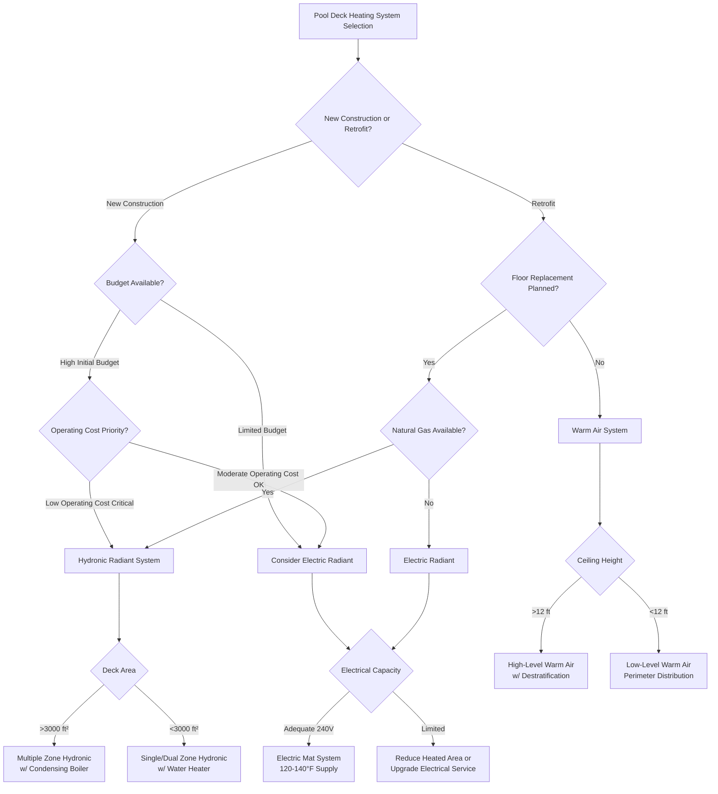

## System Selection Overview

Selecting the optimal pool deck heating system requires evaluating multiple criteria including thermal performance, energy efficiency, installation costs, operating costs, maintenance requirements, and response time characteristics. The three primary system types are hydronic radiant, electric radiant, and warm air systems, each offering distinct advantages depending on facility requirements.

## Heat Load Requirements

Pool deck heating loads differ significantly from standard floor heating due to evaporative effects and barefoot comfort requirements. The total heat flux required at the deck surface combines conduction losses and evaporative moisture transfer.

The deck surface heat requirement is:

$$q_{deck} = q_{cond} + q_{evap}$$

where:

$$q_{cond} = \frac{T_{surface} - T_{slab,bottom}}{R_{deck}}$$

$$q_{evap} = h_{mass} \cdot (W_{sat,surface} - W_{air}) \cdot h_{fg}$$

For barefoot comfort on wet surfaces, maintain deck temperatures between 82-86°F (28-30°C). The required heat flux typically ranges from 25-40 Btu/h·ft² (79-126 W/m²) depending on ambient conditions and evaporation rates.

## System Sizing Methodology

Size the heating system based on the maximum heat load condition occurring when the space is at design temperature with maximum occupancy and moisture content.

Total system capacity required:

$$Q_{total} = A_{deck} \cdot q_{deck} \cdot F_{safety}$$

Apply a safety factor $F_{safety}$ of 1.15-1.25 to account for edge losses, non-uniform heating, and thermal mass effects. For hydronic systems, calculate the tube spacing required:

$$S_{tube} = \frac{k_{deck} \cdot (T_{supply} - T_{surface})}{q_{deck} \cdot L_{embed}}$$

where $L_{embed}$ is the tube embedment depth below the surface (typically 1.5-2.5 inches for pool decks) and $k_{deck}$ is the thermal conductivity of the deck material.

## System Comparison


| Parameter | Hydronic Radiant | Electric Radiant | Warm Air |
|-----------|-----------------|------------------|----------|
| **Initial Cost** | $$$ (High) | $$ (Medium) | $$$$ (Very High) |
| **Operating Cost** | $ (Low) | $$$ (High) | $$ (Medium) |
| **Energy Efficiency** | 85-92% | 98-100% | 65-75% |
| **Response Time** | 45-90 min | 20-45 min | 5-15 min |
| **Temperature Uniformity** | Excellent (±1°F) | Excellent (±1°F) | Fair (±3-5°F) |
| **Installation Complexity** | High | Medium | Medium |
| **Maintenance Frequency** | Low (5-10 yr) | Very Low (15-25 yr) | Medium (1-3 yr) |
| **Retrofit Suitability** | Poor | Fair | Good |
| **Floor Thickness Impact** | +3-4 inches | +0.5-1 inch | None |
| **Zoning Capability** | Excellent | Excellent | Limited |
| **Typical Lifespan** | 25-35 years | 30-50 years | 15-25 years |


## System Selection Decision Tree

## Hydronic Radiant Systems

Hydronic systems circulate heated water (typically 95-140°F) through PEX or EPDM tubing embedded in the concrete deck. These systems offer the lowest operating costs when natural gas or waste heat recovery is available.

**Advantages:**
- Lowest operating cost with gas-fired condensing boilers (0.85-0.95 thermal efficiency)
- Excellent temperature uniformity across large deck areas
- Can integrate with pool water heating and dehumidification heat recovery
- Suitable for complex deck geometries with multiple zones
- Minimal electromagnetic interference

**Disadvantages:**
- Highest initial installation cost ($12-18/ft² installed)
- Slowest thermal response time (45-90 minutes to reach setpoint)
- Requires mechanical room space for boiler/manifolds
- Potential for leaks in aggressive natatorium environments
- Not suitable for retrofit without deck replacement

## Electric Radiant Systems

Electric resistance heating cables or mats embedded in or beneath the deck provide direct conversion of electrical energy to heat with near 100% efficiency at the point of use.

**Advantages:**
- Moderate installation cost ($8-14/ft² installed)
- No mechanical room equipment required
- Faster response time than hydronic (20-45 minutes)
- Minimal maintenance requirements
- Precise zone control with simple thermostats
- Suitable for small to medium deck areas

**Disadvantages:**
- Highest operating cost in most utility rate structures
- Requires substantial electrical service (25-40 W/ft² demand)
- Less economical for areas exceeding 2,500-3,000 ft²
- Limited integration with other HVAC systems
- Potential electromagnetic field concerns (low frequency)

## Warm Air Systems

Heated air delivery through perimeter floor diffusers or high-level air distribution provides both heating and air movement for evaporation control.

**Advantages:**
- Fastest response time (5-15 minutes)
- Best retrofit option without floor replacement
- Combines heating with air circulation for moisture removal
- Moderate operating costs with gas-fired equipment
- No floor thickness penalty

**Disadvantages:**
- Poor temperature uniformity across deck surface
- Highest initial cost including ductwork ($15-22/ft² equivalent)
- Creates air movement that may feel drafty on wet skin
- Higher maintenance requirements for filters and moving parts
- Noise generation from air handling equipment
- Less effective for spot heating specific zones

## ASHRAE Selection Guidelines

ASHRAE Handbook - HVAC Applications Chapter 6 (Natatoriums) provides the following selection guidance:

1. **Primary Criterion:** For new construction with deck areas exceeding 2,000 ft², radiant systems (hydronic or electric) are preferred for superior comfort and energy efficiency.

2. **Energy Performance:** Radiant systems reduce heating energy consumption by 15-30% compared to warm air systems due to lower space temperature requirements and reduced stratification losses.

3. **Integration:** Hydronic systems should be evaluated for integration with pool water heating, dehumidification condenser heat recovery, and solar thermal systems when available.

4. **Control Strategy:** Maintain deck surface temperature based on direct surface sensors rather than air temperature to ensure consistent barefoot comfort.

5. **Zoning:** Separate control zones for areas with different use patterns (competitive pool deck, leisure pool deck, spa areas, spectator areas).

## Economic Analysis

Life cycle cost analysis over a 20-year period for a 3,500 ft² pool deck (climate zone 5A, natural gas $1.20/therm, electricity $0.12/kWh):

**Hydronic System:**
- Initial cost: $52,500
- Annual operating cost: $2,850
- 20-year total: $109,500

**Electric System:**
- Initial cost: $38,500
- Annual operating cost: $6,720
- 20-year total: $172,900

**Warm Air System:**
- Initial cost: $63,000
- Annual operating cost: $4,200
- 20-year total: $147,000

The hydronic system provides the lowest life cycle cost for this scenario, breaking even with electric after 4.2 years and with warm air after 6.8 years.

## Response Time Considerations

Response time affects both comfort recovery after periods of reduced operation and the ability to implement setback strategies for energy savings.

Thermal response time constant:

$$\tau = \frac{\rho \cdot c_p \cdot V_{heated}}{h \cdot A}$$

For a typical 4-inch concrete deck with embedded hydronic tubing at 2-inch depth:
- Time to 63% of final temperature: 55-75 minutes
- Time to 95% of final temperature: 165-225 minutes

This slow response necessitates continuous operation or predictive controls that anticipate occupancy patterns. Electric systems with cables closer to the surface (0.25-0.5 inch depth) achieve similar milestones in 30-40% less time.

## Installation Complexity Factors

**Hydronic Systems:**
- Require pressure testing before concrete pour
- Need expansion joints accommodation in tube routing
- Demand skilled trades for manifold balancing
- Critical embedment depth control for performance

**Electric Systems:**
- Simpler installation with mat products
- Require ohm testing before and after concrete pour
- Need isolation from reinforcing steel
- Must coordinate with electrical rough-in

**Warm Air Systems:**
- Require ductwork routing and perimeter diffuser installation
- Need air handling unit room allocation
- Simpler commissioning procedures
- Standard HVAC trade installation

## Recommendations

- **Large facilities (>3,000 ft²) with natural gas:** Hydronic radiant with condensing boiler
- **Medium facilities (1,000-3,000 ft²) with high electric rates:** Hydronic radiant
- **Medium facilities with low electric rates or incentives:** Electric radiant
- **Small facilities (<1,000 ft²):** Electric radiant
- **Retrofit applications without floor replacement:** Warm air perimeter heating
- **Facilities with waste heat available:** Hydronic radiant integrated with heat recovery

Select the system that minimizes life cycle cost while meeting response time and comfort uniformity requirements for the specific facility operation schedule and use patterns.
