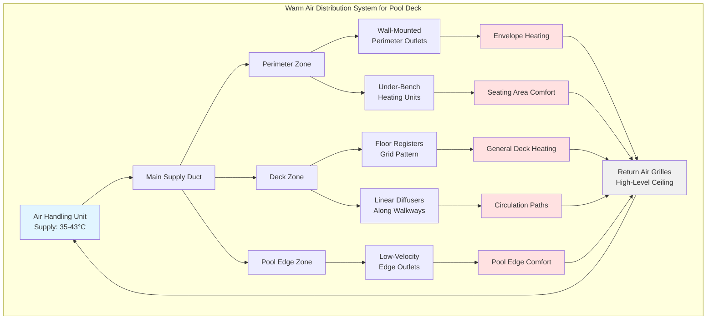

## Warm Air Heating Systems for Pool Decks

Warm air heating provides pool deck thermal comfort through convective heat transfer from conditioned air delivered via floor registers, perimeter outlets, or overhead diffusers. This approach heats occupants and surfaces through forced convection while integrating with the natatorium's ventilation system. Proper design requires careful consideration of supply air temperatures, velocity constraints, and distribution patterns to prevent thermal stratification and cold spots.

## Heat Transfer Mechanism

Warm air heating operates primarily through forced convection, with the convective heat transfer rate governed by:

$$Q_{conv} = h \cdot A \cdot (T_{air} - T_{surface})$$

Where:
- $Q_{conv}$ = convective heat transfer rate (W)
- $h$ = convective heat transfer coefficient (W/m²·K)
- $A$ = surface area exposed to warm air (m²)
- $T_{air}$ = supply air temperature (°C)
- $T_{surface}$ = deck surface temperature (°C)

The heat transfer coefficient varies with air velocity according to:

$$h = C \cdot V^{0.8}$$

Where $C$ is a constant dependent on surface geometry and $V$ is local air velocity (m/s). This relationship demonstrates that higher air velocities increase convective heat transfer but must be balanced against occupant comfort requirements.

## Supply Air Temperature Design

ASHRAE recommends pool deck dry-bulb temperatures between 26-29°C (79-84°F), typically 1-2°C above pool water temperature. Supply air temperatures for deck heating applications typically range from 32-43°C (90-110°F) depending on distribution method.

**Temperature selection criteria:**

- **Floor registers:** 35-40°C (95-104°F) to prevent excessive temperature differentials at ankle level
- **Perimeter outlets:** 38-43°C (100-110°F) for envelope heating along exterior walls
- **Overhead diffusers:** 32-37°C (90-99°F) to minimize thermal stratification

The required supply air temperature can be calculated from:

$$T_{supply} = T_{deck} + \frac{Q_{loss}}{m \cdot c_p}$$

Where:
- $T_{deck}$ = desired deck temperature (°C)
- $Q_{loss}$ = total heat loss from deck area (W)
- $m$ = air mass flow rate (kg/s)
- $c_p$ = specific heat of air (1.006 kJ/kg·K)

## Air Velocity and Comfort Constraints

Air velocity at the occupied zone must remain below 0.25 m/s (50 fpm) to prevent drafts and excessive evaporative cooling from wet skin. The air velocity decay from a floor register follows:

$$V_x = V_0 \cdot \left(\frac{A_0}{A_x}\right)^{0.5}$$

Where:
- $V_x$ = velocity at distance $x$ from outlet (m/s)
- $V_0$ = initial discharge velocity (m/s)
- $A_0$ = outlet area (m²)
- $A_x$ = effective flow area at distance $x$ (m²)

Proper outlet spacing ensures velocity decay to acceptable levels before reaching the occupied zone.

## Distribution System Configurations

## Configuration Comparison

| Configuration | Supply Temp | Outlet Velocity | Coverage Pattern | Applications | Advantages | Limitations |
|--------------|-------------|-----------------|------------------|--------------|------------|-------------|
| **Floor Registers (Grid)** | 35-40°C | 2.0-3.5 m/s | Uniform array 2-3m spacing | General deck areas, walkways | Even temperature distribution, direct foot warming | Installation complexity, potential trip hazards |
| **Perimeter Outlets** | 38-43°C | 3.0-5.0 m/s | Along exterior walls | Envelope heating, cold surface compensation | Offset envelope losses, prevent condensation | Limited central deck coverage |
| **Linear Slot Diffusers** | 35-38°C | 1.5-2.5 m/s | Directional along paths | Walkways, transition zones | Low profile, controlled throw | Higher air volume requirements |
| **Under-Bench Units** | 40-43°C | 1.0-2.0 m/s | Localized seating | Spectator areas, rest zones | Targeted comfort, integration with furniture | Point source heating only |
| **Combination System** | 32-43°C (varied) | 1.5-5.0 m/s | Multi-zone coverage | Full facility design | Optimized comfort and efficiency | Increased system complexity, control requirements |

## Air Circulation Patterns

Effective warm air heating requires proper air circulation to prevent stratification. The circulation pattern should create a gentle downward flow along exterior walls (from perimeter heating) and upward flow from the pool surface (driven by evaporation and water temperature).

**Design principles:**

1. **Return air placement:** High-level returns (ceiling-mounted) capture warm, humid air rising from the pool
2. **Supply air throw:** Horizontal throw patterns prevent direct impingement on occupants
3. **Air change rate:** 4-6 air changes per hour minimum for combined ventilation and heating
4. **Mixing effectiveness:** Supply air must mix thoroughly before reaching occupied zones

The effective air distribution can be evaluated using:

$$\epsilon = \frac{T_{exhaust} - T_{supply}}{T_{occupied} - T_{supply}}$$

Where $\epsilon$ represents ventilation effectiveness (target: 0.9-1.0 for pool decks).

## Comfort Zone Calculation

The operative temperature experienced by occupants combines air temperature and mean radiant temperature:

$$T_{operative} = \frac{T_{air} + T_{radiant}}{2}$$

For acceptable pool deck comfort per ASHRAE Standard 55, the operative temperature should remain within 26-29°C with relative humidity between 50-60%. Warm air systems must compensate for radiant heat loss to cold surfaces (exterior walls, glazing) through elevated air temperatures.

## Integration with Dehumidification

Warm air heating systems typically integrate with the natatorium's dehumidification equipment. During heating mode, the dehumidifier's reheat coil elevates discharge air temperature to the required supply temperature. The total heating capacity required combines:

- Envelope heat losses (walls, roof, glazing)
- Ventilation heating load (outdoor air conditioning)
- Pool water evaporation cooling effect
- Deck surface conduction losses

This integrated approach maximizes energy efficiency while maintaining year-round comfort and humidity control.

## System Controls and Zoning

Multi-zone control allows temperature customization for different deck areas. High-traffic walkways may require higher heating inputs than seating areas. Supply air temperature modulates based on:

- Deck temperature sensors (multiple zones)
- Outdoor air temperature (reset schedule)
- Occupancy levels (demand-based control)
- Pool water temperature (differential control)

Variable air volume (VAV) terminals at each zone enable independent temperature control while maintaining minimum ventilation airflow rates per ASHRAE Standard 62.1.
