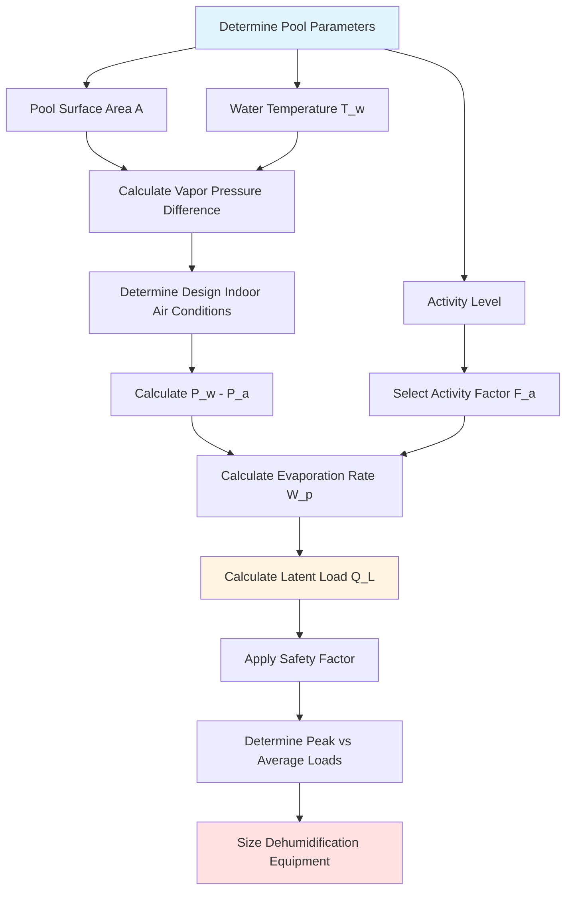

## Overview

Evaporation load calculation forms the critical foundation for natatorium HVAC system sizing. The latent load from water evaporation typically dominates the total cooling load in indoor pool facilities, often representing 60-80% of total HVAC capacity requirements. Accurate calculation of this load ensures proper dehumidification capacity, occupant comfort, and building envelope protection.

## Fundamental Evaporation Load Equation

The latent cooling load from pool water evaporation converts the evaporation rate (mass per unit time) to heat energy using the latent heat of vaporization:

$$Q_L = W_p \cdot h_{fg}$$

Where:
- $Q_L$ = Latent cooling load (Btu/hr)
- $W_p$ = Water evaporation rate (lb/hr)
- $h_{fg}$ = Latent heat of vaporization at pool water temperature (Btu/lb)

At typical pool water temperatures of 78-84°F, the latent heat of vaporization approximates 1,050 Btu/lb. For 80°F water, use $h_{fg} = 1,048$ Btu/lb.

## ASHRAE Evaporation Rate Method

The ASHRAE Handbook—HVAC Applications provides the foundational equation for calculating water evaporation rate:

$$W_p = A \cdot F_a \cdot (P_w - P_a) \cdot Y$$

Where:
- $A$ = Pool water surface area (ft²)
- $F_a$ = Activity factor (dimensionless)
- $P_w$ = Saturation vapor pressure at pool water temperature (in. Hg)
- $P_a$ = Partial vapor pressure of室内 air (in. Hg)
- $Y$ = Evaporation coefficient (lb/hr·ft²·in. Hg)

The evaporation coefficient $Y$ typically ranges from 0.1 to 0.15 lb/hr·ft²·in. Hg for indoor pools with minimal air movement. ASHRAE recommends $Y = 0.1$ for quiescent pools.

## Calculation Process

## Activity Factors by Pool Type

Pool activity level dramatically affects evaporation rates. Higher activity increases surface disturbance, air-water interface area, and moisture transfer rates.

| Pool Type | Activity Level | Activity Factor ($F_a$) | Typical Use Pattern | Design Load Multiplier |
|-----------|----------------|------------------------|---------------------|----------------------|
| Residential | Minimal | 0.5 | Private use, low occupancy | 1.0 |
| Therapy/Rehab | Light | 0.65 | Controlled exercises, moderate movement | 1.1 |
| Hotel/Condo | Moderate | 0.8 | Recreational swimming, variable occupancy | 1.15 |
| Public Recreation | Active | 1.0 | Continuous use, lap swimming, play | 1.25 |
| Competition | Very Active | 1.2 | Training, racing, high turbulence | 1.3 |
| Wave Pool/Water Park | Extreme | 1.5-2.0 | Maximum surface agitation | 1.4-1.5 |

## Peak vs. Average Load Considerations

Natatorium HVAC systems must handle both average and peak evaporation conditions:

**Average Loads** represent typical operating conditions during normal pool use. These loads determine:
- Annual energy consumption estimates
- Operating cost projections
- Equipment run-time expectations
- Part-load performance requirements

**Peak Loads** occur during maximum occupancy with high activity levels. Peak conditions establish:
- Equipment capacity selection
- Worst-case dehumidification requirements
- Maximum moisture removal rates
- Control system setpoint limits

Design calculations must use peak load conditions for equipment sizing. A properly sized system maintains design indoor air conditions (typically 50-60% RH at 82-86°F) during worst-case scenarios.

## Diversity Factors and Safety Margins

**Diversity Factors** account for the statistical improbability that all pool areas operate at peak conditions simultaneously in multi-pool facilities:

- Single pool: Diversity factor = 1.0 (no reduction)
- Two pools: Diversity factor = 0.95
- Three or more pools: Diversity factor = 0.90

Apply diversity factors only to facilities with separately controlled pool areas with different use schedules.

**Safety Margins** compensate for calculation uncertainties and equipment degradation:

- Standard practice: Add 10-15% to calculated peak latent load
- High-uncertainty conditions: Add 20% safety margin
- Minimum recommended: 10% above calculated peak

Conservative design margins prevent undersizing while avoiding excessive overcapacity that increases first cost and reduces part-load efficiency.

## Sensible Heat Component

While latent load dominates, sensible heat transfer from pool water surface contributes to total evaporation load:

$$Q_s = 0.48 \cdot W_p \cdot (T_w - T_a)$$

Where:
- $Q_s$ = Sensible cooling load (Btu/hr)
- 0.48 = Conversion factor accounting for mass flow and specific heat
- $T_w$ = Pool water temperature (°F)
- $T_a$ = Indoor air temperature (°F)

Sensible load typically represents 5-10% of total evaporation load when air temperature exceeds water temperature. When $T_a < T_w$, sensible heat transfers from water to air.

## Total Evaporation Load

The total heat load from pool evaporation combines latent and sensible components:

$$Q_{total} = Q_L + Q_s$$

For dehumidification equipment selection, specify both:
- **Latent capacity**: Must meet or exceed $Q_L$ with applied safety margin
- **Sensible capacity**: Sufficient to maintain desired air-water temperature differential

## Design Day Evaporation Rates

Calculate design day conditions using:

1. **Maximum anticipated occupancy** for the pool type
2. **Corresponding activity factor** from established values
3. **Design indoor air conditions** (typically 50-60% RH at 82-86°F)
4. **Pool water temperature** at normal operating setpoint
5. **Evaporation coefficient** appropriate for facility air distribution

Design day calculations establish the peak dehumidification capacity required. Equipment must maintain acceptable indoor humidity levels under these conditions continuously.

## Moisture Removal Rate Calculation

Convert latent load to moisture removal rate for dehumidifier specification:

$$\dot{m} = \frac{Q_L}{h_{fg}} \times 24 = W_p \times 24$$

Where:
- $\dot{m}$ = Moisture removal rate (lb/day)
- Factor of 24 converts hourly rate to daily rate

Most dehumidification equipment specifies capacity in pounds per day or pints per day (1 lb water ≈ 0.96 pints).

## Application Notes

- Verify vapor pressure calculations using psychrometric charts or software at actual operating temperatures
- Account for perimeter surfaces (spas, hot tubs) separately with appropriate temperature-based vapor pressures
- Consider unoccupied periods with reduced activity factors for energy modeling
- Evaluate impact of pool covers on evaporation rates during closure periods
- Review manufacturer dehumidifier capacity ratings at actual operating conditions (not standard rating conditions)

## References

ASHRAE Handbook—HVAC Applications, Chapter 6: Natatoriums provides comprehensive coverage of evaporation calculation methods, activity factors, and design considerations for indoor pool facilities.
