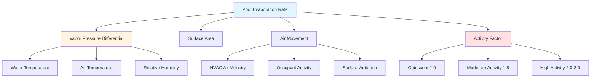

## Fundamental Evaporation Mechanisms

Pool water evaporation represents the primary source of latent cooling load in natatorium environments. The rate of moisture transfer from the pool surface to the surrounding air depends on three fundamental driving forces: the vapor pressure differential between water and air, the convective mass transfer coefficient (influenced by air velocity), and the exposed water surface area.

## ASHRAE Standard Evaporation Equation

The ASHRAE Handbook—HVAC Applications Chapter 5 provides the industry-standard equation for calculating pool evaporation rates:

$$W_p = A(p_w - p_a)(0.089 + 0.0782V)/Y$$

**Variable definitions:**

- $W_p$ = Water evaporation rate (lb/hr)
- $A$ = Pool water surface area (ft²)
- $p_w$ = Saturated vapor pressure at pool water temperature (in. Hg)
- $p_a$ = Partial vapor pressure of room air (in. Hg)
- $V$ = Air velocity over water surface (ft/min)
- $Y$ = Latent heat of vaporization at pool water temperature (Btu/lb)

This equation applies to unoccupied pools with minimal surface agitation. The term $(0.089 + 0.0782V)$ represents the convective mass transfer coefficient, which increases linearly with air velocity across the pool surface.

## Partial Pressure Differential

The driving force for evaporation is the vapor pressure difference $(p_w - p_a)$. The saturated vapor pressure at the water surface depends solely on water temperature and can be obtained from psychrometric tables or the Antoine equation. The partial vapor pressure of room air is calculated from:

$$p_a = \phi \cdot p_{sat}$$

where $\phi$ is the relative humidity (decimal form) and $p_{sat}$ is the saturation pressure at room air temperature.

Maintaining proper humidity control (typically 50-60% RH) limits the vapor pressure differential and reduces excessive evaporation rates. Lower humidity levels accelerate evaporation and increase dehumidification loads.

## Activity Factors

The baseline ASHRAE equation assumes quiescent conditions. Occupied pools experience increased evaporation due to surface agitation, splashing, and enhanced air movement. Activity factors modify the baseline calculation:

$$W_{p,actual} = W_p \times AF$$

where $AF$ is the dimensionless activity factor.

| Pool Condition | Activity Factor | Typical Applications | Evaporation Rate Multiplier |
|----------------|----------------|---------------------|---------------------------|
| Quiescent (unoccupied) | 1.0 | Unoccupied hours, hotel pools | Baseline |
| Moderate activity | 1.5 | Recreational swimming, residential | 1.5× baseline |
| High activity | 2.0 - 3.0 | Wave pools, diving areas | 2-3× baseline |
| Competition swimming | 2.0 - 2.5 | Lap swimming, training | 2-2.5× baseline |
| Therapy/exercise pools | 1.5 - 2.0 | Water aerobics, physical therapy | 1.5-2× baseline |
| Whirlpools/spas | 1.0 - 1.5 | Hot tubs (separately calculated) | 1-1.5× baseline |

Conservative design practice uses AF = 2.0 for sizing dehumidification equipment to ensure adequate capacity during peak occupancy periods.

## Shah Equation Alternative

The Shah equation provides an alternative formulation incorporating activity factors directly:

$$W_p = A \times AF \times (95 + 0.425V)(p_w - p_a)$$

where variables follow ASHRAE definitions and the coefficient 0.425 accounts for enhanced mass transfer at higher velocities. This equation produces results within 10% of the ASHRAE equation for typical natatorium conditions.

## Carrier Equation (Legacy)

The Carrier equation, historically used before widespread adoption of the ASHRAE standard:

$$W_p = 0.1 \times A \times AF \times (p_w - p_a)$$

This simplified form assumes negligible air velocity effects and produces conservative results. Modern design practice favors the ASHRAE equation for its explicit treatment of convective mass transfer.

## Latent Load Conversion

The evaporation rate in lb/hr must be converted to latent cooling load for HVAC equipment sizing:

$$Q_{latent} = W_p \times h_{fg}$$

where:
- $Q_{latent}$ = Latent cooling load (Btu/hr)
- $h_{fg}$ = Latent heat of vaporization (≈1,050 Btu/lb at typical pool temperatures)

For a typical 1,500 ft² recreational pool operating at 82°F with room conditions of 82°F and 60% RH, assuming moderate activity:

1. Calculate baseline evaporation: $W_p$ ≈ 45 lb/hr
2. Apply activity factor: $W_{p,actual}$ = 45 × 1.5 = 67.5 lb/hr
3. Convert to latent load: $Q_{latent}$ = 67.5 × 1,050 = 70,875 Btu/hr (≈6 tons latent)

This latent load drives dehumidification equipment selection and represents the continuous moisture removal requirement during pool operation.

## Design Considerations

**Accuracy factors:**
- Water temperature measurement accuracy affects $p_w$ calculation exponentially
- Air velocity assumptions significantly impact results for V > 50 ft/min
- Activity factor selection represents the largest uncertainty in design calculations

**Conservative design approach:**
- Use AF = 2.0 for equipment sizing unless detailed occupancy schedules justify lower values
- Add 10-15% safety factor for variable-speed dehumidification systems
- Consider separate calculations for whirlpools and spas with elevated water temperatures

**Validation:**
- Compare results across multiple equations (ASHRAE, Shah, Carrier)
- Results within 15-20% indicate reasonable design values
- Significant discrepancies require review of input parameters

The ASHRAE equation provides the most widely accepted method for pool evaporation calculations and forms the basis for proper natatorium HVAC system design. Understanding the physical principles—vapor pressure differential, convective mass transfer, and activity-induced turbulence—ensures accurate application of these empirical relationships.

## Components

- Shah Equation Evaporation
- Shah Formula Components
- Shah Activity Factor
- Biasin Krumme Equation
- Biasin Krumme Formula
- Carrier Equation Legacy
- Empirical Evaporation Models
- Evaporation Rate Units Lb Per Hr
- Evaporation Rate Conversion
