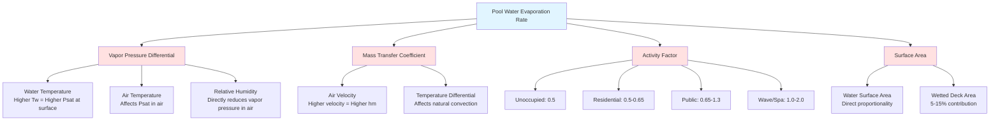

## Physical Principles of Pool Evaporation

Pool water evaporation is a complex mass transfer process governed by the vapor pressure differential between the water surface and surrounding air. The rate of evaporation depends on six primary factors that directly influence this vapor pressure gradient and the convective mass transfer coefficient.

The fundamental driving force for evaporation is the difference in partial pressure of water vapor at the pool surface versus the partial pressure in the ambient air. This relationship is expressed as:

$$\Delta P_v = P_{w,sat}(T_w) - \phi \cdot P_{sat}(T_a)$$

Where:
- $\Delta P_v$ = vapor pressure differential (in. Hg or Pa)
- $P_{w,sat}(T_w)$ = saturation vapor pressure at water surface temperature
- $P_{sat}(T_a)$ = saturation vapor pressure at air temperature
- $\phi$ = relative humidity of air (decimal)

## Water Temperature Impact

Water temperature is the single most influential factor in evaporation rate. The saturation vapor pressure at the water surface increases exponentially with temperature according to the Antoine equation. For typical pool conditions:

- Each 1°F increase in water temperature increases evaporation rate by approximately 3-5%
- Therapeutic pools (92-98°F) evaporate 40-60% more than recreational pools (78-82°F)
- Hot tubs and spas (100-104°F) can have evaporation rates 2-3 times higher than standard pools

The exponential relationship means small increases in water temperature at higher base temperatures cause disproportionately large increases in evaporation.

## Air Temperature and Relative Humidity

Air temperature and relative humidity act together to determine the vapor pressure in the ambient air. The partial pressure of water vapor in the air is:

$$P_v = \phi \cdot P_{sat}(T_a)$$

Critical considerations:

- **Temperature differential**: The difference $(T_w - T_a)$ affects both vapor pressure gradient and convective heat transfer. Larger differentials increase evaporation but can cause comfort issues and condensation risks.
- **Relative humidity**: Directly reduces the vapor pressure gradient. Each 10% increase in RH reduces evaporation rate by approximately 10-15%.
- **Optimal control range**: ASHRAE recommends maintaining air temperature 2-4°F above water temperature and relative humidity between 50-60% for comfort and condensation control.

## Air Velocity Over Water Surface

Air movement over the pool surface continuously removes saturated air and replaces it with drier air, increasing the mass transfer coefficient. The relationship is approximately:

$$h_m \propto V^{0.8}$$

Where $h_m$ is the convective mass transfer coefficient and $V$ is air velocity at the water surface.

Practical implications:

- Natural convection (still air): baseline evaporation rate
- Low air movement (20-30 fpm): 10-20% increase
- Moderate air movement (50-75 fpm): 30-50% increase
- High air movement (>100 fpm): can double evaporation rates

Supply air diffusers should never direct high-velocity air across the pool surface. Recommended air velocity at water surface is less than 30 fpm for occupied pools.

## Pool Activity Factor

The activity factor ($F_a$) quantifies the increase in evaporation rate due to water surface disturbance, increased surface area from waves and splashing, and wetted deck areas. ASHRAE provides the following ranges:

| Pool Type | Activity Factor ($F_a$) | Description |
|-----------|-------------------------|-------------|
| Unoccupied | 0.5 | Still water, minimal surface disturbance |
| Residential | 0.5 - 0.65 | Light use, occasional swimmers |
| Public Recreational | 0.65 - 1.0 | Moderate use, typical activity |
| Public Active | 1.0 - 1.3 | Heavy use, diving, play activities |
| Wave Pool | 1.5 - 2.0 | Mechanical wave action, high surface disturbance |
| Whirlpool/Spa | 1.0 - 1.5 | Jet action, high turbulence |

The activity factor is incorporated into the evaporation rate equation as a multiplier:

$$W = F_a \cdot A \cdot C \cdot (P_{w,sat} - \phi \cdot P_{sat})$$

Where:
- $W$ = evaporation rate (lb/hr)
- $F_a$ = activity factor (dimensionless)
- $A$ = water surface area (ft²)
- $C$ = evaporation coefficient (function of air velocity)

## Water Surface Area and Geometry

Evaporation rate is directly proportional to water surface area. However, effective area considerations include:

- **Primary pool surface**: Main evaporating area
- **Perimeter effects**: Enhanced evaporation at edges due to air circulation patterns (typically negligible for pools >100 ft²)
- **Wetted deck area**: Splash-out water on surrounding deck can contribute 5-15% additional evaporation, particularly with high activity factors
- **Surface features**: Waterfalls, fountains, and jets dramatically increase effective surface area through droplet formation

For design calculations, use the actual water surface area and account for wetted deck effects through the activity factor rather than adding deck area directly.

## Integrated Factor Relationships

The following diagram illustrates how all factors interact to determine the final evaporation rate:

## Design Implications

When sizing natatorium HVAC systems, engineers must carefully consider design conditions for each factor:

1. **Select appropriate activity factor**: Use conservative (higher) values for sizing dehumidification capacity. Many failures result from underestimating activity factors.

2. **Control strategy**: Maintain air temperature 2-4°F above water temperature to minimize condensation risk while controlling evaporation rate through RH control (50-60% target).

3. **Air distribution**: Design supply air patterns to avoid high-velocity airflow across the pool surface. Use low-velocity displacement ventilation or perimeter sidewall supply.

4. **Turndown capacity**: Systems must handle the wide range between unoccupied (0.5 × base) and peak occupancy conditions. Variable capacity dehumidification equipment is essential.

5. **Sensor placement**: RH and temperature sensors must be located away from the immediate pool area to measure representative space conditions, not the saturated boundary layer above water.

The ASHRAE Handbook—HVAC Applications chapter on natatoriums provides detailed calculation procedures incorporating all these factors. The Carrier equation and Shah equation are the two most widely used empirical correlations for pool evaporation, both accounting for the factors discussed above through measured coefficients and activity factors.
