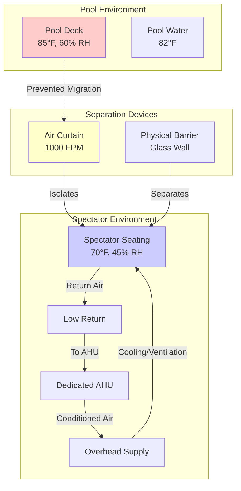

Spectator areas in competitive natatoriums present distinct HVAC challenges that differ fundamentally from pool deck conditioning. These spaces require environmental isolation from the humid pool environment while maintaining comfort for sedentary occupants who have vastly different thermal requirements than swimmers or deck personnel.

## Environmental Separation Requirements

Spectator seating areas must be environmentally isolated from the pool space to prevent migration of warm, moisture-laden air into the cooler spectator zones. This separation addresses three critical objectives:

**Temperature Differential Management**
Pool decks typically operate at 82-86°F to prevent swimmer discomfort, while spectator areas require 68-72°F for sedentary occupant comfort. This 10-15°F temperature difference creates significant driving force for air movement and moisture transfer.

**Humidity Control**
Pool areas maintain 50-60% RH at elevated temperatures (60-65°F dew point), while spectator spaces target 40-50% RH at lower temperatures (50-55°F dew point). Without proper separation, condensation forms on spectator area surfaces and discomfort occurs.

**Pressure Relationship**
Spectator areas should maintain slight positive pressure (+0.02 to +0.05 in. w.c.) relative to the pool space to prevent humid air infiltration. This pressurization requires careful coordination with the pool area exhaust system.

## Cooling Load Calculations

Spectator area loads differ significantly from pool deck calculations due to metabolic and envelope differences.

**Occupant Heat Gain**
Sedentary spectators generate:

$$q_{sensible} = 250 \text{ BTU/hr/person}$$

$$q_{latent} = 200 \text{ BTU/hr/person}$$

For a 500-seat spectator area at 80% occupancy:

$$Q_{occupant} = 400 \times (250 + 200) = 180{,}000 \text{ BTU/hr}$$

**Lighting and Equipment**
Typical spectator area lighting operates at 1.5-2.0 W/ft², with scoreboards and video displays adding concentrated loads in specific zones.

**Envelope Considerations**
Spectator areas with exterior glazing experience significant solar gains. For south-facing glazing:

$$Q_{solar} = A \times SHGC \times SC \times CF$$

Where SHGC = solar heat gain coefficient, SC = shading coefficient, CF = cooling load factor from ASHRAE tables.

**Ventilation Requirements**
ASHRAE 62.1 requires 7.5 CFM/person for assembly spaces. For 500 seats:

$$CFM_{OA} = 500 \times 7.5 = 3{,}750 \text{ CFM}$$

This outdoor air must be dehumidified to spectator space conditions, not pool space conditions.

## System Architecture

## Physical Separation Strategies

**Air Curtains**
High-velocity air curtains (800-1200 FPM discharge velocity) create an effective barrier at openings between pool and spectator areas. These units must:

- Operate continuously during pool operation
- Discharge air at spectator space temperature (not pool temperature)
- Cover 100% of opening width
- Achieve minimum 0.8 ratio of jet velocity to cross-flow velocity

**Glazed Partitions**
Full-height glass walls provide visual connection while achieving complete environmental separation. These barriers must:

- Use insulated glazing (minimum U-0.30) to prevent condensation
- Incorporate tempered safety glass per building codes
- Include minimal operable sections with effective seals
- Withstand pool area humidity without degradation

**Vestibules**
Double-door vestibule entries between zones minimize air exchange during passage. Effective vestibules maintain:

- Intermediate temperature and humidity conditions
- Self-closing door hardware on both doors
- Minimum 6-foot depth between door swings
- Adequate lighting and clear sight lines

## HVAC System Options

| System Type | Advantages | Disadvantages | Best Application |
|-------------|-----------|---------------|------------------|
| **Dedicated AHU with DX Cooling** | Independent control, precise dehumidification, lower first cost | Higher energy use, requires separate outdoor air unit | Small-to-medium facilities (<1000 seats) |
| **Chilled Water AHU** | Central plant efficiency, reheat capability, integration with building systems | Higher first cost, complexity, requires central plant | Large facilities, campus settings |
| **Variable Refrigerant Flow (VRF)** | Zone-level control, heat recovery potential, reduced ductwork | Limited dehumidification, refrigerant piping complexity | Retrofit applications, multi-zone spectator areas |
| **Dedicated Outdoor Air System (DOAS) + Local Units** | Ventilation decoupling, energy recovery, reduced unit sizes | Coordination complexity, multiple control points | High-performance designs, net-zero goals |

## Design Considerations

**Air Distribution**
Overhead supply air distribution with low sidewall or under-seat returns provides effective temperature stratification. Supply air temperatures of 55-60°F with 400-500 FPM discharge velocities achieve mixing without drafts.

**Control Strategy**
Spectator area systems require independent temperature and humidity controls separate from pool area systems. Occupancy-based setback during unoccupied periods reduces energy consumption while maintaining minimum dehumidification.

**Acoustic Requirements**
Spectator areas require low background noise (NC 35-40 maximum per ASHRAE Applications Handbook) to support speech intelligibility during events. This necessitates:

- Low-velocity duct design (1200-1800 FPM maximum)
- Sound attenuators at AHU discharge and major branches
- Isolated equipment mounting
- Acoustic ceiling materials

**Emergency Ventilation**
During pool chemical release events, spectator areas must maintain positive pressure and operate in 100% outdoor air mode to prevent contaminated pool air migration.

## Recommended Approach

Successful spectator area conditioning requires treating these spaces as separate assembly occupancies rather than extensions of the pool environment. Dedicated HVAC systems sized for sedentary occupant comfort, robust environmental separation from the pool space, and independent controls optimized for intermittent high-occupancy use deliver reliable performance and occupant satisfaction.

The investment in proper separation and dedicated systems prevents the chronic comfort complaints, condensation damage, and operational difficulties that plague natatoriums where spectator areas are treated as secondary zones of the pool HVAC system.
