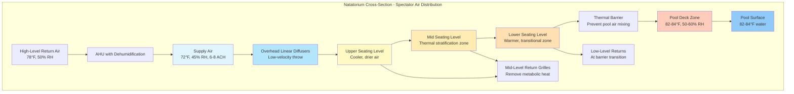

## Air Distribution Systems for Natatorium Spectator Areas

Air distribution to spectator seating in natatoriums presents unique engineering challenges due to the proximity to high-humidity pool environments, elevated occupant densities, and vertical stratification across tiered seating. The system must deliver adequate ventilation while preventing drafts, maintaining thermal comfort, and avoiding mixing warm spectator air with cooler, humid pool air.

## Ventilation Requirements for Assembly Occupancies

ASHRAE Standard 62.1 specifies ventilation rates for assembly occupancies. For spectator seating areas:

**Outdoor Air Requirements:**
- Minimum ventilation rate: $V_{oz} = R_p \times P_z + R_a \times A_z$
- Where $R_p = 5$ CFM/person (breathing zone requirement)
- $R_a = 0.06$ CFM/ft² (area component)
- For 500-person capacity: $V_{oz} = 5(500) + 0.06(A_z) = 2,500 + 0.06A_z$ CFM

**Air Change Considerations:**
Spectator zones typically require 6-10 air changes per hour (ACH) to manage metabolic loads and prevent CO₂ accumulation:

$$ACH = \frac{Q \times 60}{V_{room}}$$

Where $Q$ is total airflow (CFM) and $V_{room}$ is zone volume (ft³).

## Air Distribution Methods Comparison

| Distribution Method | Supply Location | Advantages | Disadvantages | Typical Application |
|---------------------|----------------|------------|---------------|---------------------|
| **Overhead Mixing** | Ceiling/high sidewall | Simple installation, good coverage | High throw velocity risk, mixes with pool air | Small facilities (<300 seats) |
| **Underfloor Air Distribution (UFAD)** | Floor-level swirl diffusers | Low velocity, displacement effect, excellent comfort | Higher installation cost, requires raised floor | Premium facilities, new construction |
| **Seatback/Riser Distribution** | Individual seat outlets | Personalized comfort, minimal draft | Complex ductwork, maintenance access | Competition venues |
| **Mid-Level Sidewall** | Perimeter walls at seating level | Good horizontal throw control | Limited vertical mixing, potential short-circuiting | Retrofit applications |

## Air Throw Calculations for Tiered Seating

The throw distance from supply outlets must reach occupied zones while maintaining acceptable terminal velocities. For overhead systems:

**Throw Distance:**
$$L = \frac{V_o \times A_k}{K \times V_t}$$

Where:
- $L$ = throw distance to terminal velocity (ft)
- $V_o$ = outlet velocity (FPM)
- $A_k$ = effective outlet area (ft²)
- $K$ = diffuser constant (typically 2.5-4.0 for ceiling diffusers)
- $V_t$ = terminal velocity at occupied zone (50 FPM maximum for spectators)

**Example Calculation:**
For a ceiling-mounted diffuser 20 ft above seating:
- Required throw: $L = 20$ ft
- Desired terminal velocity: $V_t = 50$ FPM
- Diffuser constant: $K = 3.0$
- Effective area: $A_k = 1.5$ ft²

Required outlet velocity: $V_o = \frac{L \times K \times V_t}{A_k} = \frac{20 \times 3.0 \times 50}{1.5} = 2,000$ FPM

## Airflow Patterns for Spectator Zones

## Draft Avoidance Strategies

**Critical Velocity Limits:**
- Occupied zone (seated): $V_{max} = 50$ FPM (30 FPM preferred)
- Neck/head level: $V_{max} = 30$ FPM
- Ankles: $V_{max} = 80$ FPM (less sensitive)

**Design Techniques:**
1. **Low-velocity diffusers:** Use large-area, low-aspect-ratio outlets to reduce jet momentum
2. **Increased throw distance:** Mount diffusers further from occupied zones to allow velocity decay
3. **Perforated face diffusers:** Distribute airflow across multiple small orifices rather than concentrated jets
4. **Temperature differential control:** Limit supply-to-space $\Delta T$ to 10-15°F maximum

$$\Delta T_{max} = T_{space} - T_{supply} \leq 15°F$$

Cooler supply air requires higher velocities to maintain throw, increasing draft risk.

## Thermal Barrier Between Spectators and Pool

A critical design element separates the conditioned spectator zone (72-76°F, 40-50% RH) from the humid pool environment (82-84°F, 50-60% RH):

**Barrier Airflow Design:**
- Vertical air curtain at seating/deck boundary
- Dedicated supply delivering 150-200 FPM downward velocity
- Low-level return positioned at pool deck side
- Prevents migration of humid pool air into spectator zone

**Barrier effectiveness:**
$$\eta = \frac{C_{pool} - C_{spectator}}{C_{pool} - C_{supply}} \times 100\%$$

Where $C$ represents humidity ratio or contaminant concentration. Effective barriers achieve $\eta > 80\%$.

## Displacement Ventilation for Premium Applications

For high-end competition facilities, displacement ventilation provides superior comfort:

**Operating Principles:**
- Supply air at floor level: 68-70°F, low velocity (<50 FPM)
- Air rises naturally through spectator zone due to thermal buoyancy from occupants
- Returns located at ceiling capture warm, contaminated air
- Maintains vertical temperature gradient: 2-4°F increase from ankle to head

**Flow Rate per Seat:**
$$q_{seat} = \frac{Q_{sensible}}{1.08 \times \Delta T \times N_{seats}}$$

Where $Q_{sensible}$ is total sensible load (Btu/h), $\Delta T$ is supply-to-return temperature difference, and $N_{seats}$ is seating capacity.

## Design Recommendations

**Overhead Distribution Systems:**
- Use for capacities up to 500 seats
- Select linear slot diffusers for even distribution along seating rows
- Position outlets 18-24 ft above seating to allow adequate velocity decay
- Provide return air at rear/top of seating area to capture rising heat

**Underfloor/Displacement Systems:**
- Implement for facilities >500 seats or premium venues
- Design for 6-8 ACH with supply temperatures 2-4°F below space setpoint
- Use swirl diffusers (0.24-0.36 pattern factor) to promote mixing at floor level
- Install returns at ceiling level, minimum 12 ft above seating

**Seatback Individual Outlets:**
- Reserve for Olympic or international competition venues
- Provide 10-20 CFM per seat with user adjustment (±30%)
- Supply at 70-72°F to prevent overcooling
- Integrate returns at seat riser to capture CO₂ plume

**Control Sequences:**
- Variable air volume (VAV) based on occupancy sensors and CO₂ monitoring
- Maintain CO₂ <1,000 ppm during events
- Reduce to 50% flow during unoccupied periods
- Coordinate with pool area dehumidification system to prevent cross-contamination

## Acoustical Considerations

Spectator areas demand low background noise levels (NC-35 to NC-40) to avoid interfering with announcements and conversation:

**Velocity Limits for Low Noise:**
- Main duct velocities: 1,500-2,000 FPM maximum
- Branch ducts: 1,000-1,500 FPM
- Diffuser face velocities: 400-600 FPM

Sound attenuation via lined ductwork or silencers is typically required within 20 ft of diffusers serving spectator zones.

## Commissioning and Verification

**Performance Metrics:**
- Air velocity traverses at occupied zone: confirm $V < 50$ FPM
- Temperature uniformity: $\pm 2°F$ across seating rows at same elevation
- Relative humidity: maintain 40-50% during occupancy
- Ventilation effectiveness: $\varepsilon_v > 0.9$ for displacement systems, $> 0.8$ for overhead mixing

Smoke testing during commissioning verifies airflow patterns and confirms the thermal barrier prevents pool air infiltration into spectator zones.
